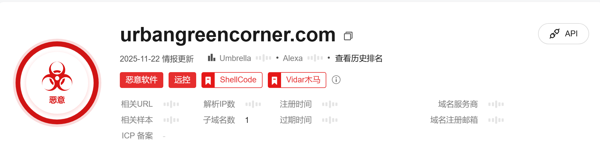
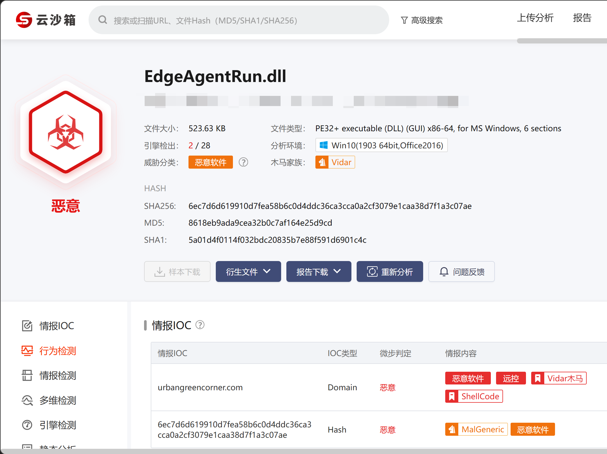

# rundll32.exe恶意加载DLL文件外联

### 告警信息

```bash
目标IP/域名：urbangreencorner.com
目标IP：146.19.49.226
目标域名：urbangreencorner.com
目标端口：443
进程名：rundll32.exe
进程ID：24916
情报信息-urbangreencorner.com  远控木马
```



### 告警核心信息

- ​**攻击载体**​： `rundll32.exe`​ 被用于加载一个位于用户临时目录下的DLL文件（`EdgeAgentRun.dll`​），这是一种常见的“​**DLL侧加载**​”或“​**DLL劫持**”攻击手法，用于规避对可执行文件的检测。
- **恶意模块**： `C:\Users\XXX\AppData\Roaming\Tl9jNIzeCrYGzpy\EdgeAgentRun.dll`​。路径中的随机文件夹名（`Tl9jNIzeCrYGzpy`）是恶意软件的典型特征，旨在混淆和避免被轻易发现。
- ​**攻击行为**​： 恶意DLL尝试与一个可疑的域名 `urbangreencorner.com` 建立连接（端口443，即HTTPS），目的是隐藏其通讯内容。

### IP/域名关联分析

- **域名：**​**urbangreencorner.】com**

  - ​**初步判断**​： 这是一个非常可疑的域名。其名称看起来像是为了伪装成一个合法的“城市绿色角落”之类的环保或社区网站，但结合它出现在恶意DLL的对外连接中，​**基本可以断定这是一个恶意命令与控制（C2）服务器域名、数据外传服务器或钓鱼网站**。
  - ​**风险等级**​： ​**高**。正常的软件不会通过rundll32加载AppData下的DLL去连接此类域名。
- **IP地址：146.19.49.226**

  - 经快速查询，此IP隶属于德国的一家网络托管公司（Contabo GmbH）。
  - 这是一个VPS/云服务器IP，这是黑客部署C2服务器的常用选择，因为其成本低、开通快且匿名性相对较好。
  - 该IP在威胁情报库中已有记录，与多种恶意软件家族的活动相关联。


### **rundll32.exe 是什么程序？**

**一句话概括：**  `rundll32.exe`​ 是 ​**Windows 操作系统核心的系统进程**​，其作用是 ​ **“运行存储在DLL（动态链接库）文件中的函数”** ​。它是一个​**合法的、不可或缺的Windows组件**。

**详细解释：**

1. ​**本质与功能**：

    - DLL文件本身不能直接双击执行，它里面封装了可供其他程序调用的函数（功能模块）。
    - ​`rundll32.exe`​ 就像一个​**通用的“DLL函数启动器”** ​。它的工作模式通常是：  
      ​`rundll32.exe <DLL文件名>, <导出函数名> [参数]`
    - 例如，执行 `rundll32.exe shell32.dll,Control_RunDLL desk.cpl`​ 会打开“显示属性”设置面板。因为控制面板的小程序（`.cpl`）本质上也是DLL。
2. ​**合法性**：

    - 它位于 `C:\Windows\System32\`​ 目录下。​**任何在其他位置的** **​`rundll32.exe`​**​ **都极有可能是恶意软件**。
    - 它是微软签名的可执行文件，其数字签名可通过右键 -> 属性查看。
3. **为什么恶意软件/攻击者“青睐”它？**   
    这正是问题的关键。其本身无害，但特性使其成为“​**活在白影子下的木马**”的理想载体：

    - ​**极高的信任度与白名单地位**​：几乎所有安全软件、防火墙、EDR都会将系统目录下的 `rundll32.exe` 视为可信进程，其网络行为可能不会被严格审查。
    - ​**强大的功能调用能力**：DLL可以实现任何功能（网络通信、文件操作、代码执行）。通过调用恶意DLL，攻击者能借其外壳做任何事。
    - ​**隐蔽性**​：任务管理器里看到的只是一个普通的系统进程名，而非可疑的恶意程序名。这实现了​**进程伪装**。

### **为何它会外连恶意域名？**

**核心原因：**​**​`rundll32.exe`​**​ **正在加载并执行一个包含恶意代码的DLL文件，而这个DLL发起了网络连接。**

**几种典型攻击场景：**

1. ​**DLL侧加载攻击**：

    - 恶意软件将恶意DLL放置在合法应用程序（或系统进程如`rundll32`​）的搜索路径中，并利用DLL加载顺序的漏洞，诱导`rundll32.exe`加载这个恶意DLL而非合法的DLL。
2. ​**通过注册表或计划任务持久化**：

    - 攻击者通过修改注册表 `HKCU\Software\Microsoft\Windows\CurrentVersion\Run`​ 或创建计划任务，设置一条命令，让系统在启动或定时执行 `rundll32.exe malware.dll,ExportFunction`。
    - 这样，每次开机，都是合法的 `rundll32.exe` 去加载恶意DLL并连接C2服务器。
3. ​**作为攻击链的后续阶段**：

    - 初始攻击（如钓鱼邮件、漏洞利用）成功后，攻击者下载一个恶意DLL到磁盘，然后立即通过命令调用 `rundll32.exe` 来执行它，建立远程控制通道。
4. ​**无文件攻击的载体**：

    - 更高级的攻击甚至可以不将DLL写入磁盘。例如，通过 PowerShell 或 WMI 将恶意代码直接注入到正在运行的 `rundll32.exe` 进程的内存中，然后让其执行并联网。

​**简单比喻**​：`rundll32.exe`​ 就像一辆​**有官方通行证（系统进程）的快递车**。攻击者把非法货物（恶意代码）装进这辆车的集装箱（内存空间）里。检查站（安全软件）看到是官方的车就直接放行了，货物得以顺利运出（外连恶意域名）。


### **如何排查？给出详细思路**

当你在网络监控、EDR或防火墙日志中发现 `rundll32.exe` 外连可疑域名/IP时，请遵循以下排查思路：

#### **第一步 紧急遏制**

- ​**网络隔离**：立即在防火墙或终端上阻断该进程对恶意域名的出站连接。
- ​**保留现场**：在开始深度排查前，如果条件允许，对受影响主机进行内存镜像和磁盘快照，以备取证。

#### **第二步 信息收集与关联分析**

这是最关键的一步，目标是找到  **“是哪个DLL在作祟”**  以及 ​ **“谁启动了这个进程”** 。

1. ​**获取进程的完整命令行**：

    - ​**使用Process Explorer**​：这是微软官方工具。运行后，找到 `rundll32.exe`​ 进程，悬停鼠标或查看属性，其 **​`Command Line`​**​ 栏会显示完整的命令，包括它正在加载的​**DLL文件全路径和导出函数**。这是最直接的证据。
    - ​**使用PowerShell**​：`Get-WmiObject Win32_Process -Filter "name='rundll32.exe'" | Select-Object CommandLine`
    - ​**任务管理器**：Win10/11新版任务管理器，在“详细信息”标签页，右键点击列标题，勾选“命令行”，即可查看。
2. ​**检查网络连接，定位具体进程PID**：

    - ​**使用netstat**​：`netstat -ano | findstr ESTABLISHED` 找到外连IP对应的PID（进程ID）。
    - ​**使用TCPView**：图形化工具，直观显示每个进程的TCP/UDP连接。
    - 将PID与 `rundll32.exe` 的PID对应起来，再用第一步的方法查看该PID对应进程的命令行。
3. ​**分析父进程与启动链**：

    - 在 **Process Explorer** 中，可以清晰地看到进程树。找到这个可疑的 `rundll32.exe`​，看它的**父进程**是什么。

      - 父进程是 `explorer.exe`？可能是用户双击了什么东西。
      - 父进程是 `svchost.exe`​ 或 `services.exe`？可能是通过服务启动的。
      - 父进程是 `wmic.exe`​、`powershell.exe`​、`cmd.exe`？这强烈指向脚本或命令执行的攻击行为。
    - 父进程信息能揭示攻击的入口点。

#### **第三 步深度调查与溯源**

1. ​**检查DLL文件本身**：

    - 对命令行中显示的DLL文件进行​**静态分析**：上传到 VirusTotal 检查哈希和签名。检查其数字签名（是否伪造？）。
    - 查看其磁盘位置：是在 `System32`​ 等正常目录，还是在用户的 `AppData`​、`Temp` 等临时目录？后者极可疑。
2. ​**检查持久化机制**：

    - ​**注册表**：检查常见的自启动项：

      - ​`HKCU\HCKM\Software\Microsoft\Windows\CurrentVersion\Run`
      - ​`HKCU\HCKM\Software\Microsoft\Windows\CurrentVersion\RunOnce`
      - ​`HKCU\HCKM\Software\Microsoft\Windows NT\CurrentVersion\Winlogon`
    - ​**计划任务**​：使用 `taskschd.msc`​ 或命令行 `schtasks /query /fo LIST /v` 查看可疑任务。
    - ​**服务**​：检查是否有可疑服务通过 `rundll32` 启动。
    - ​**文件关联**：检查是否有文件扩展名被关联到恶意命令。
    - 可以使用 **Autoruns** 工具进行全面的自动扫描，它比手动查更高效。
3. ​**时间线关联**：

    - 查看 `rundll32.exe` 进程的创建时间。
    - 在系统中搜索在该时间点前后创建的、修改的可执行文件（尤其是DLL）、日志文件（如 PowerShell 日志）。
4. **内存分析**

    - 如果怀疑是无文件攻击或进程被注入，需要对 `rundll32.exe` 进程进行内存转储，使用 Volatility 等工具分析内存中的代码片段、网络连接句柄等。

::: tip 提示

这里通过【第二步：信息收集与关联分析】使用PowerShell获取进程

```bash
Get-WmiObject Win32_Process -Filter "name='rundll32.exe'" | Select-Object CommandLine
```

:::

### 通过路径列出该目录下的文件

### **方法一：使用 dir 命令**

```
dir /a "C:\Users\XXX\AppData\Roaming\Tl9jNIzeCrYGzpy\"
```

- ​`/a` 参数显示所有文件（包括隐藏文件）
- 这样可以查看文件的创建时间、大小等信息

### **方法二：如果目录名包含空格或特殊字符**

```
dir /a "C:\Users\XXX\AppData\Roaming\Tl9jNIzeCrYGzpy"
```

（注意：末尾的反斜杠不是必须的）

### **方法三：使用 PowerShell**

powershell

```
Get-ChildItem -Path "C:\Users\XXX\AppData\Roaming\Tl9jNIzeCrYGzpy" -Force
```

- ​`-Force` 参数显示隐藏和系统文件


上传文件分析


