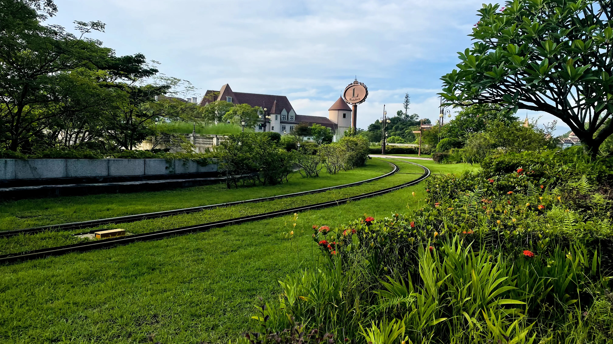
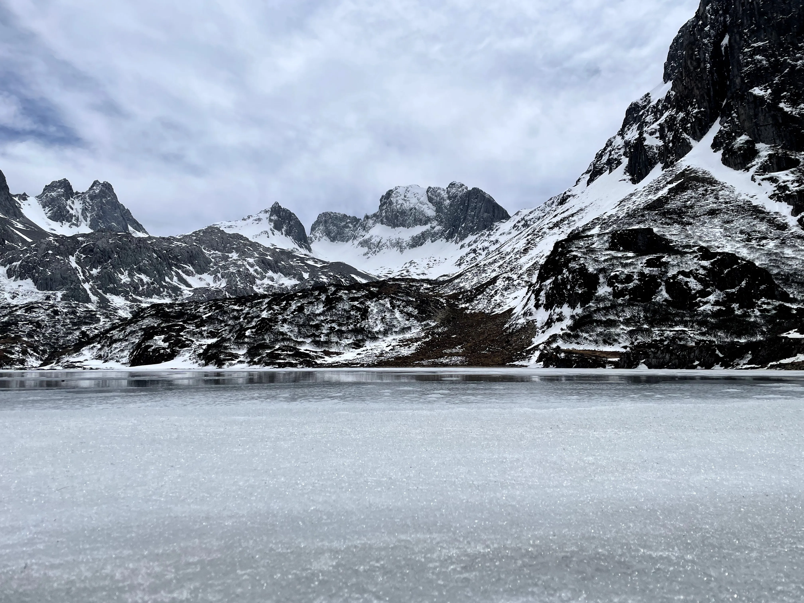
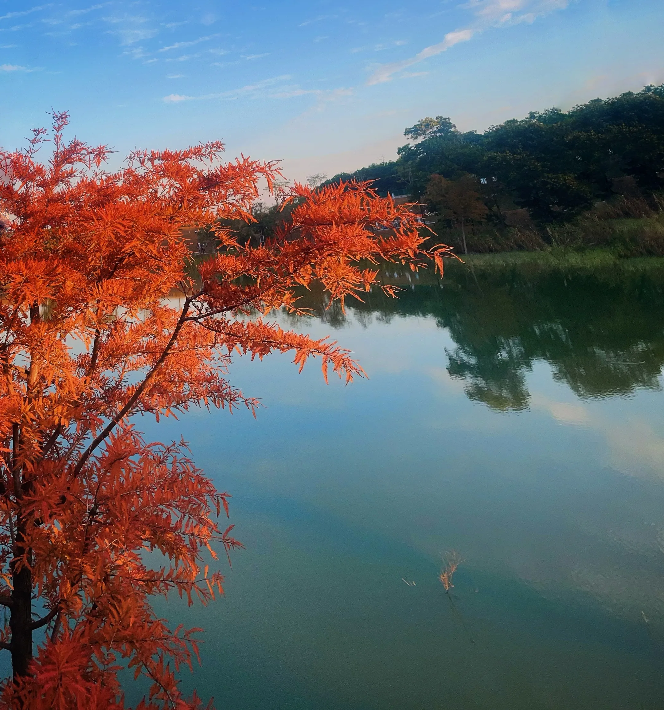
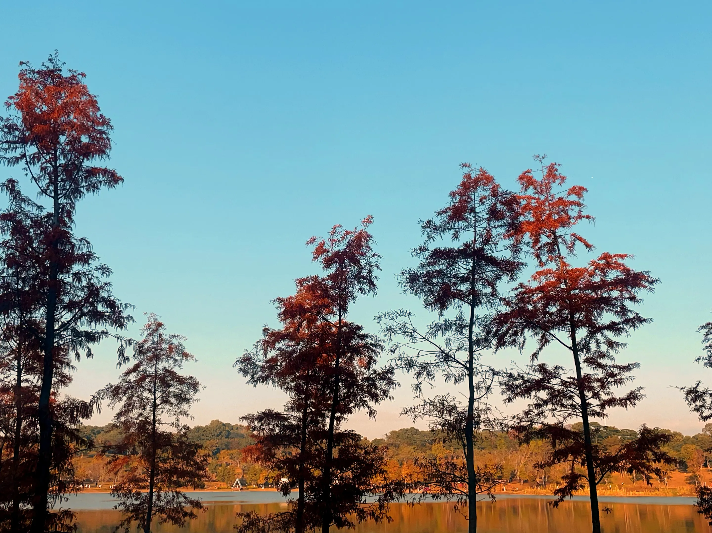
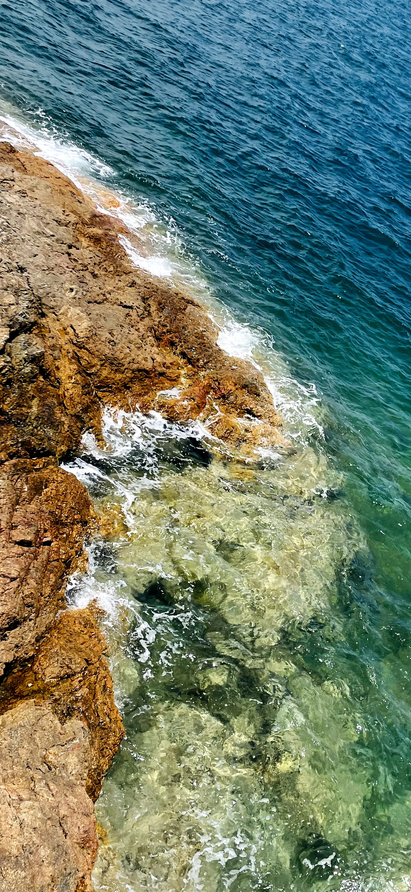
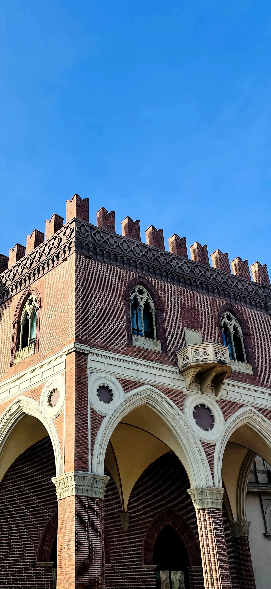
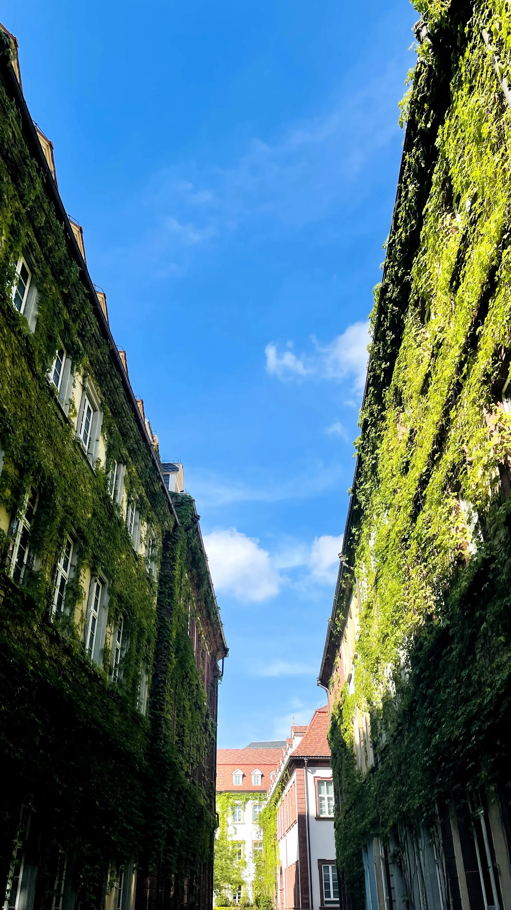
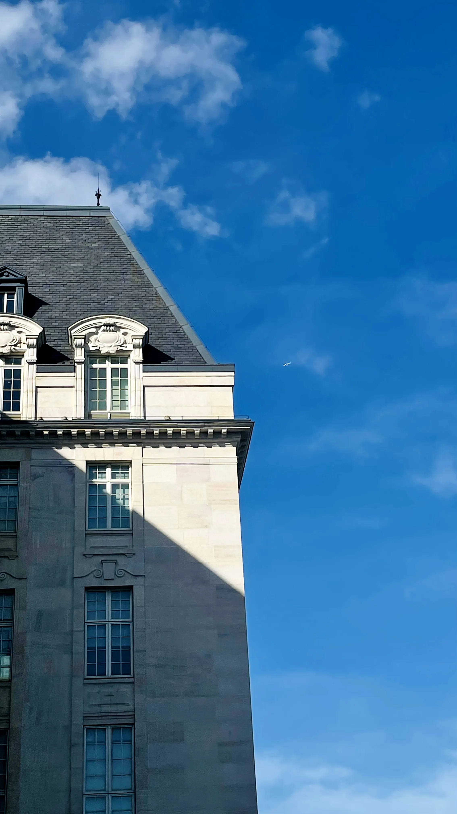
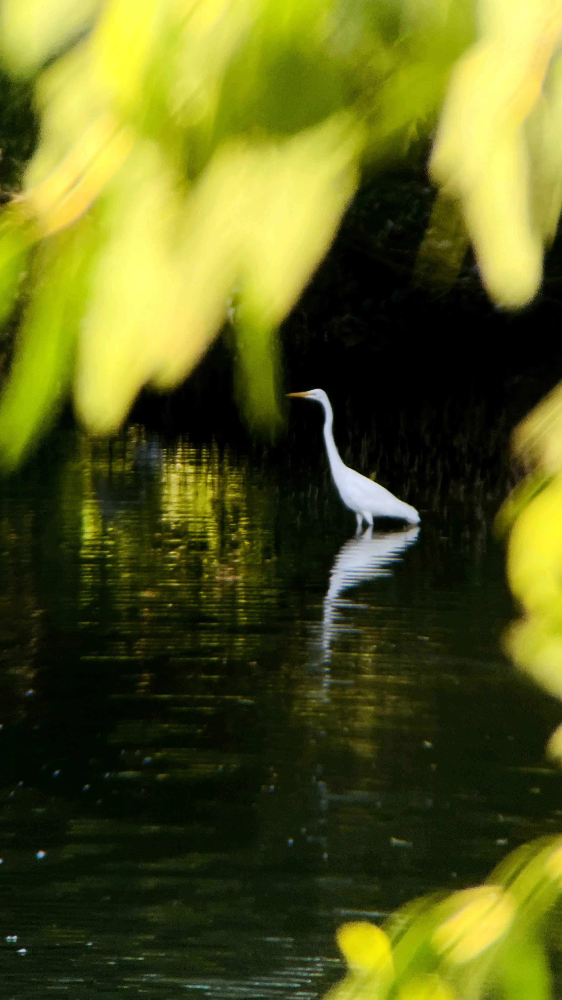
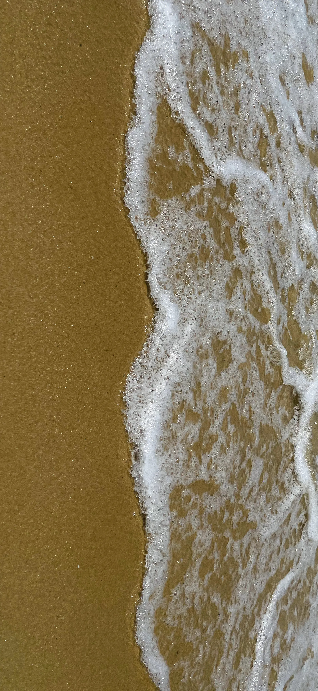

  

  

    
    
是爬山虎吗？

  

  
  

    
    
深蓝海面

  

  
  

    
    
海与石

  

  
  

    
    
草坪铁轨

  

  
  

    
    
雪天树枝

  

  
  
  

    
    
阿布吉措

  

  
  

    
    
夕阳

  

  
  
  

    
    
水面落羽衫

  

  
  

    
    
夕阳

  

  
  

    
    
湖光秋色

  

  
  

    
    
海与礁石

  

  
  

    
    
建筑

  

  
  

    
    
爬山虎

  

  
  

    
    
欧洲小镇

  

  
  

    
    
欧洲小镇

  

  
  

    
    
气球

  

  
  

    
    
海鸥

  

  
  

    
    
深色大海

  

  
  

    
    
海边波浪

  

  
  

    
    
森林草坪

  

  
  

    
    
冬日桃花

  

  
  

    
    
欧式建筑

  

  
  

    
    
不知道什么鸟

  

  
  

    
    
香格里拉

  

  
  

    
    
海滩

  

  
  

    
    
日照金山

  

  

    
    
牦牛坪

  

  

### 永远阳光，永远积极向上🥰
