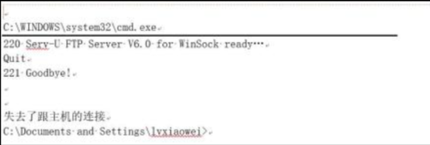
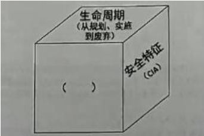
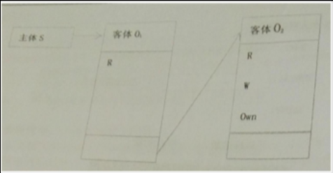
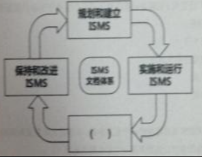

在 OSI参考模型中有7个层次，提供了相应的安全服务来 加强信息系统的安全性，以下哪一层提供了保密性、身份鉴别、数据完整性服务?

<u>A. 网络层</u>

B. 表示层

C. 会话层

D.物理层

正确答案:A  你的答案:C

**解析依据**：在OSI安全架构（ISO/IEC 7498-2标准）中，网络层是提供全面安全服务（包括保密性、身份鉴别和数据完整性）的关键层。IPsec是网络层的典型安全协议，广泛应用于VPN等场景，确保数据包级别的安全。

扩展阅读：

OSI参考模型分为7层，每层负责不同的功能，安全服务通常分布在多个层，但某些层更专注于特定安全机制：

- **物理层（Physical Layer）** ：处理物理连接和比特流传输，不提供高级安全服务（如保密性、身份鉴别或数据完整性）。
- **数据链路层（Data Link Layer）** ：负责节点到节点的帧传输，可提供基本错误检测，但不涉及身份鉴别或保密性（未在选项中）。
- **网络层（Network Layer）** ：负责路由、寻址和数据包转发。**这是唯一在选项中能提供保密性、身份鉴别和数据完整性服务的层**，主要通过协议如IPsec（Internet Protocol Security）实现：

  - **保密性**：通过加密（如IPsec的封装安全载荷ESP）防止数据窃听。
  - **身份鉴别**：通过认证头（AH）或密钥交换机制验证通信实体的身份。
  - **数据完整性**：使用哈希算法（如HMAC）确保数据在传输中未被篡改。
- **传输层（Transport Layer）** ：提供端到端连接管理，可通过TLS/SSL实现类似服务，但不在选项中（未列出）。
- **会话层（Session Layer）** ：管理会话建立、维护和终止，**不直接提供任何安全服务**（如保密性或身份鉴别）。它只处理对话控制，与会话管理相关，但安全功能通常委托给其他层。
- **表示层（Presentation Layer）** ：处理数据格式转换、加密和压缩。它可以提供**保密性**（如通过加密算法），但**一般不负责身份鉴别或数据完整性**。这些服务更多由网络层或应用层处理。
- **应用层（Application Layer）** ：支持应用程序服务（如HTTP、FTP），可通过协议如HTTPS、PGP或S/MIME提供保密性、身份鉴别和完整性，但**应用层不在选项中**。

---

关于源代码审核，描述**正确**的是

A.源代码审核过程遵循信息安全保障技术框架模型 (IATF)，在执行时应一步一步严格执行

B.**源代码审核有利于发现软件编码中存在的安全问题，相关的审核工具既有商业开源工具**

C.源代码审核如果想要有效率高，则主要依赖人工审核而不是工具审核，因为人工智能的，需要人的脑袋来判断

D.源代码审核能起到很好的安全保证作用，如果执行了源代码审核，则不需要安全测试

正确答案:B 你的答案:D

A: IATF是信息安全保障框架，不专门针对代码审核流程，代码审核通常采用SAST方法或安全编码规范，而非严格遵循IATF步骤执行。  
B: 源代码审核能有效发现SQL注入等编码安全问题，实际应用中既有商业工具如Fortify，也有开源工具如SonarQube，这是最准确的描述。  
C: 现代代码审核强调工具自动化扫描与人工审核相结合，单纯依赖人工审核效率低下，不符合当前安全实践趋势。  
D: 源代码审核只是安全开发的一个环节，无法替代渗透测试等动态安全测试，两者需要配合使用才能确保系统安全。

我选择D是因为高估了源代码审核的作用，认为静态代码检查可以完全替代动态安全测试，忽略了运行时环境检测和业务逻辑漏洞验证的必要性。

---

下图描绘了信息安全管理体系的 PDCA 模型其中，建立 ISMS 中，组织应根据业务、组织、位置、资产和技术等 方面的特性，确定 ISMS 的范围和边界，包括对范围任何 删减的 详细说明和正当性理由。组织应根据业务、组织、 位置、资产和技术等方面的特性，监视和 评审 ISMS() ，实施和运行 ISMS 中，组织应为管理信息安全风险识别 适当的()、资源、职责和优选顺序，监视和评审 ISMS 中，组织应执行监视与评审规程和其他()。以迅速检 测 过程运行结果中的错误，迅速识别图的和得逞的安全违规 和事件，使管理者能够确定分配 给人员的安全活动或通过 信息技术实施的安全活动是否按期望执行，通过使用指示 器帮助检 测安全事态并预防安全事件，确定解决安全违规 的措施是否有效，保持和改进 ISMS 中，组织应经常进行 ISMS 改进，采取合适的纠正和()，从其他组织和组织自 身的安全经验中()。

  
A.方针;管理措施;控制措施;预防措施;吸取措施  
B.方针;控制措施;管理措施;预防措施;吸取措施  
C.方针;预防措施;管理措施;控制措施;吸取措施  
D.方针;吸取措施;管理措施;控制措施;预防措施  
正确答案:A 你的答案:B

A: **方针**是ISMS的基础，**管理措施**用于风险处置，**控制措施**是具体实施手段，**预防措施**避免问题发生，**吸取措施**强调经验学习，这是PDCA循环的标准表述。  
B: 将**控制措施**和**管理措施**顺序颠倒，**控制措施**应在实施阶段而非规划阶段，不符合ISO 27001标准要求。  
C: **预防措施**不应在第三空出现，ISMS监视评审阶段主要关注检测而非预防，预防属于保持改进阶段。  
D: **吸取措施**位置错误，经验学习应在最后阶段，且**预防措施**应在纠正之后，顺序完全颠倒。

我选择B是因为混淆了**管理措施**和**控制措施**的执行顺序，没有准确理解PDCA各阶段的具体工作重点，将实施阶段的控制措施错误地放在了规划阶段。

---

网络交易发达的今天，贸易双方可以通过签署电子合同来保障自己的合法权益。某中心推出电子签名服务，按照如图方式提供电子签名，**不属于**电子签名的基本特性的是()。  
A.不可伪造性  
B.不可否认性  
C.保证消息完整性  
D.机密性  
正确答案:D 你的答案: C

A: **不可伪造性**是电子签名核心特性，确保签名者身份真实可靠，通过数字证书等技术手段防止他人伪造签名。  
B: **不可否认性**指签名者事后不能否认自己的签名行为，通过数字签名的时间戳等技术实现法律效力保障。  
C: **保证消息完整性**确保签署后的电子合同内容不被篡改，通常采用哈希算法等技术来验证文件完整性。  
D: **机密性**不属于电子签名基本特性，电子签名主要解决身份认证和防篡改问题，数据加密是另外的安全机制。

---

视窗操作系统(Windows)从哪个版本开始引入安全中心的概念?  
A. WinNT SP6  
B. Win2000 SP4  
C. WinXP SP2  
D. Win2003 SP1  
正确答案:C 你的答案:A

A: **WinNT SP6**并未引入安全中心概念，Windows NT系列主要面向企业用户，其安全机制与后续消费级系统不同。  
B: **Win2000 SP4**虽然增强了系统安全性，但仍未集成安全中心功能，其安全配置需要通过控制面板单独设置。  
C: **WinXP SP2**首次引入安全中心功能，整合防火墙、自动更新和病毒防护状态监控，成为微软系统安全的重要里程碑。  
D: **Win2003 SP1**作为服务器系统，虽然强化了安全功能，但安全中心概念最早出现在消费级的XP SP2版本中。

我选择A是因为混淆了Windows NT系列和XP系列的安全功能演进，错误认为企业级系统会更早引入安全中心这样的集成安全功能。

---

下图是安全测试人员连接某远程主机时的操作界面，请您仔细分析该图，下面分析推理正确的是()

  
A.安全测试人员链接了远程服务器的220端口  
B.安全测试人员的本地操作系统是Linux  
C.远程服务器开启了FTP服务，使用的服务器软件名FTP Server  
D.远程服务器的操作系统是windows系统  
正确答案:D 你的答案:C

A: 220是FTP服务的默认响应代码，表示服务就绪，但端口号是21而非220，220只是状态码不是端口号。  
B: 命令提示符显示**C:\Documents and Settings**路径，这是Windows特有目录结构，明确显示本地系统是Windows而非Linux。  
C: 虽然显示FTP服务就绪信息，但**Serx-U-FTPServer**可能是伪造的banner信息，不能直接确认真实服务软件名称。  
D: **C:\WINDOWS\system32\cmd.exe**路径和目录结构明确显示远程主机运行Windows系统，这是最可靠的判断依据。

我选择C是因为过于关注FTP服务的banner信息，而忽略了更可靠的系统路径特征，没有全面分析界面中提供的所有系统标识信息。

---

ISO 27002(Information technology-Security techniques-Code of practice for information security management)是重要的信息安全管理标准之一，下图是关于其演进变化示意图，图中括号空白处应填写()

  
A. BS 7799.1.3  
B. ISO 17799  
C. AS/NZS 4630  
D. NIST SP 800-37  
正确答案:B 你的答案:A

A: **BS 7799.1.3**并非标准演进过程中的正式版本号，BS 7799标准在演进过程中只有.1和.2两个部分。  
B: **ISO 17799**是BS 7799-1在2000年被ISO采纳后的第一个国际标准编号，是标准演进过程中的关键节点。  
C: **AS/NZS 4630**是澳大利亚/新西兰标准，与ISO 27002的演进过程无关，属于干扰项。  
D: **NIST SP 800-37**是美国国家标准技术研究院的风险管理框架，不属于ISO标准体系。

我选择A是因为混淆了BS 7799标准的版本编号体系，错误认为存在.1.3这样的子版本号，没有准确把握标准演进的关键节点。

---

信息安全标准化工作是我国信息安全保障工作的重要组成部分之一，也是政府进行宏观管理的重要依据，同时也是保护国家利益，促进产业发展的重要手段之一，关于我国标准化工作，下面选项中描述错误的是  
A.我国是在国家质量监督检验检疫总局管理下，由国家标准化管理委员会统一管理全国标准化工作，下设有专业技术委员会  
B.事关国家安全利益，信息安全因此不能和国际标准相同，而是要通过本国组织和专家制定标准，切实有效地保护国家利益和安全  
C.我国归口信息安全方面标准是"全国信息安全标准化技术委员会"，为加强有关工作，2016在其下设立"大数据安全特别工作组"  
D.信息安全标准化工作是解决信息安全问题的重要技术支撑，其主要作业突出体现在能够确保有关产品、设施的技术先进性、可靠性和一致性  
正确答案:B 你的答案:C

A:描述完全正确，我国标准化工作确实由国家标准化管理委员会统一管理，下设多个专业技术委员会负责具体领域标准制定。  
B:错误描述，我国信息安全标准既考虑国情也积极采用国际标准，如等同采用ISO 27001等国际标准，并非完全不能与国际标准相同。  
C:准确描述了全国信息安全标准化技术委员会(TC260)的组织架构，2016年确实增设了大数据安全特别工作组。  
D:正确阐述了标准化工作的作用，通过标准可以确保技术产品的质量和一致性，是信息安全的重要保障。

我选择错误是因为没有充分理解我国标准化工作与国际接轨的实际情况，误以为出于安全考虑必须完全自主制定标准，而忽略了我国在标准制定中采用的"等同采用"、"修改采用"等国际标准转化策略。

---

以下哪个选项不是防火墙提供的安全功能?  
A.IP地址欺骗防护  
B.NAT  
C.访问控制  
D.SQL注入攻击防护  
正确答案:D 你的答案:A

A: **IP地址欺骗防护**是防火墙的基础功能，通过检查数据包源地址防止伪造IP的攻击行为，属于网络层防护能力。  
B: **NAT(网络地址转换)** 是防火墙的常见功能，实现公私网地址转换，既能节省IP资源又能隐藏内部网络结构。  
C: **访问控制**是防火墙的核心功能，通过ACL规则控制进出网络的数据流，实现基于端口、协议等的访问限制。  
D: **SQL注入攻击防护**属于应用层防护，通常由WAF(Web应用防火墙)实现，传统网络防火墙无法检测应用层SQL语句。

我选择A是因为混淆了防火墙的基础安全功能，误将IP欺骗防护排除在外，而实际上SQL注入防护才是超出传统防火墙能力范围的功能。

---

以下关于可信计算说法错误的是:  
A.可信的主要目的是要建立起主动防御的信息安全保障体系  
B.可信计算机安全评价标准(TCSEC)中第一次提出了可信计算机和可信计算基的概念  
C.可信的整体框架包含终端可信、终端应用可信、操作系统可信、网络互联可信、互联网交易等应用系统可信  
D.可信计算平台出现后会取代传统的安全防护体系和方法  
正确答案:D 你的答案:C

A: 可信计算通过**可信度量**和**可信验证**等技术实现主动防御，改变传统被动防护模式，是其主要设计目标。  
B: 美国国防部1985年发布的**TCSEC标准**首次明确定义可信计算基(TCB)概念，成为可信计算理论奠基之作。  
C: 可信计算采用**信任链传递**机制，从硬件TPM芯片到操作系统再到应用层逐级验证，形成完整信任体系。  
D: 错误选项，可信计算是对传统安全体系的**增强补充**，而非替代，两者共同构成纵深防御体系。

我选择C是因为过度关注可信计算的技术架构，而忽略了其与传统安全体系的关系，没有理解可信计算是作为现有安全防护的补充而非替代这一关键点。

---

应用软件的数据存储在数据库中，为了保证数据安全，应设置良好的数据库防护策略，以下不属于数据库防护策略的是?  
A.安装最新的数据库软件安全补丁  
B.对存储的敏感数据进行安全加密  
C.不使用管理员权限直接连接数据库系统  
D.定期对数据库服务器进行重启以确保数据库运行良好  
正确答案:D 你的答案:C

A: **安装安全补丁**是基础防护措施，可修复已知漏洞，防止攻击者利用漏洞入侵数据库系统。  
B: **数据加密**保护敏感信息，即使数据泄露也无法直接读取，符合最小权限和深度防御原则。  
C: **最小权限原则**要求使用普通账户而非管理员账户连接，可降低攻击造成的破坏范围。  
D: 错误选项，**定期重启**属于运维操作而非安全策略，无法提升安全性，反而可能影响业务连续性。

我选择C是因为混淆了安全策略和运维操作的区别，误以为权限管理不属于核心防护策略，而忽略了重启操作实际上与数据安全防护无关这一关键点。

---

某学员在学习国家标准《信息系统安全保障评估框架 第一部分：简介和一般模型》(GB/T 20274.1-2006)后，绘制了一张简化的信息系统安全保障模型图，如下所示。请为图中括号空白处选择合适的选项()

  
A.安全保障(方针和组织)  
B.安全防护(技术和管理)  
C.深度防御(策略、防护、检测、响应)  
D.保障要素(管理、工程、技术、人员)  
正确答案:D 你的答案:C

A: **方针和组织**属于管理层面的保障措施，但GB/T 20274.1标准定义的保障要素包含更全面的维度。  
B: **技术和管理**的划分过于简单，未涵盖标准中明确提出的工程和人员等关键保障要素。  
C: **深度防御**是安全防护策略，但并非该标准定义的信息系统保障要素框架内容。  
D: 正确选项，GB/T 20274.1标准明确定义**保障要素**包含管理、工程、技术和人员四个维度，构成完整保障体系。

我选择C是因为将动态防御理念与标准定义的静态保障要素相混淆，没有准确把握GB/T 20274.1标准中关于保障要素的明确定义和分类要求。

---

以下哪个拒绝服务攻击方式不是流量型拒绝服务攻击  
A. Land  
B. UDP Flood  
C. Smurf  
D. Teardrop  
正确答案:D 你的答案:A

A: **Land攻击**属于流量型攻击，通过发送源IP和目标IP相同的特殊数据包导致系统崩溃或重启。  
B: **UDP Flood**是典型的流量型攻击，利用UDP协议无连接特性发送大量数据包耗尽目标带宽资源。  
C: **Smurf攻击**是流量放大攻击，通过伪造源IP向广播地址发送ICMP请求，产生大量回复流量淹没目标。  
D: 正确选项，**Teardrop攻击**属于协议漏洞利用，通过发送异常分片IP包使目标系统重组时崩溃，不依赖流量压制。

我选择A是因为混淆了不同DoS攻击类型的特征，误将Land攻击归类为非流量型，而实际上Teardrop才是利用协议漏洞而非流量压制的攻击方式。

---

如图所示，主体S对客体01有读(R)权限，对客体02有读(R)、写(W)权限。该图所示的访问控制实现方法是:()

  
A.访问控制表(ACL)  
B.访问控制矩阵  
C.能力表(CL)  
D.前缀表(Profiles)  
正确答案:C 你的答案:B

A: **访问控制表(ACL)** 是以客体为中心的权限管理方式，为每个客体维护一个访问主体及其权限的列表，与图示的主体视角不符。  
B: **访问控制矩阵**是理论模型，将主体和客体的权限关系用矩阵表示，实际系统中很少直接实现，且与图示的具体实现方式不符。  
C: 正确选项，**能力表(CL)** 以主体为中心，为每个主体维护其可访问的客体及对应权限列表，正好对应题目描述的权限结构。  
D: **前缀表**主要用于基于标签的访问控制，与题目描述的简单读写权限控制场景不匹配。

我选择B是因为将理论模型与实际实现方式混淆，访问控制矩阵虽然是基础理论，但实际系统中更常用能力表或ACL来实现具体权限控制。

---

关于源代码审核，下列说法正确的是:  
A.人工审核源代码审校的效率低，但采用多人并行分析可以完全弥补这个缺点  
B.源代码审核通过提供**非预期的输入**并监视异常结果来发现软件故障，从而定位可能导致安全弱点的薄弱之处  
C.使用工具进行源代码审核，速度快，准确率高 **，已经**取代了传统的人工审核  
D.源代码审核是对源代码检查分析，检测并报告源代码中可能导致安全弱点的薄弱之处  
正确答案:D 你的答案:B

A: 多人并行分析确实能提高人工审核效率，但"**完全弥补**"说法过于绝对，人工审核固有的效率瓶颈无法被完全消除。  
B: 描述的是**模糊测试(Fuzzing)技术**，属于动态测试方法，而源代码审核是静态分析技术，二者有本质区别。  
C: 工具审核虽快速但存在误报漏报，人工审核在复杂逻辑漏洞检测上**不可替代**，当前最佳实践是工具与人工结合。  
D: 正确选项，明确定义了源代码审核的核心功能是通过静态分析检测代码中的潜在安全漏洞和薄弱环节。

我选择B是因为混淆了静态代码审核与动态测试技术的区别，将模糊测试的特征错误地套用到源代码审核上，没有准确把握源代码静态分析的技术特点。

---

在戴明环(PDCA)模型中，处置(ACT)环节的信息安全管理活动是:  
A.建立环境  
B.实施风险处理计划  
C.持续的监视与评审风险  
D.持续改进信息安全管理过程  
正确答案:D 你的答案:B

A: **建立环境**属于计划(Plan)阶段的活动，主要是确定ISMS的范围、方针和目标，为后续实施奠定基础。  
B: **实施风险处理计划**是执行(Do)阶段的核心工作，将安全控制措施落实到具体操作中，而非处置环节。  
C: **监视与评审**属于检查(Check)阶段，通过审计和评审来验证安全措施的有效性，为改进提供依据。  
D: 正确选项，**持续改进**是处置(Act)阶段的本质特征，基于检查阶段的发现来优化ISMS，形成闭环管理。

我选择B是因为混淆了PDCA各阶段的工作重点，将实施(Do)阶段的任务错误地归入处置(Act)阶段，没有准确理解Act阶段的核心是改进而非执行。

---

在信息系统设计阶段，"安全产品选择"处于风险管理过程的哪个阶段?  
A.背景建立  
B.风险评估  
C.风险处理  
D.批准监督  
正确答案:C 你的答案:A

A: 背景建立是风险管理初始阶段，主要确定系统范围和边界，不涉及具体安全措施选择。  
B: 风险评估阶段识别和分析风险，为风险处理提供依据，但不直接选择安全产品。  
C: 正确选项，风险处理阶段根据评估结果选择适当的安全控制措施，包括安全产品选型。  
D: 批准监督是对整个风险管理过程的审查和监督，属于后期阶段。

我选择A是因为混淆了风险管理各阶段的重点，将前期准备工作与具体控制措施实施阶段相混淆。

---

信息系统安全保护等级为3级的系统，应当()年进行一次等级测评?  
A.0.5  
B.1  
C.2  
D.3  
正确答案:B 你的答案:C

A: 半年周期适用于特殊要求场景，非等级保护通用规定。  
B: 正确选项，等保2.0明确规定三级系统每年测评一次。  
C: 二年周期适用于二级系统，不符合三级系统要求。  
D: 三年周期过长，不符合等保对重要系统的监管要求。

我选择C是因为记混了不同等级系统的测评周期要求，将二级系统的要求套用到三级系统上。

---

关于我国加强信息安全保障工作的总体要求，以下说法错误的是:()  
A.坚持积极防御、综合防范的方针  
B.重点保障基础信息网络和重要信息系统安全  
C.创建安全健康的网络环境  
D.提高个人隐私保护意识  
正确答案:D 你的答案:B

A: 准确描述我国"积极防御、综合防范"的基本方针。  
B: 正确体现对关键基础设施的重点保护原则。  
C: 符合我国网络安全工作的环境建设目标。  
D: 错误选项，个人隐私保护是具体工作内容，不属于总体要求范畴。

我选择B是因为未能区分总体要求与具体工作内容的层次关系。

---

根据《关于加强国家电子政务工程建设项目信息安全风险评估工作的通知》的规定，以下正确的是:  
A.涉密信息系统的风险评估应按照《信息安全等级保护管理办法》等国家有关保密规定和标准进行  
B.非涉密信息系统的风险评估应按照《非涉及国家秘密的信息系统分级保护管理办法》等要求进行  
C.可委托同一专业测评机构完成等级测评和风险评估工作，并形成等级测评报告和风险评估报告  
D.此通知不要求将"信息安全风险评估"作为电子政务项目验收的重要内容  
正确答案:C 你的答案:D

A: 涉密系统评估应依据保密标准，而非等级保护管理办法。  
B: 非涉密系统评估依据等级保护而非分级保护要求。  
C: 正确选项，通知明确允许同一机构承担两项工作。  
D: 通知明确要求将风险评估纳入验收必备环节。

我选择D是因为对政策文件具体要求理解不准确，忽略了风险评估的强制性验收要求。

---

风险要素识别是风险评估实施过程中的一个重要步骤，小李将风险要素识别的主要过程使用图形来表示，如下图所示，请为图中空白框处选择一个最合适的选项()。

A.识别面临的风险并赋值  
B.识别存在的脆弱性并赋值  
C.制定安全措施实施计划  
D.检查安全措施有效性  
正确答案:B 你的答案:A

A: **风险识别赋值**通常是完成资产、威胁和脆弱性识别后的综合分析步骤，而非风险要素识别的中间环节。  
B: 正确选项，**脆弱性识别赋值**是风险要素识别的关键环节，在资产识别后、风险分析前，构成完整的风险要素链条。  
C: **安全措施计划**属于风险处置阶段内容，与风险要素识别过程无关，不符合流程图逻辑。  
D: **措施有效性检查**是风险管理的后续监督环节，完全不属于风险识别阶段的组成部分。

我选择A是因为颠倒了风险评估的工作流程，错误地将风险分析环节前置到要素识别阶段，忽略了脆弱性识别这一必要步骤。

---

小李去参加单位组织的信息安全培训后，他把自己对管理信息管理体系ISMS的理解画了一张图，但是他还存在一个空白处未填写，请帮他选择一个合适的选项()

  
A.监控和反馈ISMS  
B.批准和监督ISMS  
C.监视和评审ISMS  
D.沟通和咨询ISMS  
正确答案:C 你的答案:A

A: **监控和反馈**是PDCA循环中Check环节的部分内容，但非ISMS标准术语，表述不够规范准确。  
B: **批准和监督**属于管理层职责，通常出现在ISMS建立初期和审计阶段，不符合PDCA持续改进的循环特性。  
C: 正确选项，**监视和评审**是ISO 27001标准明确规定的关键活动，确保ISMS持续有效运行并改进。  
D: **沟通和咨询**是利益相关方管理的重要内容，但属于支持性过程而非核心管理活动。

我选择A是因为将日常管理术语与ISMS标准术语混淆，使用了非标准的"监控和反馈"表述，而忽略了标准中明确规定的"监视和评审"要求。

---

为防范网络欺诈确保交易安全，网银系统首先要求用户安全登录，然后使用"智能卡+短信认证"模式进行网上转账等交易，在此场景中用到下列哪些鉴别方法?  
A.实体"所知"以及实体"所有"的鉴别方法  
B.实体"所有"以及实体"特征"的鉴别方法  
C.实体"所知"以及实体"特征"的鉴别方法  
D.实体"所有"以及实体"行为"的鉴别方法  
正确答案:A 你的答案:C

A: 正确选项，**密码登录**属于"所知"(知识因素)，**智能卡**是物理令牌属于"所有"(拥有因素)，**短信验证**是对手机SIM卡的拥有验证。  
B: 未使用指纹/面容等**生物特征**认证，不符合场景描述。  
C: 错误混淆认证因素，短信验证是对手机SIM卡的拥有验证，而非生物特征识别。  
D: 未涉及击键节奏等**行为特征**认证方式。

我选择C是因为将短信验证错误归类为特征因素，实际上短信验证码是通过验证用户对手机号码的控制权(拥有因素)来实现认证的。

---

信息安全管理体系(ISMS)的实施和运行ISMS阶段，是ISMS过程模型的实施阶段(Do)，下面给出了一些活动：  
①制定风险处理计划  
②实施风险处理计划  
③开发有效性测量程序  
④实施培训和意识教育计划  
⑤管理ISMS的运行  
⑥管理ISMS的资源  
⑦执行检测事态和响应事件的程序  
⑧实施内部审核  
⑨实施风险再评估

选项()描述了在此阶段组织应进行的活动。  
A.①②③④⑤⑥  
**B.①②③④⑤⑥⑦**  
C.①②③④⑤⑥⑦⑧  
D.①②③④⑤⑥⑦⑧⑨  
正确答案:B 你的答案:A

A: 包含基础实施活动但缺少关键的**事件响应**程序(⑦)，不完整。实施阶段需要包含所有关键运行活动。  
B: 正确选项，完整涵盖实施阶段核心工作：**从计划实施(②)、培训(④)到日常管理(⑤⑥)和事件响应(⑦)** 。  
C: 内部审核(⑧)属于**检查(Check)** 阶段活动，不应包含在实施阶段。审核是验证实施效果的活动。  
D: 风险再评估(⑨)明显属于**监督改进环节**，完全超出实施阶段范围。再评估是基于运行效果的调整。

我选择A是因为未能全面把握实施阶段的工作范围，遗漏了关键的事件响应管理(⑦)，这是ISMS运行期间的重要保障措施。实施阶段需要包含所有确保ISMS正常运转的活动。

---

Linux 系统的安全设置中，对文件的权限操作是一项关键操作。通过对文件权限的设置，能够保障不同用户的个人隐私和系统安全。文件 fb.c 的文件属性信息如下图所示，小张想要修改其文件权限，为文件主增加执行权限，并删除组外其他用户的写权限，那么以下操作中正确的是()  
-rw-rw-rw-5 zhang users 759 Jul 64 55:99 fib.c  
A. #chmod u+x, a-w fib.c  
B. #chmod ug+x, o-w fib.c  
C. #chmod 764 fib.c  
D. #chmod 467 fib.c  
正确答案:C 你的答案:A

A: 该命令会为文件主增加执行权限(u+x)，但同时会删除所有用户(a)的写权限，不符合"只删除其他用户写权限"的要求。  
B: 该命令会为文件主和组用户都增加执行权限(ug+x)，而题目只要求为文件主增加执行权限。  
C: 正确选项，764权限对应rwxrw-r--，正好满足为文件主增加**执行权限(7=rwx)** ，同时其他用户**只保留读**权限(4\=r)。  
D: 467权限对应r--rw-rwx，完全不符合题目要求，且会导致安全风险(其他用户有执行权限)。

我选择A是因为混淆了权限设置的对象范围，错误使用了a-w参数导致权限修改范围过大，没有精确实现题目要求的权限变更。

---

从系统工程的角度来处理信息安全问题，以下说法错误的是:  
A.系统安全工程旨在了解企业存在的安全风险，建立一组平衡的安全需求，融合各种工程学科的努力将此安全需求转换为贯穿系统整个生存期的工程实施指南。  
B.系统安全工程需对安全机制的正确性和有效性做出诠释，证明安全系统的信任度能够达到企业的要求，或系统遗留的安全薄弱性在可容许范围之内。  
C.系统安全工程能力成熟度模型(SSE-CMM)是一种衡量安全工程实践能力的方法，是一种使用**面向开发**的方法。  
D.系统安全工程能力成熟度模型(SSE-CMM)是在原有能力成熟度模型(CMM)的基础上，通过对安全工作过程进行管理的途径，将系统安全工程转变为一个完好定义的、成熟的、可测量的先进学科。  
正确答案:C 你的答案:D

A: 准确描述了系统安全工程的总体目标和实施路径，强调全生命周期的安全需求转化和平衡。  
B: 正确阐述了安全工程需要验证和证明安全机制的有效性，确保安全风险控制在可接受范围内。  
C: 错误选项，SSE-CMM是**面向过程**而非面向开发的方法，它关注**安全工程过程**的成熟度而非具体开发方法。  
D: 正确说明SSE-CMM与CMM的关系及其对安全工程学科发展的贡献，强调过程管理和成熟度测量。

我选择D是因为混淆了SSE-CMM的定位，误将其理解为面向开发的方法，而实际上它是评估安全工程过程成熟度的框架，不限定具体开发方法。

---

有关系统安全工程-能力成熟度模型(SSE-CMM)中的基本实施(Base Practices，BP)，正确的理解是:  
A.BP是基于最新技术而制定的安全参数基本配置  
B.大部分BP是没有经过测试的  
C.一项BP适用于组织的生存周期而非仅适用于工程的某一特定阶段  
D.一项BP可以和其他BP有重叠  
正确答案:C 你的答案:A

A: BP是经过验证的安全工程最佳实践集合，而非技术配置参数，其核心是过程实施而非技术实现。  
B: BP都是经过验证的安全工程实践，SSE-CMM收录的都是被证明有效的实践方法。  
C: 正确选项，BP设计覆盖组织完整生命周期，确保安全工程在各个阶段都能得到有效实施。  
D: BP之间允许存在适度重叠，但题目强调的重点是BP的全生命周期适用性。

我选择A是因为混淆了BP的概念内涵，错误地将过程实践理解为技术配置，没有把握BP作为方法论的本质特征。

---

以下哪一种判断信息系统是否安全的方式是最合理的?  
A.是否己经通过部署安全控制措施消灭了风险  
B.是否可以抵抗大部分风险  
C.是否建立了具有自适应能力的信息安全模型  
D.是否已经将风险控制在可接受的范围内  
正确答案:D 你的答案:B

A: **消灭风险**是理想化状态，实际安全工作中风险只能被管理而无法被完全消除，该选项不符合风险管理基本原则。  
B: **抵抗大部分风险**表述模糊，缺乏量化标准，且未考虑风险接受度的差异，不是科学的安全评估方法。  
C: **自适应模型**是安全防护的增强手段，反映系统防御能力而非安全状态，不能作为安全性的直接判断依据。  
D: 正确选项，**风险可控**是信息安全的核心目标，将残余风险控制在组织可接受范围内是最务实的安全判断标准。

我选择B是因为陷入了"防御越多越安全"的误区，忽略了风险管理中风险接受度的关键概念，没有理解安全性的最终评判标准是风险是否可控而非防御是否全面。

---

以下关于信息安全法治建设的意义，说法错误的是:  
A.信息安全法律环境是信息安全保障体系中的必要环节  
B.明确违反信息安全的行为，并对行为进行相应的处罚，以打击信息安全犯罪活动  
C.信息安全主要是技术问题，技术漏洞是信息犯罪的根源  
D.信息安全产业的逐渐形成，需要成熟的技术标准和完善的技术体系  
正确答案:C 你的答案:D

A: **法律环境**确实是信息安全保障体系的重要组成部分，为信息安全提供制度保障和规范依据。  
B: **法律惩戒**功能是法治建设的关键作用，通过明确违法行为的法律后果来震慑犯罪。  
C: 错误选项，**技术决定论**观点片面，信息安全是管理、技术、法律等多维度综合问题，不能简单归因于技术漏洞。  
D: **产业标准**对信息安全产业发展至关重要，是法治建设的技术支撑，表述正确。

我选择D是因为没有准确把握题干要求找出"错误说法"，而C选项明显将信息安全简单归因于技术问题是片面的，更符合题干要求的错误说法。

---

小张是信息安全风险管理方面的专家，被某单位邀请过去对其核心机房经受某种灾害的风险进行评估，已知:核心机房的总价价值一百万，灾害将导致资产总价值损失二成四(24%)，历史数据统计告知该灾害发生的可能性为八年发生三次，请问小张最后得到的年度预期损失为多少:  
A.24万  
B.0.09万  
C.37.5万  
D.9万  
正确答案:D 你的答案:C

A: 直接计算资产损失的绝对值100万×24%\=24万，但未考虑灾害发生频率  
B: 错误计算了发生概率(3/8×24%\=9%)与资产价值的乘积关系  
C: 错误地将8年3次理解为每年37.5%的发生概率  
D: 正确选项，计算公式为100万×24%×(3/8)\=9万，完整考虑资产价值、损失比例和年化发生概率

我选择C是因为错误理解了灾害频率的计算方式，将8年3次简单换算为每年37.5万，没有正确进行年化概率计算。

---

信息安全等级保护要求中，第三级适用的正确的是:  
A.适用于一般的信息和信息系统，其受到破坏后，会对公民、法人和其他组织的权益有一定影响，但不危害国家安全、社会秩序、经济建设和公共利益  
B.适用于一定程度上涉及国家安全、社会秩序、经济建设和公共利益的一般信息和信息系统，其受到破坏后，会对国家安全、社会秩序、经济建设和公共利益造成一般损害  
C.适用于涉及国家安全、社会秩序、经济建设和公共利益的信息和信息系统，其受到破坏后，会对国家安全、社会秩序、经济建设和公共利益造成严重损害  
D.适用于涉及国家安全、社会秩序、经济建设和公共利益的重要信息和信息系统的核心子系统。其受到破坏后，会对国家安全、社会秩序，经济建设和公共利益造成特别严重损害  
正确答案:B 你的答案:A

A: 描述的是第二级（等保二级）系统的特征，主要保护对象是公民、法人权益  
B: 正确选项，准确描述了等保三级系统的保护对象和损害程度，强调"一般损害"  
C: 描述的是第四级（等保四级）系统的特征，损害程度为"严重损害"  
D: 描述的是第五级（等保五级）系统的特征，损害程度为"特别严重损害"

我选择A是因为混淆了等级保护的级别划分标准，将二级系统的适用范围错误对应到三级系统，低估了三级系统对国家安全和社会利益的保护要求。三级系统的核心特征是保护涉及国家社会重要利益但损害程度尚属一般的信息系统。

---

下面哪一项安全控制措施不是用来检测未经授权的信息处理活动的:  
A.设置网络连接时限  
B.记录并分析系统错误日志  
C.记录并分析用户和管理员操作日志  
D.启用时钟同步  
正确答案:A 你的答案:D

A: 正确选项，**连接时限**是预防性控制措施，用于限制访问时长而非检测未授权活动  
B: **错误日志分析**能发现异常系统行为，是有效的检测手段  
C: **操作日志审计**可直接追踪用户行为，识别未授权操作  
D: **时钟同步**为日志时间戳提供一致性，是检测分析的基础支撑

我选择D是因为混淆了检测措施与支撑技术的关系，误将时钟同步这类基础服务当作直接检测手段，而忽略了其实际作用是确保日志时间准确性。
