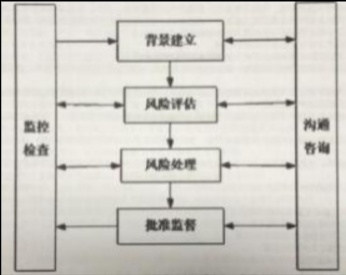

如下图所示，Alice用Bob的密钥加密明文，将密文发送给Bob，Bob再用自己的私钥解密，恢复出明文以下说法正确的是:()  
A.此密码体制为对称密码体制  
B.此密码体制为私钥密码体制  
C.此密码体制为单钥密码体制  
D.此密码体制为公钥密码体制  
正确答案:D 你的答案:B

A: 对称密码体制使用相同密钥加解密，与题目描述的密钥使用方式不符  
B: 私钥密码体制是公钥密码体制的别称，但题目描述的是典型的公钥加密场景  
C: 单钥密码体制即对称密码体制，与题目描述的公私钥配对使用场景不符  
D: 正确选项，题目描述的正是公钥密码体制的典型应用场景：发送方用接收方公钥加密，接收方用自己私钥解密

---

假设一个系统已经包含了充分的**预防控制措施**，那么安装监测控制设备:  
A.是多余的，因为它们完成了同样的功能，但要求更多的开销  
B.是必须的，可以为预防控制的功效提供检测  
C.**是可选的，可以实现深度防御**  
D.在一个人工系统中是需要的，但在一个计算机系统中则是不需要的，因为预防控制功能已经足够  
正确答案:C 你的答案:B

A: 监测控制与预防控制功能不同，前者用于**检测异常**，后者用于**阻止攻击**，二者并非重复  
B: 虽然监测控制能验证预防措施效果，但"必须"的说法过于绝对，不符合实际情况  
C: 正确选项，监测控制作为深度防御策略的一部分，可根据安全需求选择性地部署  
D: 错误区分人工系统与计算机系统的需求，监测控制在两类系统中都有应用价值

---

《信息安全技术 信息安全风险评估规范》(GB/T 20984-2007)中关于信息系统生命周期各阶段的风险评估描述**不正确**的是:  
A.规划阶段风险评估的目的是识别系统的业务战略，以支撑系统安全需求及安全战略等  
B.设计阶段的风险评估需要根据规划阶段所明确的系统运行环境、资产重要性，提出安全功能需求  
C.实施阶段风险评估的目的是根据系统安全需求和运行环境对系统开发、实施过程进行风险识别，并对系统建成后的安全功能进行验证  
D.运行维护阶段风险评估的目的是<u>了解和控制运行过程中的安全风险</u>，是一种全面的风险评估。评估内容包括对真实运行的信息系统、资产、脆弱性等各方面  
正确答案:D 你的答案:B

A: **规划阶段**风险评估确实需要识别业务战略，为后续安全需求提供依据，描述准确  
B: **设计阶段**需基于规划成果提出具体安全需求，符合标准要求  
C: **实施阶段**既要识别开发风险又要验证安全功能，描述完整正确  
D: **错误选项**，运行维护阶段评估是**周期性**的而非持续全面的，标准未要求覆盖所有方面

---

**以下哪些是需要在信息安全策略中进行描述的:**   
A.组织信息系统安全架构  
B.信息安全工作的基本原则  
C.组织信息安全技术参数  
D.组织信息安全实施手段  
正确答案:B 你的答案:A

A: **安全架构**属于技术方案层面内容，通常在具体实施方案而非策略文件中描述  
B: **正确选项**，信息安全策略的核心是明确基本原则和方针，为具体工作提供指导方向  
C: **技术参数**过于具体，属于操作层面细节，不应出现在策略性文件中  
D: **实施手段**是执行层面的内容，通常在标准或规程中规定，而非策略文件

---

**风险值=R(A，T，V)=R(L(T，V)，F(la，Va))以下关于上式各项说明错误的是:**   
A.R表示安全风险计算函数，A表示资产，T表示威胁，V表示脆弱性  
B.L表示威胁利用资产脆弱性导致安全事件的可能性  
C.F表示安全事件发生后造成的损失  
D.la，Va分别表示安全事件作用<u>全部资产的价值</u>与其<u>对应资产的严重程度</u>  
**正确答案：D 你的答案：A**

**解析：**   
**la特指某个资产A的价值**，**Va特指该资产A的脆弱性程度**，而非作用于全部资产。例如，对于一台数据库服务器（资产A），**la是其存储数据的关键价值**，**Va是其存在的SQL注入漏洞的严重程度**。

---

**小李绘制系统安全建设规划图依据的模型是：**

  
A. PDR  
B. PPDR  
C. PDCA  
D. IATF  
**正确答案：B 你的答案：C**

**解析：**   
**PPDR模型（Policy Protection Detection Response）是动态安全模型**，包含策略、防护、检测和响应四个环节，适用于系统安全建设规划。**PDCA是质量管理模型**，**PDR缺少策略环节**，**IATF是深度防御框架**。

---

信息安全风险管理过程的模型如图所示。按照流程，请问，信息安全风险管理包括()六个方面的内容。()是信息安全风险管理的四个基本步骤，()则贯穿于这四个基本步骤中。  
A. **背景建立**、**风险评估**、**风险处理**、**批准监督**、**监控审查**和**沟通咨询**；背景建立、风险评估、风险处理和批准监督；<u>监控审查和沟通咨询；</u>  
B. 背景建立、风险评估、风险处理、批准监督、监控审查和沟通咨询；背景建立、风险评估、风险处理和监控审查；批准监督和沟通咨询；  
C. 背景建立、风险评估、风险处理、批准监督、监控审查和沟通咨询；背景建立、风险评估、风险处理和沟通咨询；监控审查和批准监督；  
D. 背景建立、风险评估、风险处理、批准监督、监控审查和沟通咨询；背景建立、风险评估、监控审查和批准监督；风险处理和沟通咨询。

正确答案：A 我的答案：C

解析：

  
信息安全风险管理包括**六个方面**：**背景建立、风险评估、风险处理、批准监督、监控审查和沟通咨询**。其中，**四个基本步骤**是**背景建立、风险评估、风险处理和批准监督**，而**监控审查和沟通咨询**贯穿于这四个步骤中。  
**核心考点**：风险管理流程的六个组成部分和四个基本步骤的关系，**监控审查和沟通咨询**是持续性活动。

---

在进行应用系统的测试时，应尽可能避免使用包含个人隐私和其它敏感信息的实际生产系统中的数据，如果需要使用时，以下哪一项**不是必须做的：**   
A. 测试系统应使用不低于生产系统的访问控制措施  
B. **为测试系统中的数据部署完善的备份与恢复措施**  
C. 在测试完成后立即清除测试系统中的所有敏感数据  
D. 部署审计措施，记录生产数据的拷贝和使用

正确答案：B我的答案：C

**解析：**   
使用生产数据进行测试时，必须采取严格的安全措施，包括**访问控制（A）** 、**数据清除（C）** 和**审计记录（D）** 。但**备份与恢复（B）** 不是必须的，因为**测试数据通常不具备长期保存价值，且备份可能增加数据泄露风险。**   
**核心考点**：**测试环境数据安全要求**，重点在于**最小化敏感数据的使用**，并确保**访问控制、审计和清理**措施到位。

---

以下哪一项不属于**信息安全工程监理模型**的组成部分:  
A.监理咨询支撑要素  
B.控制和管理手段  
C.监理咨询阶段过程  
D.**监理组织安全**​**<u>实施</u>**  
正确答案：D 我的答案：A

解析：信息安全工程监理模型由三大核心组成：**监理咨询支撑要素**（如标准规范）、**监理咨询阶段过程**（规划、实施、验收等阶段）、**控制和管理手段**（质量、进度、成本控制）。**D选项属于实施层面内容**，不属于监理模型的理论框架。NISP考试重点在于掌握监理模型的结构性要素，需区分"监理"与"实施"的职责边界。

---

某公司在执行灾难恢复测试时，信息安全专业人员注意到灾难恢复站点的服务器的运行速度缓慢，为了找到根本原因，他应该首先检查:  
**A.灾难恢复站点的错误事件报告**  
B.灾难恢复测试计划  
C.灾难恢复计划(DRP)  
D.主站点和灾难恢复站点的配置文件  
正确答案：A 我的答案：D

解析：**故障排查应优先分析错误事件报告**，因其直接记录系统异常信息。灾难恢复流程强调**从日志和错误报告入手**，而非直接对比配置文件或检查计划文件。NISP考试重点在于**事件响应优先级**，**错误日志是定位性能问题的第一手资料。**

---

COBIT(信息和相关技术的控制目标)是国际专业协会ISACA为信息技术(IT)管理和IT治理创建的良好实践框架。COBIT提供了一套可实施的"信息技术控制"并围绕IT相关流程和推动因素的逻辑框架进行组织。COBIT模型如图所示，按照流程，请问，COBIT组件包括()、()、()、()、()、等部分。  
A.流程描述、框架、控制目标、管理指南、成熟度模型  
B.框架、流程描述、管理目标、控制目标、成熟度模型  
C.框架、流程描述、控制目标、管理指南、成熟度模型  
D.框架、管理指南、流程描述、控制目标、成熟度模型  
正确答案：C 我的答案：D

解析：**COBIT五大核心组件**为：框架（整体结构）、流程描述（IT活动分解）、控制目标（具体要求）、管理指南（执行方法）、成熟度模型（能力评估）。**选项C正确列出全部组件且顺序准确**，NISP考试重点在于掌握COBIT框架的完整组成要素及其逻辑关系。

---

作为业务持续性计划的一部分，在进行**业务影响分析(BIA)** 时的**步骤**是:1.标识关键的业务过程;2.开发恢复优先级;3.标识关键的IT资源;4.表示中断影响和允许的中断时间  
A.1-3-4-2  
B.1-3-2-4  
C.1-2-3-4  
D.1-4-3-2  
正确答案：A 我的答案：B

解析：**BIA标准流程顺序**应为：<u>**先识别关键业务→确定支撑的IT资源→分析中断影响→最后制定恢复优先级**</u>。**选项A符合BCM最佳实践**，NISP考试重点在于掌握业务影响分析各阶段的逻辑递进关系，确保恢复策略基于实际业务需求。

---

主体S对**客体01**有读(R)权限，对**客体02**有读(R)、写(W)、拥有(Own)权限，该访问控制实现方法是:  
A.访问控制表(ACL)  
B.访问控制矩阵  
**C.能力表(CL)**   
D.前缀表(Profiles)  
正确答案：C 我的答案：A

解析：**能力表(CL)以主体为中心**记录其对客体的权限，而**ACL以客体为中心**记录访问权限。题目描述的是从主体角度出发的权限分配，符合CL特性。NISP考试重点区分不同访问控制模型的实现机制，**CL更适合描述主体拥有的权限集合**。

---

下面哪一项不是虚拟专用**网络(VPN)协议标准**:  
A.第二层隧道协议(L2TP)  
B.Internet安全性(IPSEC)  
**C.终端访问控制器访问控制系统(TACACS+)**   
D.点对点隧道协议(PPTP)  
正确答案：C 我的答案：D

解析：**TACACS+是AAA(认证、授权、计费)协议**，主要用于远程访问控制，不属于VPN协议。**L2TP、IPSec和PPTP都是主流VPN协议**。（3P）NISP考试重点在于区分网络安全协议的不同应用场景，VPN协议专注于建立安全的远程连接隧道。

---

下列对网络认证协议**Kerberos描述正确**的是:  
A.该协议使用非对称密钥加密机制  
B.密钥分发中心由认证服务器、票据授权服务器和客户机三个部分组成  
**C.该协议完成身份鉴别后将获取用户票据许可票据**  
D.使用该协议不需要时钟基本同步的环境  
正确答案：C 我的答案：A

解析：**Kerberos采用对称加密**而非非对称加密(A错)，其KDC仅包含AS和TGS(B错)，且**严格要求时间同步**(D错)。**C选项正确描述了Kerberos认证第一步**：获取票据许可票据(TGT)。NISP考试重点掌握Kerberos三阶段认证流程及其技术特点。

---

鉴别的基本途径有三种：所知、所有和个人特征，以下哪一项不是基于你所知道的：  
A.口令  
**B.令牌**  
C.知识  
D.密码  
正确答案：B 我的答案：D

解析：**令牌属于"所有"的鉴别方式**（如智能卡、U盾等物理载体），而口令、密码和知识都属于"所知"的鉴别因素。NISP考试重点在于区分三类认证因素：**所知（记忆信息）、所有（持有物品）、个人特征（生物识别）** 。

---

**入侵防御系统(IPS)** 是继入侵检测系统(IDS)后发展出来的一项新的安全技术，它与IDS有着许多不同点，请指出下列哪一项描述不符合IPS的特点：  
A.串接到网络线路中  
B.对异常的进出流量可以直接进行阻断  
C.有可能造成单点故障  
**D.不会影响网络性能**  
正确答案：D 我的答案：B

解析：**IPS采用串联部署方式**（A正确），**能主动阻断威胁**（B正确），**但会引入延迟影响性能**（D错误），且存在单点故障风险（C正确）。NISP考试重点掌握IPS与IDS的核心区别：**IPS是主动防御设备，必然会影响网络性能**，这是其工作原理决定的固有特性。

---

下列关于**kerckhof**准则的说法**正确**的是:  
A.保持算法的秘密性比保持密钥的秘密性要困难的多  
B.密钥一旦泄漏，也可以方便的更换  
**C.在一个密码系统中，密码算法是可以公开的，密钥应保证安全**  
D.公开的算法能够经过更严格的安全性分析  
正确答案：C 我的答案：D

解析：**Kerckhoffs准则核心**是密码系统安全性应仅依赖于密钥而非算法保密（C正确）。虽然公开算法更易分析（D部分正确），但这不是准则核心内容。NISP考试重点在于理解该准则强调**密钥保密比算法保密更重要**，这是现代密码学基本原则。

---

以下列出了MAC和散列函数的相似性，哪一项说法是**错误**的：  
A.MAC和散列函数都是用于提供消息认证  
B.MAC的输出值不是固定长度的，而散列函数的输出值是固定长度的  
C.MAC和散列函数都不需要密钥  
D.MAC和散列函数都不属于非对称加密算法  
正确答案：C 我的答案：A

解析：**MAC（消息认证码）必须使用密钥**，而散列函数不需要密钥（C错误）。两者确实都提供消息认证（A正确），且都非对称加密（D正确）。NISP考试重点在于区分MAC与散列的关键差异：**MAC是带密钥的认证机制，散列是无密钥的指纹算法**。

---

关于《关于信息安全**等级保护工作的实施意见**》(公通字[2004]166号)文件，下面**理解正确**的是：  
A.该文件是一个由部委发布的政策性文件，不属于法律文件  
B.该文件适用于2004年的等级保护工作，其内容<u>不能约束</u>到2005年及之后的工作  
C.该文件是一个总体性指导文件，<u>规定所有</u>信息系统都要纳入等级保护定级范围  
D.该文件适用范围为发文的这四个部门，<u>不适用于其他部门</u>和企业等单位  
正确答案：A 我的答案：C

解析：**该文件属于部委发布的政策性指导文件**（A正确），不具有法律强制力。作为我国等级保护制度的奠基性文件，**其指导原则长期有效**（B错误），但并非要求所有系统强制定级（C错误），且适用范围不限于发文部门（D错误）。NISP考试重点在于理解我国等级保护制度的发展历程和政策文件的法律效力层级。

---

通过**对称密码算法**进行安全消息传输的**必要条件**是：  
A.在安全的传输信道上进行通信  
B.通讯双方通过某种方式，**安全且秘密地共享密钥**  
C.通讯双方使用不公开的加密算法  
D.通讯双方将传输的信息夹杂在无用信息中传输并提取  
正确答案：B 我的答案：A

解析：**对称加密的核心是密钥安全共享**（B正确），而非依赖安全信道（A错误）或算法保密（C错误）。NISP考试重点在于掌握对称加密的基本原理：**安全性完全依赖于密钥的保密性**，与传输信道和算法公开性无关。

---

以下对Windows账号的描述，**正确**的是：  
A.Windows系统是采用**SID(安全标识符)** 来标识用户对文件或文件夹的权限  
B.Windows系统是采用用户名来标识用户对文件或文件夹的权限  
C.Windows系统默认会生成administrator和guest两个账号，两个账号都不允许改名和删除  
D.Windows系统默认生成administrator和guest两个账号，两个账号都可以改名和删除  
正确答案：A 我的答案：D

解析：**Windows权限系统基于SID而非用户名**（A正确）。默认账户中，**administrator可改名但不可删除**，guest可改名和删除（C、D错误）。NISP考试重点在于理解Windows安全机制：**SID是权限管理的核心标识符**，用户名只是SID的友好显示名称。

---

**AES**在<u>抵抗差分密码</u>分析及线性密码分析的能力比DES更有效，已经替代DES成为新的数据加密标准。其算法的信息块长度和加密密钥是可变的，以下哪一种不是其可能的密钥长度：  
**A.64bit**  
B.128bit  
C.192bit  
D.256bit  
正确答案：A 我的答案：C

解析：**AES标准密钥长度为128/192/256位**（B/C/D正确），64位（A选项）是DES的密钥长度而非AES。NISP考试重点在于区分**AES与DES的关键参数差异**：AES采用更长的密钥长度（最小128位）和更大的分组大小（128位），提供比DES（64位密钥/64位分组）更强的安全性。

---

以下关于Windows SAM(**安全账号管理器**)的说法**错误**的是：  
A.安全账号管理器(SAM)具体表现就是%SystemRoot%\\system32\\config\\sam  
B.安全账号管理器(SAM)存储的账号信息是存储在注册表中  
C.安全账号管理器(SAM)存储的账号信息administrator和system是**可读和可写的**  
D.安全账号管理器(SAM)是Windows的用户数据库系统进程通过Security Accounts Manager服务进行访问和操作  
正确答案：C 我的答案：B

解析：**SAM文件仅SYSTEM账户有完全访问权限**（C错误），administrator账户也无权直接读写。SAM数据实际存储在 **%SystemRoot%\system32\config\sam文件**（A正确）而非注册表（B错误）。NISP考试重点在于掌握Windows安全机制：**SAM数据库的访问权限严格控制**，仅系统核心进程可通过安全账户管理器服务访问。

---

信息安全是国家安全的重要组成部分，综合研究当前世界各国信息安全保障工作，总结**错误**的是：  
A.各国普遍将与国家安全、社会稳定和民生密切相关的关键基础设施作为信息安全保障的重点  
B.各国普遍重视战略规划工作，逐步发布网络安全战略、政策评估报告、推进计划等文件  
C.各国普遍加强国际交流与对话，**均同意建立一致的安全保障系统**，强化各国安全系统互通  
D.各国普遍积极推动信息安全立法和标准规范建设，重视应急响应、安全监管和安全测评  
正确答案：C 我的答案：A

解析：**各国安全战略存在显著差异**，并未就"建立一致的安全保障系统"达成共识（C错误）。虽然各国都重视关键基础设施保护（A正确）和战略规划（B正确），但**国家安全考量导致政策独立性**，系统互通存在现实障碍。NISP考试重点在于理解国际信息安全合作的局限性。

---

**公钥密码**的应用不包括：  
A.数字签名  
B.非安全信道的密钥交换  
**C.消息认证码**  
D.身份认证  
正确答案：C 我的答案：D

解析：**消息认证码（MAC）使用对称加密**而非公钥密码（C正确）。公钥密码典型应用包括：**数字签名（A）、密钥交换（B）和身份认证（D）** 。NISP考试重点在于区分对称加密和公钥加密的不同应用场景，**MAC需要共享密钥，属于对称加密范畴**。

---

**自主访问控制模型(DAC)** 的访问控制关系可以用访问控制表(ACL)来表示，该ACL利用在客体上附加一个主体明细表的方法来表示访问控制矩阵，通常使用由客体指向的链表来存储相关数据。下面选项中说法**正确**的是：  
A.ACL是Bell-LaPadula模型的一种具体实现  
B.ACL在删除用户时，去除该用户所有的访问权限比较方便  
C.ACL对于统计某个主体能访问哪些客体比较方便  
D.**ACL管理或增加客体比较方便**  
正确答案：D 我的答案：B

解析：**ACL以客体为中心存储权限**，增加/管理客体时只需修改单个链表（D正确）。**删除主体需遍历所有客体**（B错误），统计主体权限效率低（C错误）。NISP考试重点在于理解ACL的**数据结构特点及其管理效率**，ACL与BLP模型（强制访问控制）无关（A错误）。

---

什么是**系统变更控制**中最重要的内容？  
**A.所有的变更都必须文字化，并被批准**  
B.变更应通过自动化工具来实施  
C.应维护系统的备份  
D.通过测试和批准来确保质量  
正确答案：A 我的答案：D

解析：**变更控制的核心理念是文档化和审批流程**（A正确），<u>这是确保变更可追溯的基础。</u>虽然测试（D）和备份（C）很重要，但属于支持性措施。NISP考试重点在于掌握**变更管理的基本原则**：所有变更必须被记录、评估和授权，这是信息安全治理的关键要求。

---

小陈学习了有关<u>**信息安全管理体系**</u>的内容后，认为组织建立信息安全管理体系并持续运行，比起简单地实施信息安全管理，有更大的作用，他总结了四个方面的作用，其中总结**错误**的是：  
A.可以建立起文档化的信息安全管理规范，实现有"法"可依，有章可循，有据可查  
B.可以强化员工的信息安全意识，建立良好的安全作业习惯，培育组织的信息安全企业文化  
C.可以增强客户、业务伙伴、投资人对该组织保障其业务平台和数据信息的安全信心  
D.可以深化信息安全管理，提高安全防护效果，使组织通过国际标准化**组织的ISO9001认证**  
正确答案：D 我的答案：C

解析：**ISO9001是质量管理体系认证**，与信息安全无关，正确的应是**ISO27001认证**（D错误）。其他选项正确描述了信息安全管理体系(ISMS)的价值：规范化管理（A）、意识提升（B）和增强信任（C）。NISP考试重点在于区分不同管理体系标准的适用范围。

---

随着"互联网"概念的普及，越来越多的新兴住宅小区引入了"**智能楼宇**"的理念，某物业为提供高档次的服务，防止网络主线路出现故障，保证小区内网络服务的可用、稳定、高效，计划通过**网络冗余配置**的是：  
**A.接入互联网时，同时采用不同电信运营商线路，相互备份且互不影响**  
B.核心层、汇聚层的设备和重要的接入层设备均应双机设备  
C.规划网络IP地址，制定网络IP地址分配策略  
D.保证网络带宽和网络设备的业务处理能力具备冗余空间，满足业务高峰期和业务发展需求  
正确答案：A 我的答案：B

解析：**多运营商线路备份**（A）是解决"网络主线路故障"的最直接方案，而设备冗余（B）和带宽冗余（D）属于系统内部冗余。NISP考试重点在于区分不同层级的冗余措施，**线路级冗余最能防范运营商单点故障**，IP规划（C）与冗余无关。

---

若一个组织声称自己的ISMS符合ISO/IEC 27001或GB/T22080标准要求，其信息安全控制措施通常需要在人力资源安全方面实施常规控制，**人力资源安全划分为3个控制阶段**，**不包括**哪一项：  
A.任用之前  
B.任用中  
C.任用终止或变化  
**D.任用后**   
正确答案：D 我的答案：A

解析：**ISO27001标准将人力资源安全分为任用前、任用中和任用终止三个阶段**（A/B/C正确），"任用后"（D）不属于标准划分。NISP考试重点在于掌握**信息安全人力资源管理的全生命周期控制要求**，特别是岗位变更和离职时的安全管理措施。**任用后是离职后的意思吧**

---

关于**Kerberos**认证协议，以下说法**错误**的是：  
A.只要用户拿到了认证服务器(AS)发送的票据许可票据(TGT)并且该TGT没有过期，就可以使用该TGT通过票据授权服务器(TGS)完成到任一个服务器的认证而不必重新输入密码  
B.认证服务器(AS)和票据授权服务器(TGS)是集中式管理，容易形成瓶颈，系统的性能和安全也严重依赖于AS和TGS的性能和安全  
C.该协议通过用户获得票据许可票据、用户获得服务许可票据、用户获得服务三个阶段，仅支持服务器对用户的单向认证  
D.该协议是一种基于对称密码算法的网络认证协议，随用户数量增加，密钥管理较复杂  
正确答案：C 我的答案：D

解析：**Kerberos支持双向认证**（C错误），**<u>不仅验证用户身份，也验证服务器身份</u>**。其他选项正确描述了Kerberos特性：TGT重用（A）、中心化架构（B）和对称加密机制（D）。NISP考试重点在于掌握**Kerberos的三阶段认证流程和双向认证机制**，这是协议的核心安全特性。

---

某单位系统管理员对组织内核心资源的访问制定访问策略，针对**每个用户指明**能够访问的资源，对于不在指定资源列表中的对象**不允许访问**。该访问控制策略属于以下哪一种：  
A.强制访问控制  
B.基于角色的访问控制  
**C.自主访问控制**  
D.基于任务的访问控制  
正确答案：C 我的答案：A

解析：**自主访问控制(DAC)允许资源所有者自主决定访问权限**，符合题目中"<u>**针对每个用户指明访问资源"的描述，说明是自主的。**</u> 强制访问控制(MAC)需要系统统一分配安全标签（A错误）。NISP考试重点在于区分不同访问控制模型：**DAC的特点是权限分配灵活，由数据所有者自主管理**。

---

‍
