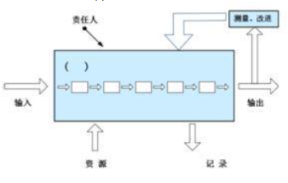

某电子商务网站在开发设计时，使用了威胁建模方法来分析电子商务网站所面临的威胁。STRIDE是微软SDL中提出的威胁建模方法，将威胁分为六类，为每一类威胁提供了标准的消减措施，Spoofing是STRIDE中**欺骗类**的威胁，以下威胁中哪个可以归入此类威胁：  
A.网站竞争对手可能雇佣攻击者实施DDoS攻击，降低网站访问速度  
B.网站使用用户名、密码进行登录验证，攻击者可能会利用**~~弱口令或其他方式获得用户密码~~**，以该用户身份登录修改用户订单等信息  
C.网站使用使用http协议进行浏览等操作，无法确认数据与用户发出的是否一致，可能数据被中途篡改  
D.网站使用使用http协议进行浏览等操作，未对数据进行加密，可能导致用户传输信息泄露，例如购买的商品金额等  
正确答案：B 我的答案：C

解析：**Spoofing（欺骗）威胁特指身份冒充**（B正确），如密码窃取后伪装合法用户。DDoS（A）属于拒绝服务，数据篡改（C）属于篡改（Tampering），信息泄露（D）属于信息泄露（Information Disclosure）。NISP考试重点在于掌握STRIDE模型六类威胁：**欺骗（S）、篡改（T）、抵赖（R）、信息泄露（I）、拒绝服务（D）和权限提升（E）** ，需准确区分各类威胁特征。

---

下列关于软件安全开发中的BSI(Build Security In)系列模型说法**错误**的是：  
A.软件安全的三根支柱是风险管理、软件安全触点和安全知识  
B.BSI含义是指将安全内建到软件开发过程中，而不是可有可无，更不是游离于软件开发生命周期之外  
C.BSI系列模型强调**~~安全测试~~**的重要性，要求安全**~~测试~~**贯穿整个开发过程及软件生命周期  
D.软件安全触点是软件开发生命周期中一套轻量级最优工程化方法，它提供了从不同角度保障安全的行为方式  
正确答案：C 你的答案：D

解析：**BSI模型的核心是"预防性安全措施"而非测试**（C错误），其三大支柱为风险管理、安全触点和安全知识（A正确）。NISP考试重点在于理解BSI模型的**主动防御理念**：通过需求分析、架构设计等触点（D）将安全内建（B）到SDLC中，而非依赖后期的安全测试。

---

在信息安全风险管理过程中，**背景建立**是实施工作的第一步。下面哪项理解是**错误**的：  
A.背景建立阶段应分析信息系统的体系结构和关键要素，分析信息系统的安全环境和要求，形成信息系统的安全要求报告  
B.背景建立阶段应调查信息系统的业务目标、业务特性、管理特性和技术特性，形成信息系统的描述报告  
C.背景建立阶段应识别需~~要保护的资产、面临的威胁以及存在的脆弱性~~，并分别赋值，同时确认已有的安全措施，形成需要保护的资产清单  
D.背景建立的依据是国家、地区或行业的相关政策、法律、法规和标准，以及机构的使命、信息系统的业务目标和特性  
正确答案：C 我的答案：D

解析：**资产识别和赋值属于风险要素识别阶段**（C错误），而非背景建立阶段。背景建立主要完成系统描述（B）、安全要求确定（A）和政策符合性分析（D）。NISP考试重点在于区分风险管理各阶段任务：**背景建立→资产识别→风险分析→风险处置**，C选项内容属于第二阶段工作。

---

有关**系统安全工程-能力成熟度模型(SSE-CMM)** 中的通用实施(Generic Practices，GP)**错误**的理解是：  
A.在工程实施时，GP应该作为基本实施(Base Practices，BP)的一部分加以执行  
B.GP适用于域维中部分过程区域(Process Areas, PA)的活~~动而非所有PA的活动~~  
C.在评估时，GP用于判定工程组织执行某个PA的能力  
D.GP是涉及过程的管理、测量和制度化方面的活动  
正确答案：B 你的答案：C

解析：**通用实施(GP)适用于所有过程区域(PA)** （B错误），是跨PA的共性实践。其他选项正确描述了GP特性：与基本实施(BP)协同执行（A）、用于能力评估（C）、聚焦过程管理（D）。NISP考试重点在于掌握SSE-CMM的双维结构：**11个PA（过程域）和5个GP（公共特征）共同构成能力成熟度评估框架**。

---

Gary McGraw博士及其合作者提出软件安全应由三根支柱来支撑，这**三个支柱**是：  
A.威胁建模、源代码审核和模糊测试  
B.应用**风险管理、软件安全接触点和安全知识**  
C.威胁建模、渗透测试和软件安全接触点  
D.源代码审核、风险分析和渗透测试  
正确答案：B 你的答案：A

解析：**软件安全三大支柱为风险管理（贯穿生命周期）、安全触点（SDLC关键环节）和安全知识（最佳实践）** （B正确）。其他选项混淆了具体技术手段（A/C/D）与体系化框架。NISP考试重点在于掌握BSI模型核心思想：**将安全内建到开发全流程**，而非依赖后期测试（如模糊测试/渗透测试）。

---

软件存在漏洞和缺陷是不可避免的，实践中常使用**软件缺陷密度**(Defects/KLOC)来衡量软件的安全性。假设某个软件共有296万行源代码，总共被检测出145个缺陷，则可以计算出其软件**缺陷密度值**是：​​  
A.49  
B.0.49  
C.0.00049  
**D.0.049**  
正确答案：D 你的答案：C

解析：**缺陷密度=缺陷数/(代码行数/1000)=145/(2,960,000/1000)=0.049缺陷/KLOC**（D正确）。NISP考试重点在于掌握软件安全度量方法：**千行代码缺陷率（Defects/KLOC）是行业通用基准**，计算时需注意单位换算（每千行而非每行）。

---

ISO9001-2000标准鼓励在制定、实施质量管理体系以及改进其有效性时采用过程方法，通过满足顾客要求，增进顾客满意度。下图是关于过程方法的示意图，图中括号空白处应填写：

  
A.策略  
B.活动  
C.组织  
D.管理者  
正确答案：B 你的答案：D

解析：**过程方法的核心是"活动-输入-输出"转换模型**（B正确），图中空白处应填入"活动"这一关键要素。NISP考试重点在于理解ISO9001的过程方法：**所有工作都应视为通过活动将输入转化为输出的过程**，这是质量管理体系的基础逻辑。

---

以下关于互联网协议安全(Internet Protocol Security, IPsec)协议说法**错误**的是：  
A.IPsec**仅能**保证传输数据的可认证性和保密性  
B.验证头协议(Authentication Head，AH)和IP封装安全载荷协议(Encapsulating Security Payload，ESP)都能以传输模式和隧道模式工作  
C.在隧道模式中，保护的是整个互联网协议(Internet Protocol，IP)包，包括IP头  
D.在传送模式中，保护的是IP负载  
正确答案：A 你的答案：B

解析：**IPsec不仅能提供认证和保密，还能保证数据完整性**（A错误），这是其三大核心安全服务。其他选项正确描述了IPsec特性：AH/ESP的工作模式（B）、隧道模式范围（C）和传输模式范围（D）。NISP考试重点在于掌握IPsec的**三大功能：认证（AH）、加密（ESP）和完整性保护**，以及两种封装模式的区别。

---

下列选项中对**信息系统**审计概念的描述中**不正确**的是：  
A.信息系统审计，也可称作IT审计或信息系统控制审计  
B.信息系统审计是一个获取并评价证据的过程，审计对象是信息系统相关控制，审计目标则是判断信息系统是否能够保证其安全性、可靠性、经济性以及数据的真实性、完整性等相关属性  
C.信息系统审计是单一的概念，**~~是对会计信息系统~~**的安全性、有效性进行检查  
D.从信息系统审计内容上看，可以将信息系统审计分为不同专项审计，例如安全审计、项目合规审计、绩效审计等  
正确答案：C 你的答案：D

解析：**信息系统审计是综合性概念**（C错误），涵盖<u>各类信息系统</u>（非仅会计系统）的多维度评估。其他选项正确描述了审计特性：别称（A）、过程定义（B）和分类方式（D）。NISP考试重点在于理解信息系统审计的**广泛适用性**：覆盖技术控制、管理控制和业务合规性等多个层面。

---

终端访问控制器访问控制系统(TACACS)在认证过程中，客户机发送一个START包给服务器，包的内容包括执行的认证类型、用户名等信息。START包只在一个认证会话开始时使用一个，序列号永远为()。服务器收到START包以后，回送一个REPLY包，表示认证继续还是结束。  
A.0  
**B.1**  
C.2  
D.4  
正确答案：B 你的答案：A

解析：**TACACS协议规定START包序列号固定为1**（B正确），后续REPLY包序列号递增。NISP考试重点在于掌握TACACS认证流程细节：**START（1）→REPLY（2）→CONTINUE（3）** 的序列号递增机制，这是协议设计的核心特征。

---

访问控制方法可分为自主访问控制、强制访问控制、基于角色访问控制和基于规则访问控制，它们具有不同的特点和应用场景。如果需要选择一个访问控制模型，要求能够支**持最小特权原则和职责分离原则**，而且在不同的系统配置下可以具有不同的安全控制，那么在(1)自主访问控制，(2)强制访问控制，(3)**基于角色的访问控制，(4)基于规则的访问控制中**，能够满足以上要求的选项有：  
A.只有(1)(2)  
B.只有(2)(3)  
**C.只有(3)(4)**   
D.只有(4)  
正确答案：C 你的答案：B

解析：**基于角色（RBAC）和基于规则（RuBAC）的访问控制**（C正确）能同时满足最小特权和职责分离要求，且配置灵活。强制访问控制（MAC）过于刚性（B错误），自主访问控制（DAC）难以实现权限约束（A错误）。NISP考试重点在于理解不同访问控制模型的适用场景：**RBAC通过角色权限分离实现最小特权，RuBAC通过策略规则实现动态控制**。

---

分析针对Web的攻击前，先要明白http协议本身不存在安全性问题，攻击者不会把它当作攻击对象。而是应用了http协议的服务器或客户端、以及运行的服务器web应用资源才是攻击目标。针对**Web应用的攻击**，我们归纳出了12种，小陈列举了其中的4种，在这四种当中错误的是：  
A.拒绝服务攻击  
B.网址重定向  
C.传输保护不足  
**D.错误的访问控制**  
正确答案：D 你的答案：C

解析：**错误的访问控制属于系统设计缺陷**（D错误），而非针对Web应用的攻击类型。其他选项均为典型的Web攻击：DoS攻击资源（A）、重定向钓鱼（B）、明文传输嗅探（C）。NISP考试重点在于区分**针对Web应用的攻击手段与系统安全缺陷**，OWASP Top 10中的攻击类型均针对应用层漏洞。

---

1998 年英国公布标准的第二部分《信息安全管理体系规范》，规定()管理体系要求与()要求，它是一个组织的全面或部分信息安全管理体系评估的()，它可以作为一个正式认证方案的()。BS 7799-1与 BS7799-2 经过修订于 1999 年重新予以发布，1999 版考虑了信息处理技术，尤其是在网络和通信领域应用的近期发展，同时还非常强调了商务涉及的信息安全及()的责任。

A. 信息安全;<u>信息安全控制</u>;**根据**;**基础**;信息安全  
B. ~~信息安全控制;信息安全，根据;基础;信息安全
C. 信息安全控制;信息安全;基础;根据;信息安全~~  
D. 信息安全;<u>信息安全控制</u>;基础;根据，信息安全

正确答案：A 我的答案：D

**BS 7799-2标准的核心内容**：该标准规定了**信息安全**管理体系要求与**信息安全控制**要求，是评估的**根据**，并作为认证的**基础**。1999年修订版强化了**信息安全责任**，尤其关注网络和通信技术的发展。**易错点在于“根据”和“基础”的顺序**，正确顺序应为“根据”在前。BS 7799是ISO/IEC 27001的前身，奠定了现代信息安全管理体系（ISMS）的基础。

---

2006 年5月8日电，中共中央办公厅、国务院办公厅印发了《2006-2020年国家信息化发展战略》。全文分()部分共计约 15000余字。对国内外的信息化发展做了宏观分析，对我国信息化发展指导思想和战略目标标准要阐述，对我国()发展的重点、行动计划和保障措施做了详尽描述。该战略指出了我国()发展的()，当前我国信息安全保障工作逐步加强。制定并实施了(),初步建立了信息安全管理体制和)。基础信息网络和重要信息系统的安全防护水平明显提高，互联网信息安全管理进一步加强。  
A.5个; 信息化; 基本形势;国家安全战略;工作机制  
**B.6个**;信息化;基本形势 **;国家信息安全战略**;工作机制  
C.7个;信息化;基本形势;国家安全战略;工作机制  
D.8个;信息化;基本形势;**国家信息安全战略**;工作机制

正确答案：B 我的答案：D  
 **《2006-2020年国家信息化发展战略》是我国信息化发展的重要纲领性文件**。全文共分为**6个部分**，内容涵盖信息化发展的指导思想、战略目标、重点任务和保障措施等。该战略明确指出了我国信息化发展的**基本形势**，并强调制定实施了**国家信息安全战略**，初步建立了信息安全**工作机制**。**关键点在于区分"国家安全战略"和"国家信息安全战略"** ，在信息化领域应选择后者。文件标志着我国将信息安全提升到国家战略高度，为后续网络安全立法奠定了基础。

---

张主任的计算机使用Windows7操作系统，他常登陆的用户名为zhang，张主任给他个人文件夹设置了权限为只有zhang这个用户有权访问这个目录，管理员在某次维护中无意将zhang这个用户删除了，随后又重新建了一个用户名为zhang，张主任使用zhang这个用户登陆系统后，发现无法访问他原来的个人文件夹，原因是()

A. 新建用户需要授权才能访问系统文件  
**B. 新建的zhang用户SID与原用户不同，系统视为不同用户**  
C. 用户删除后其文件夹自动删除  
D. 新建用户会继承原用户权限但文件夹已加密

正确答案：B 我的答案：C

**Windows权限机制的核心是SID（安全标识符）** 。系统通过唯一SID而非用户名识别用户，即使新建同名用户也会生成新SID，导致无法访问原用户权限设置的资源。这是Windows安全体系的基础特性，管理员需通过"取得所有权"功能重新分配权限。**实际工作中常见此类问题，解决方案是使用管理员账户重新配置文件夹权限**。

---

杀毒软件一般是通过对代码与特征库中的特征码进行比对，判断这个文件是否为恶意代码，如果是则联系到病毒库中对该病毒的描述，从而确认其行为，达到分析的目的。下列对恶意代码**静态分析的说法中，错误的是()**

A. 静态分析不需要实际执行恶意代码，它通过对其二进制文件的分析，获得恶意代码的基本结构和特征，了解其工作方式和机制  
B. 静态分析通过查找恶意代码二进制程序中嵌入的可疑字符串，如：文件名称、URL地址、域名、调用函数等来进行分析判断  
C. 静态分析检测系统函数的**运行状态**，数据流转换过程，能判别出恶意代码行为和正常软件操作  
D. 静态分析方法可以分析恶意代码的所**有执行路径**，但是随着程序复杂度的提高，冗余路径增多，会出现分析效率很低的情况

正确答案：C 我的答案：D

**静态分析与动态分析的核心区别**：静态分析仅检查代码本身而不执行，无法获取运行时状态。选项C描述的"检测系统函数运行状态"和"数据流转换过程"属于动态分析范畴。**关键点在于静态分析只能分析代码结构和特征，无法观察实际执行行为**。随着代码复杂度增加（选项D），静态分析确实会面临路径爆炸问题，这是其固有局限性。

---

数据库是一个单位或是一个应用领域的通用数据处理系统，它存储的是属于企业和事业部门、团体和个人的有关数据的集合。数据库中的数据是从全局观点出发建立的，按一定的数据模型进行组织、描述和存储。其结构基于数据间的自然联系，从而可提供一切必要的存取路径，且数据不再针对某一应用，而是面向全组织，具有整体的结构化特征。数据库作为应用系统数据存储的系统，毫无疑问会成为信息安全的重点防护对象。数据库安全涉及到数据资产的安全存储和安全访问，**对数据库安全要求不包括下列**()  
A. 向所有用户提供可靠的信息**服务**  
B. 拒绝执行不正确的数据操作  
C. 拒绝非法用户对数据库的访问  
D. 能跟踪记录，以便为<u>合规性检查、安全责任审查等提供证据和迹象</u>

正确答案：A 我的答案：D

**数据库安全的核心要求**主要聚焦于数据的机密性、完整性和可用性（CIA三要素）。选项A所述的"向所有用户提供可靠的信息服务"属于数据库系统的功能目标，而非安全要求范畴。**关键区分点在于：数据库安全关注的是防护措施（如访问控制、审计日志等），而非服务可用性**。其他选项B、C、D分别对应完整性保护、访问控制和审计追踪，都是典型的安全要求。

---

()在实施攻击之前，需要尽量收集伪装身份()，这些信息是攻击者伪装成功的()。例如攻击者要伪装成某个大型集团公司总部的()，那么他需要了解这个大型集团公司所处行业的一些行规或者()、公司规则制度、组织架构等信息，甚至包括集团公司中相关人员的绰号等等。

**A. 攻击者**；所需要的信息；系统管理员；基础；内部约定  
B. 所需要的信息；基础；攻击者；系统管理员；内部约定  
**C. 攻击者**；所需要的信息；**基础；** 系统管理员；内部约定  
D. 所需要的信息；攻击者；基础；系统管理员；内部约定

正确答案：C 我的答案：B  
**社会工程学攻击的关键在于身份伪装的信息收集**。攻击者需要获取目标的基础信息（如行业规范）和内部约定（如公司暗语）来伪装成系统管理员等可信身份。**核心考点是社会工程学的实施步骤：确定伪装身份→收集必要信息→构建可信形象**。实际防御中，企业应加强员工安全意识培训，建立身份验证机制。

---

风险评估相关政策，目前主要有()(国信办[2006]5号)。主要内容包括：分析信息系统资产的()，评估信息系统面临的()、存在的()、已有的安全措施和残余风险的影响等、两类信息系统的()、涉密信息系统参照"分级保护"、非涉密信息系统参照"等级保护"。

A.《关于开展**信息安全**风险评估工作的意见》；重要程度；**安全威胁**；**脆弱性**；**工作开展**  
B.《关于开展风险评估工作的意见》；安全威胁；重要程度；脆弱性；工作开展  
C.《关于开展风险评估工作的意见》；重要程度；安全威胁；脆弱性；工作开展  
D.《关于开展**信息安全**风险评估工作的意见》；脆弱性；重要程度；安全威胁；工作开展

正确答案：A 我的答案：C  
 **《关于开展信息安全风险评估工作的意见》(国信办[2006]5号)是我国信息安全风险评估工作的纲领性文件**。其核心内容包括：资产重要程度评估、安全威胁分析、系统脆弱性识别，并明确区分涉密系统(分级保护)和非涉密系统(等级保护)的不同管理要求。**关键点在于准确记忆文件全称和评估流程顺序**：资产→威胁→脆弱性。

---

由于病毒攻击、非法入侵等原因，校园网整体瘫痪，或者校园网络中心全部DNS主WEB服务器不能正常工作；由于病毒攻击、非法入侵、人为破坏或不可抗力等原因，造成**校园网出口中断**，属于以下哪种级别事件()

A. 特别重大事件  
B. 重大事件  
C. 较大事件  
D. **一般事件**

正确答案：D 我的答案：A  
**网络安全事件分级标准的核心考量是影响范围和恢复难度**。校园网瘫痪或出口中断属于局部网络故障，**<u>==影响范围限于单个单位，通常列为一般事件==</u>**。**关键区分点在于：特别重大事件需影响多个地区或关键基础设施，而校园网问题不在此列**。实际处置时应参考《网络安全事件应急预案》的具体分级标准，重点关注系统服务中断时长和影响用户规模。

---

以下关于开展软件安全开发必要性描述**错误**的是？()

A. 软件应用越来越广泛  
B. 软件应用场景越来越不安全  
C. 软件安全问题普遍存在  
**D. 以上都不是**

正确答案：D 我的答案：B  
**软件安全开发的必要性体现在多个方面**。选项A、B、C都正确描述了当前软件安全面临的挑战：软件应用普及（A）、应用环境风险增加（B）以及普遍存在的安全问题（C）。**关键点在于理解"以上都不是"作为错误选项的条件**，当其他选项都正确时，D就是错误描述。实际开发中，安全应贯穿软件生命周期全过程，从需求分析到部署维护。

---

灾备指标是指信息安全系统的容灾抗毁能力，主要包括四个具体指标：恢复时间目标(RTO)、恢复点目标(RPO)、降级操作目标(DOO)和网络恢复目标(NRO)。小华准备为其工作的信息系统拟定恢复点目标RPO-0，以下描述中，正确的是()。

A. RPO-0，相当于没有任何数据丢失，但需要进行业务恢复处理，覆盖原有信息  
B. RPO-0，相当于所有数据全部丢失，需要进行业务恢复处理，修复数据丢失  
C. RPO-0，相当于部分数据丢失，需要进行业务恢复处理，修复数据丢失  
D. RPO-0，相当于没有任何数据丢失，且不需要进行业务恢复处理

正确答案：A 我的答案：D

**解析：**   
**RPO-0是灾备领域的最高数据保护标准**，表示系统可以实现零数据丢失。但关键点在于：虽然数据不会丢失，业务恢复过程仍需执行以覆盖原有信息。**实际应用中，RPO-0通常需要同步数据复制技术支撑**，这对系统性能和成本要求较高。选项D错误在于忽略了必要的业务恢复处理环节，这是灾备方案实施的关键步骤。

---

关于信息安全事件管理和应急响应，以下说法**错误**的是

A. 应急响应是指组织为了应对突发/重大信息安全事件的发生所做的准备，以及在事件发生后所采取的措施  
B. 根据信息安全事件的分级参考要素，可将信息安全事件划分为4个级别：特别重大事件（Ⅰ级）、重大事件（Ⅱ级）、较大事件（Ⅲ级）和一般事件（Ⅳ级）  
C. 应急响应方法，将应急响应管理过程分为~~遏制、根除、处置、恢复、报告和跟踪6个阶段~~  
D. 对信息安全事件的分级主要参考信息系统的**重要程度**、**系统损失**和社会影响三方面因素

正确答案：C 你的答案：D

**解析：**   
**标准应急响应流程应为6个阶段：准备、检测、遏制、根除、恢复、跟踪**。选项C错误地将"处置"列为独立阶段，并遗漏了关键的"准备"和"检测"阶段。**关键点在于掌握NIST标准的应急响应生命周期模型**，这是信息安全事件处理的国际通用框架。实际响应中，准备阶段（预案制定等）往往决定事件处置的最终效果。

---

规范的实施流程和文档管理，是信息安全风险评估能否取得成功的重要基础。某单位在实施风险评估时，形成了《待评估信息系统相关设备及资产清单》。在风险评估实施的各个阶段中，该《<u>待评估信息系统相关设备及资产清单</u>》应是如下()中的输出结果。

A **. 风险要素识别**  
B. 风险结果判定  
C. 风险分析  
D. 风险评估准备

正确答案：A 我的答案：D

**解析：**   
**风险评估的核心流程阶段划分**：资产清单是风险要素识别阶段的关键产出物。**关键点在于理解风险评估各阶段的核心任务**：1)准备阶段确定评估范围和方法；2)风险要素识别阶段明确资产、威胁和脆弱性；3)风险分析阶段计算风险值；4)风险结果判定阶段评估风险等级。实际工作中，资产清单的完整性直接影响后续威胁分析和脆弱性评估的准确性。

---

随着信息安全涉及的范围越来越广，各个组织对信息安全管理的需求越来越迫切，越来越多的组织开始尝试使用参考ISO27001介绍的ISMS来实施信息安全管理体系，提高组织的信息安全管理能力。关于ISMS，下面描述**错误**的是()。

A. 组织的管理层应确保ISMS目标和相应的计划得以制定，信息安全管理目标应明确、可度量，风险管理计划应具体，具备可行性  
B. 组织的管理层应全面了解组织所面临的信息安全风险，决定风险可接受级别和风险可接受准则，并确认接受相关残余风险  
C. 组织的信息安全目标、信息安全方针和要求应传达至全组织范围内，应包括全体员工，同时，也应传达到客户、合作伙伴和供应商等外部各方  
D. 在组织中，应由**信息技术责任部门**(如信息中心)制定并颁布信息**安全方针**，为组织的ISMS建设指明方向并提供总体纲领，明确总体要求

正确答案：D 你的答案：C

**解析：**   
**ISMS(信息安全管理体系)的核心管理要求**：根据ISO27001标准，信息安全方针应由最高管理层（而非IT部门）制定和批准，体现领导层对信息安全的承诺。**关键点在于理解ISMS的"领导作用"原则**：1)方针制定是管理层职责；2)需要全员参与；3)需考虑外部相关方。实际实施中，常见误区就是将ISMS仅视为IT部门职责，而忽略了管理层的核心作用和跨部门协作要求。

---

我国等级保护**政策发展的正确顺序**是()  
①等级保护相关政策文件颁布  
②计算机系统安全保护等级划分思想提出  
③等级保护相关标准发布  
④网络安全法将等级保护制度作为基本国策  
⑤等级保护工作试点

A. ①②③④⑤  
B. ②⑤①③④  
C. ①⑤④②③  
D. ②③①⑤④

正确答案：B 你的答案：D

**解析：**   
**我国等级保护制度发展历程**的关键时间节点为：

1. 1994-1999年：计算机系统安全保护等级划分思想首次提出（②）
2. 2002-2006年：等级保护工作试点阶段（⑤）
3. 2004-2009年：相关政策文件陆续颁布（①）
4. 2008-2014年：等级保护标准体系逐步发布（③）
5. 2016年：《网络安全法》确立等级保护为基本国策（④）

**关键点在于把握政策演进的历史脉络**：从理论提出→实践试点→政策完善→标准制定→法律固化。这一发展路径体现了我国网络安全治理体系的不断完善和成熟。

---

数据在进行传输前，需要由协议栈自上而下对数据进行封装。TCP/IP协议中，数据封装的顺序是()。

A. 传输层、网络接口层、互联网络层  
B. **传**输层、互联**网络层**、网络接口层  
C. 互联网络层、传输层、网络接口层  
D. 互联网络层、网络接口层、传输层

正确答案：B 你的答案：D

**解析：**   
**TCP/IP协议栈的标准封装顺序**为：应用层→传输层→互联网络层→网络接口层。**关键点在于理解协议栈的层次结构**：传输层（TCP/UDP）添加端口信息→互联网络层（IP）添加IP包头→网络接口层添加帧头和帧尾。实际网络通信中，这个封装过程确保了数据能正确路由和传输，接收端则按相反顺序解封装。

---

分组密码算法是一类十分重要的密码算法，下面描述中，**错误**的是()。

A. 分组密码算法要求输入明文按组分成固定长度的块  
B ~~. 分组密码算法也称为序列密码算法~~  
C. 分组密码算法每次计算得到固定长度的密文输出块  
D. 常见的DES、IDEA算法都属于分组密码算法

正确答案：B 你的答案：D

**解析：**   
**分组密码与序列密码的核心区别**：分组密码对固定长度数据块加密（如DES的64位块），而序列密码逐比特/字节加密。**关键点在于：分组密码（如DES/AES）和序列密码（如RC4）是两类不同的对称加密技术**，不能混为一谈。实际应用中，分组密码需要配合工作模式（如CBC）来处理长报文，而序列密码更适合实时通信加密。

---

关于标准，下面哪项理解是**错误**的()

A. **标准**是在一定范围内为了获得最佳秩序，经协商一致制定并由公认机构批准，共同重复使用的一种**规范性文件**。标准是标准化活动的重要成果  
B. 行业标准是针对没有国家标准而又需要在全国某个行业范围内统一的技术要求而制定的标准。同样是强制性标准，当行业标准和国家标准的条款发生冲突时，应以国家标准条款为准  
C. 国际标准是由国际标准化组织通过并公开发布的标准。同样是强制性标准，当国家标准和国际标准的条款发生冲突时，应以国际标准条款为准  
D. 地方标准由省、自治区、直辖市标准化行政主管部门制定，并报国务院标准化行政主管部门和国务院有关行政主管部门备案，在公布国家标准之后，该地方标准即应废止

正确答案：C 你的答案：B

**解析：**   
**我国标准体系的核心原则是国家标准优先**。根据《标准化法》规定，当国家标准与国际标准冲突时，应以国家标准为准。**关键点在于理解标准的分级关系**：国际标准→国家标准→行业标准→地方标准→企业标准，下级标准不得与上级标准相抵触。实际应用中，企业需特别注意强制性国家标准的优先执行要求。

---

关于标准，下面哪项理解是**错误**的()。

A. 标准是在一定范围内为了获得最佳秩序，经协商一致制定并由公认机构批准，共同重复使用的一种规范性文件。标准是标准化活动的重要成果  
B. 行业标准是针对没有国家标准而又需要在全国某个行业范围内统一的技术要求而制定的标准。同样是强制性标准，当行业标准和国家标准的条款发生冲突时，应以国家标准条款为准  
C. 国际标准是由国际标准化组织通过并公开发布的标准。同样是强制性标准，当国家标准和国际标准的条款发生冲突时，~~应以国际标准条款为准~~  
D. 地方标准由省、自治区、直辖市标准化行政主管部门制定，并报国务院标准化行政主管部门和国务院有关行政主管部门备案，在公布国家标准之后，该地方标准即应废止

正确答案：C 你的答案：B

**解析：**   
**我国标准化体系的核心原则**是：国家标准优先于国际标准。根据《中华人民共和国标准化法》规定，当国家标准与国际标准冲突时，应以国家标准为准。**关键点在于理解标准的分级效力**：国家标准＞行业标准＞地方标准＞企业标准，国际标准在我国不具有强制优先性。实际应用中，企业应当优先执行强制性国家标准（GB），国际标准（如ISO）仅作为参考或自愿采用。

---

以下哪项的行为不属于违反国家保密规定的行为()

~~A. 以不正当手段获取商业秘密~~  
B. 在私人交往中涉及国家秘密  
C. 将涉国密计算机、涉密存储设备接入互联网及其他公共信息网络  
D. 通过普通邮政等无保密措施的渠道传递国家秘密载体

正确答案：A 你的答案：B

**解析：**   
**国家秘密与商业秘密的法律区分**是本题核心考点。根据《保守国家秘密法》，选项B、C、D均明确违反国家保密规定，而选项A涉及的是《反不正当竞争法》规范的商业秘密。**关键点在于：国家秘密关系国家安全和利益，而商业秘密属于企业知识产权范畴**。实际工作中需注意，即便不构成国家秘密违规，窃取商业秘密仍可能构成民事侵权或刑事犯罪。

---

主体和客体是访问控制模型中常用的概念。下面描述中**错误**的是

A. 主体是动作的实施者，比如人、进程或设备等均是主体，~~这些对象不能被当作客体使用~~  
B. 一个主体为了完成任务，可以创建另外的主体，这些主体可以独立运行  
C. 主体是访问的发起者，是一个主动的实体，可以操作被动实体的相关信息或数据  
D. 客体也是一种实体，是操作的对象，是被规定需要保护的资源

正确答案：A 你的答案：D

**解析：**   
**主体与客体的相对性**是访问控制模型的核心特性。在实际系统中，一个实体（如进程）既可以是执行操作的主体，也可以是被其他主体操作的客体。**关键点在于理解角色转换**：当管理员监控某个进程时，该进程就从主体转变为客体。这种动态关系在操作系统和分布式系统中尤为常见，是访问控制实现的基础机制。

---

《国家信息化领导小组关于加强信息安全保障工作的意见》中办发[2003]27号明确了我国信息安全保障工作的()、加强信息安全保障工作的()、需要重点加强的信息安全保障工作。27号文的重大意义是，它标志着我国信息安全保障工作有了()、我国最近十余年的信息安全保障工作都是围绕此政策性文件来()的、促进了我国()的各项工作。

A. 方针和总体要求；主要原则；总体纲领；展开和推进；信息安全保障建设  
B. 总体要求；总体纲领；主要原则；展开；信息安全保障建设  
C. 方针；主要原则；总体纲领；展开和推进；信息安全保障建设  
**D. 总体要求；主要原则；总体纲领；展开；信息安全保障建设**

正确答案：D 你的答案：C

**解析：**   
 **[2003]27号文是我国信息安全保障体系的纲领性文件**，其核心内容包含三个关键要素：1)明确总体要求；2)确立主要原则；3)形成总体纲领。**关键点在于准确记忆文件的结构性内容**：该文件提出了"积极防御、综合防范"的方针，构建了我国信息安全保障体系的基本框架，后续的等级保护、风险评估等工作都是在其指导下展开的。实际工作中，27号文至今仍是指导我国信息安全工作的顶层政策文件。

---

PDCA循环又叫戴明环，是管理学常用的一种模型。关于PDCA四个字母，下面理解**错误**的是()。

A. D是Do，指实施、具体运作，实现计划中的内容  
B. P是~~Prepare~~，指准备，包括明确对象、方法，制定活动规划  
C. A是Act或Adjust，指改进、完善和处理，对总结检查的结果进行处理，对成功的经验加以肯定，并予以标准化，总结失败的教训并加以重视，对没有解决的问题，应该交给下一个PDCA循环解决

正确答案：B 你的答案：C

**解析：**   
**PDCA循环的标准定义**：P代表Plan（计划），而非Prepare。**关键点在于掌握质量管理四阶段**：Plan（计划）→Do（执行）→Check（检查）→Act/Adjust（改进）。实际应用中，这个循环强调持续改进，每个阶段都有明确任务：计划阶段设定目标，执行阶段实施方案，检查阶段评估结果，改进阶段优化流程。理解这个模型对实施信息安全管理体系(ISMS)尤为重要。

---

以下说法**正确**的是()。

A. 软件测试计划开始于软件设计阶段，完成于软件开发阶段  
B. 验收测试是由承建方和用户按照用户使用手册执行软件验收  
C. 软件测试的目的是为了验证软件功能是否正确  
**D. 监理工程师应按照有关标准审查提交的测试计划，并提出审查意见**

正确答案：D 你的答案：未提供

**解析：**   
**软件测试全生命周期管理要点**：

1. 测试计划贯穿整个开发周期（A错误<u>，应延续至维护阶段</u>）
2. 验收测试依据需求<u>规格/合同</u>而非~~使用手册~~（B错误）
3. 测试目的包括验证功能、性能及合规性等（C表述不全面）
4. 监理的核心职责包括测试计划审查（D正确）

**关键实践标准**：根据GB/T 25000.51，测试活动需覆盖需求追踪、缺陷管理和过程审计，监理方需确保测试方案符合SOW及行业规范。

---

规范的实施流程和文档管理，是信息安全风险评估能否取得成果的重要基础。某单位在实施风险评估时，按照规范形成了若干文档，其中，下面()中的文档应属于风险评估中"**风险要素识别**"阶段输出的文档。

A. 《风险评估方法和工具列表》，主要包括拟用的风险评估方法和评估工具等内容  
B **. 《已有安全措施列表》，** 主要包括经检查确认后的已有技术和管理方面安全措施等内容  
C. 《风险评估方案》，主要包括本次风险评估的目的、范围、目标、评估步骤、经费预算和进度安排等内容  
D. 《风险评估准则要求》，主要包括现有风险评估参考标准、采用的风险分析方法、资产分类标准等内容

正确答案：B 你的答案：C

**解析：**   
**风险评估各阶段的核心输出文档**：

1. 准备阶段输出《风险评估方案》（C选项）
2. 风险要素识别阶段输出《资产清单》《威胁列表》《脆弱性列表》及《已有安全措施列表》（B选项）
3. 风险分析阶段输出《风险计算报告》

**关键区分点**：《已有安全措施列表》是识别阶段对现有防护措施的登记确认，直接影响后续风险计算中的安全措施有效性评估。而《风险评估方案》属于前期规划文档，应在准备阶段完成。

---

近几年，无线通信技术迅猛发展，广泛应用于各个领域。而无线信道是一个开放性信道，它在赋予无线用户通信自由的同时也给无线通信网络带来一些不安全因素，下列选项中，对无线通信技术的安全特点描述**正确**的是()

A. 无线信道是一个开放信道，~~任何~~具有适当无线设备的人均可以通过~~搭线窃听~~而获得网络通信内容  
B. 通过传输流分析，攻击者可以掌握~~精确~~的通信内容  
C. 对于无线局域网络和无线个人区域网络来说，它们的通信内容<u>更容易被窃听</u>  
D. 群通信方式~~可以防止~~网络外部人员获取网络内部通信内容

正确答案：C 你的答案：B

**解析：**   
**无线通信安全的核心脆弱性**主要体现在：

1. 无线信号的空间传播特性（正确答案C），使WLAN/WPAN更易遭受中间人攻击
2. 攻击者通常通过**无线嗅探**（非搭线）获取通信内容（A错误）
3. 加密传输可防止获取精确内容（B过度夸大）
4. 群通信易造成密钥管理漏洞（D完全错误）

**防护要点**：应采用WPA3加密、MAC地址过滤、隐藏SSID等综合措施，并特别注意物联网设备的无线安全配置。

---

以下哪种风险被认为是合理的风险()。

A. 残余风险  
B. 未识别的风险  
C. **可接受的风险**  
D. 最小的风险

正确答案：C 你的答案：D

**解析：**   
**风险管理中的核心概念区分**：

1. 可接受风险（正确答案）是指组织经评估后**决定承担的风险**，通常已采取控制措施将风险降至可容忍水平
2. 残余风险是采取控制措施后剩余的风险，未必都可接受
3. 最小风险是理论最优状态，实际运营中难以实现

**关键决策依据**：根据ISO 31000标准，风险可接受性取决于组织的风险偏好、处置成本与潜在影响的平衡。实际工作中需通过风险处置将残余风险调整至可接受范围。

---

数据链路层负责监督**相邻网络节点的信息流动**，用检错或纠错技术来确保正确的传输，确保解决该层的流量控制问题。数据链路层的数据单元是()

A. 报文  
B. 比特流  
**C. 帧**  
D. 包

正确答案：C 你的答案：B

**解析：**   
**OSI模型各层数据单元的核心对应关系**：

1. 物理层处理比特流（B选项）
2. 数据链路层处理帧（正确答案C），包含帧头、载荷和帧尾
3. 网络层处理包/分组（D选项）
4. 传输层处理报文/段（A选项）

**关键协议实现**：以太网（IEEE 802.3）、PPP等数据链路层协议均采用帧结构，通过FCS字段实现差错检测。实际网络分析中，Wireshark等工具可直接捕获和解析数据链路层帧结构。

---

‍
