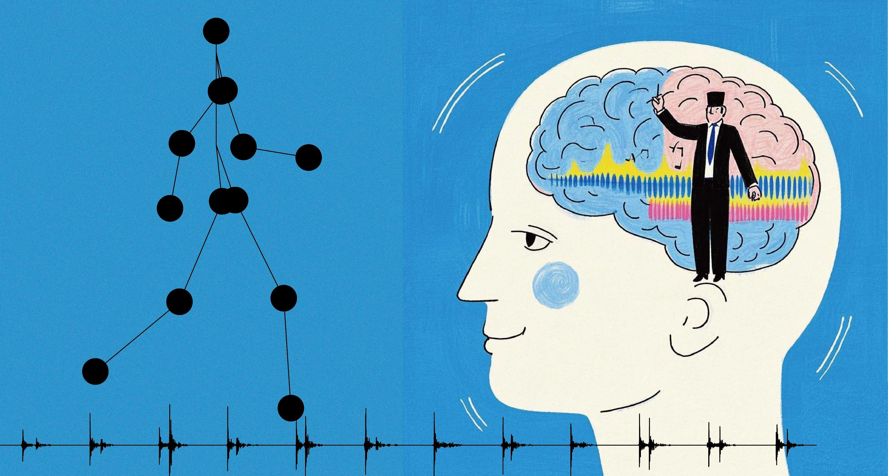

  <a class="image-card" href="./《认知觉醒》读书笔记.html">
    
    

      <h3 class="card-title">认知觉醒</h3>
      
《认知觉醒》是作者周岭的作品，通过深入浅出的方式揭示了人类思维运作的底层逻辑，帮助我们理解大脑的认知机制，掌握提升学习力、思考力和行动力的有效方法，开启自我改变的觉醒之路。

    

  </a>

  <a class="image-card" href="./《悉达多》读书笔记.html">
    
    

      <h3 class="card-title">悉达多</h3>
      
《悉达多》是德国作家赫尔曼·黑塞的经典作品，讲述了一位古印度贵族青年寻求生命真谛的修行之旅。通过悉达多的人生经历，探索自我、生命意义与精神觉醒的主题，充满了哲学思考和诗意表达。

    

  </a>

  <a class="image-card" href="./《稀缺》读书笔记.html">
    
    

      <h3 class="card-title">稀缺</h3>
      
《稀缺》是经济学家塞德希尔·穆来纳森和心理学家埃尔德·沙菲尔合著的作品，深入探讨了"稀缺心态"如何影响我们的思维方式和决策能力。书中揭示了为什么忙碌的人会更忙，贫穷的人会更穷的心理机制。

    

  </a>

  <a class="image-card" href="./《心理学》读书笔记.html">
    
    

      <h3 class="card-title">心理学</h3>
      
这是一本关于心理学基础知识的入门读物，系统介绍了心理学的核心概念、主要流派和研究方法。内容涵盖认知、情绪、人格、发展等多个领域，帮助读者建立对心理学学科的整体认识和理解框架。

    

  </a>

  <a class="image-card" href="./《营养学》读书笔记.html">
    
    

      <h3 class="card-title">营养学</h3>
      
这本营养学读物全面介绍了人体所需的各种营养素、饮食平衡原则以及健康饮食的科学依据。内容涵盖宏量营养素、微量营养素、膳食指南等，帮助读者建立科学的饮食观念，提升健康生活质量。

    

  </a>

