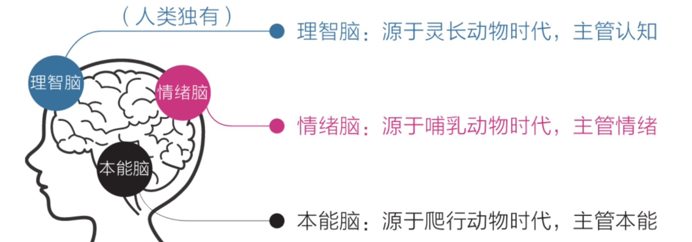
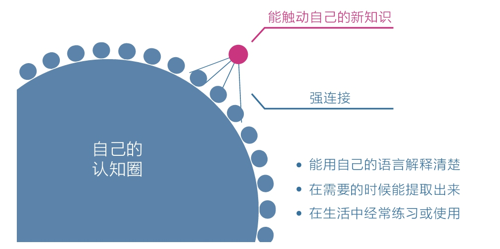
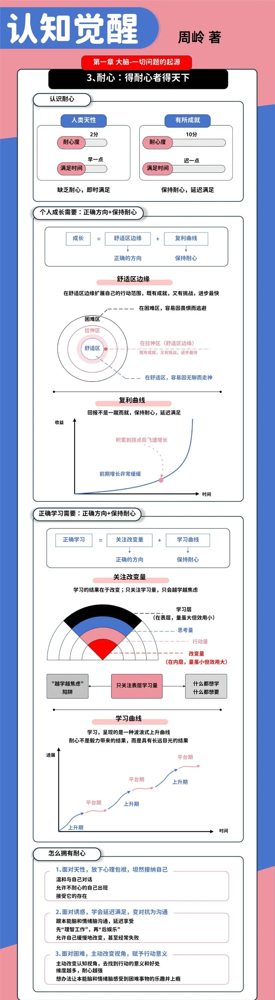
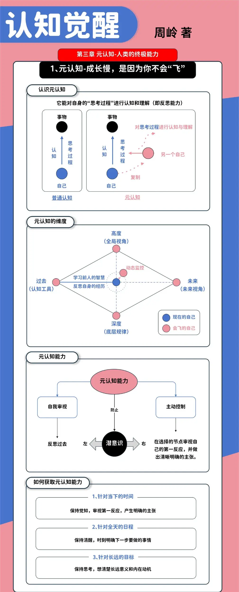
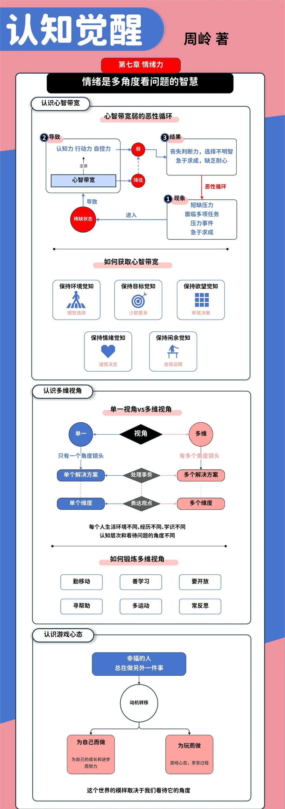
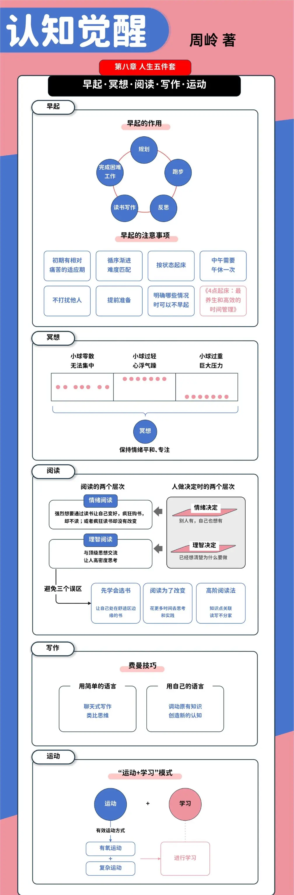

本书的核心主题是​**探讨个人成长的内在机制，通过了解大脑运作规律，开启自我改变的原动力**​。本次笔记的主要用途是​**知识内化与个人提升**​，因此，请侧重输出**实用观点与行动指南**方面的内容。

## 核心概念解读

**三重大脑**  
指人类大脑由“本能脑”、“情绪脑”和“理智脑”三层结构组成。本能脑负责原始冲动，情绪脑处理感受，理智脑进行认知思考。理解这三者之间的关系和运作模式，是理解我们行为模式和改变阻力的基石，它解释了为何“知易行难”——因为理智脑的力量远不如前两者强大。

**本能脑**：源于爬行动物时代，结构最简单，掌管本能（如呼吸、心跳、遇到危险时的战斗或逃跑反应）。它的核心特点是追求安全、节省能量，反应速度最快，但非常固执。
**情绪脑**：源于哺乳动物时代，掌管情绪（如快乐、悲伤、恐惧）、记忆和社交。它的核心特点是追求奖励、规避痛苦，能通过情绪快速做出“好坏”判断。
**理智脑**：人类独有，源于前额叶皮层，掌管认知、逻辑、规划和元认知。它的核心特点是追求长远价值，但耗能高、反应慢、力量弱。

**元认知**  
指“对认知的认知”，即对自己思考过程的觉察与反思。它是最高级别的认知能力，如同一个站在高处俯瞰的观察者，能够监控并调整自己的思维、情绪和行为。强大的元认知能力是实现自我成长和情绪管理的关键，是“认知觉醒”的核心工具。

**监控与评估**：在思考或行动时，能即时判断“我这样想对吗？”、“我的情绪是否合理？”。
**控制与指导**：能主动调整错误思维，将注意力拉回到目标上。
**舒适区边缘**  
描述一个介于舒适区和困难区之间的最佳学习与成长区域。在这个区域里，挑战难度略高于当前能力，既不会因太简单而无聊，也不会因太困难而放弃。遵循“舒适区边缘”规律进行练习，是高效成长的核心策略，适用于技能学习、知识拓展等各个方面。

**复利效应**：
指做某件事的结果会随着时间推移，以指数级速度增长。在知识学习、技能提升、健康习惯等方面，持续的小进步能累积成巨大的成就。其实就是量变到质变的过程。

**刻意练习**  
指有明确目标、专注投入、包含反馈并能突破舒适区的系统性练习方法。它不同于简单的重复，而是持续在“舒适区边缘”进行挑战，是实现技能精进和能力跃迁的科学路径。

**心智带宽**  
指个体在某一时刻可用于处理信息、做出决策的认知资源总量。当人们被琐事、烦恼或欲望占据过多心智时，心智带宽就会变窄，导致判断力下降、缺乏耐心。管理心智带宽是现代人保持清醒决策的重要能力。

**清晰力**  
指将目标、方法和路径思考清楚，并将其具体化的能力。模糊是行动力和幸福感的天敌，而清晰力则是将理智脑的思考转化为具体指令，从而驱动本能脑和情绪脑有效行动的关键。

**行动关联**  
指学习新知识时，将其与已有的经验、需求或实际问题紧密联系起来。没有行动关联的知识是信息，有关联的知识才能转化为真正的能力。这一概念强调了“学以致用”的神经科学基础。

**学习权重比**：
指在学习一项技能或知识时，不同学习方式（如阅读、听讲、实践等）的有效程度比例。通常，主动学习（如讨论、教授他人、实践应用）的效果远胜于被动学习（如听讲、阅读）。

**平台期**：
在技能学习或能力提升过程中，经过一段时间的快速进步后，出现的进步缓慢甚至停滞的阶段。平台期是正常现象，需要耐心和持续的努力来突破。如专业技能的增长可能是指数级的，量变质变。

## 理论重点

**大脑的天性与成长的对策**：
   - **天性**：人类倾向于避难趋易、急于求成。
   - **对策**：面对天性，应设置清晰的目标，利用复利效应，坚持在舒适区边缘努力，克服拖延，保持耐心。

**深度学习与关联能力**：
   - **重要性**：深度学习有助于构建知识网络，提高解决问题的能力。
   - **方法**：通过大量阅读和高质量输出（如写作、演讲）来强化知识间的联系，形成知识晶体。
   - 说到要有知识产出，目前地解决方法是写blog。

**专注力：精力的合理分配**：
   - **策略**：采用番茄工作法等方法，提高单次专注的质量，同时保证足够的休息和恢复。
   - **重要性**：专注力是高效学习和工作的基础。

**反馈循环：如何有效学习**：
   - **机制**：通过主动寻求反馈（如请教他人、自我反思）、设定小目标并及时调整策略，形成正向反馈循环。
   - **作用**：加速学习过程，确保方向正确。
   - 目前使用的是自我反思。

**情绪与理智的和谐共处**：
   - **方法**：学会冥想、情绪日记等工具，增强自我觉察，用理智脑调控情绪脑，避免冲动决策。
   - **目标**：培养平和的心态，提高情绪智力。

**习惯的力量：从被动到主动**：
   - **形成机制**：习惯由提示、渴求、反应、奖励四个步骤构成，通过刻意练习可以塑造新习惯。
   - **策略**：利用微习惯策略，从极小步骤开始，逐步建立稳固的习惯体系。

### 核心论点与例证

**成长的本质是让大脑的“理智脑”变强，学会驱动“本能脑”和“情绪脑”，而非对抗它们。**   
阐述与例证：单纯依靠意志力（理智脑）很难战胜天性（本能脑和情绪脑）。明智的做法是让理智脑学习知识，制定策略，然后巧妙地引导天性。例如，为了养成早起习惯，不是强迫自己，而是给本能脑和情绪脑一个“快乐”的理由，比如享受一顿美味的早餐，让它们期待早起，从而协同合作。

**清晰力是真正的行动力，模糊是焦虑和迷茫的根源。**   
阐述与例证：当目标模糊时，大脑会因为不确定性而产生内耗和逃避。将大目标拆解为极度清晰、具体的小步骤，能极大降低行动阻力。例如，目标不是“学好英语”，而是“今天在通勤路上用App记15个单词”，清晰的指令会让大脑直接行动，无需纠结。

**在“舒适区边缘”持续练习，是成长最快、最稳健的方式。**   
阐述与例证：贸然挑战困难区会因挫败而放弃，停留在舒适区则会停滞不前。真正的成长发生在拉伸区。例如，一个从不跑步的人，不应直接挑战5公里，而是从快走1公里开始，逐渐增加距离和速度，让身体和能力在可承受的范围内逐步适应和提升。

**知识的价值不在于“知道”，而在于与自身进行“行动关联”。**   
阐述与例证：阅读时，不应只记录知识点，而应时刻思考“这个观点如何用在我的生活中？它解决了我哪个痛点？”。例如，学到“元认知”概念后，立刻在下次情绪失控时尝试使用，观察自己情绪的由来并调整，这个知识才真正被你吸收。

**元认知能力是高级的成长催化剂，它让我们从“被动反应”走向“主动掌控”。**   
阐述与例证：元认知如同一个“灵魂伴侣”，时刻从高处审视自己。当你因失败而沮丧时，元认知能力会让你跳出情绪，思考：“我为什么会产生这种情绪？这次失败教会了我什么？我下一步可以怎么做？” 这种反思能迅速将负面经历转化为成长养分。

### 经典/划线句子摘录

1. 人与人之间的根本差异是认知能力上的差异，因为认知影响选择，而选择改变命运。
2. 焦虑的根源在于，想同时做很多事，又想立即看到效果。
3. 耐心不是毅力带来的结果，而是具有长远目光的结果。
4. 清晰力，才是真正的行动力。
5. 知识的获取不在于多少，而在于是否与自己有关联，以及这种关联有多充分。
6. 我们做不成事，并不是因为愿望不够强烈，也不是因为意志力不足，而是因为默认天性太过强大。
7. 元认知能力就是飞行数据记录器，没有它，你每次都会掉进同一个坑里，完全不知道自己为什么又会坠机。
8. 当一个人能主动开启第三视角、开始持续反观自己的思维和行为时，就意味着他真正开始觉醒了。
9. 成长慢，是因为你在“舒适区”里浪费了太多时间；成长痛苦，是因为你总是在“困难区”受挫。
10. 理想的做法是打造自己的“核心能力圈”，无论世界如何变化，你都能在其中游刃有余。
11. 一个真正的自控高手，不是一个只知道冲刺的人，而是一个善于主动休息、保持平衡的人。
12. 学习的本质，是解释而非信息。
13. 身体的智慧在于，它总是忠于当下的感受，而思维却总是跑到未来或过去。
14. 反思，不是否定，而是深度思考；不是自责，而是优化。
15. 真正的学习成长，不是“努力，努力再努力”，而是“反馈，反馈再反馈”。

## 行动指南

**每日反思**
每天花5-10分钟，以第三方视角回顾当天的1-2个关键事件。写下“当时是怎么想的？”“这样想对不对？”“更好的做法是什么？”。这如同给大脑安装“杀毒软件”，定期清理错误思维。​**模型**​：记录 → 分析 → 优化。

**目标拆解，运用清晰力**
为任何想要达成的目标，进行“手术刀式”的拆解。将“提升沟通能力”拆解为“本周与3位同事进行非工作闲聊，并记录对方的兴趣点”。**“极度清晰原则”** ：所有目标都必须符合SMART原则（具体的、可衡量的、可实现的、相关的、有时限的）。

 **践行“舒适区边缘”**
在学习任何新技能时，主动定义自己的“舒适区边缘”。例如，阅读一本有难度的书，不强求全部读懂，而是规定“每天只精读5页，并复述核心观点”。**“15.87%定律”** 最佳的学习难度约在15%的新内容与85%的熟悉内容之间，这正是舒适区边缘的量化体现。

**建立“行动关联”式学习流程**
阅读或学习时，手边准备一个“行动笔记”。每学到一个有启发的点，立刻停下，写下：“这个知识可以如何用在……？”并至少列出一个具体的应用场景。**“学习闭环”** ：输入 → 思考关联 → 实践应用 → 总结反馈。

**主动管理心智带宽**
通过“写下来”的方式清空大脑的“工作内存”。将所有的待办事项、烦恼、灵感全部倾倒在纸上或清单App中，为重要决策留出充足的心智带宽。**“大脑是CPU，不是硬盘”** 。只让大脑负责思考，不负责记忆。

**内观自己，确定目标**
首要对自己有清晰的认识，了解自己的兴趣、能力和需求。根据自己的实际情况，设定一个既具有挑战性又可实现的目标。

**拆解目标，逐步推进**
将大目标拆解成一系列小目标，每个小目标都位于自己的舒适区边缘。逐步推进，每完成一个小目标，都是对自己能力的一次提升。

**保持专注，有效练习**
在执行任务时，保持高度专注，避免分心。采用有效的练习方法，如番茄工作法、刻意练习等，提高练习效率。

**主动寻求反馈，优化策略**
主动向他人寻求反馈，了解自己在执行任务过程中的不足。根据反馈优化策略，调整任务难度和练习方法。

**保持耐心，持续进步**
成长是一个持续的过程，需要保持耐心和毅力。**不要急于求成**，要相信在舒适区边缘的持续努力会带来显著的进步。

