# 香港之行
## 0x01 计划
故事开始于一次和朋友说起去香港玩的事，后来也搁置了几个月，年后才隐约有的打算，看到同事也过去玩了，所以搜索了相关攻略后，迫不及待地去办了通行证。虽然踩了几个坑，但是最后还是如愿以偿办到了。

当时照相是可以到出入境大厅免费拍照的，但是网友忽悠在手机上办理多出了20，然后办证也需要预约，要好长时间才能办，但是走人工通道也去一趟就办好了，深圳的办公还是很人性化和高效的。当时签注只有香港，去拿证的时候想着也就几块钱一并签了澳门，没想到后面派上了用场。

## 0x02 出发
在周末，我随便看了攻略便出发了，从深圳湾口岸出发，顺利过境后坐上了去天水围B2P公交，支付很方便，可以使用微信和支付宝，但是也办了八达通，也埋了一个雷。
在天水围下车，手机已经没有信号，手机上买了流量卡。当时看到的是基础设施和大陆有所不同，车子都是右舵，刚来还有点不太习惯，文字使用繁体字，这导致好多文字我也不认识。
在天水围乘坐公交，一路到旺角这边，路上看到的很多景象确实和国内不一样。

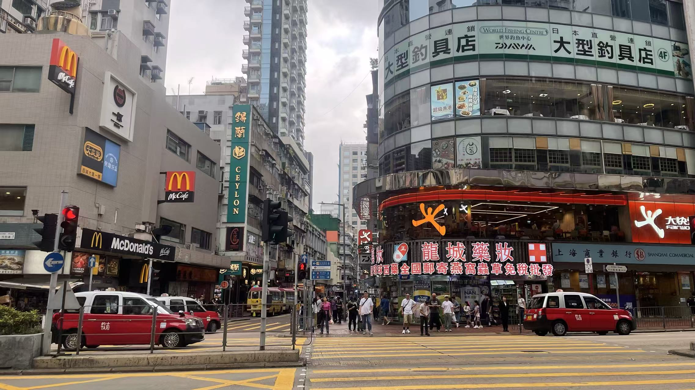

## 0x03 街道

下了公交，由于对周围不够熟悉，加之攻略做的不够详细，上午其实在油麻地附近瞎逛了很久，去看了油麻地警署，很多人拍照，但是我们这层人似乎对这一打卡点没有太多的情怀，看了一会便离开。但是附近的老城确实很有特色，密密麻麻的各式各样的招牌、小广告交错在一起，新事物与旧事物交织在一起，让这里变得更加有年代感。

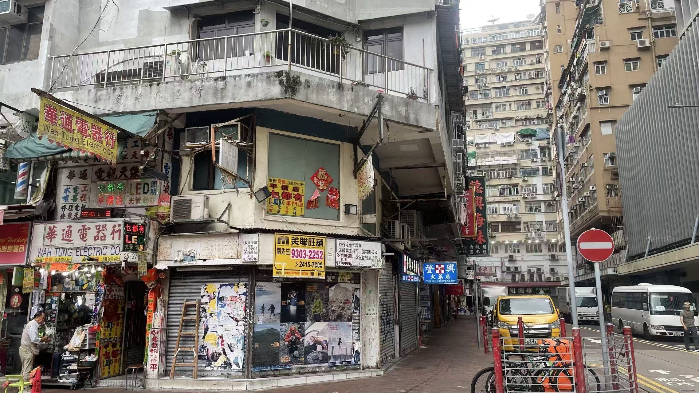

## 0x04 维多利亚港
一路直走，来到了维多利亚港，这里风景开阔，人也很多，但是当天天气不好，照片显得昏沉。打卡了星光大道、李小龙雕像。并徘徊了久，坐在钟楼广场前的石椅上，吹着风，看着海上游船来往。
维多利亚港的天星小轮缓缓驶过，绿色的船身在碧蓝海面上划出温柔涟漪。这是香港最经典的渡海方式，百年航线，承载着无数人的日常与浪漫。

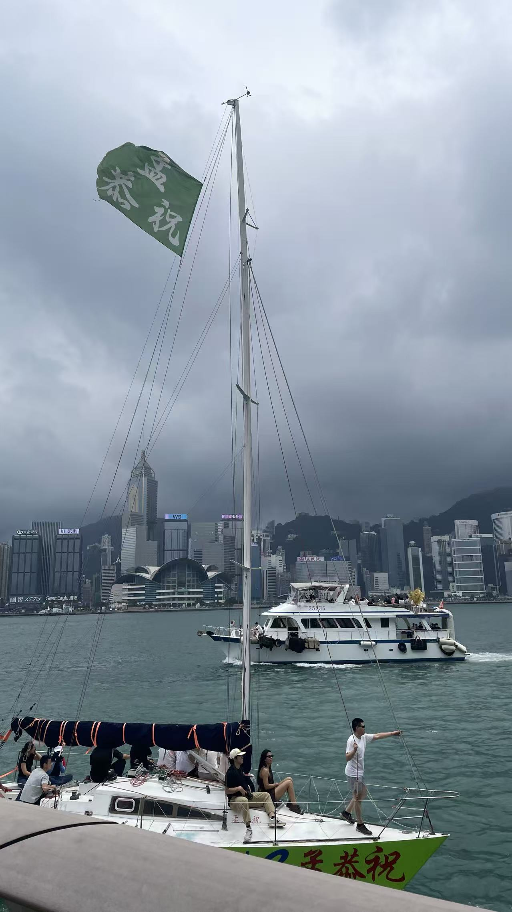

对面即是中环的摩天大楼如森林般矗立，玻璃幕墙映照着蓝天白云。这里是香港的经济心脏，也是都市繁华最直观的展现。

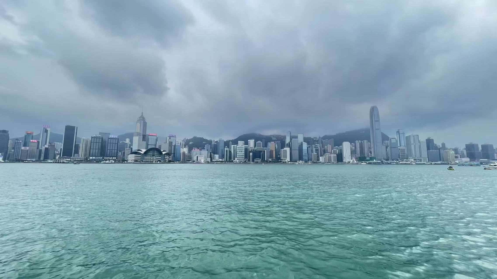

## 0x05 星光大道

一路走着，成龙、周润发、张国荣、李小龙、梅艳芳、刘德华、梁朝伟等传奇人物映入眼帘，为了表彰对香港电影工业做出杰出贡献的台前幕后工作者。大道全长约440米，效仿好莱坞星光大道，地上镶嵌了超过百块明星名牌与手印。

星光大道上的李小龙铜像，保持着经典的武术姿势，眼神坚定有力。他不仅是功夫巨星，更是无数人心中不屈不挠的香港精神象征。

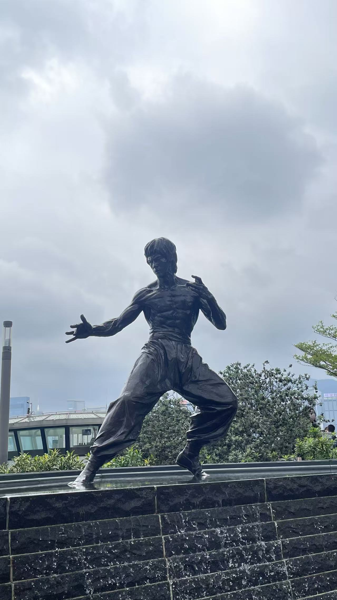

``李小龙（1940–1973），功夫巨星、截拳道创始人，出生于美国旧金山，成长于香港。他以《唐山大兄》《精武门》《猛龙过江》《龙争虎斗》等影片打破西方对华人银幕形象的刻板印象，将中国功夫推向世界。李小龙倡导“以无法为有法，以无限为有限”的哲学思想，创立截拳道，强调自我表达与实战效率。``

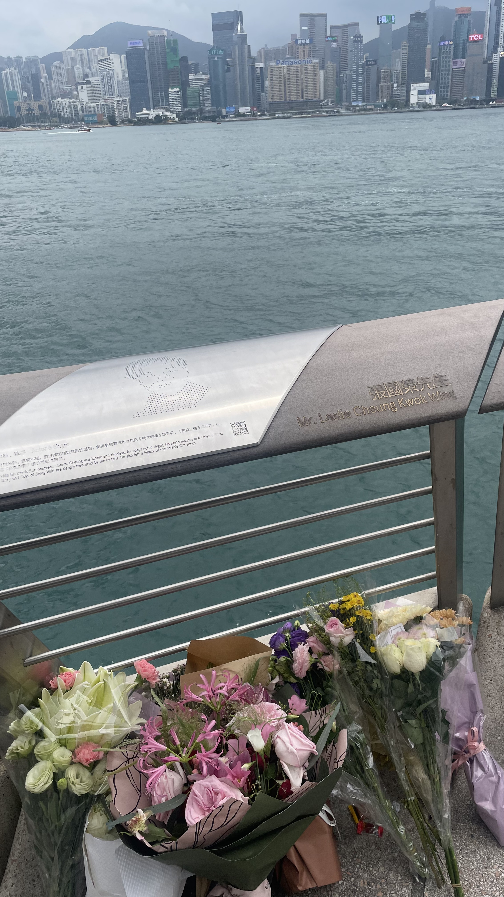

``张国荣（1956–2003），香港著名歌手与演员，他以《风继续吹》《Monica》《当年情》《沉默是金》等金曲横扫乐坛，1999年获香港乐坛最高荣誉“金针奖”；电影方面，他主演的《霸王别姬》荣获戛纳金棕榈奖，他饰演的程蝶衣成为影史经典，此外《阿飞正传》《春光乍泄》《倩女幽魂》《胭脂扣》等作品亦广受赞誉。张国荣以前卫的舞台艺术和真诚的人格魅力深受爱戴，每年4月1日（逝世纪念日）和9月12日（诞辰），各地粉丝自发在星光大道他的名牌前献花纪念。``

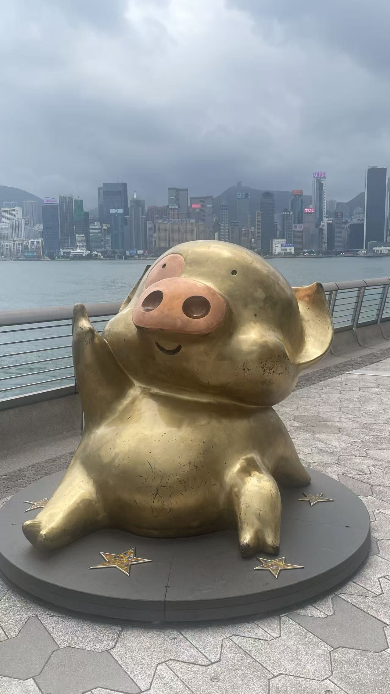

可爱的麦兜站在街头，圆滚滚的身子配上标志性的粉红耳朵。这只来自香港动画的小猪，用纯真和善良温暖了无数人的童年。

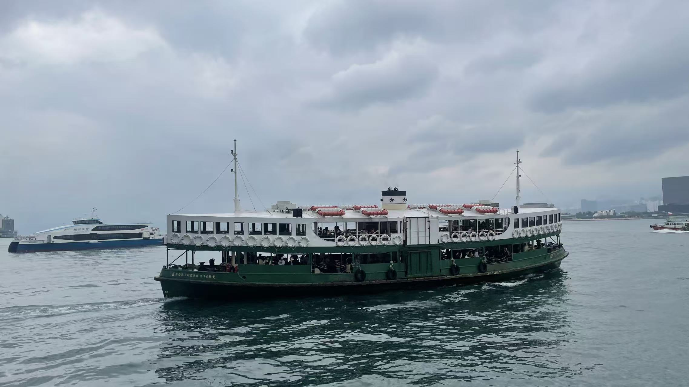

## 0x06 纪念碑

纪念碑耸立在会展中心旁的纪念碑，碑文简练庄重，记录着那历史性的一刻。碑文由中华人民共和国前主席江泽民亲笔题写，寥寥数语却庄严地宣告了香港特别行政区的成立与“一国两制”伟大构想的成功实践。纪念碑前的国旗与区旗冉冉升起，与维多利亚港的潮汐共映，既提醒世人铭记那洗刷百年国耻的历史时刻，也象征着香港与祖国紧密相连、共创繁荣的坚定信念。

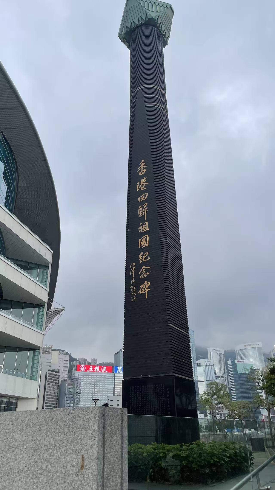

## 0x07 紫荆花

``紫荆花，正式名称为洋紫荆（Bauhinia × blakeana），花瓣紫红色，呈五片兰花状，叶片形似羊蹄，1880年左右由法国传教士在香港岛被发现，为天然杂交种，不育，只能通过扦插繁殖。1965年，洋紫荆被定为香港市花；1997年香港回归祖国后，其图案被纳入香港特别行政区区徽和区旗，位于湾仔金紫荆广场的“永远盛开的紫荆花”雕塑则成为回归纪念地标。洋紫荆冬季盛开、花期长久，象征香港坚韧繁荣、不畏风雨，区旗上五片花瓣各含一颗星，寓意“一国两制”下香港与内地团结与希望。``

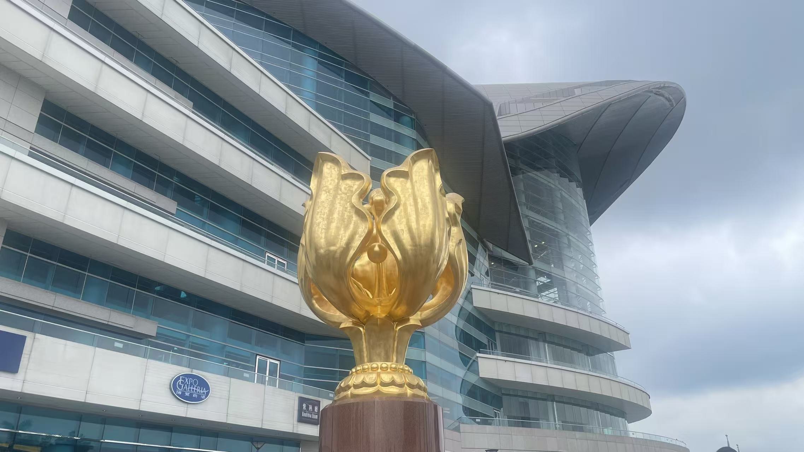

## 0x08 夜景及灯光秀

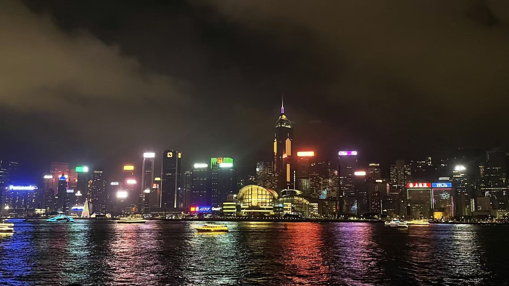

晚上的灯光秀准时上演，激光与音乐配合，点亮两岸天际线。摩天大楼成了光影的画布，钟楼用多国语言播报，突然觉得这是多么的国际化。演绎着东方之珠的不夜传奇。

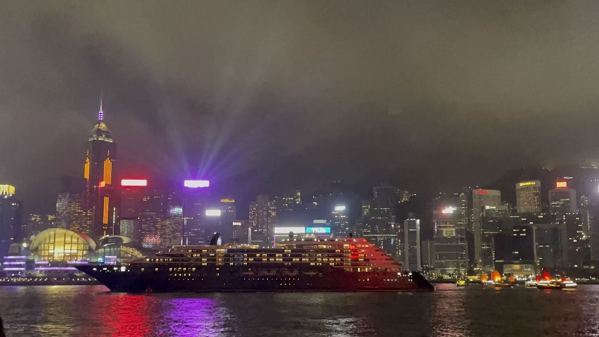

至此，游玩结束，我乘坐着地铁，从罗湖口岸回深圳，感慨万千，犹如梦境，小时候历史课本中的场景就这样照进了我的现实...