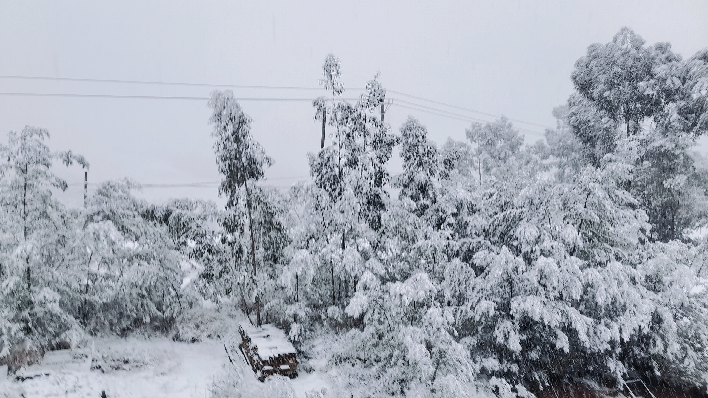
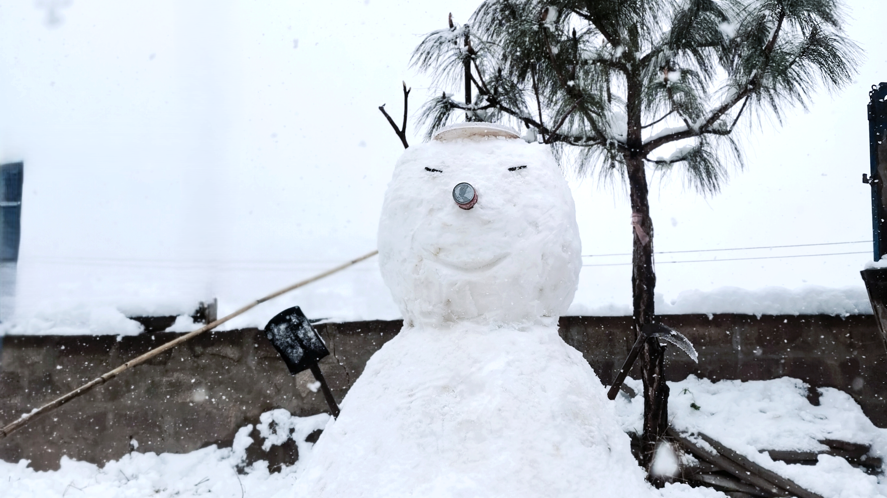
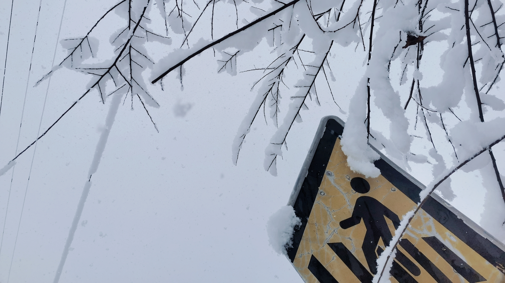

# 大雪

拍摄时间：2022-02-22

  

    
    
2022-02-22 12:52:30

  

  
  

    
    
2022-02-22 08:35:53

  

  
  

    
    
2022-02-22 21:16:23

  

  
  

    
    
2022-02-22 21:18:02

  

  
  

    
    
2022-02-22 21:18:55

  

  
  

    
    
2022-02-22 21:19:47

  

