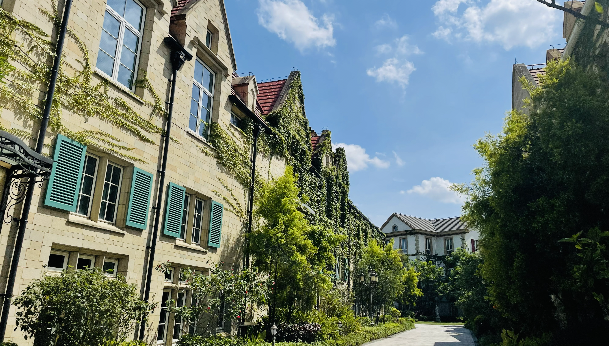
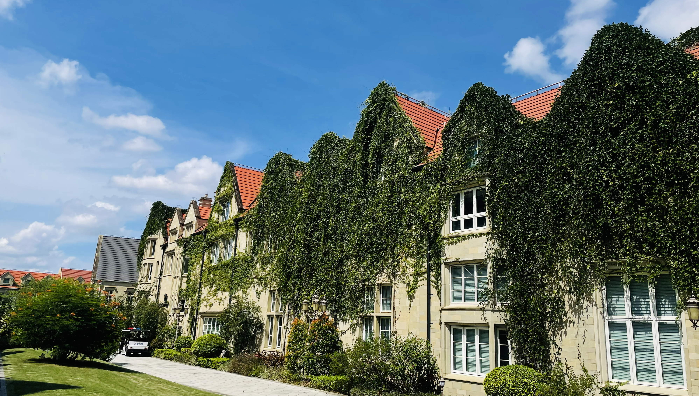
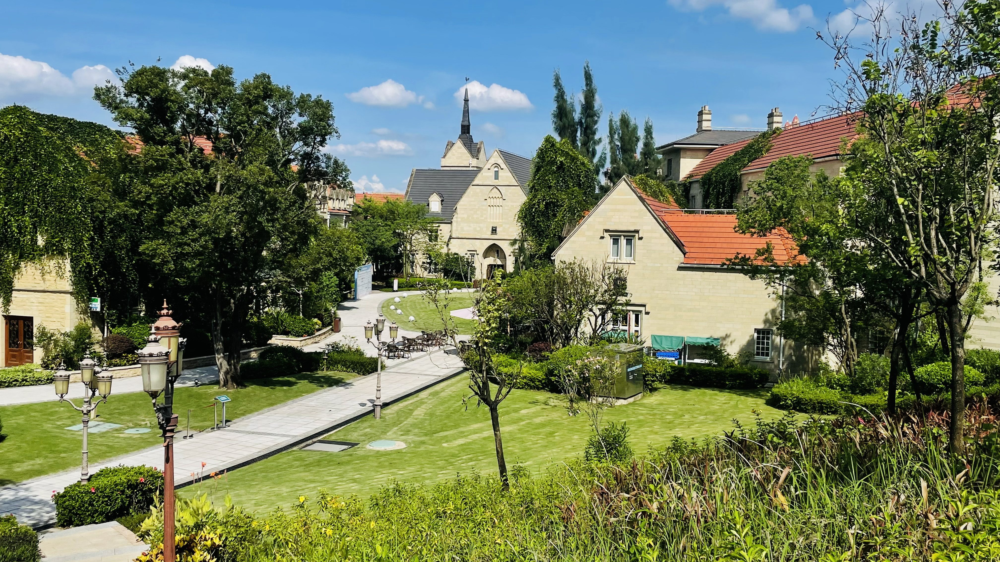
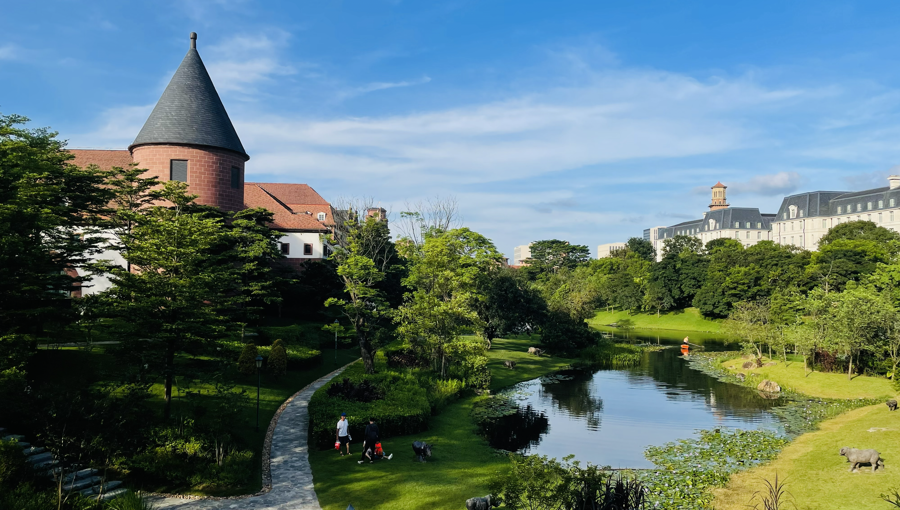
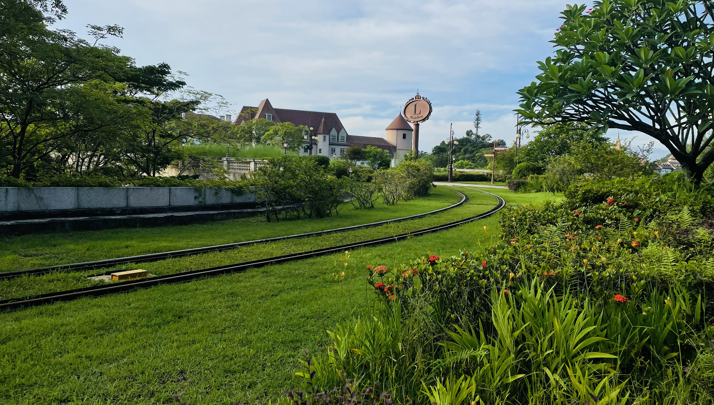

# 欧洲小镇

拍摄时间：2023-06-22

  

    
    
2023-06-22 14:43:15

  

  
  

    
    
2023-06-22 14:44:26

  

  
  

    
    
2023-06-22 15:33:02

  

  
  

    
    
2023-06-22 16:29:50

  

  
  

    
    
2023-06-22 17:31:44

  

  
  

    
    
2023-06-22 17:51:11

  

