# 澳门之行

## 0x01 计划
香港回来之后，心里一直惦记着近在咫尺的澳门。翻翻日历，寻了个周末，买了去拱北口岸的车票便出发了。相比香港的繁华，澳门更像一座被时光厚待的小城——四百年前的教堂炮台与彻夜不眠的赌场霓虹并肩而立，历史与现代以一种惊人的密度交叠在一起。

## 0x02 过关
从拱北口岸过关，人潮涌动，大多拖家带口冲着大三巴和葡挞而来。出了关闸，便踏上了这块面积不过三十多平方公里的土地。

``澳门，古称"濠镜""濠江"，因港阔水深、海面如镜而得名。1553年葡萄牙人借晾晒货物之名登陆，1557年获准定居，澳门自此成为中国最早向西方开放的窗口之一。其名源自妈阁庙——葡萄牙人以闽粤方言"妈阁"音译作"Macau"。1999年12月20日澳门回归祖国，成为继香港之后又一个特别行政区。``

## 0x03 大三巴牌坊
来澳门必到的自然是地标大三巴牌坊。远远望去，一座巴洛克式石壁立在石阶之巅，庄严而醒目。

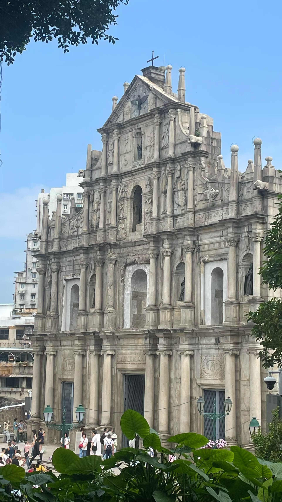

走近细看，牌坊四层浮雕密布，圣神、耶稣受难、圣母像与诸圣形象交融，中西元素同框，透着四百年前的匠心。石阶上坐满歇脚的游客，拍照的、吃东西的、发呆的，把广场挤得满满当当。

``大三巴牌坊是圣保禄学院教堂（Igreja de São Paulo）的前壁遗址。"三巴"即"圣保禄"（São Paulo）的粤语谐音。教堂由耶稣会士始建于1580年前后，主体于1602至1640年间重建，曾是远东最大的天主教大学与教堂。1835年1月26日一场大火烧毁教堂与学院，仅剩这面石制前壁，因形似中国牌坊而得名"大三巴"。2005年，它作为"澳门历史城区"的一部分列入《世界遗产名录》。``

## 0x04 大炮台公园
牌坊旁的小山坡上便是大炮台公园。拾级而上，古木成荫，凉意扑面。

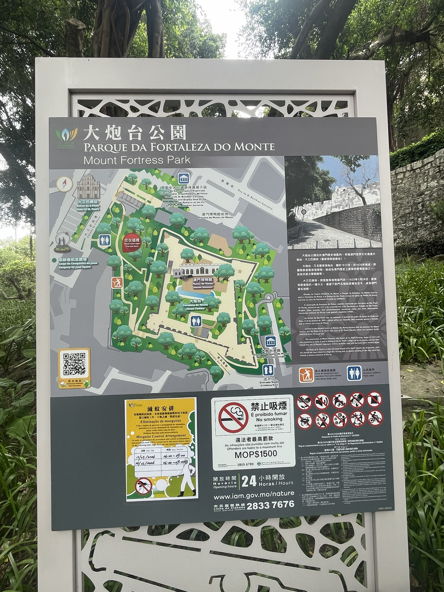

山顶视野开阔，澳门半岛尽收眼底——旧城红瓦连绵，远处高楼林立，再远处是氹仔金光闪闪的酒店群。铁炮仍立在墙边，炮口指向海面，仿佛还在守望数百年前的那场海战。

``大炮台（Fortaleza do Monte）建于1617至1626年间，由耶稣会士主持修筑，曾是圣保禄学院的防御工事。1622年荷兰舰队进犯澳门，大炮台上的火炮在保卫战中发挥了关键作用，击退了来敌。此后它先后作为军事要塞、总督官邸与气象台使用，如今其内设有澳门博物馆，是读懂澳门的一扇窗。``

## 0x05 玫瑰圣母堂
下了山坡，穿过几条巷子便到议事亭前地。一座明黄色的巴洛克教堂静静立在街角，在阳光下格外明亮——这就是玫瑰圣母堂。

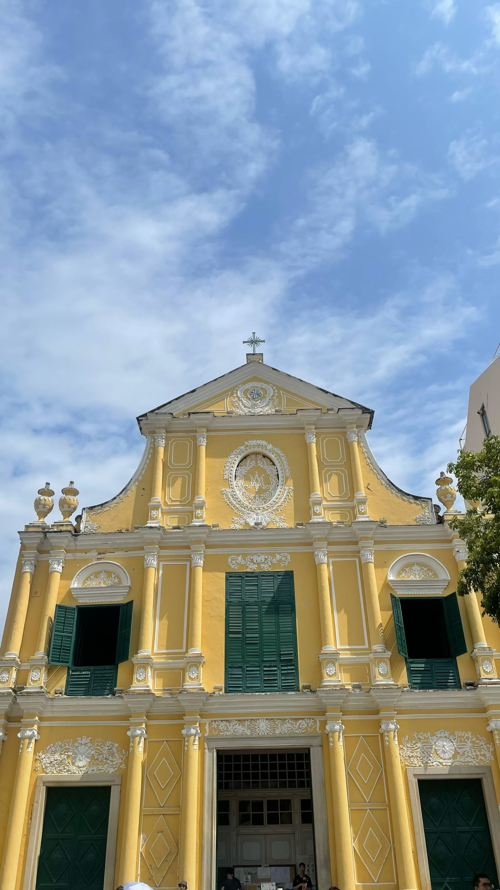

步入教堂，光线透过彩窗洒在金碧辉煌的祭台上，室内浮雕繁复华丽，与外面的喧闹恍如两个世界。

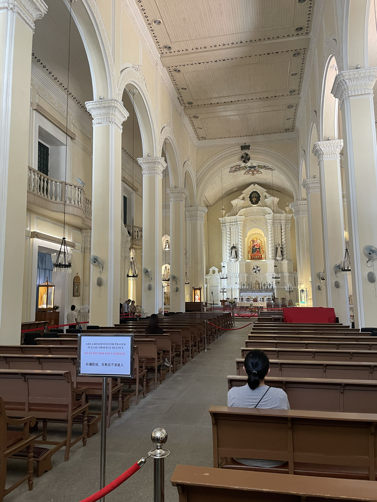

堂侧还藏着一间圣物宝库，陈列历代的圣像、祭器与法衣，件件都带着岁月的包浆。

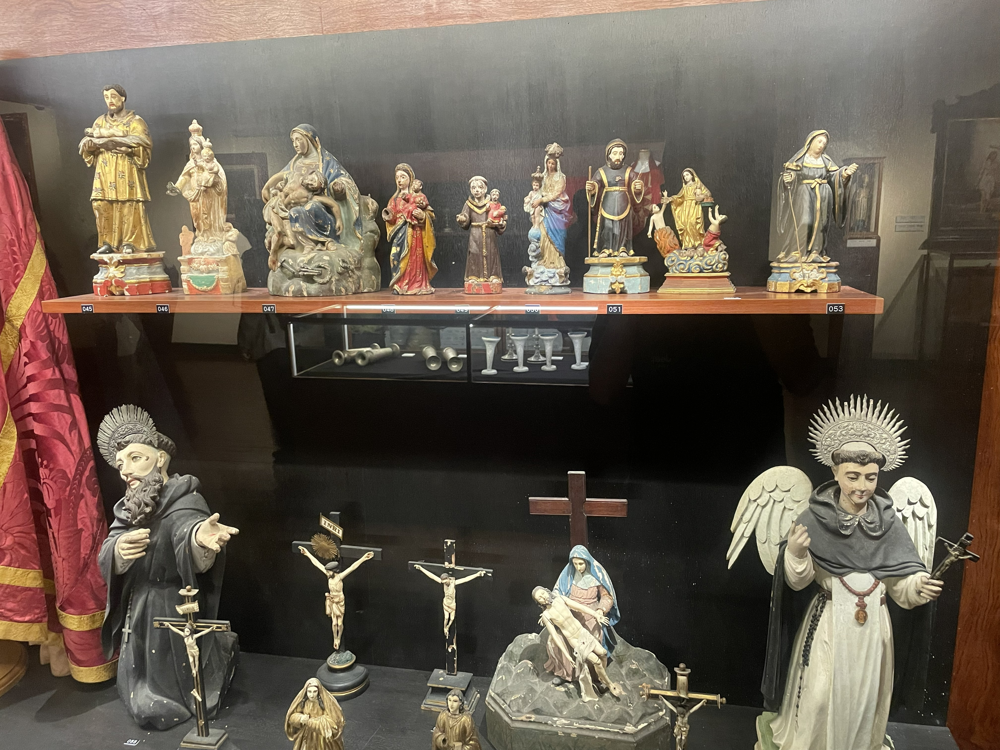

``玫瑰圣母堂（Igreja de São Domingos）约建于1587年，由西班牙圣多明我会传教士修建，是澳门最古老的教堂之一。教堂供奉玫瑰圣母，中文俗称"板樟堂"。它采用巴洛克风格，明黄外墙配白色浮雕，室内保存大量珍贵圣物与艺术品，堂侧的圣物宝库记录了澳门天主教传播的数百年历史。1828年教堂大修，如今外观即定型于此。``

## 0x06 市政署
议事亭前地的葡式碎石路面如波浪般铺展，中央一座喷泉，四周欧式建筑环伺，市政署大楼临街而立，米黄外墙配优雅拱廊。

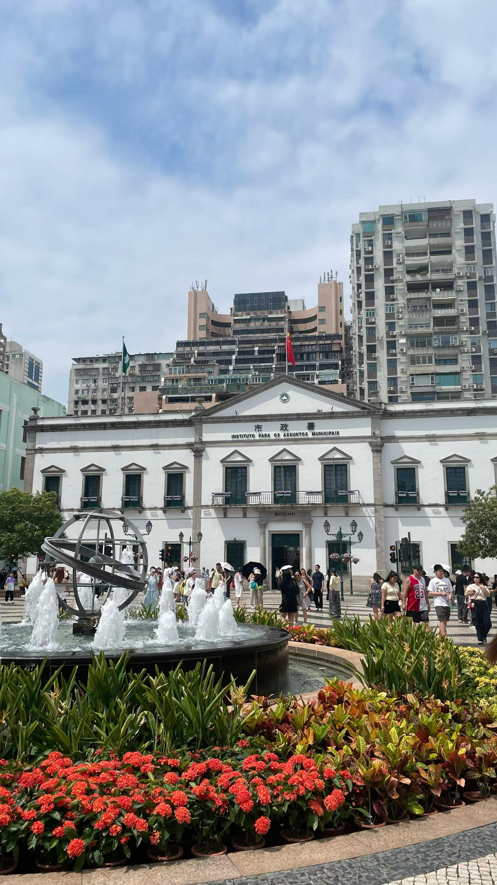

这里是澳门半岛的政治与商业中心，人流穿梭。广场边的小店飘出牛杂与蛋挞的香气，坐在长椅上看着人来人往，恍惚间仿佛置身某个南欧小城的广场。

``议事亭前地是澳门最热闹的中心广场，名称源自明朝在此设立的议事机构。澳门市政署大楼前身是"议事公局"（Leal Senado，意为"忠诚议会"），建于1784年，曾是葡萄牙人自治议事机构的办公场所。如今它延续着市政服务的职能，是澳门历史城区的核心地标，见证了澳门从葡人自治到回归祖国的数百年变迁。``

## 0x07 永利皇宫
过海到了氹仔，先去看了永利皇宫。金色外观在夜色中格外耀眼，正门前一片表演湖，每隔一阵便有一场水舞——喷泉随乐起舞，水柱最高可冲数十米，灯光、水雾与乐声交织，围观人群不时发出惊叹。

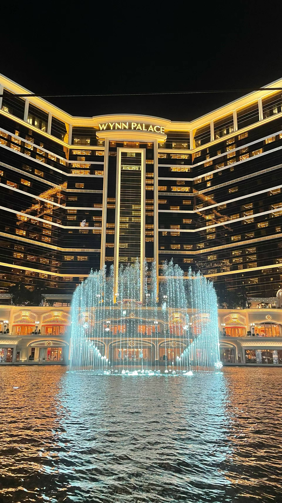

一国游客走了过来，连比带划地请我帮他们一家人拍张合影。我一下就慌了，半句语言讲不清楚。话到嘴边又咽了回去。最后只能红着脸点头，接过相机，手忙脚乱地帮他们按了几下快门。拍完他们连声道谢，我除了点头傻笑，一个完整的句子也说不出来。那一刻心里特别懊恼：怎么就没学好英语呢？

步入大厅更是极尽奢华，金色与花卉元素铺满视野，巨大的艺术装置悬于穹顶之下，恍若宫殿。

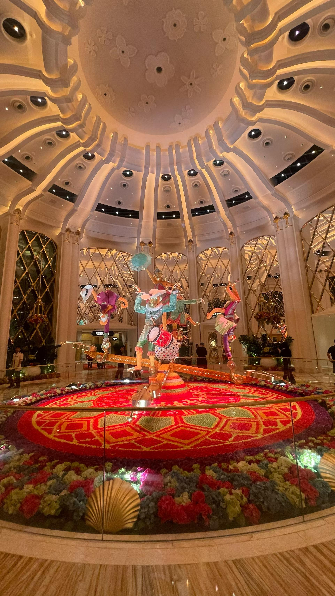

``永利皇宫（Wynn Palace）2016年开业，是永利澳门集团在路氹的旗舰度假村，创始人是美国博彩业大亨史提芬·永利。酒店以"花"与"金"为设计主题，门前的表演湖设有大型音乐喷泉，游客还可乘观光缆车穿越湖面，是金光大道上最具代表性的奢华地标之一。``

## 0x08 官也街
从永利皇宫出来，肚子也饿了，便拐去官也街。这是一条窄窄的小巷，却汇集了澳门最有名的味道——猪扒包、水蟹粥、杏仁饼、葡挞，整条街飘着饼香与肉香。

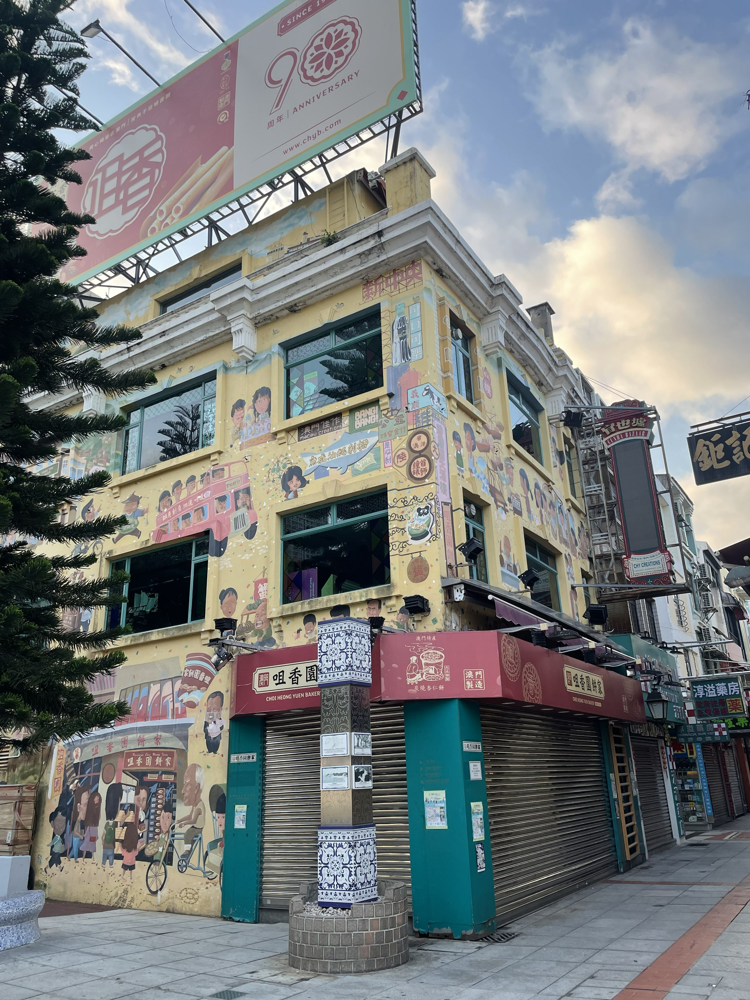

排了一会儿队，买到热腾腾的羊杂，站在街边便迫不及待地尝起来。

一个外国男子走了过来，问chinese？我掏出手机，打开翻译软件。一来一回，交流了好久，他们是问路的。

``官也街（Rua do Cunha）位于氹仔老城，是澳门最负盛名的小吃街，以一位葡萄牙海军上校的名字命名。街道两侧葡式建筑保存完好，遍布传统饼家与美食店，是感受澳门市井烟火气的最佳去处。氹仔本为独立离岛，随路氹填海与金光大道开发，如今已与澳门半岛、路环连成一片。``

## 0x09 威尼斯人
吃饱喝足，去见识路氹最负盛名的地标——威尼斯人度假村。走进大堂，头顶是绘满蓝天白云的天幕，脚下是运河与石桥，贡多拉船夫唱着意大利民歌缓缓划过，人造的天空永远明亮。

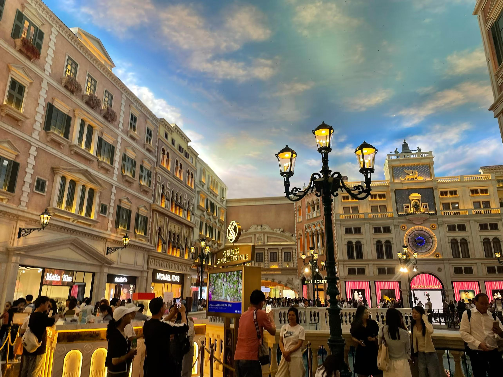

商场内穹顶壁画、威尼斯式楼宇与运河交错，营造出"永不下雨的水城"。游客纷纷登上贡多拉，在歌声与涟漪里留影。

我正站在桥边拍照，一位陌生的外国女士走了过来，微笑着递过手机，指了指手机，又指了指镜头——又是请帮忙拍照。这一次我明显熟练了些，先是认真地帮她找角度、倒数"，拍完还翻给她看效果。她道谢时，我鼓起勇气问了一句："Where are you from?" 她笑着答："India, I'm a police." 

虽然全程还是靠手势和单词拼凑，但从永利皇宫的慌乱，到官也街靠翻译软件，再到这次能主动问出第一句完整的话——这一趟下来，我第一次真切地感受到，以前学的英语好像真的派上用场了。

``威尼斯人度假村2007年开业，由美国拉斯维加斯金沙集团投资兴建，灵感源自威尼斯水城风情。它把运河、贡多拉、圣马可广场搬进室内，仿照拉斯维加斯威尼斯人酒店打造，是路氹"金光大道"上规模最大的综合度假村之一，也带动了澳门以博彩为核心的综合旅游模式。``

## 0x0A 新葡京与葡京
夜色渐深，回到澳门半岛，远远便望见新葡京那朵金光闪闪的"莲花"——整栋楼如一枚倒置的宝石，在夜空中夺目。紧挨着它的，是已有半个世纪历史的葡京赌场，鸟笼般圆润的造型带着上世纪七十年代的复古气息。

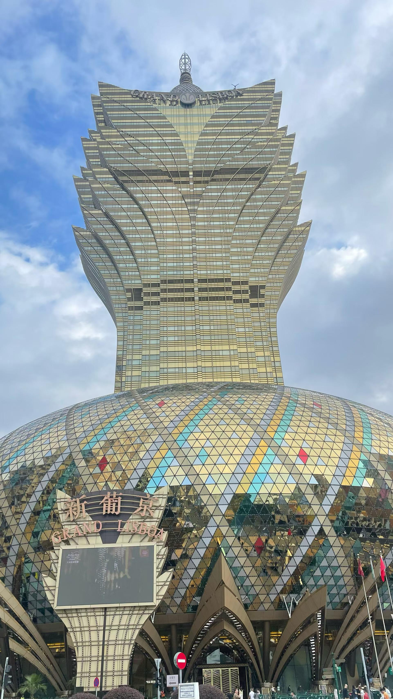

两代赌场并立，仿佛一部浓缩的澳门博彩史。我没有进去，只在外面看了看——灯火通明的门口，进进出出的人流络绎不绝，那是澳门独有的烟火气。

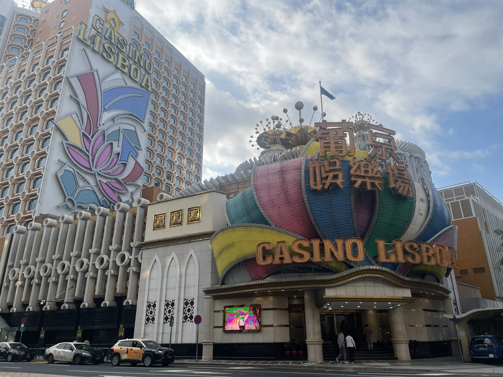

``澳门博彩业源远流长：1847年澳葡政府首开博彩合法化先例；1961年，何鸿燊与叶汉合办的澳门旅游娱乐公司夺得博彩专营权，葡京赌场1970年开业，其鸟笼造型暗含"进得来出不去"的设计巧思，开启澳门博彩业近半个世纪的垄断时代。2002年澳门博彩牌照开放，引入金沙、永利等国际集团，博彩业爆发式增长，澳门一跃成为全球博彩收入最高的城市。2008年开业的新葡京，正是澳博在专营与开放交替之际的旗舰之作。``

## 0x0B 尾声
回程站在码头边，最后看了一眼澳门的夜色。威尼斯人那片灯光连成金红色的海，映在水面上，随波轻轻晃动。

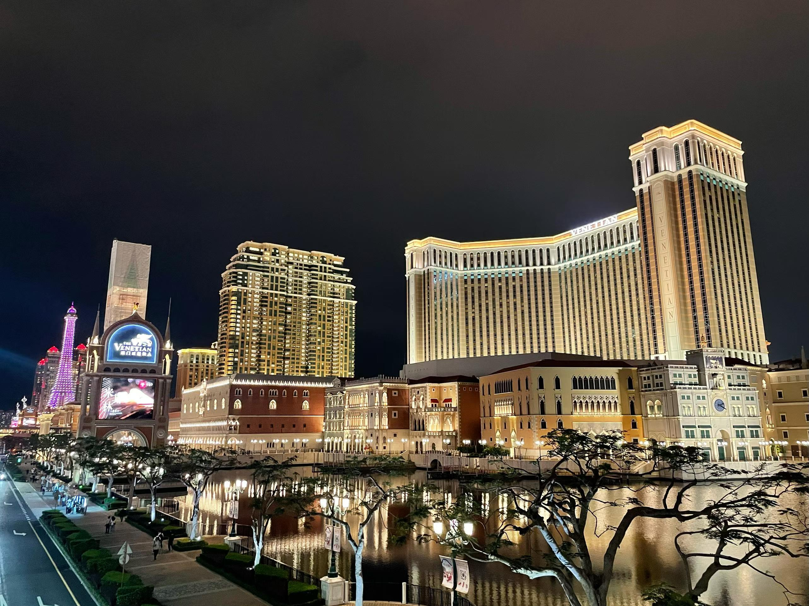

这座城市小得一天就能逛完，却又厚得装下四百多年的风云变幻——教堂与赌场比邻，历史与欲望共生，旧城的钟声与新城的霓虹在同一个夜空下交叠。小时候从历史课本读到"1557年葡萄牙人定居澳门""1999年澳门回归"，如今亲身站在这里，才真切感到什么叫"历史照进现实"。

其实这一趟最让我意外的收获，是那三次磕磕绊绊的英语对话。老实说，我英语考过30分，平时从不敢开口，可澳门之行里，从永利皇宫的手足无措，到官也街靠翻译软件问路，再到威尼斯人主动问出那句"Where are you from"——三幕下来，我第一次觉得那些年背的单词、做的卷子，真真切切地在生活里派上了用场。哪怕只会比划和蹦单词，开口的那一刻，世界就悄悄向我打开了一道门。

回到口岸过关，排队的人依然很多，但心里是满足的。澳门这趟，值了。
