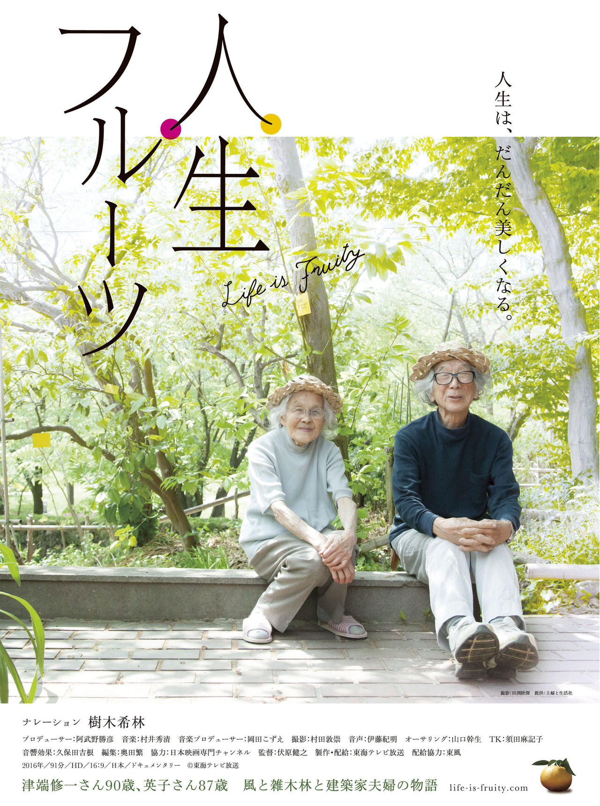

  <a class="image-card" href="./《人生果实》观后感.html">
    
    

      <h3 class="card-title">人生果实</h3>
      
纪录片《人生果实》记录九十岁建筑师津端修一与英子夫妇的晚年田园日常，他们亲手种植多样果蔬，精心烹饪每顿餐食，为花木鸟兽倾注关怀，在四季更迭中践行“风吹枯叶落，落叶生肥土”的哲理，用平凡诠释深情，让观者发现质朴生活的丰盈与宁静。

    

  </a>

<a class="image-card" href="./《今日说法》汇总笔记.html">
    
    

    <h3 class="card-title">今日说法</h3>
    
央视法制栏目《今日说法》每日聚焦真实案件，以案说法、以法析理，通过专家解读与记者调查，将晦涩法条融入生动故事，既传递法治温度，又警示世人，让观众在短短二十分钟内读懂是非善恶，成为国人最熟悉的“法律公开课”。

  

</a>

