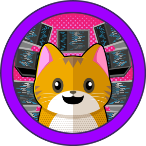
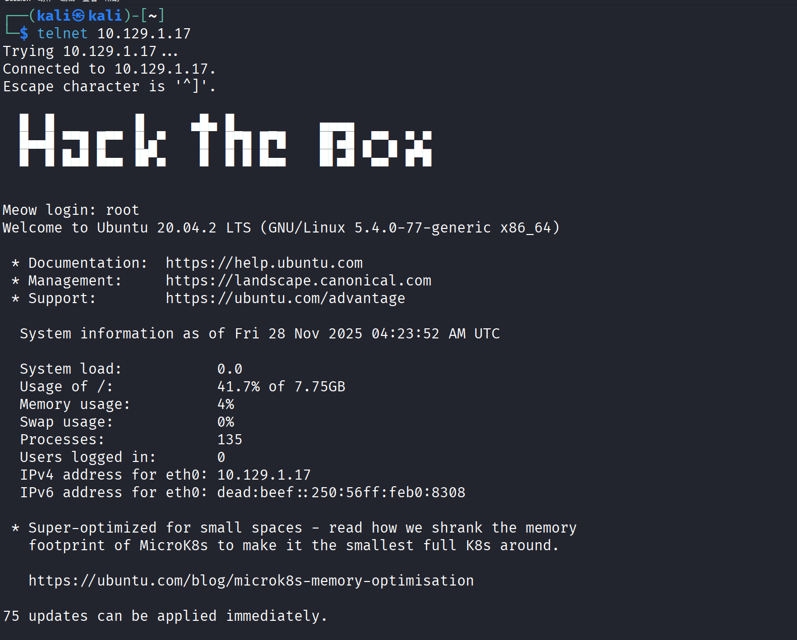
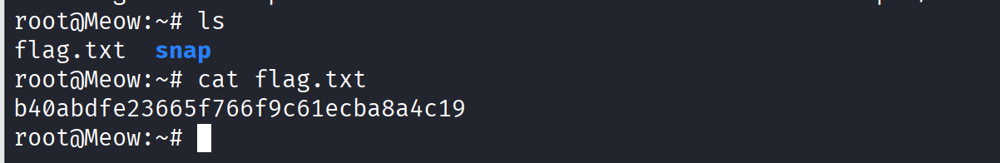

- [https://app.hackthebox.com/machines/Meow?tab=play_machine](https://app.hackthebox.com/machines/Meow?tab=play_machine)

- What does the acronym VM stand for?  
  VM 这个缩写代表什么？

  !!Virtual Machine!!
- What tool do we use to interact with the operating system in order to issue commands via the command line, such as the one to start our VPN connection? It's also known as a console or shell.  
  我们用什么工具来与作系统交互，以便通过命令行下达命令，比如启动 VPN 连接的那个？它也被称为控制台或外壳。

  !!terminal!!
- What service do we use to form our VPN connection into HTB labs?  
  我们用什么服务来把 VPN 连接连接到 HTB Labs？

  !!openvpn!!
- What tool do we use to test our connection to the target with an ICMP echo request?  
  我们用什么工具来测试与目标的连接，发送 ICMP 回声请求？

  !!ping!!
- What is the name of the most common tool for finding open ports on a target?  
  寻找目标开放端口的最常用工具叫什么名字？

  !!nmap!!
- What service do we identify on port 23/tcp during our scans?  
  在扫描时，我们在端口 23/TCP 上识别哪个服务？

  !!telnet!!
- What username is able to log into the target over telnet with a blank password?  
  什么用户名能用空密码通过 telnet 登录目标网站？

  !!root!!
- Submit root flag  提交根标志

  

  0H 16M 23S  0小时 16分 23秒

‍
