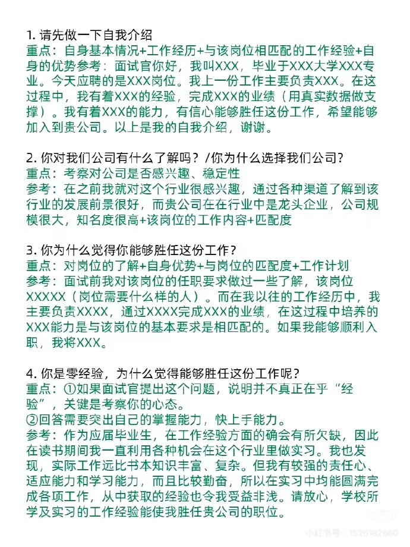
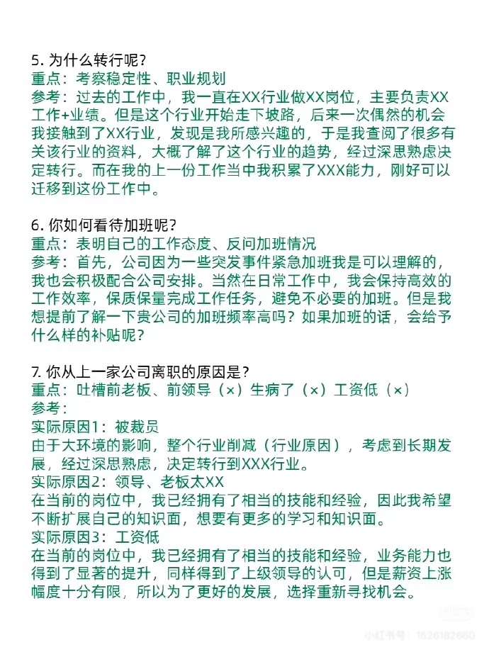
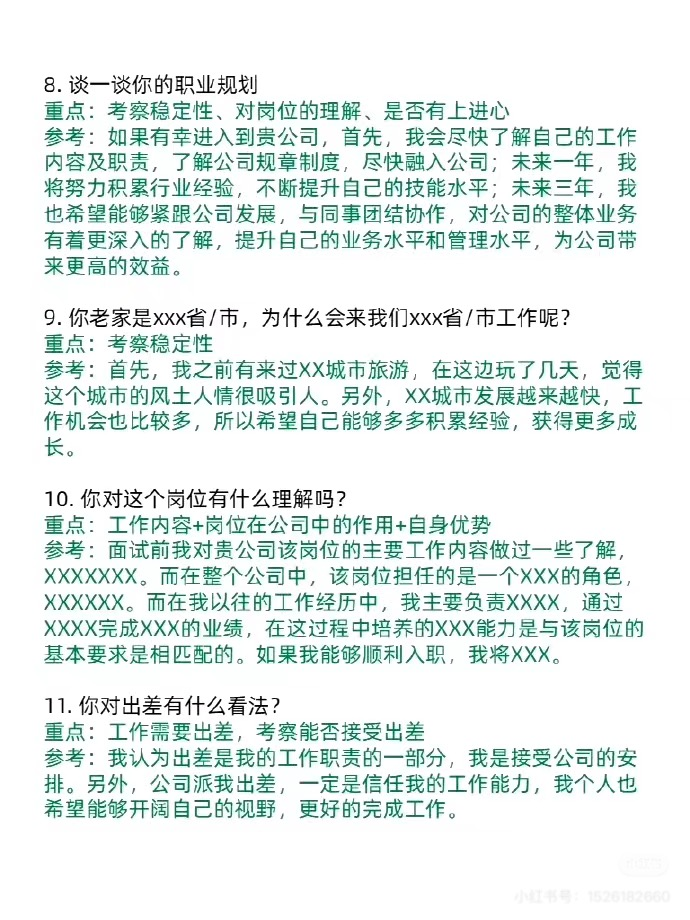
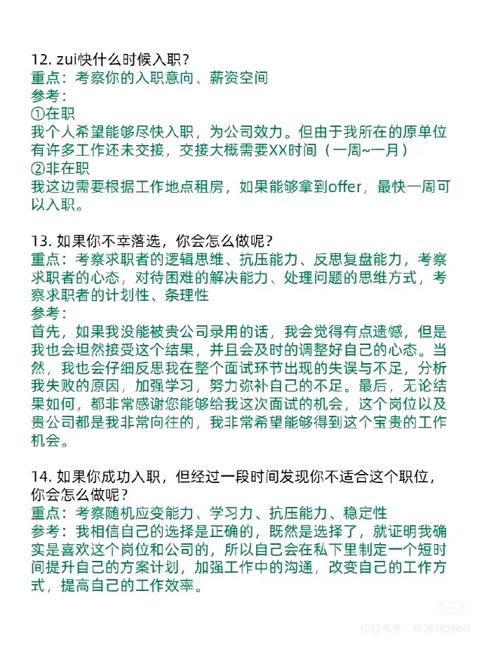
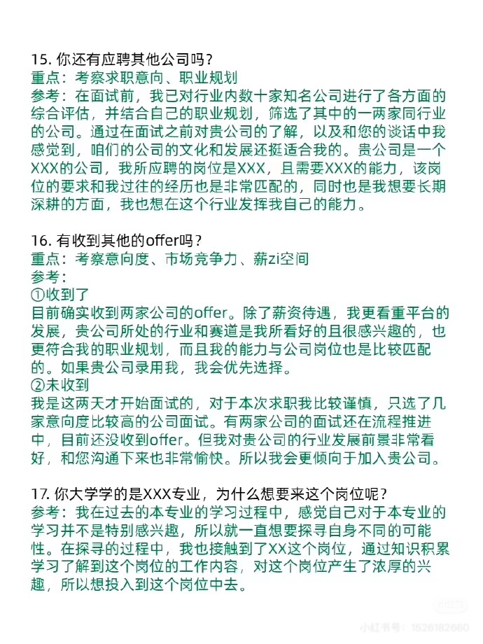
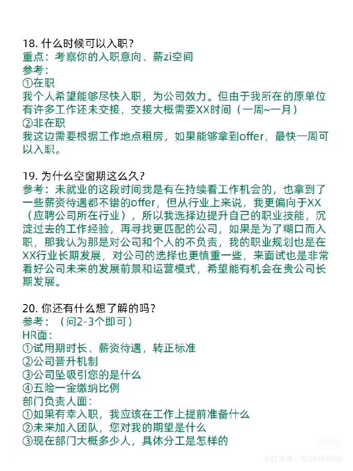
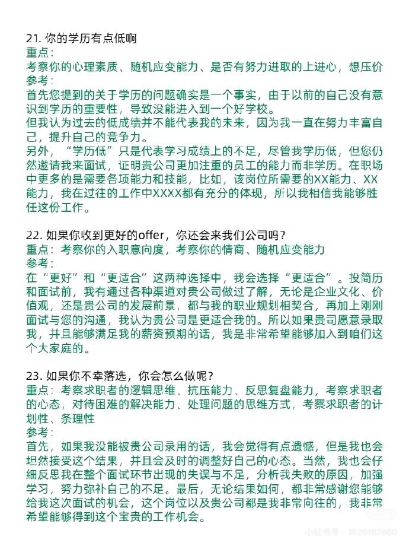
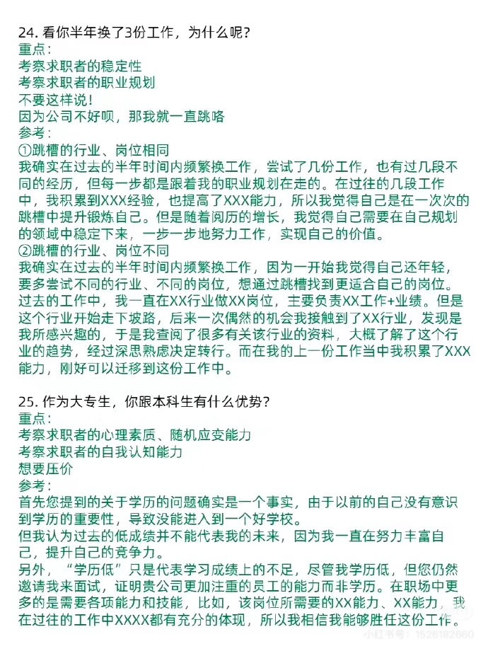
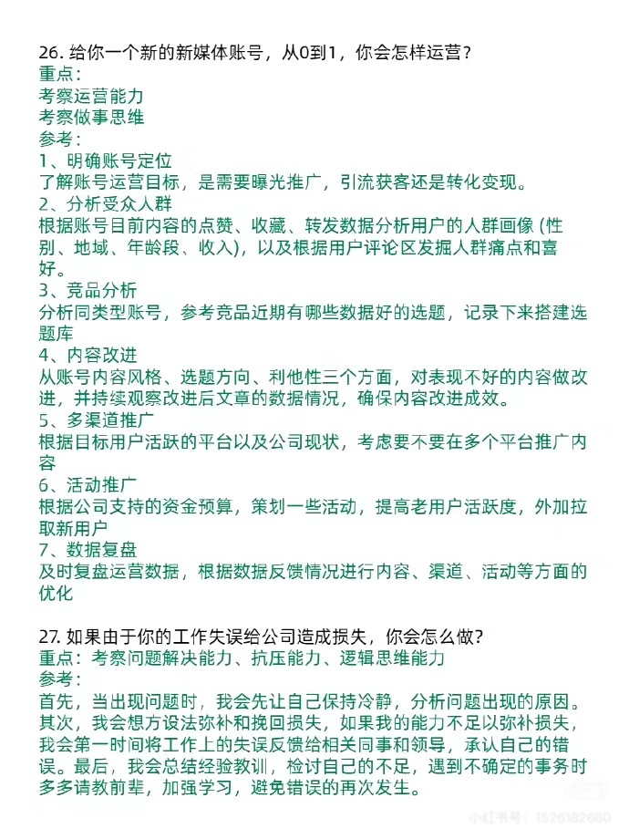
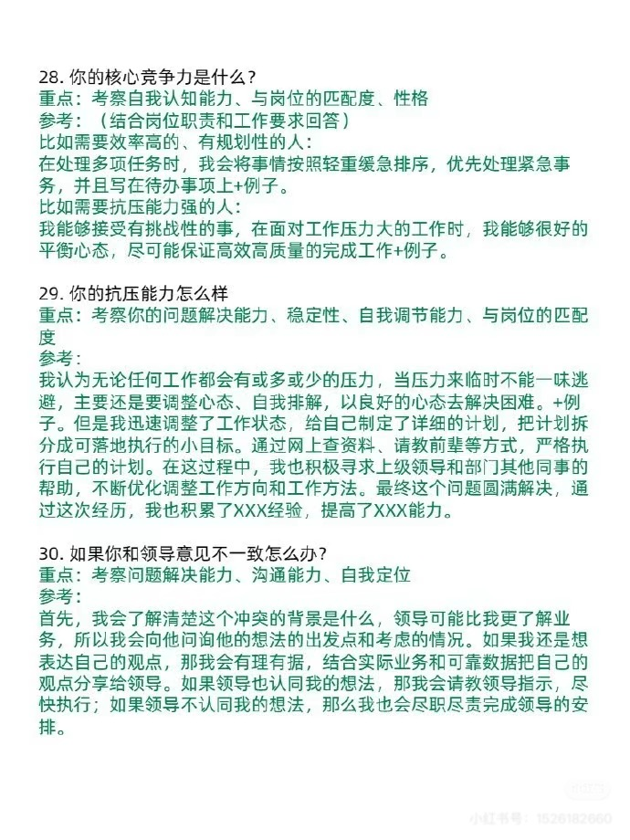

#### 最近遇到的最大的挫折是什么？你是如何克服的？

考察点：逆商(AQ)  面对挫折摆脱困难的能力。高逆商的人会透过消极因素，掌控局面。低逆商的人只会想着逃避。

面试官是想了解你承受工作压力的限度，日后不会因为在工作中遇到超出你能力范围内的工作时，直接被吓跑，做甩手掌柜，而是可以坚持把手上的工作做好。

例：在疫情的假期期间负责维护医院做核酸的打印机，当时打印机出现故障需要我马上处理，但是并没有处理成功，当时有很多在场等待做核酸的人员指责。我通过联系其他公司师傅帮忙处理，最终问题得到解决。

#### 平时有没有买过技术类的相关书籍，比如？

考察点：对技术的兴趣、自学能力、持续学习态度

例：经常买我平时会购买技术类书籍提升专业技能，比如《计算机网络》通过阅读这本书，我不仅学习了TCP/IP协议栈的工作原理，还深入了解了各种网络协议细节。我也会关注新技术的发展，定期购买和阅读相关的书籍，以保持自己的知识和技能与时俱进。

#### 能不能接受偏远地方出差？

不能就说不能，能接受就说能接受，问清楚出差福利 报销制度等

#### 你觉得自己最大的优势和劣势是什么？

优势：我认为我最大的优势是**快速学习和适应能力**。比如，在之前的实习中，我需要在短时间内掌握一项新技术来完成项目。我通过自学和请教同事，迅速上手并成功交付了任务。这种能力让我在面对新挑战时能够快速进入状态。”  
劣势：我有时会过于**追求细节**，**完美主义**，导致在某些任务上**花费的时间比预期多**。不过，我已经意识到这一点，并正在通过制定优先级和时间管理工具来提高效率。比如，在最近的项目中，我学会了先完成核心任务，再优化细节，这让我更好地平衡了质量和效率。”

### **对于我们公司了解多少？**

我了解到贵公司是一家专注于提供信息化项目建设及运维服务的企业，主要产品/服务包括[具体内容]。贵公司在[某领域]有很强的技术优势，并且在[某市场]占据了领先地位。此外，我注意到贵公司最近在[某项目/技术]上有新的突破，这让我对加入贵公司充满期待。”

### **最近有没有其他面试，结果怎么样？**

**回答思路**：诚实回答，但不要透露过多细节，重点表达对当前公司的兴趣。  
我最近确实参加了几家公司的面试，但目前还在等待结果。不过，我对贵公司的岗位最感兴趣，因为[公司优势/岗位匹配度]，所以我更希望有机会加入贵公司。

### **为什么会选择我们公司**

**回答思路**：结合公司特点和个人职业规划，突出匹配度。  
我选择贵公司是因为[**公司行业地位/技术优势/文化]，这与我的职业发展方向非常契合**。我希望在一个能够不断挑战自我、提升技术的环境中工作，**而贵公司正好提供了这样的机会**。

### **能接受的薪资是多少？**

**回答思路**：提前了解行业薪资水平，给出一个合理范围，并表达灵活性。  
根据我的了解，这个岗位的薪资范围大概在[范围]之间。我对薪资有一定的期望，但更**看重的是这个岗位的稳定性**，所以我相信贵公司会给出一个合理的薪资。

### **如果在客户服务过程中，客户告诉你，你发现的漏洞没有另一家公司的工程师多，这时候你应该如何应对？**

**回答思路**：展现专业态度和解决问题的能力。  
首先，我会冷静**倾听客户的反馈**，并感谢他们的意见。然后，我会仔细**检查自己的工作**，确认是否有遗漏。如果确实存在不足，我会立即**改进**；如果我的工作没有问题，我会向客户**解释我们的工作重点和优势**，强调我们提供的价值不仅仅是漏洞数量，而是整体解决方案的质量。

### **简单的介绍一下你的实习经历。**

**回答思路**：重点突出与应聘岗位相关的经验和技能。  
“我曾在[公司名称]实习，主要负责[具体工作]。在实习期间，我学会了[技能]，并参与了[项目]，这让我对[某领域]有了更深入的理解。这段经历让我具备了[某能力]，我相信这对贵公司的岗位非常有帮助。”

### **请问你如何看待公司的文化，比如我们这个岗位要求一天白班一天夜班。**

**回答思路**：展现适应能力和积极态度。  
“我理解这种排班方式是为了保证服务的连续性，我愿意接受这样的安排。我认为只要合理安排时间，保持良好的作息习惯，完全可以适应这种工作节奏。此外，我相信这种工作方式也能让我更快地成长。”

### **说说你这些年来遇到过的最困难的一件事？**

**回答思路**：选择一个真实的例子，重点突出你如何解决问题和从中学习。  
我在[某项目/任务]中遇到了[具体困难]，当时[描述挑战]。我通过[具体行动]解决了问题，并从中学会了[某技能/经验]。这段经历让我更加坚韧，也让我明白了团队合作和沟通的重要性。”

### **你平时是怎么学习新技术的？**

**回答思路**：展现主动学习的能力和方法。  
“我通常会通过在线课程、技术博客和官方文档来学习新技术。此外，我也会动手实践，比如通过项目或开源贡献来巩固所学。我还会参加技术社区的活动，与其他开发者交流，这让我能够更快地掌握新知识。”

### **如果上级给你布置了很难的任务，并且你没办法搞定，你该如何和上级沟通？**

**回答思路**：展现沟通能力和解决问题的思路。  
“我会先尝试自己解决问题，如果确实无法搞定，我会及时向上级汇报，说明我遇到的困难和我已经尝试的解决方案。同时，我会提出一些可能的解决思路，并请求上级的指导或资源支持。”

### **在遇到一个很难的任务时，上级愿意给你所有的支持，你会向他提什么样需求来解决该问题？**

**回答思路**：具体说明需要的资源或支持。  
我会请求上级提供更多的**技术资料或培训机会**，以便我更好地理解任务。如果需要，我也会请求团队中更有经验的同事协助，或者申请更多的时间来确保任务完成的质量。

### **你在学校内最有挑战的事情？遇到的问题？如何解决的？**

**回答思路**：选择一个有代表性的例子，突出你的能力和成长。  
在学校期间，我参与了一个[项目/比赛]，当时遇到了[具体挑战（比如开发一个程序）]。我通过[具体行动（寻找资源借鉴学习）]解决了问题，并最终[取得的结果（比赛名次）]。这段经历让我学会了[某技能（开发）]，也让我更加自信。”

### **你在学校内最有成就感的事情？为什么？你在其中又是什么角色？又解决了什么关键问题？**

**回答思路**：突出你的贡献和成长。  
我最有成就感的事情是[某项目/活动（开发）]，我在其中担任了[角色]。我们团队遇到了[问题]，我通过[具体行动]解决了[关键问题]，最终[取得的结果]。这段经历让我明白了[某道理]，也让我更加坚定了[某方向]。”

### **你还有什么问题要问我？**

**回答思路**：提出有深度的问题，展现对公司和岗位的兴趣。

* 贵公司对这个岗位的长期发展有什么期望？
* 团队目前面临的最大挑战是什么？
* 贵公司对新员工有哪些培训或支持计划？

​​

​​

​​

​​

​​

​​

​​

​​

​​

​​
