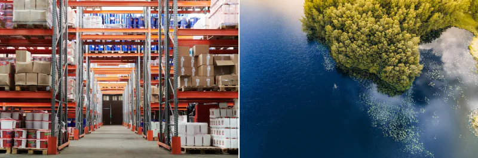

如今企业产生的数据量令人震惊。

然而，缺乏有效策略，大部分信息未被充分利用，数据被孤岛化。

这时，数据湖应运而生——一种强大且灵活的现代数据管理解决方案，能够将原始信息转化为有价值的资产。

如果您的组织正在寻找更好的数据处理和分析方法，本指南非常适合您。我们将解析什么是数据湖，它是如何运作的，以及为何不同行业的企业正在采用它。

## 数据湖介绍

让我们先从数据湖的基本背景说起。

### 什么是数据湖？

数据湖是一个集中式存储库，旨在存储大量[结构化、半结构化和非结构化数据](https://www.splunk.com/en_us/blog/learn/data-structured-vs-unstructured-vs-semi-structured.html)。与传统系统如数据仓库不同，数据湖不需要在存储数据*前*预定义模式。

这使得它成为处理各种原始数据的组织的理想解决方案。可以把数据湖想象成一个广阔的开阔水域，数据流从多个来源流入。这包括从[数据库](https://www.splunk.com/en_us/blog/learn/database-monitoring.html)、物联网设备到社交媒体平台和应用日志的各种各样。

### 数据湖的组成部分

数据湖通常由三个主要组成部分组成：

- **数据摄取层：** 该组件收集并加载来自多个来源的数据到存储层。
- **存储层：** 这里存储所有原始数据。
- **数据处理与分析层：** 这里的数据会被转换、清洗，并为不同工具和应用的分析做准备。

其他辅助组件可能包括[元数据管理](https://www.splunk.com/en_us/blog/learn/metadata-management.html)工具、安全框架和治理策略。

### 数据湖与数据仓库和数据湖仓一体有何不同？

了解[数据湖和数据仓库之间的](https://www.splunk.com/en_us/blog/learn/data-warehouse-vs-data-lake.html)区别至关重要，因为它们通常相互补充而不是替代。

- **数据湖以其**原生形式存储原始数据，而不强加固定结构。它们具有高度可扩展性、成本效益，并支持机器学习等高级分析方法。
- **数据仓库**是处理数据以适应定义架构的结构化环境。它们针对[商业智能 （BI）](https://www.splunk.com/en_us/blog/learn/business-intelligence.html) 工具和事务查询进行了优化，提供高性能但灵活性有限。

这意味着数据湖能够保存图像、视频和文本等非结构化数据，而数据仓库更适合数字和日期等结构化数据。

还有[数据湖仓一体，](https://www.splunk.com/en_us/blog/learn/data-lakehouses.html)这是一种现代混合架构，将数据湖的可扩展性和灵活性与数据仓库的结构化数据管理和性能相结合。它支持来自统一平台的高级分析和商业智能。

*这些照片展示了基本原理：数据湖没有像自然湖那样被强加的结构，而数据仓库则是为特定用途组织数据。*

## 实现数据湖的好处

采用数据湖为企业带来了几项主要优势：

### 无缝数据访问

数据湖支持将信息从经常孤立的来源收集到一个中心位置。这种可访问性使[分析师](https://www.splunk.com/en_us/blog/learn/data-analyst-role.html)、[数据科学家](https://www.splunk.com/en_us/blog/learn/data-scientist-role-responsibilities.html)和[高管](https://www.splunk.com/en_us/blog/learn/chief-data-officer-role-responsibilities.html)能够从相同的信息中汲取信息，从而减少数据驱动决策中的摩擦。

### 所有数据类型的灵活性

与最适合处理结构化数据的数据[仓库](https://www.splunk.com/en_us/blog/learn/data-warehouse-vs-data-lake.html)不同，数据湖可以容纳任何类型的数据：文本、图像、视频、流数据，应有尽有。组织可以进行创新，而不会被僵化的模式所束缚。

### 可扩展性促进增长

AWS S3 和 Azure Data Lake 等现代解决方案可以轻松扩展 PB 级数据，而不会显着增加成本。数据湖的弹性特性可确保您的存储随着业务的增长而发展。

### 启用高级分析

对于探索机器学习、[大数据分析](https://www.splunk.com/en_us/blog/learn/big-data-analytics.html)或[预测建模](https://www.splunk.com/en_us/blog/learn/predictive-modeling.html)的组织来说，数据湖是黄金标准。

数据团队能够通过使用数据湖直接访问原始数据。这使他们能够执行传统 BI 系统中无法实现的先进技术。例如，[Amazon Security Lake 和 Splunk 为高级分析功能提供了一个集成的集中式数据湖](https://www.splunk.com/en_us/form/aws-security-lake-brief.html)。

### 成本效益

数据湖的存储解决方案明显比高性能数据库或仓库更实惠。此外，随着对大量 ETL（提取、转换、加载）准备的需求减少，数据湖可以显着节省成本。

## 数据湖工具和平台

要正确实施数据湖，您需要一个现成的解决方案。存在多种数据湖解决方案，可满足各种用例和预算限制。

一些流行的选项包括：

- [AWS S3](https://aws.amazon.com/big-data/datalakes-and-analytics/datalakes/)​ **：** Amazon 基于云的存储服务具有高度可扩展性、经济实惠且易于与其他 AWS 服务集成。
- [Azure Data Lake Store （ADLS）：](https://learn.microsoft.com/en-us/azure/storage/blobs/data-lake-storage-introduction)ADLS 基于 Azure Blob 存储构建，支持在云中存储 PB 级非结构化数据。
- [谷歌云平台](https://cloud.google.com/?hl=en)​ **：** Google 提供多种数据湖解决方案，包括 Google Cloud Storage 和 BigQuery，可根据不同的业务需求量身定制。
- [Hadoop](https://hadoop.apache.org/)​ **：** 支持大数据处理能力的开源框架。Hadoop 用于世界上一些最广泛的数据湖。
- [Snowflake](https://www.snowflake.com/en/)​ **：** 一个一体化数据平台，结合了传统数据仓库和数据湖的功能。

### Splunk 是数据湖吗？

Splunk 不是传统的数据湖，但提供了一些类似的功能。它主要是一个分析和可观察性平台，用于收集、索引和分析机器生成的数据，如[日志和指标](https://www.splunk.com/en_us/blog/learn/logs-vs-metrics.html)。

虽然 [Splunk 数据平台](https://www.splunk.com/en_us/products/platform.html)可以存储大量半结构化数据，但其优势在于实时搜索、警报和监控，尤其是在 IT 运营、安全和 DevOps 方面。

Splunk 可以在特定场景中充*当*数据湖，[例如 Amazon Security Lake](https://docs.splunk.com/Documentation/SplunkCloud/9.3.2408/FederatedSearch/faaslDataLakeIndexes) 或 Splunk Data Fabric Search，它可以集中和分析原始数据。但是，它并不是被设计成一个全面的、架构灵活的数据湖，供广泛的企业使用。

 *(*​[探索用于数据管理、可观测性和网络安全的 Splunk 统一平台](https://www.splunk.com/en_us/products.html)​ *。*

<iframe class="vidyard_iframe" title="Building a Better Lake: How to Utilize Federated Search for Amazon Security Lake" src="https://play.vidyard.com/6iFwuVE8AT2TCfNpNCRGyU.html?" width="640" height="360" frameborder="0">&amp;nbsp;</iframe>

## 真实世界的数据湖用例

各行各业的许多组织都依靠数据湖来推动创新。这里有几个例子：

​**零售业的客户个性化**：零售连锁店使用数据湖来集成购买历史记录、社交媒体活动和网站行为。这种统一的数据可以为个人客户提供高度定制的购物体验。

**医疗保健数据集成：**  医院和实验室将病历、影像数据和患者遥测数据存储在数据湖中。这可以简化研究、预测性诊断并改善患者护理。

**物联网和智能设备分析：**​[制造公司利用数据湖](https://corsosystems.com/posts/how-to-use-data-lakes-in-manufacturing)来分析来自连接设备的高速物联网数据，帮助他们预测维护需求、优化工作流程并最大限度地减少停机时间。

**金融风险管理：**  银行使用数据湖来模拟客户行为并预测信用违约或欺诈等风险。通过将结构化财务记录与非结构化网络活动相结合，银行可以改进其整体风险管理策略。

 *（相关阅读：*​[金融犯罪风险管理](https://www.splunk.com/en_us/blog/learn/fcrm-financial-crime-risk-management.html)​ *）*

## 构建和维护数据湖：最佳实践

为了最大限度地发挥数据湖的效用，必须遵循以下分步最佳实践：

### 1. 从明确的数据治理策略开始

如果没有适当的治理，您的数据湖就有可能成为“[数据沼泽](https://www.alation.com/blog/data-swamp-lake-lakehouse/)”，信息杂乱无章且难以提取。您还应该在流程的早期建立数据组织、使用和访问规则。

有效的数据治理*实际上*与组织无关，它对于满足 GDPR、HIPAA 或 [SOC 2](https://www.splunk.com/en_us/blog/learn/soc-compliance.html) 等[法规遵从性标准](https://www.splunk.com/en_us/blog/learn/regulatory-compliance.html)至关重要。确保适当的访问控制、审计跟踪和数据沿袭跟踪有助于企业避免法律陷阱并维护客户信任。

### 2. 优先考虑安全

通过实施强大的用户身份验证、加密和合规性监控来确保数据湖的安全性。[ AWS Lake Formation](https://aws.amazon.com/lake-formation/) 等技术使组织能够无缝地完成这一过程。

### 3. 维护元数据以加快检索速度

包括元数据标记，以帮助用户有效地搜索、定位和检索数据。[ Apache Atlas](https://atlas.apache.org/#/) 等工具可以帮助管理整个湖中的综合元数据。

### 4. 设计灵活的数据管道

[ Apache Spark](https://spark.apache.org/) 和[ AWS Glue](https://aws.amazon.com/glue/) 等平台简化了提取、转换和加载数据的过程，而不会将您锁定在特定的架构要求中。这符合数据湖的流体存储理念。

### 5. 定期监控绩效

请务必密切关注用户查询、作业运行时和数据存储成本。尝试寻找瓶颈并优化作，以确保数据湖随着您的使用模式而发展。

### 6. 优化性能

主动优化数据湖可以显著提高性能并降低成本。

- 按时间或类别对数据进行分区，通过缩小搜索范围来加快查询执行速度。
- 使用 Parquet 或 ORC 等列式存储格式可提高读取效率并减少存储占用空间。
- 实现查询加速层（例如，物化视图或缓存引擎）可以缩短重复查询的响应时间。

这些实践共同确保你的数据湖高效存储数据，同时快速可靠地提供洞察。

### 7. 管理数据生命周期

随着数据湖的扩大，管理[存储数据的生命周期](https://www.splunk.com/en_us/blog/learn/dlm-data-lifecycle-management.html)变得至关重要。并非所有数据都具有长期价值，因此实施策略——如归档、分层存储或自动删除陈旧数据集——有助于控制存储成本并优化性能。

许多云服务提供商提供内置生命周期策略来自动化这一流程。

## 管理数据湖的挑战（以及如何解决这些挑战）

虽然数据湖的优势引人注目，但也有一些挑战需要考虑：

- **数据质量差：**  原始数据通常存在不一致、错误和重复。实施自动清理工具和数据验证管道，以确保高质量的输入。
- **压倒性的体积：**  未经过滤的大量数据可能会让用户不知所措。实施高效的索引和元数据标记可以缓解这种情况。
- **用户访问复杂性：**  新用户可能难以查询非结构化数据。为了克服这个问题，请投资用户友好的查询解决方案，例如 [Presto](https://prestodb.io/) 或 [SQL-on-Hadoop 工具](https://www.integrate.io/blog/12-sql-on-hadoop-tools/)。

## 数据湖的未来趋势

随着数据生态系统的发展，数据湖变得更加智能和统一。新兴趋势包括：

- 用于自动标记和发现的 AI 驱动的数据编目
- 将分析性能与灵活性融为一体的数据湖屋的兴起
- 与实时流媒体平台更紧密地集成。

组织也正在转向受监管的自助服务模式，允许更多团队在不大量 IT 参与的情况下访问和分析数据，同时保持控制和合规性。

## 利用数据湖的力量

精心设计的数据湖不仅仅是高级存储解决方案，还提供了统一组织数据的机会。

要从不同和孤立的数据中引入新的业务洞察，请考虑立即为您的企业构建数据湖。
