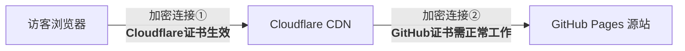
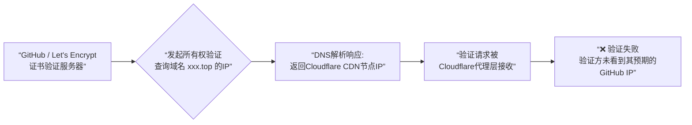
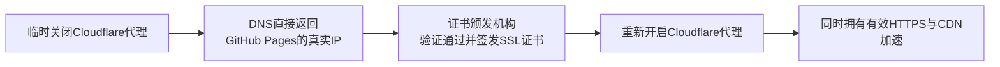
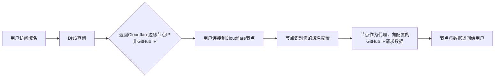

背景：博客使用的是github page，但是国内访问速度太慢了，所以就有了使用CDN的打算同时也让AI帮我对比了几个方案。

|对比维度|**自定义域名 + Cloudflare CDN**|博客**迁移至 Netlify/Vercel 等第三方**|
| ----------| ----------------------------------------------------| ----------------------------------------------------|
|**对现有 Actions 工作流的影响**|**零影响**。Actions 配置无需任何改动。|**需要迁移**。需将构建部署流程从 GitHub Actions 转移到新平台。|
|**自动化程度**|**完全自动**。一次性配置域名和CDN后，后续全自动。|**完全自动**，但需适应新平台的自动构建设置。|
|**加速原理**|通过 CDN 节点缓存和优化访问路径。|使用平台自带的全球CDN。|
|**核心优点**|**无缝集成**，保留所有 GitHub 生态和自动化体验。|功能强大，速度可能更快，平台集成体验好。|
|**主要缺点**|需要拥有一个自定义域名（通常每年约几十元人民币）。|**需重构部署流程**，放弃现有的 Actions 配置可能带来额外成本。|

### 阿里云购买域名

在阿里云购买了一个域名

### 域名托管到Cloudflare

将你在阿里云购买的域名交由Cloudflare管理。

1. **注册Cloudflare**：访问 [Cloudflare官网](https://www.cloudflare.com/) 注册账号。
2. **添加站点**：登录后，在控制台点击  **“添加站点”** ，输入主域名。
3. ​**选择套餐**​：在计划页面选择 ​**免费计划**，然后点击继续。
4. **变更域名服务器**：

   - Cloudflare会提供**两个专属的名称服务器地址**。
   - **登录阿里云控制台**，找到域名管理页面，进入 **DNS解析设置** 或 **域名服务器修改** 选项。
   - 将阿里云原有的名称服务器记录，​**替换为Cloudflare提供的那两个地址**。

### 在Cloudflare配置DNS解析

待域名状态在Cloudflare变为“有效”后，需要配置DNS记录，将域名指向你的GitHub Pages。

需要添加以下两条核心记录。操作在Cloudflare控制台的 **DNS > 记录** 页面完成：

- **记录1：根域名（@）A记录**

  - ​**目的**​：让 `yourdomain.com` 能访问。
  - ​**操作**​：点击“添加记录”，类型选择 ​**A**​；名称填写 ​ **​`@`​** ​；IPv4地址填入GitHub Pages的IP之一，例如 ​**​`185.199.108.153`​**​（这是四个官方IP之一，任选一个即可）；务必点亮​**橙色云朵**（代理状态开启）。
- **记录2：www子域名CNAME记录**

  - ​**目的**​：让 `www.yourdomain.com` 能访问。
  - ​**操作**​：点击“添加记录”，类型选择 ​**CNAME**​；名称填写 ​**​`www`​**​；目标填写你的GitHub Pages地址 ​ **​`<你的用户名>.github.io`​**​；同样点亮​**橙色云朵**。

> ​**重要提示**：点亮“橙色云朵”意味着流量经过Cloudflare CDN加速和保护；如果云朵是灰色的，则只使用其DNS解析功能，没有加速效果。

### 在GitHub Pages绑定自定义域名

此操作是让GitHub知道你的自定义域名。

1. 进入你的GitHub Pages仓库的 ​**Settings**。
2. 找到 **Pages** 部分，在 **Custom domain** 栏中，输入绑定好的域名，然后点击 **Save**。
3. 建议勾选下方的 ​ **“Enforce HTTPS”** （强制HTTPS）选项。

### 配置SSL与安全设置

在Cloudflare控制台进行以下设置，提升安全性和体验：

1. ​**SSL/TLS加密模式**：

   进入 **SSL/TLS** 设置页面。
2. 推荐将加密模式设置为 ​ **“完全（严格）”** 。此模式在浏览器到Cloudflare、Cloudflare到GitHub Pages之间都进行加密，安全性最高。
3. ​**始终使用HTTPS**：

   - 在 **SSL/TLS** 的“边缘证书”页面，找到  **“始终使用 HTTPS”**  选项并开启。这会将所有HTTP请求自动重定向到HTTPS。

### Github Page 自定义域名无法开启强制HTTPS 

报错如下：

```bash
Enforce HTTPS — Unavailable for your site because your domain is not properly configured to support HTTPS (min168.top) — Troubleshooting custom domains
HTTPS provides a layer of encryption that prevents others from snooping on or tampering with traffic to your site.
When HTTPS is enforced, your site will only be served over HTTPS. Learn more about securing your GitHub Pages site with HTTPS.
```

  **“Enforce HTTPS unavailable” 错误，是GitHub无法为你的源站颁发证书，而Cloudflare可以轻松为访问者提供加密**。两者区别的核心在于它们保护的是HTTPS连接中的**不同阶段**。





**Cloudflare 无法与 GitHub Pages 源站建立安全的 HTTPS 连接**。

★ ★ ★  GitHub在为你的域名自动签发SSL证书时，需*要*​***验证你拥有这个域名***​ *。标准的验证方式是检查该域名的DNS记录是否指向了GitHub。* 但是，当Cloudflare代理开启后，GitHub的验证系统可能会因为流量路径被改变而**无法正确完成验证**，从而导致证书签发失败。

同样我直接访问域名的错误信息如下：

```bash
Invalid SSL certificate Error code 526
Visit cloudflare.com for more information.
2025-12-31 07:19:09 UTC
You
Browser  Working
Hong Kong
Cloudflare  Working
min168.top
Host  Error
What happened?

The origin web server does not have a valid SSL certificate.
What can I do?
If you're a visitor of this website:
Please try again in a few minutes.
If you're the owner of this website:

The SSL certificate presented by the server did not pass validation. This could indicate an expired SSL certificate or a certificate that does not include the requested domain name. Please contact your hosting provider to ensure that an up-to-date and valid SSL certificate issued by a Certificate Authority is configured for this domain name on the origin server. Additional troubleshooting information here.
Cloudflare Ray ID: 9b6801cb081303f2
Your IP:  Click to reveal
Performance & security by Cloudflare
```

**解决方法: 让GitHub完成验证**



暂时“绕过”Cloudflare的代理，让GitHub的验证系统能看到正确的DNS记录。

**第一步：临时关闭Cloudflare代理**

1. 登录Cloudflare控制台，进入 ​**DNS > 记录**。
2. 找到您为 域名 设置的 **A记录**（名称是 `@` 的那条）。
3. 点击该记录旁的 ​**橙色云朵图标**​，使其变为​**灰色（仅DNS）** 。这表示暂停代理，DNS将直接返回GitHub的IP地址。
4. ​**仅操作A记录即可**​，`www` 的CNAME记录可以保持橙色。

**第二步：触发GitHub重新验证并签发证书**

1. 回到GitHub仓库的 ​**Settings > Pages**。
2. 在“Custom domain”中，再次执行“清空 -> 保存 -> 等待1分钟 -> 重新填入 `域名` -> 保存”的操作。
3. 保存后，请密切关注是否出现  **“Certificate is being issued...”**  的提示。看到此提示，说明验证已触发。

**第三步：重新开启Cloudflare代理并完成配置**

1. 等待足够时间（例如2-4小时）或通过 [SSL Labs](https://www.ssllabs.com/ssltest/) 检测确认证书已签发成功后（报告显示证书由GitHub/Let‘s Encrypt签发）。
2. ​**返回Cloudflare**​，将那条A记录的代理状态​**重新点击为橙色云朵（已代理）** 。
3. 最后，回到GitHub Pages设置页面，刷新后**勾选 “Enforce HTTPS”**  选项。

至此CDN已配置好，原理如下：



### 关于网站显示乱码的解决

之前访问我的我配置过两次就是出现同样的问题，通过域名访问只能返回html，css和js的数据未返回。起初怀疑国内网速不好。或是被GFW拦截了。配置了好几次没有成功。访问index.html也404。

网站可能并非构建在名为 `你的用户名.github.io` 的特殊仓库中，而是构建在一个普通仓库里。

**访问这个地址**：`https://你的用户名.github.io`​说明没有那个以 `你的用户名.github.io` 命名的仓库，或者该仓库未开启Pages。然后我想到我之前网站后要加/blog/才能访问。

那么这个的 **正确访问地址** 是：`https://域名/blog/`

所以需要确保在 **VuePress 配置文件** 中的 `base`​ 选项设置为 `"/"`这样构建时候将项目构建在根目录而非/blog/才能 域名直接访问。

### 解决RSS不显示和跨域问题

配置完以上问题后，我的RSS页面显示空白F12调试发现RSS文件可以请求下来，而一个叫XSL的文件没有请求下来。

**XSL（eXtensible Stylesheet Language）**  是**可扩展样式表语言**，专门用来处理和转换 XML 文档。它为 XML 提供类似 CSS 对于 HTML 的功能。

报错如下：

```bash
rss.xml:1  Unsafe attempt to load URL https://xxx.github.io/rss.xsl from frame with URL https://域名/rss.xml. Domains, protocols and ports must match.
```

这个错误是浏览器出于安全考虑触发的**同源策略（Same-origin policy）**  限制。

你的 RSS 文件 `rss.xml`（位于 域名下）尝试加载一个外部 XSL 样式表：

```
<?xml-stylesheet type="text/xsl" href="https://用户名.github.io/rss.xsl"?>
```

浏览器禁止这种跨域资源加载，因为：

- **源不同**：域名 ≠ `用户名.github.io`
- **协议、域名、端口** 这三者必须完全一致才能直接加载

解决方法：**修改引用**：将外部引用改为本地引用

将 XSL 文件放在同域名下，但是我根目录有这个文件。所以根本原因是我的域名修改了，但是RSS文件里的XSL文件路径在编译时忘记改了所以要修改文件途径。

同时将vuepress hope 的theme.ts的配置修改为：

```bash
export default hopeTheme({
  hostname: "https://域名",
```

将RSS文件里的路径修改为：

```bash
<?xml-stylesheet type="text/xsl" href="rss.xsl"?>
<!-- 或者 -->
<?xml-stylesheet type="text/xsl" href="https://域名/rss.xsl"?>
```

或直接移除这一行，让 RSS 以纯 XML 格式显示。

至此，CDN这块内容就折腾的差不多了，总耗时3个晚上。。。
