# OPNsense 部署与三网卡区域隔离

## 原理目标

- 是什么：OPNsense 是 2015 年从 pfSense 分叉出来的开源防火墙，同样基于 FreeBSD、同样用 pf 做包过滤，Web 界面更现代化、默认启用更多安全基线（如默认拒绝私有网络流量）
- 原理：和 pfSense 一致——接口划分区域（WAN/LAN/DMZ），**区域之间默认拒绝，按需放行**
- 学完能做什么：搭出与 pfSense 篇完全同构的三网段隔离；能口头讲清 OPNsense vs pfSense 的差异（界面、许可、插件、安全默认项）

> 为什么两款都要部署？pfSense（Netgate）近年把新功能集中到商业版 pfSense Plus，CE 更新变慢；OPNsense 社区版完全开源、功能全量开放。真实企业里两者都能见到，各记各的坑。

## 环境条件

| 项目 | 值 |
|---|---|
| 虚拟化平台 | VMware Workstation Pro |
| OPNsense | CE 26.7（当前稳定版，DVD 镜像约 470MB） |
| 虚拟机配置 | 2 核 / 2GB 内存 / 20GB 磁盘 / 3 张网卡 |
| 管理机 | 物理主机（宿主），用来访问 Web 管理界面 |

网络规划（注意：**LAN 换到了 vmnet3，网段与 pfSense 篇不同**，避免两个实验虚拟机同时占用同一网段）：

| 网卡 | VMware 网络 | 网段 | OPNsense 接口 | 用途 |
|---|---|---|---|---|
| 网卡1 | 桥接模式（Bridged） | 由热点分配（192.168.x.x） | WAN | 出口，连手机热点 |
| 网卡2 | vmnet3（仅主机） | 192.168.200.0/24 | LAN | 可信内网，管理口 |
| 网卡3 | vmnet2（仅主机） | 10.0.10.0/24 | DMZ | 半可信区，放对外服务 |

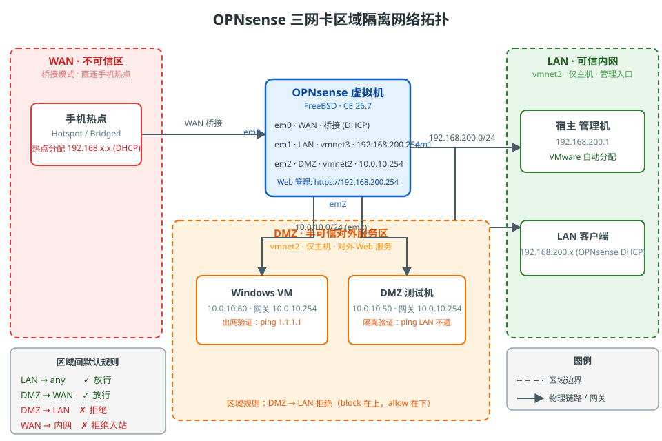

OPNsense 接口 IP：LAN=192.168.200.254、DMZ=10.0.10.254、WAN 桥接由热点 DHCP 获取。宿主适配器由 VMware 自动配为各网段 `.1`（192.168.200.1 / 10.0.10.1），与 OPNsense 不冲突。


## 操作步骤

### 1. 下载 OPNsense 镜像

打开官网 [OPNsense 下载页](https://opnsense.org/download/)，选择 **amd64 / dvd** 版本下载：

- dvd：ISO 安装镜像，带 live 系统能力，适合 VMware 挂载
- 当前稳定版 26.7，文件名为 `OPNsense-26.7-dvd-amd64.iso.bz2`（约 470MB，`.bz2` 压缩包）
- 下载后是 `.iso.bz2`，需用 7-Zip 先解压出 `.iso` 再挂载

> 📎 官方文档入口：[OPNsense Documentation](https://docs.opnsense.org/) | [安装指南](https://docs.opnsense.org/manual/install.html)

北大镜像：https://mirrors.pku.edu.cn/opnsense/releases/mirror/OPNsense-26.7-dvd-amd64.iso.bz2
台湾镜像：https://mirror.ntct.edu.tw/opnsense/releases/26.7/OPNsense-26.7-dvd-amd64.iso.bz2

### 2. 新建/配置虚拟网络

LAN 和 DMZ 需要两个**独立的仅主机网络**。本方案：LAN 用 vmnet3（全新），DMZ 用 vmnet2（pfSense 篇已配好），WAN 用桥接连手机热点。

1. 打开 编辑 → 虚拟网络编辑器 → 点"更改设置"（需要管理员）
2. 若没有 vmnet3：点"添加网络"新建一个，选**仅主机模式**，把 Subnet IP 改成 `192.168.200.0`、掩码 `255.255.255.0`，点**应用**
3. 确认 vmnet2 仍是 `10.0.10.0`、掩码 `255.255.255.0`
4. **关闭 vmnet3 的 VMware DHCP**（LAN 的 DHCP 由 OPNsense 自己开，VMware 的 DHCP 会跟它抢地址；DMZ 机器用静态 IP）
5. 确认更改后宿主适配器自动变为 `192.168.200.1` / `10.0.10.1`

  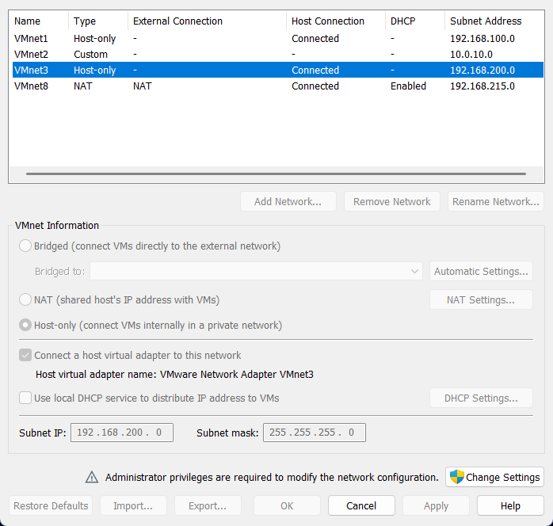

> ⚠️ 与 pfSense 篇的区别：pfSense 用 vmnet1 做 LAN，这里用 vmnet3——**别沿用 vmnet1**，否则会和 pfSense 虚拟机抢 192.168.100.0/24 网段。

### 3. 创建虚拟机并挂载镜像

1. 新建虚拟机 → 典型 → 稍后安装操作系统
2. 客户机操作系统选 **FreeBSD → FreeBSD 13 (64-bit)**（OPNsense 基于 FreeBSD，别选 Linux）
3. 内存 2GB、磁盘 20GB
4. 自定义硬件 → 配置 3 张网卡：
   - 网络适配器1：桥接模式（WAN，连手机热点）
   - 网络适配器2：仅主机 vmnet3（LAN）
   - 网络适配器3：仅主机 vmnet2（DMZ）
5. CD/DVD 挂载解压好的 OPNsense ISO，勾选"启动时连接"

  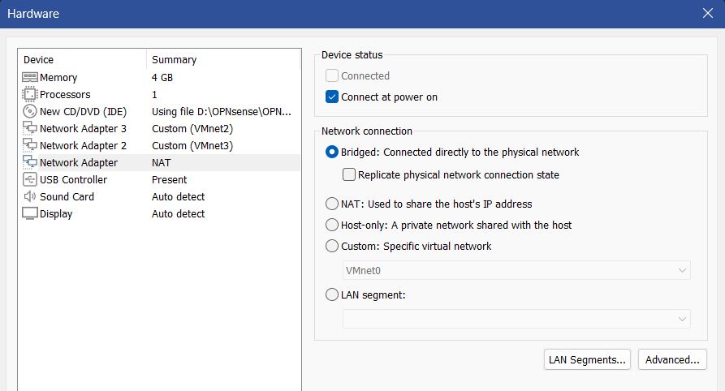

### 4. 安装 OPNsense（分区选 UFS）

启动虚拟机，从 ISO 引导会进入 **live 环境**（FreeBSD 直接跑在内存里），先登录再启动安装器：

1. 登录 live 环境：用户名 `installer`，密码 `opnsense`
2. 输入 `installer` 命令，进入安装流程
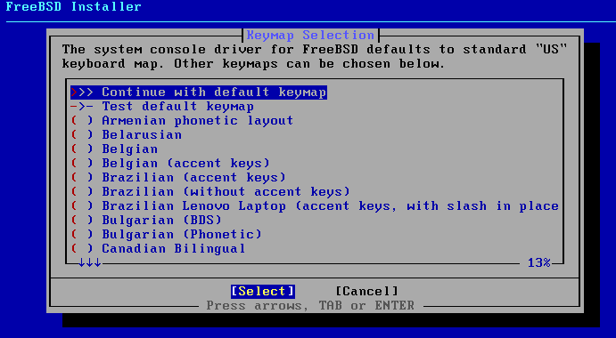

3. 键盘布局默认（US）即可
4. 同意许可协议
5. 安装类型选 **Install (UFS)**（ZFS 需要更多内存且配置更复杂，2GB 小实验机用 UFS 足够）
6. 分区方案选 **Auto (UFS)** 整盘安装
7. 磁盘确认选 `da0`（VMware 虚拟盘），确认后开始安装
8. **设置 root 密码**（这个密码就是以后登录 Web 管理界面的密码，别用默认的 opnsense）
9. 安装完成 → 移除 ISO → 重启

> ⚠️ 与 pfSense 篇的区别：pfSense 安装器直接把安装选项列在引导界面；OPNsense 是**先进 live 系统、再手动敲 `installer` 命令**，用户名密码固定为 `installer/opnsense`。第 5 步分区 UFS 的思路两者一致。

安装完成后进入控制台菜单：

```
* * * Welcome to OPNsense [OPNsense 26.7 (amd64/OpenSSL) on OPNsense * * *

0) Logout                      7) Ping host
1) Assign interfaces           8) Shell
2) Set interface(s) IP address 9) pfTop
3) Reset the root password    10) Filter logs
4) Reset to factory defaults  11) Restart web interface
5) Reboot system              12) Upgrade from console
6) Halt system                13) Restore a configuration
```
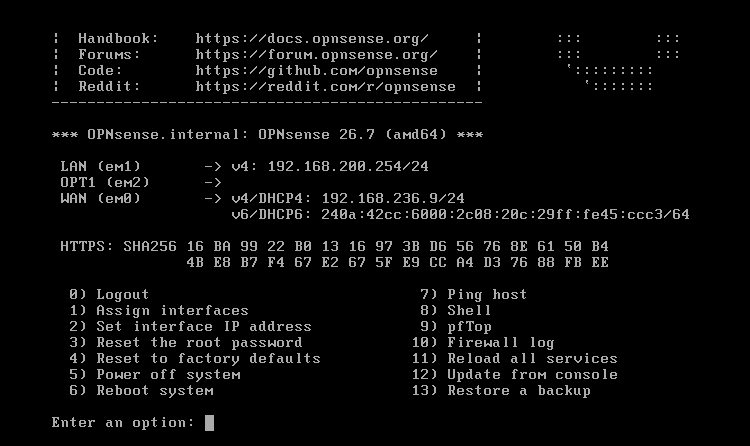

### 5. 分配三网卡（Assign Interfaces）

选 **1** 进入接口分配：

1. 配置 LAGG / Vlan " → 输入 `n`
2. 输出查看检测到的网卡和 MAC 地址，**和 VMware 设置里的 MAC 对照**，确定谁是 WAN/LAN/DMZ
3. 依次分配：WAN=em0、LAN=em1、DMZ=em2（OPNsense 里先问 WAN，再问 LAN，可选接口依次编号）
4. 确认无误后输入 `y` 应用

  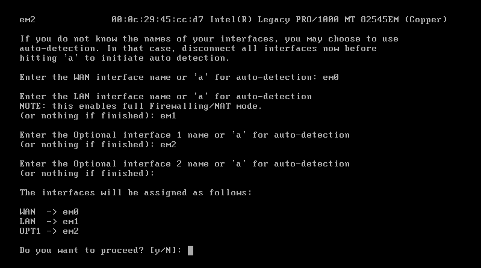

> ⚠️ 踩坑：VMware 里三张网卡的排列顺序要和 OPNsense 检测到的 `em0/em1/em2` 对上，最稳的办法还是看 MAC。先把"网络适配器1 桥接 = WAN"想清楚，再动手分配。

### 6. 配置接口 IP

选 **2 Set interface(s) IP address**，逐个配置：

- **WAN**：选 DHCP 自动获取（桥接从手机热点拿地址）
- **LAN**：IPv4 填 `192.168.200.254/24` → 是否开 DHCP server 选 `y`（LAN 主机由 OPNsense 发地址）→ IPv6 跳过
- **DMZ**：IPv4 填 `10.0.10.254/24` → DHCP 选 `n`


### 7. 登录 Web 管理界面

宿主 vmnet3 适配器自动拿到 `192.168.200.1`，浏览器访问：

```
https://192.168.200.254
```

用户名 `root`，密码默认opnsense 或有**第 4 步安装时设置的那个 root 密码**。

  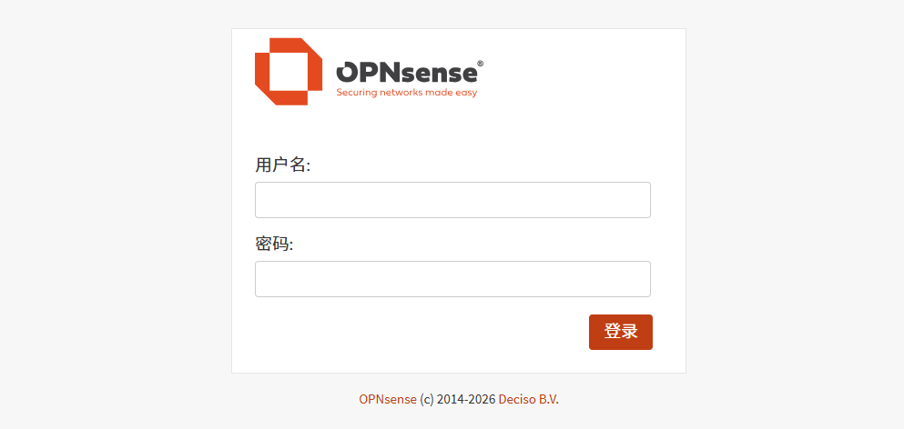

完成时区和语言变更。

  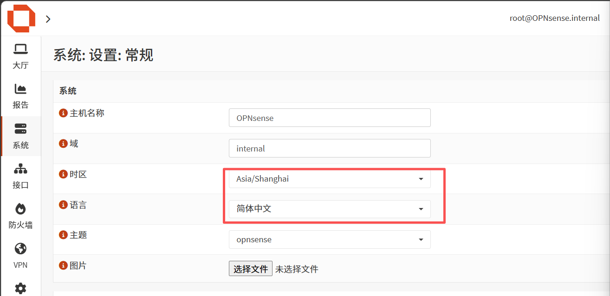

检查WAN、LAN、DMZ接口配置情况，没有配置需要补上。
  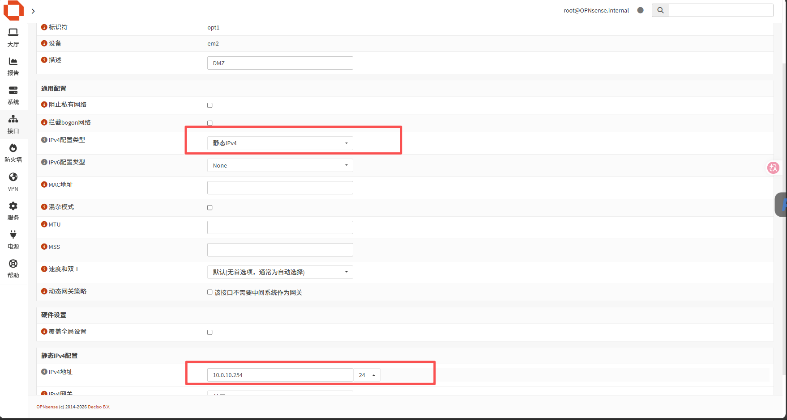

### 8. 看默认规则（区域隔离的起点）

进入 防火墙 → 规则，查看默认规则集：

- **WAN 规则**：默认拒绝入站，且 OPNsense 默认勾选"block private networks"（拦截源或目的为私网地址的流量，防止源地址欺骗/内网地址出站）——这是它比 pfSense 更严的默认项
- **LAN 规则**：默认放行出站

  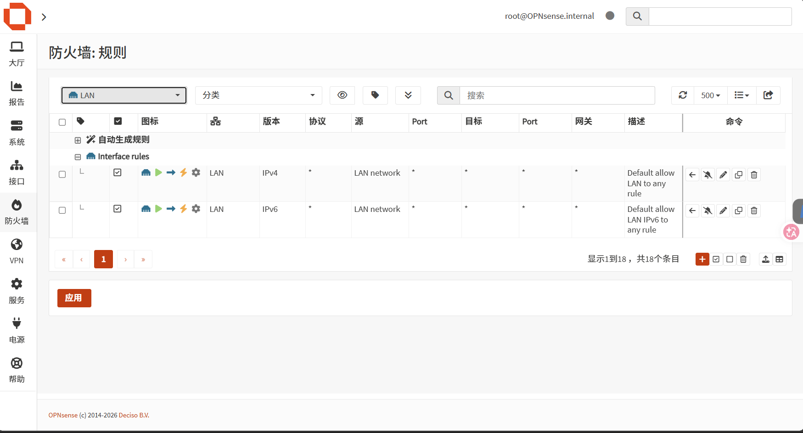

### 9. 收紧 DMZ 规则（按需放行）

**DMZ → LAN 默认拒绝，DMZ → WAN 按需放行**。OPNsense 规则同样从上往下匹配、先命中先生效，用"上面的 block + 下面的 allow"组合：

1. 防火墙 → 规则 → DMZ：在列表**最上面新增一条 block**：`DMZ net → LAN net`，动作 Block——掐断 DMZ 对内网的访问
2. 默认的放行规则**保留在下面**：DMZ 仍能出 WAN，但进不了 LAN
3. 需要 DMZ 访问内网某服务时：在 block 规则**上面**插一条窄范围 allow（先放行、再拦其余）
4. 点击"应用更改"
  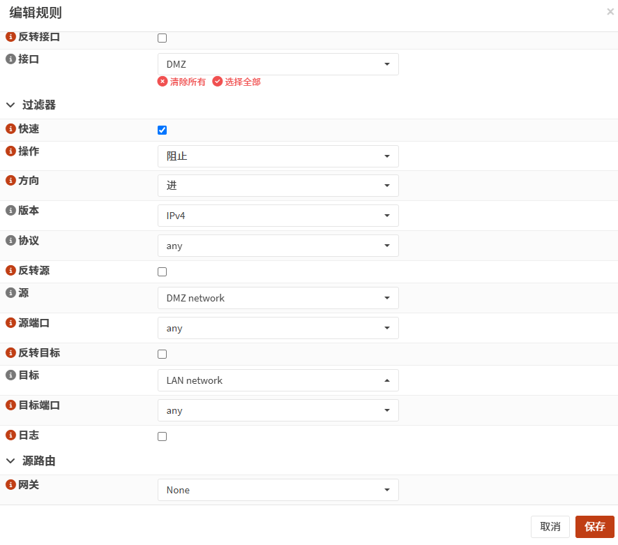
5. 开启日志记录这样方便观察后续DMZ隔离情况
  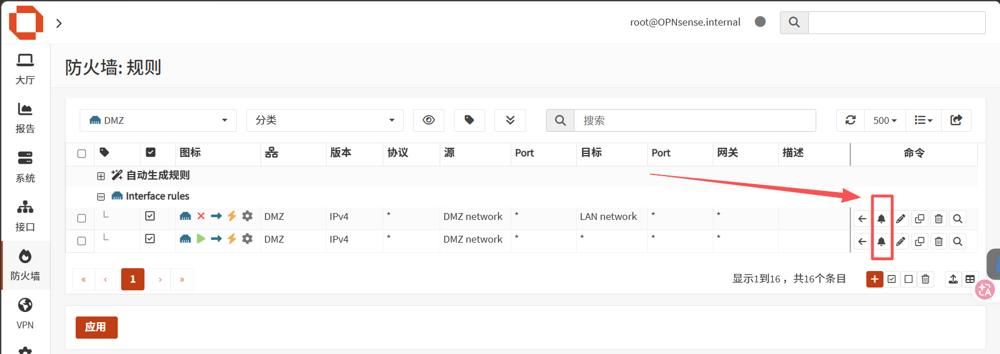

### 10. 区域隔离验证（关键一步）

建一台 DMZ 测试机（只挂 vmnet2 网卡，静态 IP `10.0.10.50/24`，网关 `10.0.10.254`），验证：

| 验证项 | 预期结果 |
|---|---|
| LAN（宿主 192.168.200.1）→ 管理口 192.168.200.254 | 通 |
| LAN → WAN 侧（出网） | 通 |
| LAN → DMZ 网关 10.0.10.254 | 通（默认 LAN 可到 any） |
| DMZ（10.0.10.50）→ LAN（192.168.200.254） | **不通**（规则已收紧） |
| DMZ → WAN 出网 | 通（业务需要对外服务） |

在 DMZ 测试机上 `ping 192.168.200.254` 不通、`ping 10.0.10.254` 通，就说明区域隔离生效了。
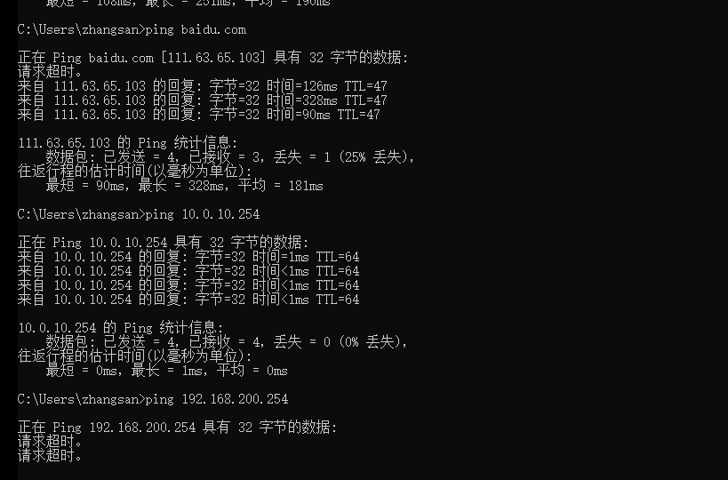
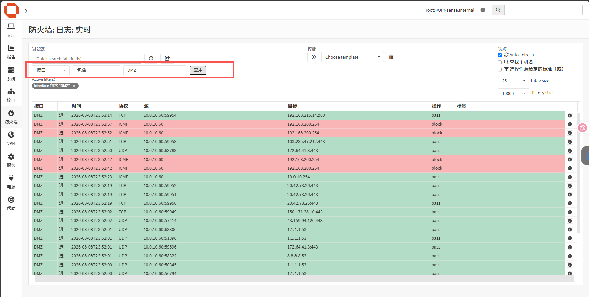


### 11. 开启日志（为后续对接 SIEM 铺垫）

1. 防火墙 → 日志 → 防火墙，查看被丢弃/放行的记录
2. 在 DMZ/WAN 的规则上把"日志"勾选打开，方便后面观察攻击流量（同9.5.）

## OPNsense vs pfSense 差异对照

| 维度 | pfSense | OPNsense |
|---|---|---|
| 出身 | Netgate，2006 年起 | 2015 年从 pfSense 分叉 |
| 内核 | FreeBSD | FreeBSD（同为 pf 包过滤） |
| 商业策略 | 新功能集中在 pfSense Plus（商业版），CE 更新放缓 | 社区版完全开源，全量功能 |
| 默认密码 | `admin/pfsense`（固定） | 默认/安装时自设 root 密码 |
| 安全默认项 | 较宽松 | 默认拒绝私有网络/bogons 流量 |
| 插件生态 | pfSense Plus 部分插件受限 | 插件全量开放（os-* 系列） |
| 界面 | 传统 Web GUI | 更现代的 UI，默认新版界面 |

## 知识总结

**Q1：OPNsense 和 pfSense 是什么关系？**
OPNsense 是 2015 年从 pfSense 分叉的开源项目，两者都基于 FreeBSD、都用 pf 防火墙引擎，规则和 NAT 的底层逻辑几乎一样，但界面、许可策略和安全默认项不同。

**Q2：OPNsense 的默认安全基线和 pfSense 有什么不同？**
OPNsense 默认勾选"block private networks"和"block bogon networks"，即拒绝私有地址与保留地址流量出入 WAN；pfSense 默认较宽松。真实渗透/安服视角看，这是理解"防火墙默认策略差异"的好例子。

**Q3：DMZ 为什么要单独隔离？**
对外服务机器一旦被攻破，DMZ 是"牺牲区"——攻击者拿到 DMZ 机器也不能直通内网，必须再打一道防线。OPNsense/pfSense 都是靠"上面的 block + 下面的 allow"规则顺序实现。

**Q4：接口子网掩码配成 /32 会有什么后果？**
系统把接口当"单主机接口"，自动 NAT 只覆盖该 IP 自身，整个网段没有出口 NAT——网段内其他主机出公网流量不做 NAT、以私网源 IP 直发被上游丢弃。配成 /24 后自动 NAT 覆盖整段。

**控制台命令速查**

| 菜单 | 作用 |
|---|---|
| 1 Assign Interfaces | 分配接口角色（WAN/LAN/DMZ） |
| 2 Set interface(s) IP | 配置接口 IP |
| 3 Reset the root password | 重置 root 密码 |
| 8 Shell | 进 shell，可用 `pfctl -s rules` 看规则、`ifconfig` 看网卡 |
| 9 pfTop | 实时看连接/规则命中 |
