# pfSense 部署与三网卡区域隔离


## 原理目标

- 是什么：pfSense 是基于 FreeBSD 的开源防火墙/路由器，Web 界面可配，被大量中小企业当商业防火墙的平替
- 原理：防火墙把接口划分成安全区域（Zone）。WAN=不可信外网、LAN=可信内网、DMZ=半可信对外服务区。区域之间**默认拒绝，按需放行**——这就是"区域隔离"
- 学完能做什么：搭出 WAN/LAN/DMZ 三个隔离网段；验证默认规则、手动收紧 DMZ 规则；给后续安全产品提供基础网络


## 环境条件

| 项目 | 值 |
|---|---|
| 虚拟化平台 | VMware Workstation Pro |
| pfSense | CE 2.7.x（当前稳定版，镜像约 800MB） |
| 虚拟机配置 | 2 核 / 2GB 内存 / 20GB 磁盘 / 3 张网卡 |
| 管理机 | 物理主机（宿主），用来访问 Web 管理界面 |

网络规划：

| 网卡 | VMware 网络 | 网段 | pfSense 接口 | 用途 |
|---|---|---|---|---|
| 网卡1 | 桥接模式（Bridged） | 由热点分配（如 192.168.236.0/24） | WAN | 出口，连手机热点 |
| 网卡2 | vmnet1（仅主机） | 192.168.100.0/24 | LAN | 可信内网，管理口 |
| 网卡3 | vmnet2（仅主机） | 10.0.10.0/24 | DMZ | 半可信区，放对外服务 |

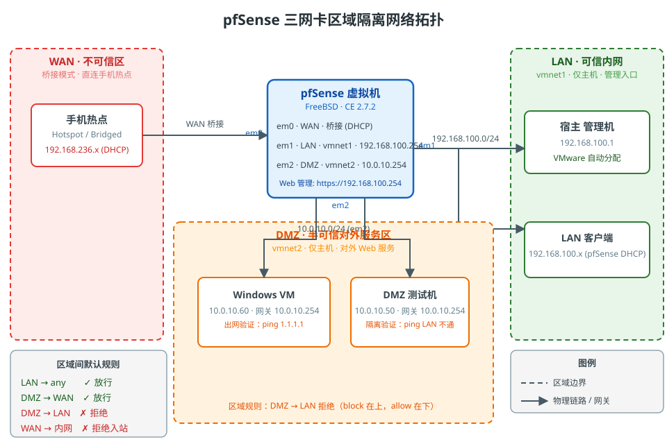

pfSense 接口 IP：LAN=192.168.100.254、DMZ=10.0.10.254、WAN 桥接由热点 DHCP 获取。宿主适配器由 VMware 自动配为各网段 `.1`（192.168.100.1 / 10.0.10.1），与 pfSense 不冲突。

## 操作步骤

### 1. 下载 pfSense CE 镜像

打开官网 [pfSense 下载页](https://www.pfsense.org/download/)，选择 CE / amd64 / DVD Image (ISO) 下载，完成注册登陆填写地址信息（随便写，地址和邮箱对上即可）不需要银行卡号，后下载链接就发送到邮箱了。

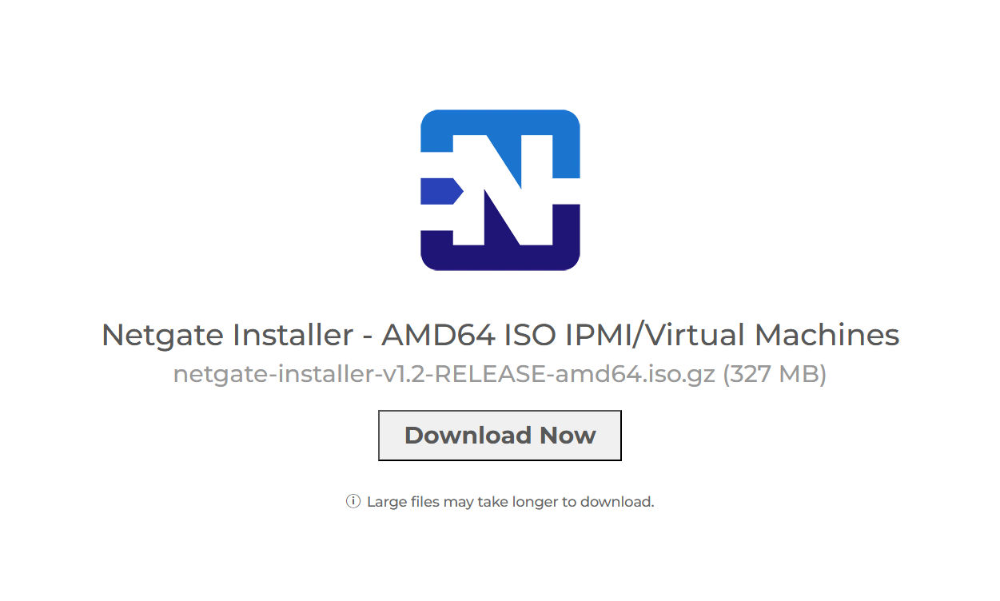

> 📎 官方文档入口：[pfSense Documentation](https://docs.netgate.com/pfsense/en/latest/)

或：

官方镜像（美国）：https://atxfiles.netgate.com/mirror/downloads/pfSense-CE-2.7.2-RELEASE-amd64.iso.gz
下载后是 .iso.gz，需要用 7-Zip 或 gzip 解压得到 .iso 文件


### 2. 新建/配置虚拟网络（vmnet1 改 192.168.100、vmnet2 改 10.0.10）

LAN 和 DMZ 需要两个**独立的仅主机网络**，否则两个区域会挤在同一个网段，区域隔离无从谈起。**本方案：LAN 用 vmnet1，DMZ 用 vmnet2，WAN 用桥接连手机热点。**

1. 打开 编辑 → 虚拟网络编辑器 → 点"更改设置"（需要管理员）
2. 选中 vmnet1（仅主机），把 Subnet IP 改成 `192.168.100.0`、掩码 `255.255.255.0`，点**应用**
3. 选中 vmnet2（仅主机），把 Subnet IP 改成 `10.0.10.0`、掩码 `255.255.255.0`，点**应用**（不存在就先"添加网络"）
4. **关闭这两个网络的 VMware DHCP**（LAN 的 DHCP 由 pfSense 自己开，VMware 的 DHCP 会跟它抢地址；DMZ 机器用静态 IP，也不需要 VMware DHCP）
5. 确认更改后宿主适配器自动变为 `192.168.100.1` / `10.0.10.1`


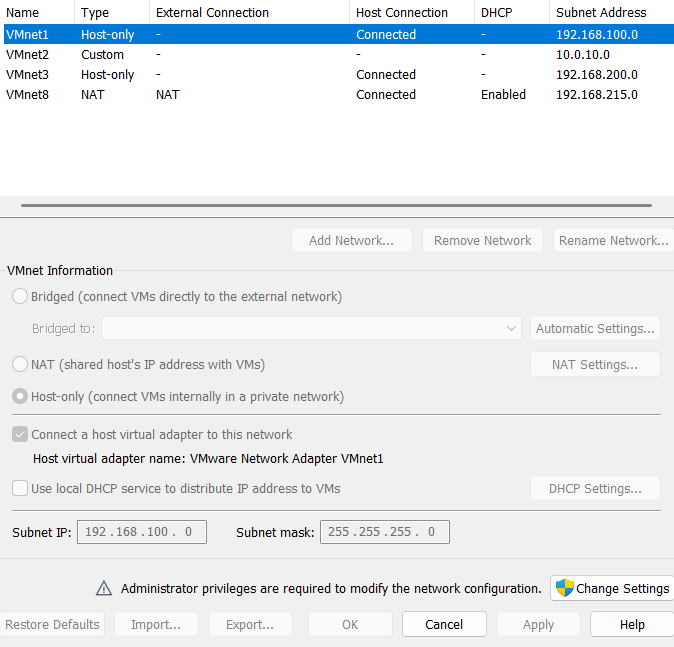

### 3. 创建虚拟机并挂载镜像

1. 新建虚拟机 → 典型 → 稍后安装操作系统
2. 客户机操作系统选 **FreeBSD → FreeBSD 12 (64-bit)**（pfSense 基于 FreeBSD，别选 Linux）
3. 内存 2GB、磁盘 20GB
4. 自定义硬件 → 配置 3 张网卡：
   - 网络适配器1：桥接模式（WAN，连手机热点）
   - 网络适配器2：仅主机 vmnet1（LAN）
   - 网络适配器3：仅主机 vmnet2（DMZ）
5. CD/DVD 挂载下载好的 pfSense ISO，勾选"启动时连接"

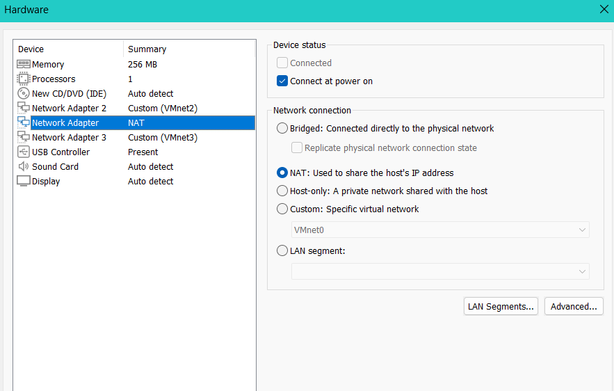


### 4. 安装 pfSense（分区选 UFS）

启动虚拟机，进入安装界面：

1. 选 **Install pfSense** 回车
2. 键盘布局默认（US）即可
3. 同意许可协议
4. 进入分区选择（Partitioning），本实验选 **Auto (UFS)**，整盘安装


5.  **Auto (ZFS)**，会多进一个 **ZFS Configuration** 界面（Select Virtual Device type：stripe / Mirror / raid10 / RAID-Z1~Z3
6. 分区方案确定后，会显示磁盘确认：`[*] da0  VMware, VMware Virtual S...`（就是那块 20GB 虚拟盘），确认无误点 **OK**
7. 等安装完成 → 重启前把 ISO 从 CD/DVD 里移除（否则又会进安装界面）

安装完成后进入控制台菜单：

```
Welcome to pfSense
0) Logout
1) Assign Interfaces
2) Set interface(s) IP address
3) Reset webConfigurator password
...
```
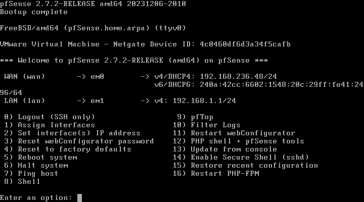

### 5. 分配三网卡（Assign Interfaces）

选 **1** 进入接口分配：

1. "Should VLANs be set up now? [y|n]" → 输入 `n`
2. 输入 `i` 查看检测到的网卡和 MAC 地址，**和 VMware 设置里的 MAC 对照**，确定谁是 WAN/LAN/DMZ
3. 依次分配：WAN=vtnet0、LAN=vtnet1、DMZ=vtnet2
4. 确认无误后 "Do you want to proceed? [y|n]" → `y`

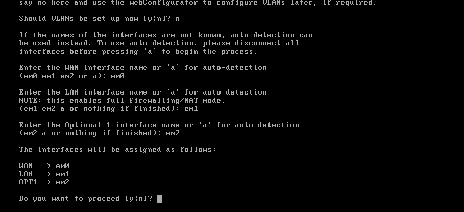

> ⚠️ 踩坑：接口分配错了很常见。判断方法是 VMware 虚拟机设置里每张网卡都有 MAC 地址，控制台 `i` 显示的 MAC 能一一对上。我第一次把 WAN 和 LAN 配反，结果 WAN 拿不到地址、管理口也不通。

### 6. 配置接口 IP

选 **2 Set interface(s) IP address**，逐个配置：

- **WAN**：选 DHCP 自动获取（桥接从手机热点拿地址，如 192.168.236.x）
- **LAN**：IPv4 填 `192.168.100.254/24` → 是否开 DHCP server 选 `y`（LAN 主机由 pfSense 发地址）→ IPv6 跳过 → 是否用 HTTP 替代 HTTPS 访问选 `n`（保持 HTTPS）
- **DMZ**：IPv4 填 `10.0.10.254/24` → DHCP 选 `n`

> ⚠️ **掩码踩坑（/32 vs /24）**：接口 IP 的**子网掩码一定要写对**。曾把 DMZ 配成 `10.0.10.254/32`（单主机），pfSense 会认为该接口上只有网关自己一个 IP，自动 NAT 只生成 `/32` 规则，整个 `10.0.10.0/24` 网段出网没有 NAT——DMZ 里的主机全上不了网（完整排查见第 10 步）。写成 `/24` 即可。

> ⚠️ 桥接踩坑：热点下拿不到地址时，先确认 VMware 桥接的是热点所在 WiFi 网卡；仍不行就暂时退回 NAT（vmnet8），LAN/DMZ 方案不变。

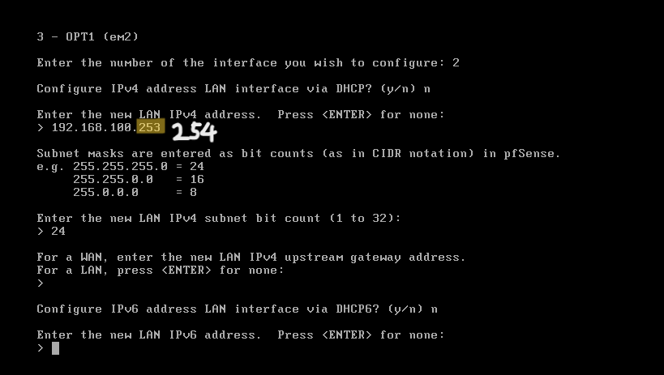

### 7. 登录 Web 管理界面

宿主 vmnet1 适配器会自动拿到 `192.168.100.1`（VMware 自动配的 .1），和 pfSense 的 `192.168.100.254` 同网段但**不冲突**，直接浏览器访问：

```
https://192.168.100.254
```

默认账号 `admin`，密码 `pfsense`。首次登录会强制改密码，并进入设置向导——直接跳过即可（后面手动配）。

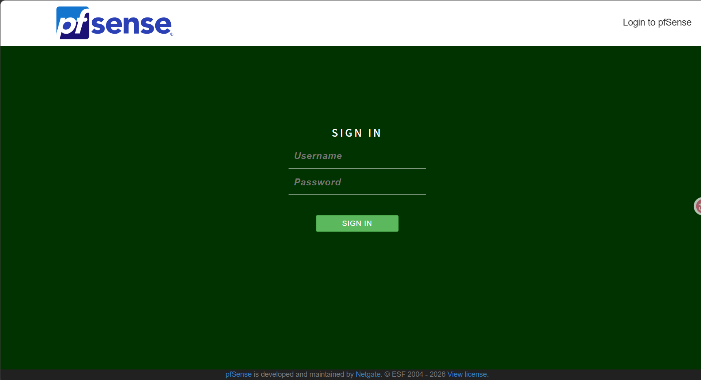


### 8. 看默认规则（区域隔离的起点）

进入 防火墙 → 规则，查看默认规则集：

- **WAN 规则**：默认全部拒绝入站（只放行回包）——外网打不进来
- **LAN 规则**：默认一条 `LAN net → any` 放行——内网可以出去，**也能到 DMZ**
- **DMZ 规则**：新建接口默认也带一条 `DMZ net → any`（和 LAN 一样放行）

这正是演示重点：**默认规则不等于安全，DMZ 必须手动收紧**。

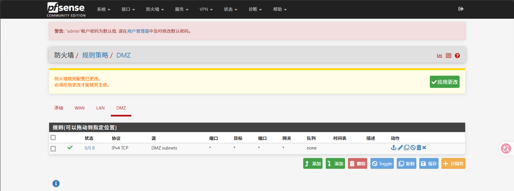

### 9. 收紧 DMZ 规则（按需放行）

DMZ 的语义是"对外提供服务的半可信区"——它不该反过来访问内网。核心原则：**DMZ → LAN 默认拒绝，DMZ → WAN 按需放行**。pfSense 规则从上往下匹配、先命中先生效，所以靠"上面的 block + 下面的 allow"组合实现。

1. 防火墙 → 规则 → DMZ：在列表**最上面新增一条 block**：`DMZ net → LAN net`，动作选 Block/Reject——从根上掐断 DMZ 对内网的访问
2. 默认的 `DMZ net → any` 放行规则**保留在下面**：DMZ 仍能出 WAN（对外服务要更新/调外部接口），但进不了 LAN
3. 如果确实有 DMZ 服务器要访问内网某服务：在 block 规则**上面**再插一条窄范围 allow（如 `10.0.10.50 → 192.168.100.5` 仅 80 端口）——先放行、再拦其余
4. 点击"应用更改"

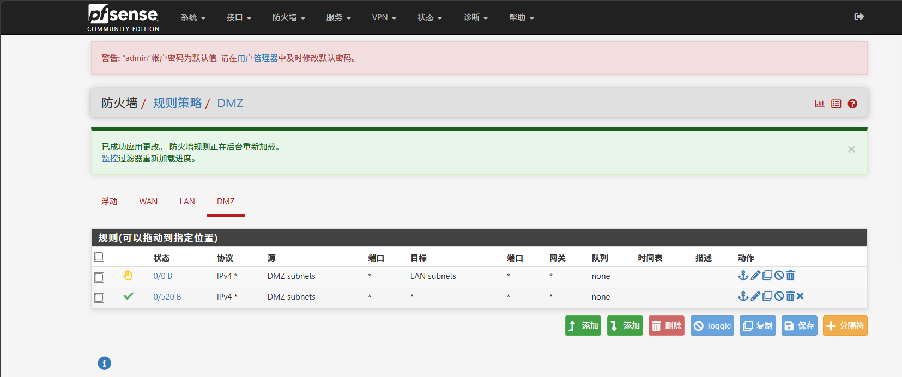

注意：DMZ net → any 不能将any换为WAN subnets，WAN subnets只包含 WAN 网段，公网地址不在其中，会被默认规则丢弃

### 10. 区域隔离验证（关键一步）

建一台 DMZ 测试机（只挂 vmnet2 网卡，静态 IP `10.0.10.50/24`，网关 `10.0.10.254`），分别验证：

| 验证项 | 预期结果 |
|---|---|
| LAN（宿主 192.168.100.1）→ 管理口 192.168.100.254 | 通 |
| LAN → WAN 侧（出网） | 通 |
| LAN → DMZ 网关 10.0.10.254 | 通（默认 LAN 可到 any） |
| DMZ（10.0.10.50）→ LAN（192.168.100.254） | **不通**（规则已收紧） |
| DMZ → WAN 出网 | 通（业务需要对外服务） |

在 DMZ 测试机上 `ping 192.168.100.254` 不通、`ping 10.0.10.254` 通，就说明区域隔离生效了。

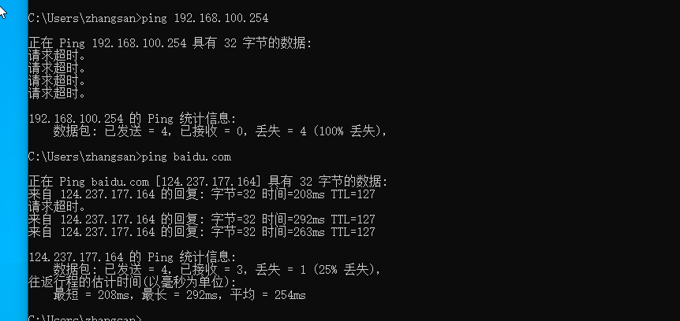

> 🔧 **排查实战：DMZ 主机能 ping 通网关但上不了网（NAT 掩码坑）**
>
> 现象：DMZ 测试机（10.0.10.60）`ping 10.0.10.254` 通、`ping 1.1.1.1` 超时——说明区域隔离 OK，但出口 NAT 有问题。
>  **定位根因**：接口 → DMZ，子网掩码被配成了 `/32`（应为 `/24`）。掩码 /32 让 pfSense 认为 DMZ 接口只有网关一个 IP，自动 NAT 只覆盖它，网段内主机出公网不 NAT → 以私网源 IP 出去被上游丢弃
>  **修复**：掩码改回 `/24` → 保存 → 应用更改；混合（hybrid）NAT 模式会自动为 `10.0.10.0/24` 生成正确规则
> 💡 这个"三网卡 + 默认拒绝 + 按需放行"的模型，就是企业里"安全分区、横向隔离"的最小复刻。

### 11. 开启日志（为后续对接 SIEM 铺垫）

1. 状态 → 系统日志 → 防火墙 查看被丢弃/放行的记录
2. 在 DMZ/WAN 的规则上把"日志"勾选打开，方便后面观察攻击流量

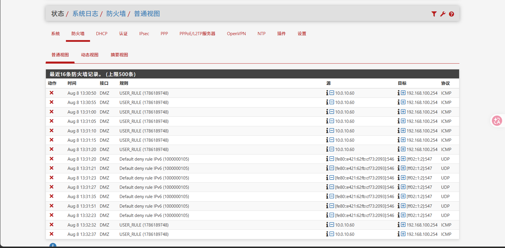

> 📎 [pfSense 接口分配官方文档](https://docs.netgate.com/pfsense/en/latest/config/interfaces-assign.html) | [pfSense 防火墙规则文档](https://docs.netgate.com/pfsense/en/latest/firewall/index.html)

## 知识总结

**Q1：什么是区域隔离/安全域？**
防火墙按接口划分信任等级不同的区域（WAN/LAN/DMZ），区域之间默认拒绝、按需放行，把风险限制在局部。

**Q2：pfSense 默认规则是怎样的？**
- WAN：全部拒绝入站
- LAN：默认放行出站（可到 any）
- 新增接口（如 DMZ）：默认也是放行出站，需要手动收紧

**Q3：DMZ 为什么单独隔离？**
对外服务机器一旦被攻破，DMZ 是"牺牲区"——攻击者拿到 DMZ 机器也不能直通内网，必须再打一道防线。

**Q4：状态化防火墙和无状态防火墙的区别？**
状态化会记录连接表（源/目的/端口/状态），回包自动放行、防 TCP 伪造；pfSense (pf) 就是状态化。无状态只按单包规则匹配。

**Q5：三网卡隔离和三 VLAN 隔离的区别？**
物理网卡/接口隔离最彻底，管理简单但占资源；VLAN 更省但依赖交换机与配置正确性。真实生产常混合使用。

**Q6：接口子网掩码配成 /32 会有什么后果？**
pfSense 会把接口当"单主机接口"，自动 NAT 只覆盖该 IP 自身，整个网段没有出口 NAT——网段内其他主机出公网流量不做 NAT、以私网源 IP 直发被上游丢弃。配成 /24 后自动 NAT 覆盖整段。排查最快的方式是控制台 Shell 跑 `pfctl -sn` 看实际加载的 NAT 规则。

**控制台命令速查**

| 菜单 | 作用 |
|---|---|
| 1 Assign Interfaces | 分配接口角色（WAN/LAN/DMZ） |
| 2 Set interface(s) IP | 配置接口 IP |
| 3 Reset webConfigurator password | 重置 Web 密码 |
| 8 Shell | 进 shell，可用 `pfctl -s rules` 看规则、`ifconfig` 看网卡 |

