### zabbix快速上手及SNMP相关介绍

### **一、Zabbix概述**

一个**企业级分布式开源监控解决方案**，用于实时监控网络设备、服务器、应用及云服务的健康状态，通过灵活告警机制快速定位故障。

- **典型场景**：

  - 服务器资源监控（CPU/内存/磁盘）
  - 网络设备性能监控（SNMP协议）
  - 应用服务可用性检测（Web/Nginx/数据库）
  - 云环境与容器监控（Docker/K8s集成）

### **二、核心功能与优势**

|**功能**|**作用**|**优势**|
| --| -----------------------------------------------| ------------------|
|**数据采集**|支持Agent/SNMP/IPMI等多种方式收集监控数据|覆盖全栈监控需求|
|**触发器(Trigger)**|定义监控项阈值（如CPU\>90%），触发异常状态|精准阈值告警|
|**可视化**|提供Dashboard/图形/拓扑图展示监控数据|数据直观易分析|
|**告警通知**|邮件/微信/钉钉等多媒介报警，支持告警升级策略|灵活通知机制|
|**自动发现**|自动识别网络设备并添加监控|减少人工配置|

> ✅ **核心优势**：开源免费、分布式扩展性强、定制化程度高、社区生态成熟。

### **三、专业术语解析**

- 主机：被监控的设备（IP/域名标识）
- 监控项：具体监控指标（如内存使用率）
- 触发器：阈值判断表达式（例：`{Host:item.last()}>90`​ ）
- 动作：触发器触发后的响应（如发送邮件/执行脚本）
- 模板：一组实体（监控项、触发器、图表、低级发现规则、Web 场景），准备应用于一个或多个主机。模板的工作是加快监控任务在主机上的部署;此外，还可以更轻松地将批量更改应用于监视任务。模板直接链接到各个主机。
- Proxy：分布式代理节点，减轻Server压力
- 主机组：主机的逻辑分组。为不同用户组的主机分配访问权限时，将使用主机组。
- 项目：要从主机接收的特定数据，数据度量。
- 值预处理：在将收到的指标值保存到数据库之前对其进行转换。、
- 触发：一个逻辑表达式，用于定义问题阈值并用于“评估”项目中接收的数据。*当收到的数据高于阈值时，触发器将从“正常”进入“问题”状态。当接收到的数据低于阈值时，触发器将保持/返回到 'Ok' 状态。
- 模板组：模板的逻辑分组。为不同用户组分配对模板的访问权限时，会使用模板组。
- 事件：值得注意的某项内容的单次出现，例如触发器更改状态或发生发现/代理自动注册。
- 事件标签：事件的预定义标记。它可用于事件关联、权限粒度等。
- 事件关联：一种灵活、精确地将问题与解决方案相关联的方法。例如，您可以定义一个触发器报告的问题可以由另一个触发器解决，该触发器甚至可能使用不同的数据收集方法。
- 问题：*处于 “Problem” 状态的触发器。
- 问题更新：Zabbix 提供的问题管理选项，例如添加评论、确认、更改严重性或手动关闭。
- 行动：对事件做出反应的预定义方法。*作由作（例如发送通知）和条件（*执行作时*）组成

### 四 **、快速使用指南**

1. **添加主机**：  
    Web界面 → `Configuration`​ → `Hosts`​ → `Create Host`​（填写主机IP/名称）
2. **链接模板**：  
    选择预置模板（如`Linux by Zabbix agent`​监控OS基础指标）
3. **自定义监控项**：

    - 创建脚本：`/etc/zabbix/zabbix_agent.d/nginx_data.sh`​ 收集Nginx状态[1](https://blog.csdn.net/m0_51960729/article/details/124318366)
    - 配置监控项：`UserParameter=nginx.status,/etc/zabbix/scripts/nginx_data.sh`​
4. **配置告警**：

    - 创建触发器：`{Host:nginx.status.last()}=0`​ （服务停止）
    - 设置动作：触发时发送邮件至管理员

> 💡 **效率技巧**：善用主机组(Host Group)批量管理设备，利用自动发现减少重复操作。

### 五、快速部署

1. 为了快速上手，这里选择Install Zabbix Appliance

    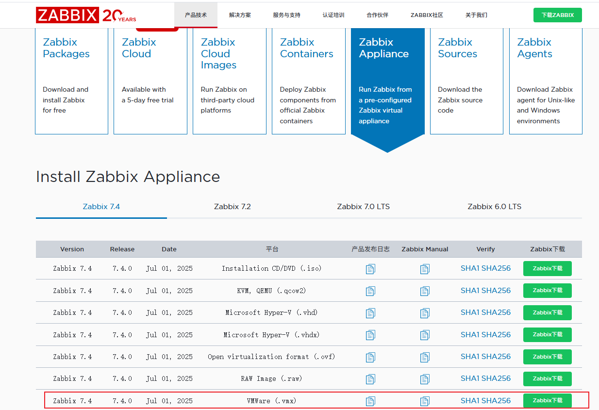
2. 下载`VMWare (.vmx)`​版本，后续直接导入vmware。

    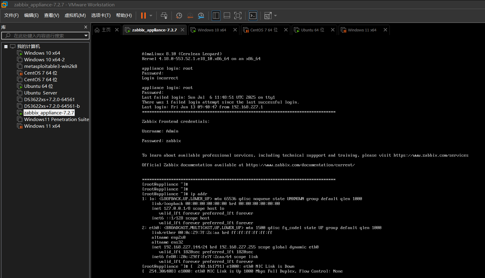
3. 带IP访问如图所示

    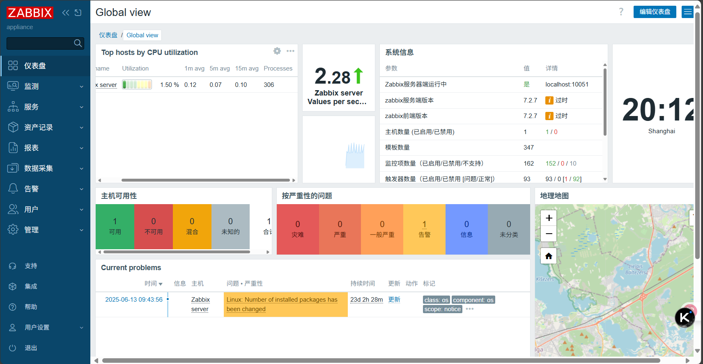

## 六、SNMP介绍

SNMP是广泛应用于TCP/IP网络的网络管理标准协议，该协议能够支持网络管理系统，用以监测连接到网络上的设备是否有任何引起管理上关注的情况。SNMP采用轮询机制，提供最基本的功能集，适合小型、快速、低价格的环境使用，而且SNMP以用户数据报协议（UDP）报文为承载，因而受到绝大多数设备的支持，同时保证管理信息在任意两点传送，便于管理员在网络上的任何节点检索信息，进行故障排查。

随着网络技术的飞速发展，在网络不断普及的同时也给网络管理带来了一些问题：

- **网络设备数量成几何级数增加**，使得网络管理员对设备的管理变得越来越困难；同时，网络作为一个复杂的分布式系统，其覆盖地域不断扩大，也使得对这些设备进行实时监控和故障排查变得极为困难。
- **网络设备种类多种多样**，**不同设备厂商提供的管理接口（如命令行接口）各不相同**，这使得网络管理变得愈发复杂。

在这种背景下，SNMP应运而生，SNMP是广泛应用于TCP/IP网络的网络管理标准协议，该协议能够支持网络管理系统，用以监测连接到网络上的设备是否有任何引起管理上关注的情况。通过“利用网络管理网络”的方式：

- 网络管理员可以利用SNMP平台在网络上的任意节点完成信息查询、信息修改和故障排查等工作，工作效率得以提高。
- 屏蔽了设备间的物理差异，SNMP仅提供最基本的功能集，使得管理任务与被管理设备的物理特性、网络类型相互独立，因而可以实现对不同设备的统一管理，管理成本低。
- 设计简单、运行代价低，SNMP采用“尽可能简单”的设计思想，其在设备上添加的软件/硬件、报文的种类和报文的格式都力求简单，因而运行SNMP给设备造成的影响和代价都被最小化。

### SNMP的基本组件

SNMP基本组件包括**网络管理系统NMS**（Network Management System）、代理进程（Agent）、被管对象（Managed Object）和管理信息库MIB（Management Information Base）。

### NMS

**NMS是一个采用SNMP协议对网络设备进行管理/监视的系统**，运行在NMS服务器上。

- NMS可以向设备上的Agent发出请求，查询或修改一个或多个具体的参数值。
- NMS可以接收设备上的Agent主动发送的Trap信息，以获知被管理设备当前的状态。

### Agent

Agent是被管理设备中的一个**代理进程**，用于维护被管理设备的信息数据并响应来自NMS的请求，把管理数据汇报给发送请求的NMS。

- Agent接收到NMS的请求信息后，通过MIB表完成相应指令后，并把操作结果响应给NMS。
- 当设备发生故障或者其它事件时，设备会通过Agent主动发送信息给NMS，向NMS报告设备当前的状态变化。

### Managed Object

Managed Object指被管理对象。每一个设备可能包含多个被管理对象，被管理对象可以是设备中的某个硬件，也可以是在硬件、软件（如路由选择协议）上配置的参数集合。

### MIB

MIB是**一个数据库**，指明了被管理设备所**维护的变量**，是能够被Agent查询和设置的信息。MIB在数据库中定义了被管理设备的一系列属性：对象的名称、对象的状态、对象的访问权限和对象的数据类型等。通过MIB，可以完成以下功能：

- Agent通过查询MIB，可以获知设备当前的状态信息。
- Agent通过修改MIB，可以设置设备的状态参数。

SNMP的MIB采用树型结构，它的根在最上面，根没有名字。如下图所示的是MIB的一部分，它又称为对象命名树。每个对象标识符OID（object identifier）对应于树中的一个管理对象，该树的每个分支都有一个数字和一个名称，并且每个点都以从该树的顶部到该点的完整路径命名，如system的OID为1.3.6.1.2.1.1，interfaces的OID为1.3.6.1.2.1.2。

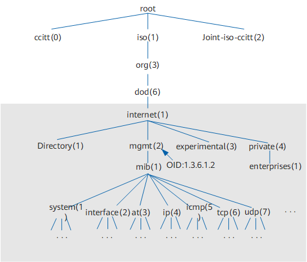

### SNMP版本

SNMP有三种版本：SNMPv1，SNMPv2c和SNMPv3。

- SNMPv1：SNMP的第一个版本，它提供了一种监控和管理计算机网络的系统方法，它**基于团体名认证**，安全性较差，且返回报文的错误码也较少。它在RFC 1155和RFC 1157中定义。
- SNMPv2c：第二个版本SNMPv2c引入了GetBulk和Inform操作，支持更多的标准错误码信息，支持更多的数据类型。它在RFC 1901，RFC 1905和RFC 1906中定义。
- SNMPv3：鉴于SNMPv2c在安全性方面没有得到改善，IETF颁布了SNMPv3版本，提供了基于USM（User Security Module）的**认证加密**和基于VACM（View-based Access Control Model）的访问控制，是迄今为止最安全的版本。SNMPv3在RFC 1905，RFC 1906，RFC 2571，RFC 2572，RFC 2574和RFC 2575中定义。

### SNMP端口

SNMP端口是SNMP通信端点，SNMP消息传输通过UDP进行，通常使用UDP端口号161/162。有时也使用传输层安全性（TLS）或数据报传输层安全性（DTLS）协议.

### SNMP如何工作？

一旦网络中启动SNMP协议，NMS作为整个网络的网管中心，会对设备进行管理。每个被管理设备都包含驻留在设备上的Agent、多个被管对象和MIB，NMS通过与运行在被管理设备上的Agent交互，由Agent通过对设备端的MIB的操作，完成NMS的指令。SNMP的工作原理是将协议数据单元（也称为SNMP GET请求）发送到响应SNMP的网络设备。用户通过网络监控工具可以跟踪所有通信过程，并从SNMP获取数据。

### SNMP Traps

SNMP Traps是指SNMP Agent主动将设备产生的告警或事件上报给NMS，以便网络管理员及时了解设备当前运行的状态。

SNMP Agent上报SNMP Traps有两种方式：Trap和Inform。Trap和Inform的区别在于，SNMP Agent通过Inform向NMS发送告警或事件后，NMS需要回复InformResponse进行确认。

### Trap操作工作原理

Trap不属于NMS对被管理设备的基本操作，它是被管理设备的自发行为。当被管理设备达到告警的触发条件时，会通过SNMP Agent向NMS发送Trap消息，告知设备侧出现的异常情况，便于网络管理人员及时处理。例如被管理设备热启动后，SNMP Agent会向NMS发送warmStart的Trap。

这种Trap信息是受限制的。只有在设备端的模块达到模块预定义的告警触发条件时，SNMP Agent才会向管理进程报告。这种方法的好处是仅在严重事件发生时才发送Trap信息，减少报文交互产生的流量。

### Inform操作工作原理

Inform操作也是被管理设备向NMS主动发送告警。与Trap告警不同的是，被管理设备发送Inform告警后，需要NMS进行接收确认。如果被管理设备没有收到确认信息则：

1. 将告警或事件暂时保存在Inform缓存中。
2. 重复发送该告警或事件，直到NMS确认收到该告警或者发送次数达到最大重传次数。
3. 被管设备上会生成相应的告警或事件日志。

### SNMP的应用

网管可以通过SNMP协议管理设备，如下图所示，管理员要对整个网络的设备进行配置和管理，这些设备分布较为分散，管理员到现场进行设备配置是不现实的。当这些网络设备来自不同的厂商，而每个厂商都提供一套独立的管理接口（比如使用不同的命令行），将使得批量配置网络设备的工作量巨大。因此，在这种情况下，如果采用传统的人工方式，将会带来成本高、效率低的弊端，此时网络管理员可以利用SNMP远程管理和配置其下属设备，并对这些设备进行实时监控。

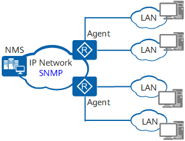

在组网中配置SNMP协议，首先需要在管理端配置SNMP管理程序NMS，同时在被管理设备端配置SNMP的Agent。

通过SNMP协议：

- NMS可以通过Agent在任何时候及时地获得设备的状态信息，实现远端控制被管理设备。
- Agent可以及时地向NMS报告设备的当前状态信息。

## 七、快速上手

1. ### 如深信服AF开启SNMP

    在【导航菜单】页面中的『网络』→『高级网络配置』，右边进入【SNMP】编辑页面：

    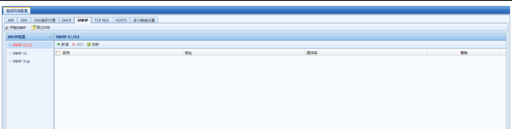勾选[开启 SNMP]，则其他设备和管理软件可以通过 SNMP 读取设备信息。导出 MIB：导出 AF 设备支持的 MIB 库，可导入 SNMP 客户端使用。

    『SNMP V1/V2』用于设置允许其他设备通过 SNMP V1/V2 协议连接设备，并约定连接参数。点击新增，配置如下：

    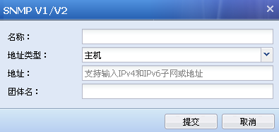

    [名称]：设置该管理主机的名称。

    [地址类型]：设置管理主机的类型，可选值为“主机”和“子网”。当选择“主机” 则设定 SNMP 管理者为一台主机；“子网”设定 SNMP 管理者为一个子网，该子网内的主机都可以通过 SNMP 管理设备。

    [地址]：设置 SNMP 管理者的 IP 地址或地址范围，当管理主机类型为“主机” 时，用于指定 SNMP 管理主机对象的 IP 地址；当管理主机类型为“子网”时，用于指定 SNMP 管理子网对象的子网地址及其掩码。支持配置 IPv6 地址。

    [团体名]：指定 SNMP 管理主机访问设备时的团体名。

    『SNMP V3』用于设置当以 SNMP V3 版本通讯时，需要设置的一些高级扩展选项，配置如下：

    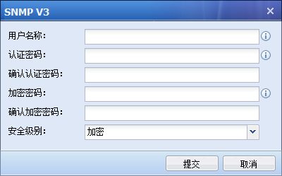

    \[用户名称]：添加该用户的名称。

    [认证密码]和[确认认证密码]：指定 SNMPV3 用户对象进行认证时使用的密码，认证密码必须大于 8 位字符并且不能包含空格，将以 MD5 算法进行加密。 [加密密码]和[确认加密密码]：指定消息加密时使用的密码，认证密码必须大于 8 位字符并且不能包含空格，将以 DES 算法进行加密。

    [安全级别]：设置是否对 SNMP 认证和管理信息进行加密。可选项为：加密、不加密。当设置加密时，同时使用加密和认证技术，先对数据进行加密，然后进行认证技术的消息摘要计算。设置不加密时，只使用认证技术。点击提交完成配置。

    『SNMP Trap』：SNMP Trap 功能用于主动发送 SNMP 信息到管理端，以方便管理员实时监控 AF 的运行状态。\

    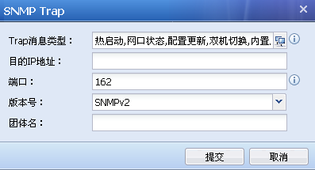

    \[Trap 消息类型]：用于设置 AF 主动发送的消息类型，包括：热启动、网口状态、配置更新、双机切换、内置库更新、链路检测（各消息类型对应的 OID可点击 查看）。

    [目的 IP 地址]：设置发送 SNMP Trap 报文的目标主机地址，即 SNMP 客户端的 IP 地址，支持 ipv4 和 ipv6 地址。

    [端口]：用于目标主机监听的端口号。

    [版本号]：支持选择 SNMP V1、V2、V3 版本。

    [团体名]：指定发送 SNMP Trap 消息的团体名。
2. ### 深信服AD开启SNMP

    SNMP V2

    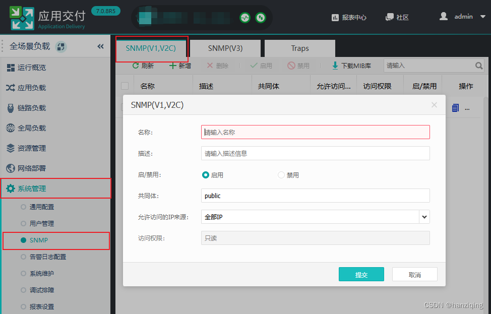​  
    名称：自定义

    共同体：相当于密码，建议设置强一些，一定记好，之后要用

    允许访问的IP来源：建议仅允许zabbix服务器访问

    SNMP V3

    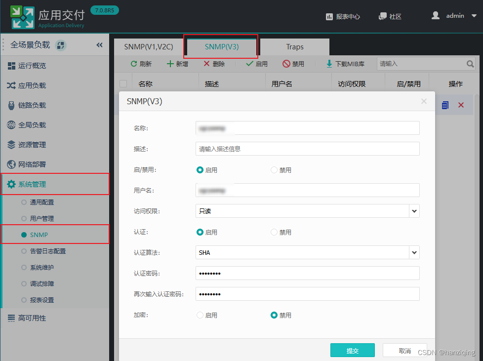​  
    名称：自定义

    用户名：自定义，一定记好，之后要用

    认证：启用，算法选择SHA

    认证密码：自定义，一定记好，之后要用

    加密：禁用（这个版本的AD仅支持DES加密方式，zabbix不支持，所以禁用）
3. ### 天融信防火墙开启SNMP

    登陆系统后，找到SNMP中关于管理主机相关配置。

    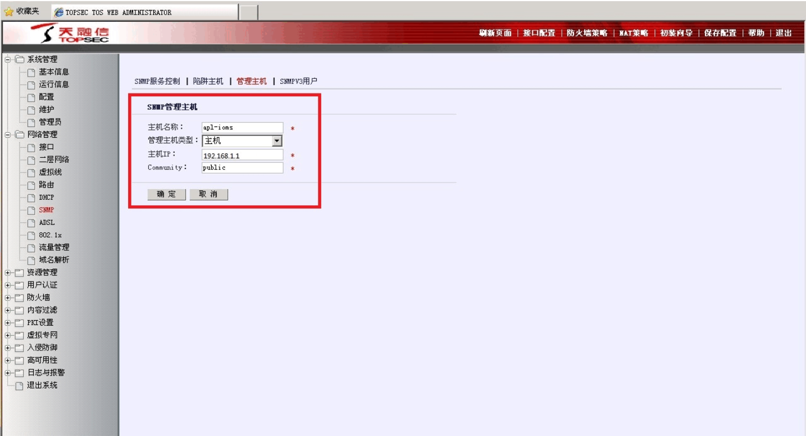
4. ### zabbix添加主机群组

    群组主要为不同类型的主机分类，方便后期管理。

    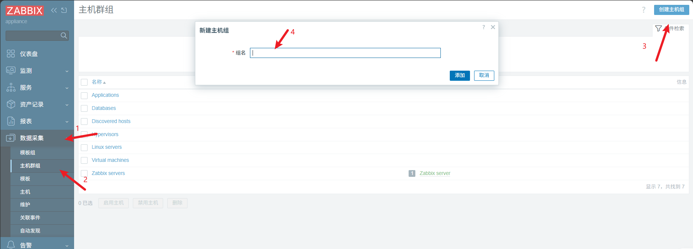
5. ### 监控模板导入

    zabbix自带监控模板，例如大多数主机使用Linux，可以使用`Linux by SNMP`​这个模板，如果要监控一些特殊选项，或者监控项是非标的，显示不出来可以网络上寻找githb或各家厂商写的模板进行导入。一般为YAML、XML、JSON格式。

    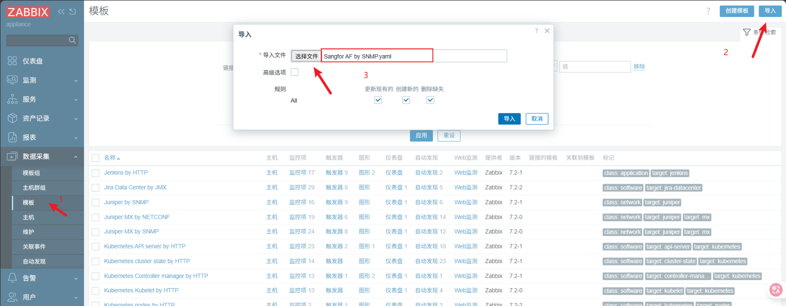
6. ### 添加主机

    如图，添加的主机要和开启SNMP的主机IP对应，选择相关模板和主机群组、协议版本、团体名。注意：此处团体名使用宏变量，该值为默认public，也可以自己设置，要和开启SNMP的主机里的团体名一一对应。

    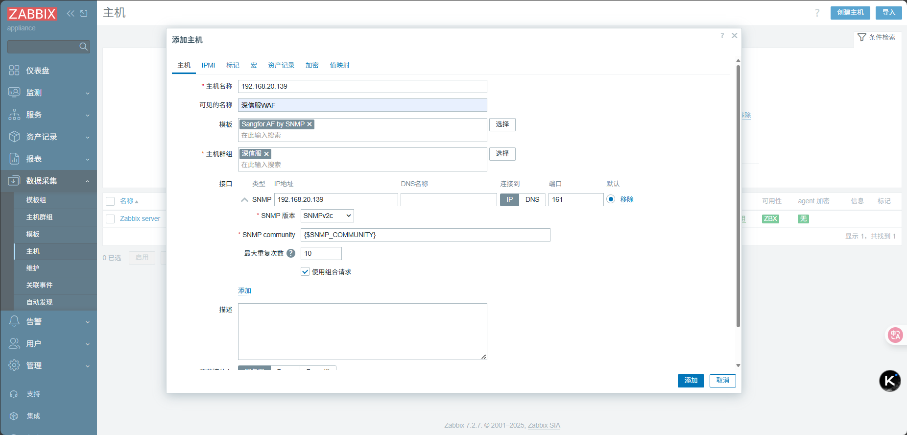
7. 添加完成后主机即可显示，可用性为绿色代表连通，红色代表有问题。

    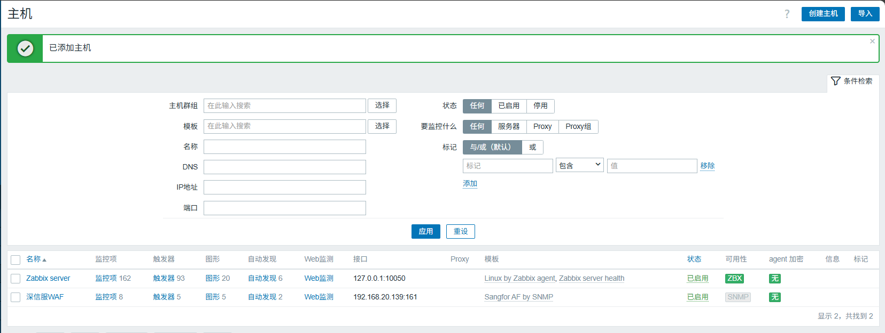
8. 添加完成后即可在仪表盘做配置使其监控相关指标。eg：cup、内存、网络。

    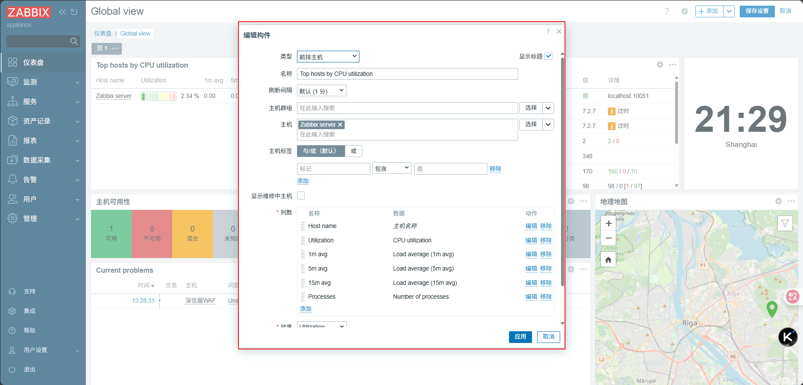

‍
