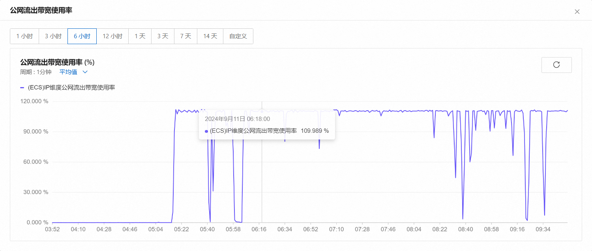
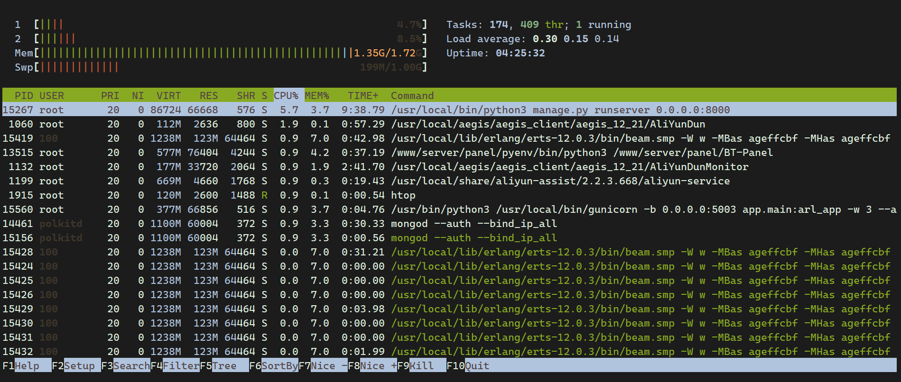

## sqlmap 更新报错

```
ubuntu@ubuntu-cmp:~$ pip install --upgrade sqlmap
error: externally-managed-environment

× This environment is externally managed
╰─> To install Python packages system-wide, try apt install
    python3-xyz, where xyz is the package you are trying to
    install.
  
    If you wish to install a non-Debian-packaged Python package,
    create a virtual environment using python3 -m venv path/to/venv.
    Then use path/to/venv/bin/python and path/to/venv/bin/pip. Make
    sure you have python3-full installed.
  
    If you wish to install a non-Debian packaged Python application,
    it may be easiest to use pipx install xyz, which will manage a
    virtual environment for you. Make sure you have pipx installed.
  
    See /usr/share/doc/python3.12/README.venv for more information.

note: If you believe this is a mistake, please contact your Python installation or OS distribution provider. You can override this, at the risk of breaking your Python installation or OS, by passing --break-system-packages.
hint: See PEP 668 for the detailed specification.

```

这个错误信息表明你当前的 Python 环境是“外部管理的”（externally-managed-environment），这通常是指系统通过包管理器（如 `apt`​）来管理 Python 包。在这种环境下，直接使用 `pip`​ 安装或升级包可能会导致系统问题，因为它会影响系统安装的 Python 包，甚至可能破坏其他依赖。

1. **使用虚拟环境（推荐）**
2. **使用** **​`pipx`​**​ **安装（推荐）**
3. **系统级别安装（不推荐）**

    ```
    sudo pip install --upgrade sqlmap --break-system-packages
    ```

## docker报错-waf不能访问解决方法

​​

sudo vi /etc/docker/daemon.json

```
{
    "dns": ["8.8.8.8", "8.8.4.4"],
    "registry-mirrors": [
        "https://docker.m.daocloud.io/",
        "https://huecker.io/",
        "https://dockerhub.timeweb.cloud",
        "https://noohub.ru/",
        "https://dockerproxy.com",
        "https://docker.mirrors.ustc.edu.cn",
        "https://docker.nju.edu.cn",
        "https://xx4bwyg2.mirror.aliyuncs.com",
        "http://f1361db2.m.daocloud.io",
        "https://registry.docker-cn.com",
        "http://hub-mirror.c.163.com",
         "https://docker.211678.top",
            "https://docker.1panel.live",
            "https://hub.rat.dev",
            "https://docker.m.daocloud.io",
            "https://do.nark.eu.org",
            "https://dockerpull.com",
            "https://dockerproxy.cn",
            "https://docker.awsl9527.cn"
    ],
    "runtimes": {
        "nvidia": {
            "path": "nvidia-container-runtime",
            "runtimeArgs": []
        }
    }
}

```

完了之后 配置重新加载

```
sudo systemctl daemon-reload
```

docker 重新启动

```
sudo systemctl restart docker
```

大功告成！

## 80端口被占用怎么解决？

1. 检查服务器端口情况

    ```php
    netstat -anput | grep 80
    ```

    ​​

    ## netstat命令

    在Linux系统中，`netstat`​命令用于显示网络连接、路由表、接口统计等信息。

    * ​`netstat`​：显示网络连接、路由表、接口统计等信息。
    * ​`-a`​（或`--all`​）：显示所有选项，默认不显示监听端口。
    * ​`-n`​（或`--numeric`​）：以数字形式显示地址和端口号。
    * ​`-p`​（或`--program`​）：显示哪个进程正在使用某个套接字（socket）。注意，这个选项可能需要root权限才能显示所有进程的信息。
    * ​`-u`​（或`--udp`​）：仅显示UDP连接。但在这个上下文中，如果你想要查看监听在80端口的TCP连接（HTTP服务通常使用TCP的80端口），这个选项实际上是不需要的，可能是个误用。
    * ​`-t`​（或`--tcp`​）：仅显示TCP连接。这是查看HTTP服务（监听在80端口）时应该使用的选项。
2. ```php
    lsof -i :80
    ```

    ## lsof命令

    命令全称为list open files，意为列出当前系统打开的文件。在Linux环境下，万物皆文件，通过文件不仅可以访问常规数据，还可以访问网络连接和硬件设备等。系统为每一个打开的文件都分配了一个文件描述符，这个文件描述符为应用程序与基础操作系统之间的交互提供了通用接口。因此，应用程序打开的文件描述符列表提供了大量关于应用程序本身的信息，通过lsof命令可以查看这个列表，对系统监控和排错非常有帮助。

    * ​`-d <描述符>`​：显示指定文件描述符的文件。
    * ​`-u <用户>`​：显示特定用户打开的文件。
    * ​`-c <命令>`​：显示由特定命令打开的文件。
    * ​`-p <PID>`​：显示特定进程打开的文件。
    * ​`-i`​：显示所有网络连接。
    * ​`-n`​：直接显示IP地址，不进行域名解析，以加快处理速度。
    * ​`-l`​：显示登录用户名称而非ID。
    * ​`+D <目录>`​：显示特定目录下打开的文件。
    * ​`-a`​：用于多个条件的租户
3. ```php
    sudo fuser -k 80/tcp   
    ```

    命令 `sudo fuser -k 80/tcp`​ 在。这里，`fuser`​ 命令是用来识别使用特定文件或端口的进程的工具，而 `-k`​ 选项则指定 `fuser`​ 应该发送 SIGKILL 信号给这些进程，强制它们终止。如果你遇到任何问题或该命令在你的系统上不起作用，你可以尝试去掉 `/tcp`​ 部分，只使用 `sudo fuser -k 80`​。

    ‍

## 宝塔Nginx无法启动提示找不到  nginx.pid

首先找到端口号，确保/var/run/nginx.pid存在，若是宝塔， /www/server/nginx/logs/nginx.pid; 也要存在。

​​

1. 首先，可以尝试查找进程 ID。运行以下命令，查找 Nginx 进程的 ID，第一行是 Nginx 的主进程，第二行是 Nginx 的工作进程。主进程的进程 ID 可以用于启动或停止 Nginx。

    ```php
    ps -ef | grep nginx
    ```
2. 如果在第一步中无法找到 Nginx 进程，可以尝试重新启动 Nginx。在启动时，Nginx 会创建一个新的 PID 文件。运行以下命令启动 Nginx：

    ```php
    nginx -c /path/to/nginx.conf
    ```
3. 如果以上方法都无法解决问题，可以尝试手动创建 PID 文件。首先，停止 Nginx 进程。运行以下命令：

    ```php
    nginx -s stop
    ```

4. 手动创建一个空的PID文件，并将其权限设置为Ngix用户可写。运行以下命令：

    ```php
    touch /var/run/nginx.pid
    chown www-data:www-data /var/run/nginx.pid
    chmod 644 /var/run/nginx.pid

    ```
5. 启动
6. ```php
    nginx -c /path/to/nginx.conf
    ```
7. 其他解决方法见网页PDF

## 记一次clash网络出口带宽被占完导致web服务无法访问

出口带宽拉爆

​​

问售后

​​

## top命令

```
top    显示进程信息
top -c   显示完整命令
```

​​

|列名|含义|
| :-------: | ---------------------------------------------------------------------------------------------------------------------------------|
|PID|进程id|
|USER|进程所有者的用户名|
|PR|优先级|
|N|nice值。负值表示高优先级，正值表示低优先级|
|VIRT|进程使用的<span data-type="text" style="color: var(--b3-font-color9);">虚拟内存总量</span>，单位kb。VIRT\=SWAP+RES|
|RES|进程<span data-type="text" style="color: var(--b3-font-color9);">使用</span>的、未被换出的<span data-type="text" style="color: var(--b3-font-color9);">物理内存大小</span>，单位kb。RES\=CODE+DATA|
|SHR|<span data-type="text" style="color: var(--b3-font-color9);">共享内存</span>大小，单位kb|
|S|进程状态。D\=不可中断的睡眠状态|
|%CPU|上次更新到现在的CPU时间占用百分比|
|%MEM|<span data-type="text" style="color: var(--b3-font-color9);">进程使用的物理内存百分比</span>|
|TIME+|进程使用的CPU时间总计，单位1/100秒|
|COMMAND|<span data-type="text" style="color: var(--b3-font-color9);">命令名/命令行</span>|

看atop，磁盘读写异常的高。

## atop命令

atop是一款用于监控Linux系统资源与进程的工具，能够报告所有进程的活动。其以一定的频率记录系统和进程活动，采集的数据包含CPU、内存、磁盘、网络的资源使用情况和进程运行情况，并能以日志文件的方式保存在磁盘中。对于每个进程，会显示CPU使用率、内存增长、磁盘使用率、优先级、用户名、状态和退出码等。

```
yum install atop
atop

打开日志文件后，您可以使用以下命令筛选数据。
g：切换回默认的综合输出视图。
c：显示进程列完整命令行。
m：按照进程内存使用率进行降序筛选。
d：按照进程磁盘使用率进行降序筛选。
a：按照进程资源综合使用率进行降序筛选。
n：按照进程网络使用率进行降序筛选。
t：跳转到下一个监控采集点。
T：跳转到上一个监控采集点。
b：指定时间点，格式为YYYYMMDDhhmm。
```

​​

到此，应该就是clash导致的，并且我设置了开机自启...

```php
iftop -i eth0 -n -P
lsof -i :7890  通过端口找进程
kill -9 2449   杀死进程
fuser -k 80    杀死进程
systemctl disable clash   关闭开机自启
unset  http_proxy  https_proxy  all_proxy  取消系统代理
```

## 快捷键来结束进程

1. <span data-type="text" style="color: var(--b3-font-color9);">Ctrl + C：这是最常用的快捷键</span>，用于<span data-type="text" style="color: var(--b3-font-color9);">终止</span>当前正在运行的前台进程。当你按下Ctrl + C时，系统会发送一个SIGINT信号给当前进程，通常会导致进程终止。
2. Ctrl + \\：这个快捷键同样也可以用来终止前台进程，它发送的是一个SIGQUIT信号。和Ctrl + C不同的是，Ctrl + \\会生成一个进程的核心转储文件（core dump），这个文件可以用于分析进程崩溃的原因。
3. Ctrl + Z：这个快捷键用于将当前运行的前台进程暂停，并放入<span data-type="text" style="color: var(--b3-font-color9);">后台</span>运行。按下Ctrl + Z后，系统会发送一个SIGTSTP信号给当前进程，进程会被挂起（Suspended），并返回一个进程ID（PID）。你可以使用”jobs”命令查看被挂起的进程，并使用”fg”命令重新将进程返回前台运行，或使用”bg”命令将进程转到后台继续运行。
4. Ctrl + D：这个快捷键用于<span data-type="text" style="color: var(--b3-font-color9);">结束当前的终端会话</span>，相当于输入”exit”命令。当你在终端输入Ctrl + D时，系统会发送一个EOF（End-of-File）信号，终端会话会被结束。

## htop命令

​​

## top，atop 和 htop 对比

​`top`​、`atop`​ 和 `htop`​ 都是 Linux 系统上的监控工具，用于查看系统资源和进程活动。以下是它们之间的主要比较：

### 1）top

* ​`top`​ 是一个基本的<span data-type="text" style="color: var(--b3-font-color9);">实时进程监控工具</span>，文本模式显示当前运行的进程列表和系统资源使用情况，包括 CPU、内存、交换空间等。
* ​`top`​ 提供了一些基本的交互式功能，如排序、刷新、查看不同系统资源等。
* <span data-type="text" style="color: var(--b3-font-color9);">界面相对简单</span>，适用于查看当前的系统状态，但对于<span data-type="text" style="color: var(--b3-font-color9);">详细的资源历史数据和分析可能有限。</span>

### 2）atop

* ​`atop`​ 是一个功能强大的性能监控工具，可以记录系统活动和资源<span data-type="text" style="color: var(--b3-font-color9);">使用情况</span>，适用于<span data-type="text" style="color: var(--b3-font-color9);">性能分析</span>。
* 它提供了**丰富的历史数据记录功能**，可以查看过去的资源使用情况和进程活动。
* ​`atop`​ 具有交互式界面，可以以多种视图展示资源使用情况，包括**进程列表、磁盘活动图表等**。  
  适用于深入了解系统资源和性能问题。

### 3）htop

* ​`htop`​ 是一个<span data-type="text" style="color: var(--b3-font-color9);">交互式</span>的<span data-type="text" style="color: var(--b3-font-color9);">实时</span>进程监控工具，<span data-type="text" style="color: var(--b3-font-color11);">提供了更友好的界面和更多的功能</span>。
* 它以彩色显示的方式展示进程列表，包括 **CPU、内存和交换空间使用情况，以及进程树结构**。
* ​`htop`​ 允许通过<span data-type="text" style="color: var(--b3-font-color9);">键盘快捷键进行排序、搜索、终止进程</span>等操作，操作更直观。
* 界面相对于 top 更易于理解，适用于实时监控和进程管理。

总结：

* 如果你只需要查看当前系统资源和进程状态，`top`​ 是最基本的选择。
* 如果你需要更详细的历史资源使用情况和性能分析，以及丰富的交互式界面，`atop`​ 是一个好的选择。
* 如果你想要更友好的实时进程监控界面和操作体验，以及进程管理功能，`htop`​ 是一个很好的替代。

你可以根据自己的需求来选择使用其中之一或多个工具来监控和管理你的 Linux 系统。

## atop 与 htop 命令的基本语法

### 1）atop

> 【基本语法】atop [options]

常用的选项（options）包括：

* ​`-r, --replay=FILENAME`​: 以回放模式运行 atop，并显示指定文件中的记录数据。可以用来查看以前保存的性能数据。
* ​`-a, --pid`​: 显示活动进程的详细信息。
* ​`-d, --delay=SECONDS`​: 指定刷新间隔，以秒为单位，默认值为 10 秒。
* ​`-n, --number=COUNT`​: 指定刷新次数，atop 将会在指定的次数后自动退出。
* ​`-o, --output=FILENAME`​: 将监控数据输出到指定的文件中，而不是显示在终端。
* ​`-b, --bytes`​: 在进程列表中显示字节单位的数据传输量。
* ​`-M, --mfield=FIELDS`​: 自定义输出字段，以逗号分隔。例如，-M PID,COMM,CPU 只显示 PID、命令和 CPU 列。
* ​`-h, --help`​: 显示帮助信息。
* ​`-v, --version`​: 显示版本信息。

示例:

```bash
# 1、实时监控：
atop 

# 2、指定刷新间隔和次数：
atop 2 5

# 3、以回放模式查看之前记录的数据：
atop -r /var/log/atop/atop_20230819
```

### 2）htop

​`htop`​ 命令是一个交互式的系统监控工具，通常不需要在命令行中使用大量参数来配置。大部分操作是在其界面内完成的。然而，我将列出一些常见的 htop 参数以供参考：

> 【基本语法】htop [options]

以下是一些常见的 htop 参数：

* ​`-d SECONDS, --delay=SECONDS`​: 指定刷新间隔，以秒为单位。默认为 1 秒。
* ​`-C, --no-color`​: 禁用彩色显示，以单色文本显示。
* ​`-u USERNAME, --user=USERNAME`​: 仅显示指定用户名的进程。
* ​`-p PID, --pid=PID`​: 仅显示指定 PID 的进程。
* ​`-s KEY, --sort-key=KEY`​: 指定默认的排序键，可以是 cpu、pid、memory 等。
* ​`-t, --tree`​: 显示进程树，以分层树状结构显示进程关系。
* ​`-H, --highlight-threads`​: 高亮显示线程。
* ​`-h, --help`​: 显示帮助信息。
* ​`-v, --version`​: 显示版本信息。

这些选项可以用于在命令行中直接控制 htop 的一些行为，然而，htop 的真正强大之处在于其交互式界面。你可以在交互式界面中使用各种功能键来切换视图、排序进程、过滤进程、查看进程详细信息等。

示例：

```
htop
```

#使用 Arrow Up 和 Arrow Down 键来选择不同的进程。  
#使用 F5 和 F6 键来切换排序方式。  
#使用 F9 键选择并终止进程。  
#使用 F10 键退出 htop。

#按 F1 键查看所有可用的功能键和操作。  
#按 F2 键进入设置界面，可以更改显示选项和排序方式。  
#按 F3 键进行进程搜索。  
#按 F4 键过滤进程显示。
