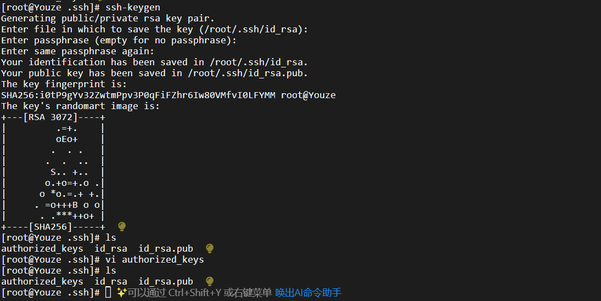
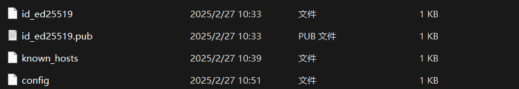
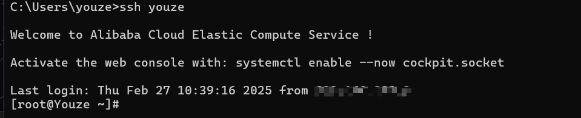

#### 通过ssh连接服务器

客户端操作：

1. 检查用户.ssh下是否有已经生成公私钥
2. 如果没有公私钥则生成，有则跳过

   ```bash
   ssh-keygen
   ```

服务端操作：

1. 删除.ssh下的全部文件（authorized_keys可保留）
2. 生成公私钥

   ```bash
   ssh-keygen    一路回车
   ```
3. 服务端创建authorized_keys文件

   ```bash
   touch authorized_keys
   ```
4. 将客户端公钥添加到 authorized\_keys

客户端即可访问

```bash
ssh root@ip
```



#### 创建ssh config文件实现快速登陆

```bash
Host youze# 登录简称
HostName ip  # 服务器ip
Port 22  # 登录服务器的端口
User root  # 用户名
```





注意：生成密钥建议使用的算法

使用 ssh-keygen -t +算法 ，现在大多数都使用rsa或者dsa算法。

```bash
$ ssh-keygen -t rsa
```

#### 删除主机密钥

使用-R选项，也可以在~/.ssh/known_hosts文件中手动删除

```rust
$ ssh-keygen -R 222.24.51.147
```

‍
