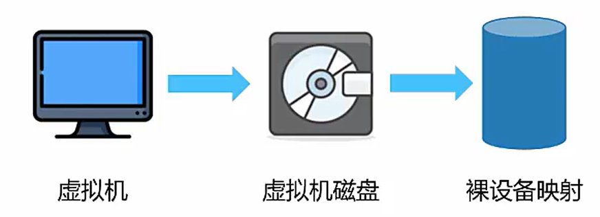

## 什么是云计算？

美国国家标准与技术研究院NIST定义：云计算是一种模型，可以随时随地，便捷地，随需应变地从可配置计算资源共享池中获取所需资源（例如：网络、服务器、存储、应用、服务），资源可以快速供应并释放，使管理资源的工作量和服务提供商的交互减小到最低限度。

|**云计算1.0**|计算虚拟化（Hyper-v、XEN、KVM、Vmare EXS）虚拟化为了提高利用率|以虚拟化为核心|
| :-: | :---------------------------------------------------------------| :---------------|
|**云计算2.0**|**软件定义与整合（Openstatck、Vmware、AWS）基础设施云化、资源服务标准化、自动化**|**以资源为中心**|
|**云计算3.0**|**云原生与重构业务（Docker、CoresOS、Cloud Foundry）应用云化、敏捷应用开发与生命周期管理**|**应用为核心**|

## 云计算特点

* 虚拟化技术
* 动态可扩展
* 按需部署
* 灵活性高
* 可靠性高
* 地理分布
* 先进的安全技术

## 云计算优势

* 按需自助服务
* 广泛网络接入
* 资源池化
* 快速弹性伸缩
* 可计量服务

## 云计算服务类型

1. 基础设施即服务

基础设施即服务IaaS （Infrastrure as a Serverce）服务商出租处理能力、存储空间、网络容量等基本计算资源。

2. 平台即服务

平台即服务PaaS（Platfrom as a Serverce）服务商提供给用户一套可编程、可开发的云环境（针对开发者）

3. 软件即服务

软件即服务SaaS（Software as a Serverce）服务商提供给客户一套在云环境下的工具、应用程序。

​​

一个具体的理解：传统架构相当于自己买厨房、自己买菜自己做饭自己在餐桌吃；IaaS相当于自己租一个厨房，自己买菜自己做饭自己的餐桌上吃；PaaS相当于点外卖在餐桌吃；SaaS相当于去餐馆吃饭，只用付钱就行。

## 云计算部署形式

1. 私有云

私有云利用自己已有的或租用的基础设施资源自己构建的云。云端资源只给单位组织内的用户使用。

优点：根据自己要求构建、安全性高。

缺点：需要IT团队、成本高。

2. 社区/行业云

为特定行业构建的云，云端资源给固定的几个单位内用户使用，而这些单位对云端有相同诉求。

优点：有一套用户体系、方便。

缺点：需要IT团队，成本高。

3. 公有云

构建大型的基础设施的云出租给大众使用。云端资源开放给公众使用。

优点：对用户成本低、服务多。

缺点：安全性不高。

4. 混合云

由两种以上部署形式组成的云。他们各自独立，用标准/专有的技术将他们组合起来。实现云数据之间和应用程序之间平滑流转。

优点：敏捷、灵活、降低成本。

缺点：兼容性问题。

## 云计算应用

1. 存储云

以数据存储和管理为核心的云计算系统。用户将本地的资源上传至云端上，可以在 任何地方连入互联网来获取云上的资源。例：百度云盘

2. 医疗云

在云计算、移动通信、多媒体、大数据、 物联网等技术基础上，结合医疗技术，用 “云计算”来创建医疗健康服务平台，实 现了医疗资源的共享和医疗范围扩大。

3. 教育云

教育云可以将所需要的任何教育硬件资源 虚拟化，然后将其传入互联网中，向教育 机构和学生老师提供一个方便快捷的平台。例：华为在线云课堂

4. 金融云

为银行、保险和基金等金融机构提供互联 网处理和运行服务，同时共享互联网资源 解决现有问题并达到高效、低成本的目标。例：微信支付、支付宝

5. 其他

桌面云、企业云、云安全、开发测试云、游戏云等等

## 关键技术1：虚拟化技术

虚拟化是一种计算机资源管理技术，将各种IT实体资源抽象、转换成另一种形式的技术 都是虚拟化。虚拟化是资源的逻辑表示，其不受物理限制的约束。(一个物理主机只能 运行一个操作系统，虚拟化可以多个操作系统。

## 关键技术2：分布式数据存储技术

将数据存储在不同的物理设备中。这种模式不仅摆脱了硬件设备的限制，同时扩展性更 好，能够快速响应用户需求的变化(整合存储资源提供动态可伸缩资源池的分布式存储技术)。

## 关键技术3：数据中心联网

东西向流量增长并行计算业务(如:搜索)需要服务器集群协同运算，产生大量横向交互 流量虚拟机的自由部署和动态迁移，虚机间需要实时同步大量的数据。

## 关键技术4：并行编程技术

在并行编程模式下，并发处理、容错、数据分布、负载均衡等细节都被抽象到一个函数 库中，通过统一接口，用户大尺度的计算任务被自动并发和分布执行，即将一个任务自 动分成多个子任务，并行地处理海量数据。

​​

## 关键技术5:体系结构

云计算平台体系结构由用户界面、服务目录、管理系统、部署工具、监控和服务器集群

(1)用户界面:主要用于云用户传递信息，是双方互动的界面。

(2)服务目录:顾名思义是提供用户选择的列表。

(3)管理系统:指的是主要对应用价值较高的资源进行管理，

(4)部署工具:能够根据用户请求对资源进行有效地部署与匹配,

(5)监控:主要对云系统上的资源进行管理与控制并制定措施。

(6)服务器集群:服务器集群包括虚拟服务器与物理服务器，隶属管理系统。

## 关键技术6:自动化部署

对云资源进行自动化部署指的是基于脚本调节的基础上实现不同厂商对于设备工具的自 动配置，用以减少人机交互比例、提高应变效率，避免超负荷人工操作等现象的发生 最终推进智能部署进程。

## 云计算服务提供商

* 亚马逊云

亚马逊云服务是全球市场份额最大的云计算厂商，2016年8月1日 “亚马逊云服务 (AWS)结束两年多的内测，在中国展开商用。  
负载均器 Amazon AWS 服务包括:弹性计算云(EC2)、简单存储服务(S3)、 (ELB)、关系型数据库服务(RDS)等，服务类型十分丰富。

* 微软 Azure

微软 Azure(服务包括: Office 365 产品、在线版的 Dynamics 系列企业软件和在线 开发工具...

* 腾讯云

腾讯云成立于2016年，第一个产品QQ其实就是一朵云。云服务有计算与网络 (FPGA云服务器、黑石物理服务器2.0等)、存储和CDN(归档存储 CAS、存储网关 CSG 等)、视频服务(云直播 CSS、视频处理 MPS ...

* 阿里云

阿里云成立于2009年，国内成立最早，国内份额也最高。云服务有计算服务(云服 务器 ECS、轻量应用服务器等)、存储服务(文件存储CPFS、块存储等)、数据库 图数据库、云数据库PolarDB ...

* 百度云

百度云成立于2015年，云服务有计算与网络(云服务器 BCC、GPU服务器等)、存 储和CDN(云磁盘CDS、私有云存储ABCStorage等)、数据库 (云数据库 DRDS、数 据传输服务 DTS)...

* 华为云

华为云成立于2011年，用户以企业为主。云服务有弹性计算(弹性云服务器 ECS 云手机 CPH等)、存储服务(对象存储服务 OBS、云硬盘 EVS等)、网络(虚拟私有 云 VPC、直播加速 LSA)...

## 云计算服务关联技术架构

私有云厂商:Vmware、华为(FC云操作系统)、微软...  
技术架构:开源(Xen、KVM)、Vmware、微软hyper-v、阿里飞天Apsara...  
开源云管理平台:Openstack。

## 云计算与虚拟化的关系

* 云计算是极度依赖虚拟化的。但虚拟化并非云计算
* 云计算也并非虚拟化。虚拟化只是云计算的核心技术，但并非云计算的核心关注点。

云计算:一种服务。  
虚拟化:一种技术基础。

## 虚拟化中的几个概念

Guest Os:运行在虚拟机之上的OS

Guest Machine:虚拟出来的虚拟机

VMM:虚拟机监控器，即虚拟化层 (Virtual Machine Monitor,VMM)

Host Os:运行在物理机之上的OS

Host Machine:物理机

​​

## 虚拟化特点

1. 分区

分区指可在一台服务器上运 行多台虚拟机使一台服务器 运行多个应用程序。

2. 隔离

隔离指分区完后的所有虚拟 机之间相互隔离，每个虚拟 机像单独的物理主机。

3. 封装

整个虚拟机运行条件封装在 独立文件夹中，可通过移动 文件的方式来迁移虚拟机。

4. 相对于硬件独立

即：软硬件解耦。虚拟机运行在虚拟化层之上， 不必考虑物理服务器即可在 任何服务器上运行。

## 虚拟化类型

1. ### 寄居虚拟化

在主机(宿主)操作系统上安装和运行虚拟化程序

​​

特点:

* 简单、易于实现。
* 安装和运行应用程序依赖于主机操作系统对设备的支持。
* 有两层OS，管理开销较大，性能损耗大。
* 虚拟机对各种物理设备(cpu、内存、硬盘等)的调用 都通过虚拟化层和宿主机的OS一起协调才能完成。

Vmvare Workstation和VirtualBox都是基于这种方式实现的,

2. ### 裸金属虚拟化

直接将VMM安装在硬件设备上，VMM在这种模式下又叫做 Hypervisor,虚拟机有指令要执行时,Hypervisor会接管该指令，模拟相应的操作。

​​

特点:

* 不依赖于操作系统。
* 支持多种操作系统，多种应用 依赖虚拟层内核和服务器控制台进行管理。
* 要对虚拟层的内核进行开发。

VMware ESX、Xen、华为 FusionSphere基于这种方式

3. ### 混合虚拟化

在一个现有的正常操作系统下安装一个内核模块，内核拥有虚拟化能力。(相当于寄居与裸金属的混合)

​​

特点:

* 相对于寄居虚拟化架构，性能高。
* 相对于裸金属虚拟化架构，不需要开发内核。
* 可支持多种操作系统。
* 需底层硬件支持虚拟化扩展功能。

Redhat KVM基于这种方式。

## 虚拟化层架构

虚拟化层架构有:全虚拟化、半虚拟化、硬件辅助虚拟化。

1. ### 架构一：全虚拟化

即所抽象的VM具有完全的物理特性，虚拟化层负责捕获CPU指令，为指令 访问硬件充当媒介。

​​

典型的有VMware，Virtualbox，VirtualPC，KVM-x86.

特点:

* OS无需修改。
* 速度和功能都非常不错，使用非常简单。
* 移植性好。

#### KVM

KVM(Kernel-Based Virtual Machines)是一个基于Linux内核的虚拟化技术,可以直接 将Linux内核转换为Hypervisor。从而使得Linux内核能够直接管理虚拟机,直接调用 Linux内核中的内存管理、进程管理子系统来管理虚拟机。

组成:由处于内核态的KVM模块和用户态的QEMU两部分组成:

​​

### 架构二：半虚拟化

起初是为了解决全虚拟化效率不高的困难，**它需要修改OS**，工作效率相对全虚拟化要高很多。**Hypervisor直接安装在物理机上**，多个虚拟机在 Hypervisor 上运行。Hypervisor 实现方式一般是一个特殊定制的 Linux 系统。  

​​

典型的有Xen、VMWare ESXi、微软Hyper-V。

特点:

* 架构更精简。
* 在整体速度上有一定的优势。
* 需要对OS进行修改，在用户体验方面比较麻烦。

#### Xen

Xen直接把操作系统内核改了，把OS改成一个轻量级Hypervisor在里面运行了一个 管理所有资源作资源调度的Domain0。  
组成:由Xen Hypervisor(虚拟化层)、Domin0(管理主机)、DominU(用户虚 拟机)

​​

### 架构三：硬件辅助虚拟化

硬件辅助虚拟化是随着虚拟化技术的应用越来越广泛Intel、AMD等 硬件厂商通过对硬件的改造来支持虚拟化技术。

常用于优化全虚拟化和半虚拟化产品，像VMware Workstation，它虽然属于全虚拟化 但它在6.0版本中引入了硬件辅助虚拟化技术，比如Intel的VT-x和AMD的AMD-V。主 流全虚拟化和半虚拟化产品都支持硬件辅助虚拟化。(VirtualBox，KVM，Xen等)

## KVM架构与Xen架构对比

|KVM|Xen|
| --------------------------| -----------------------------------|
|支持全虚拟化|支持全虚拟化、半虚拟化|
|内置在内核中|需要对内核修改|
|便于版本安装、升级、维护|更新版本，Xen需要重新编译整个内核|
|性能高|隔离性好|
|总结:KVM平台架构侧重性能|总结: Xen平台架构侧重安全性|

## 容器

包装或装载物品的贮存器，利用一个开源的应用容器引擎，让开发者可以打包他 们的应用以及依赖包到一个可移植的镜像中，然后发布到任- Linux或Windows机器上 也可以实现虚拟化。相互之间不会有任何接口，实现APP与操作系统的解耦。

镜像是可执行的独立软件包，包含软件运行的内容:代码，运行时环境，系统工具，系 统库和设置。(容器就是将OS上层的应用进行了隔离)

​​

## 主流容器技术

### Docker

Docker属于Linux容器的一种封装，提供简单易用的容器使用接口，他是目前最 流行的Linux容器解决方案。

### Docker作用

将应用程序与该程序的依赖，打包在一个文件里。运行这个文件，就会生成一个 虚拟容器。程序在这个虚拟容器里运行，就好像在真实的物理机上运行一样。有了 Docker，就不用担心环境问题。

核心:实现应用与运行环境整体打包以及打包格式统一

### Docke组成

* 客户端(Docker Client )  和用户交互
* 守护进程(Docker Daemon) 等待接收客户端消息
* 镜像(Dockerlmage ) 创建docker的容器
* 容器(DockerContainer) 镜像的实例
* 仓库(Docker Registry )存储镜像的库

### 容器特点

容器本质上是一款轻量级虚拟化技术

用户需要高效运行环境，而非整个机器

一次构建、到处运行

部署方便(创建的速度快，秒级)

隔离性好

成本低

## 容器和虚拟化区别

|虚拟化|容器|
| -------------------------------------------------| ---------------------------------------------------------|
|隔离性强，有独立的GUEST OS|共享内核和OS，隔离性弱|
|虚拟化性能差(>15%)|计算/存储无损耗，无GuestOs内存开销|
|虚拟机镜像庞大(几G  -几十G)，且实例化时不能共享|Docker容器镜象 200-300M，且公共基础镜象实例化时可以共享|
|虚拟机镜象缺乏统一标准|Docker提供了容器应用镜象事实标准，0CI推动进一步标准化|
|虚拟机创建慢(>2分钟)|秒级创建(<10s) 相当于建立索引|
|虚拟机启动慢(>30s)读文件逐个加载|秒级(<1s，不含应用本身启动)|
|资源虚拟化粒度低，单机10-100虚拟机|单机支持1000+容器 密度很高，适合大规模的部署|

## 容器的应用场景

1. 提供一次性的环境。比如，本地测试他人的软件、持续集成的时候提供单元测试和构建的环 境。
2. 提供弹性的云服务。因为 Docker 容器可以随开随关，很适合动态扩容和缩容
3. 组建微服务架构。通过多个容器，一台机器可以跑多个服务，因此在本机就可以模拟出微服务架构。

## 虚拟化技术分类

* 计算虚拟化
* 存储虚拟化
* 网络虚拟化

一个虚拟机的完整创建正是通过虚拟化技术这三部分。

### 计算虚拟化

* CPU虚拟化:保障CPU资源的合理调度以及VM上的指令能够正常高效的执行
* 内存虚拟化:保障内存空间的合理分配、管理，隔离，以及高效可靠地使用。
* I/O虚拟化:保障VM的I0隔离与正常高效的执行。

## 常见计算服务架构

想要实现虚拟机的创建与管理，需要与其它组件(镜像、调度、存储、网络等)协同工 作才能完成，并提供完整的计算服务

常见的计算服务架构有:

1. OpenStack Nova

OpenStack是开源的云平台，通过不同的组件提供计算、存储、网络、数据库等多种云 服务。其中计算服务由Nova组件提供，通过nova-API与其他组件通信，通过novacompute对接不同的虚拟层提供计算虚拟化服务。

​​

2. 阿里云ECS

云服务器ECS(Elastic Compute Service)是阿里云提供的基于KVM虚拟化的弹性计 算服务，建立在阿里云飞天(Apsara)分布式操作系统上: 请求的主要调用流程为:OpenAPI、业务层、控制系统、宿主机服务.

​​

3. 腾讯云CVM

云服务器CVM(Cloud Virtual Machine)是腾讯提供的基于KVM虚拟化的弹性计算 服务，建立在腾讯云分布式资源管理调度系统vStation上， 请求的主要调用流程为: APlServer、vStation、服务器集群。

​​

## CPU虚拟化

在物理机(宿主机)中通过线程或进程这种纯软件方式模拟出假的CPU，通过CPU虚拟化 就可以**将一个物理CPU发给不同的虚拟机使用**。  
**虚拟出来的每颗CPU实际上就是一个线程或者进程，**​***<u>因此物理CPU核数要大于虚拟CPU 总核数</u>***​ **。**

### CPU虚拟化的计算

计算公式: 总资源=服务器**CPU个数*****单个CPU核数kernel*****线程**(超线程为2，单线程为1)

例如:某服务器有四个主频为3.0GHZ的CPU，每个CPU四核，超线程。可以虚拟多少VCPU 和总资源?

每个CPU有4核x2线程=8个线程，服务器有四个主频也就是四个CPU，则服务器总共可以虚拟的 VCPU=8x4=32个。

总资源=32 x3.0GHZ=96GHZ。

一般多个虚拟机之间可以复用一个物理CPU，所以单台服务器上的虚拟机可以使用的 VCPU大于总的VCPU数量。

### CPU Qos

CPU QoS(Quality of Service )服务质量，用来控制虚拟机使用CPU资源量的大小。

CPU资源限额: 控制虚拟机占用物理资源使用的上限。  
CPU资源份额:定义了多台虚拟机在竞争物理CPU资源时,需按比例分配计算资源。  
CPU预留资源:定义了多台虚拟机在竞争物理CPU时，每台虚拟机最低分配的计算资源。

例:一个 2.8GHZ 单物理机，三台VM:A、B、C，分得的份额分别是1000、2000 4000，预留分别是700MHZ、0MHZ、0MHZ。思考一下满CPU运行时每台资源?  
 A=700MHZ

B=(2.8GHZ-700MHZ)x1/3=700MHZ

C=(2.8GHZ-700MHZ)x2/3 =1400MHZ

(先看预留-再看份额-最后看限额)

### NUMA

NUMA(Non Uniform Memory Access Architecture)非统一内存访问体系结构，提高 物理服务器性能的一种技术。

将物理服务器的CPU和内存资源分到多个node上，node内的内存访问效率最高 NUMA保证了一个VM上的VCPU尽量分配到同一个node中的物理CPU上，如果一台 VM的VCPU跨node访问内存的话，访问的延时肯定增加。

## 内存虚拟化

内存虚拟化抽象了物理内存，**虚拟机每个进程都被赋予一块连续的、 超大的虚拟内存空间。**   
根据系统结构来定，32 位系统寻址空间为 232，64 位系统为 264.

​​

## 内存虚拟化类型

### 全虚拟化

**为每个VM维护一个影子页表记录虚拟化内存与物理内存的映射关系**,VMM将影子页表提交给CPU的内存管理单元MMU进行地址转换， VM的页表无需改动。

### 半虚拟化

采用页表写入法，为每个VM创建 一个页表并向虚拟化层注册。VM 运行过程中VMM不断管理和维护该页表，确保VM能直接访问到合适的地址。

### 硬件辅助内存虚拟化

EPT/NPT是内存管理单元MMU的 扩展，CPU硬件一个特性，通过 硬件方式实现GuestOs物理内存地址到主机物理内存地址的转换，系统开销更低，性能更高。

## 内存复用技术

内存复用是指在服务器物理内存一定的情况下，通过综合运用内存复用技术对内存进行 分时复用。  
内存复用技术有：

内存气泡:虚拟化层将较空闲VM内存，分配给内存使用较高的虚拟机。内存的回收和分配由 虚拟化层实现，虚拟机上的应用无感知，提高物理内存利用率。  
内存交换:将外部存储虚拟成内存给VM使用，将VM上长时间未访问的数据存放到外部存储 上，建立映射关系。VM再次访问这些数据是通过映射在与内存上的数据进行交换。  
内存共享:VM只对共用的内存(共享数据内容为零的内存页)做只读操作，有写操作时运用 写时复制(VM有写操作时，开辟另一空间，并修改映射)

## 内存复用QoS

 内存资源QoS有 内存预留:VM预留最低的物理内存。

内存份额:适用资源复用场景，按比例分配内存资源。

物理内存6G，部署三台虚拟机。

* 未开启内存复用每台只能分得2G内存:
* 开启了内存虚拟化(这里以物理内存150%)物理内存由6G变为逻辑上的9G(虚拟上的9G) 则每台虚拟机内存为3G.

​​

## I/O虚拟化类型

1. 全虚拟化

通过软件模拟的形式模拟IO设备,不需要硬件支持，对虚拟机的操作系统也不 需要修改(因为模拟的都是一个常见的硬件网卡，如IntelE1000,主流操作系 统一般都自带这些驱动，因此默认情下虚拟机不需要再安装驱动。缺点就是性 能差了

2. 半虚拟化

由Hypervisor提供资源调用接口。VM通过特定的调用接口与Hypervisor通 信，完成获取完整I/O资源控制操作。(需修改内核及驱动程序，存在移植性 和适用性问题，导致其使用受限。)

3. Pass-through

Hypervisor直接把硬件PCI设备分配给 虚拟独占使用，性能当然好啦。但是浪费硬件设备，且配置复杂，首先需要在hypervisor指定通过PClid方式分配给指定的虚拟机，然后虚拟机再识别到设备再安装驱动来使用。

4. **硬件辅助虚拟化**

通过硬件的辅助可以让**虚拟机直接访问物理设备**，而不需要通过 VMM 。最常用的就是 SR-IOV(Single Root l/O Virtualizmion)单根I/O虚拟化标准, 该技术可以直接虚拟出128-512网卡 可以让虚拟机都拿到一块独立的网卡， 直接使用I/O资源。

## I/O环适配功能

I/O分为:

非密集1/0:在一秒钟读的次数很少。  
密集1/0:在一秒钟内完成了多次读，但每次读取的内容是少量的。

I/O环适配功能主要用来提升大块(44K以上) 多队列(32队列深度以上)类型的I0密 集型业务的I/0性能(就是将存储设备资源利用率提高)

用户可通过开启I/O环适配功能，提升I/O性能。

## 集群

集群是一种计算机系统，通过一组计算机或服务器的软硬件连接起来**高度紧密地协作完成计算工作**。在客户端看来为其提供服务的只有一台设备，实际上它是一群设备的集合 只不过这些设备提供的服务一样。  
集群系统中**单个计算机**通常称为**节点**，通过局域网连接，利用多个计算机进行并行计算 获得很高计算速度，也可以用多个计算机做备份提高**可靠性**。

## 虚拟机HA

HA(High Availability)**高可用性**, 一种让服务中断尽可能少的技术，

将多台主机组建成一个故障转移集群，运行在集群上的服务(或VM)**不会因为单台主机的故障而停止**。

提升故障恢复速度，降低业务中断时间、**保障业务连续性**、实现一定的系统自维护。

## 动态资源调度(DRS)

DRS(Dynamic resource scheduling)动态资源调度 根据对资源池资源负载的动态监控，合理触发均匀分配规则，实现资源池中的物理服务器之间**重新分配资源**，达到**负载均衡、消峰填谷**。

当物理服务器上负载过大时，通过DRS将虚拟机<u>迁移到其他负载较轻的物理服务器上</u>。

当虚拟机遇到负载增大时，DRS将为资源池中的物理服务器重新分配虚拟机可使用资源，**在多个虚拟机之间智能地分配可用资源**。

## 分布式电源管理(DPM)

DPM( Distributed power management ) 分布式电源管理，用于业务较轻时，把虚拟机动态“集中”到集群中的少部分主机上，将其他主机待机，节省电力消耗，等业务量较大时，再重新唤醒之前待机的主机。

执行**DPM策略的前提是开启DRS策略**，即集群必须先设置好DRS策略，才能设置DPM 策略。

## 存储类型

现网中的存储设备为存储虚拟化的实现提供了资源基础:

常用的存储类型有

1. 本地磁盘

云计算虚拟化场景下的本地磁盘是指使用**服务器本地的磁盘资源**， 经过**RAID(磁盘阵列)** 化后提供给虚拟化平台进行使用。

优缺点：使用方便；无共享框架；对跨服务器来说没有备份、冗余机制；

2. DAS

**DAS(Direct-Attached Storage)直连式存储:** 一个存储设备与使用存储空间的服务器 直接相连的架构。DAS为服务器提供块级的存储服务。

优缺点： 1、多个磁盘合并成一个逻辑磁盘，满足海量存储的需求； 2、可实现应用数据和操作系统的分离； 3、能提高存取性能；4、实施简单； 5、服务器发生故障，数据不可访问；

3. NAS

NAS(Network Attached Storage)**网络附加存储**:将分布、独立的数据进行整合，集中化管理，以便对**不同主机和应用服务器进行访问**的技术。

NAS将存储设备连接到现有的网络上来提供数据和文件服务。

优缺点：1、支持快照等高级特性； 2、集中存储；3、提供安全集成环境(用户认证和授权)； 4、<u>传输速率低</u>； 5、前期安装和设备成本高；

4. SAN

SAN(Storage Area Networks)**存储区域网络**:是一种高速的、专门用于存储操作的网络，通常独立于计算机局域网。

提供在主机和存储系统之间数据传输，网络<u>内部数据传输的速率快</u>。

常见架构有FC SAN、IP SAN

优缺点： 1、存储容量利用率高； 2、兼容性高； 3、传输距离远； 4、高带宽； 5、主机、存储设备可以独立扩展；6、成本高、复杂；

## 存储虚拟化

 **把多个存储介质(如硬盘、RAID)通过一定的技术将它们集中起来**，组成一个存储池并进行统一管理，从主机和工作站的角度看是一个超大容量(如1T以上)的硬盘。将多 种、多个存储设备统一管理起来，为用户提供大容量、高数据传输性能的存储系统称为存储虚拟化。

## 云计算存储基本概念

### 存储资源

表示实际的物理存储设备，例如DAS(直连存储)、NAS(网络附加存储)、SAN(存储区域 网络)等。

### 存储设备

表示存储资源中的管理单元，例如本地磁盘、LUN(逻辑单元号)、Storage存储池、NAS共 享目录等。

### 数据存储

表示虚拟化平台中可管理的存储逻辑单元，承载了虚拟机业务，创建磁盘。

​​

## 创建虚拟存储流程

1. 在主机软件界面添加存储资源(SAN、DAS等)，对主机的启动进行配置.
2. 主机关联存储资源后，进行扫描存储设备(本地磁盘、LUN等)，将具体的设备扫描到 主机上。
3. 主机在选择存储设备，进行数据存储的添加，并进行虚拟化。
4. 最后对虚拟化好的数据存储进行创建卷等操作。

​​

## 存储模式分类

在存储虚拟化中，以是否使用虚拟化技术将存储模式分为:

### 1.非虚拟化存储

就是把磁盘进行分区，分割成不同的逻辑卷，每一个逻辑卷可以给到 传统的存储模式， 虚拟机进行使用。

​​

特点:

性能好(不再有中间的虚拟化层，VM读写直接在磁盘上)、速度快、效率高。  
支持的存储功能少(不支持快照、精简配置等)

### 2.虚拟化存储

将不同的存储设备、 磁盘进行格式化，格式化的目的是**屏蔽底层存储设备的能力、接口、协议等差异性**，将各种存储资源转化为统一管理的数据存储资源。

​​

特点：

支持多种存储功能 (快照、精简磁盘、磁盘扩容、存储热迁移等)

性能不高(没有非虚拟化存储好)

### 3.裸设备映射

虚拟化层不再对其进行任何干预(卷都不需要创建) 将磁盘直接给到虚拟机使用，让虚拟机直接处理调用存储的命令(直接访问磁盘)中间

​​

特点:

速度快(三种模式中最快)、性能好。

支持的存储功能少(不支持快照、精简配置等)，仅支持部分操作系统的虚拟机使用、数据存 储只能整块当做裸设备映射的磁盘使用，**不可分割**。

## 存储虚拟化方法

存储虚拟化可以展现给用户一个灵活的、逻辑的数据存储空间。

实现存储虚拟化的方法有：

### 1.基于主机的存储虚拟化

若仅是**单个主机服务器(或单个集群)访问多个磁盘阵列**，可采用基于主机的存储虚拟化。虚拟化的工作通过特定的软件在主机服务器上完成，经过虚拟化的存储空间可以跨越多个异构的磁盘阵列。

优点是稳定性，以及对异构存储系统的开放性。

**软件运行于主机上。**

从与主机连接的存储上创建虚拟卷。

### 2.基于存储设备的虚拟化

若**多个主机服务器需要访问同一个磁盘阵列时**，可采用基于存储设备虚拟化。

虚拟化的工作在阵列控制器上完成，将一个阵列上的存储容量划分多个存储空间(LUN) 供不同的主机系统访问。主要用在同一存储设备内部，进行数据保护和数据迁移。

优点是与主机无关，**不占用主机资源** 数据管理功能丰富。

<u>软件运行于存储设备中专门的嵌入式系统上。</u>

从与SAN连接的存储上创建虚拟卷。

### 3.基于网络的存储虚拟化

通过在存储区域网(SAN)中添加虚拟化引擎实现的，主要用于异构存储系统的整合和统一数据管理。

优点是与主机无关，不占用主机资源；支持异构主机、异构存储设备；能使不同存储设备的数 据管理功能统一，统一管理平台，可扩展性好。

**软件运行于存储网络中的磁盘阵列上。**

从与磁盘阵列连接的存储上创建虚拟卷。

## 存储虚拟化功能

 存储虚拟化可以提高硬件资源的使用效率，简化系统管理的复杂度，增强云存储平台的 可靠性。

主要通过以下功能来实现:

* ### 精简磁盘和空间回收

精简磁盘和空间回收用于提高存储资源的使用效率、减小虚拟机未使用空间在主机上占用率过大的问题。

​​

特点:

用户用多少分配多少空间(自动分配)。

空间回收可以将用户删除的数据空间释放到数据存储。

* ### 快照和快照链

指定数据集合的一个完全可用拷贝，该拷贝包括相应数据在某个时间点(拷贝开始的时 间点)的映像。

快照可以是其所表示的数据的一个副本，也可以是数据的一个复制品。

快照的作用主要是能够进行在线数据备份与恢复。

特性:

记录了虚拟机在某一时间点的内容和状态。

恢复虚拟机快照可以使虚拟机多次快速恢复到某一时间点。

快照包含磁盘内容、虚拟机配置信息、内存数据。

多次快照之间保存差量数据，节约存储空间。

快照方式：

创建快照时会生成一个新的差分卷，虚拟机会挂载这个差分卷作为磁盘文件。

1. **ROW 写时重定向**

2. **COW 写时拷贝**
3. WA 随机写

​​

快照链：

对虚拟机进行多次的快照操作，这些多次的快照操作形成快照链。

拟机卷始终挂载在快照链的最末端。

​​

* ### 链接克隆

将源卷和差分卷组合映射为一个链接克隆卷，给虚拟机使用。**一个链接克隆需要和原始虚拟机共享同一虚拟磁盘文件**。

采用共享磁盘文件缩短了创建克隆虚拟机的时间，还节省了物理磁盘空间。

通过链接克隆，可以轻松的为不同的任务创建一个独立的虚拟机。

​​

* ### 虚拟磁盘文件迁移

将虚拟机的磁盘从一个数据存储迁移到另一个数据存储。可以将虚拟机的所有磁盘整体 迁移，也可以单个磁盘分别迁移

虚拟机的快照可以一起迁移，虚拟机开启或者关闭时都可以迁移。

​​

## 网络虚拟化

虚拟化是对所有IT资源的虚拟化，提高物理硬件的灵活性及利用效率。云计算中的计算和存储资源分别由计算虚拟化和存储虚拟化提供，而网络作为IT的重要资源也有相应的虚拟化技术，网络资源由网络虚拟化提供。

网络是由各种设备组成，有传统的物理网络，还有运行在服务器上看不到的虚拟网络。

* 将物理网络虚拟出多个相互隔离的虚拟网络，从而使得不同用户之间使用独立的网络资源，从而提高网络资源利用率，实现弹性的网络。
* VLAN就是一种网络虚拟化，在原有网络基础上通过VLAN Tag划分出多个广播域。
* 网络虚拟化保障我们创建出来的虚拟机可以正常通信、访问网络。

## 为什么要网络虚拟化

传统数据中心无法满足部署多台虚拟机，网络架构固定。

云计算数据中心满足部署多台虚拟机，网络架构会随虚拟机的迁移改变，满足虚拟机的迁移。

​​

## 网络虚拟化的目的

节省物理主机的网卡设备资源，并且可以提供应用的虚拟网络所需的**L2-L7层网络服务**。

**网络虚拟化软件**提供逻辑上的交换机和路由器(L2-L3),逻辑负载均衡器，逻辑防火墙 (L4-L7)等，且可以以任何形式进行组装，从而为虚拟机提供一个完整的**L2-L7层的虚拟网络拓扑**。

## 物理网络包含的设备

路由器：工作在网络层，连接两个不同的网络。

二层交换机：工作在数据链路层，转发数据。

三层交换机：工作在网络层，结合了部分路由和交换机的功能。

服务器网卡：提供通信服务。

## 网络虚拟化的特点

### 与物理层解耦

接管所有的网络服务、特性和应用的虚拟网络必要的配置，简化这些服务、配置将它们映射给虚拟化层，使用服务的应用只需要和虚拟化网络层打交道。

### 网络服务抽象化

虚拟网络层可以提供逻辑接口、逻辑交换机和路由器等，并确保这些网络设备和服务的监控、QoS和安全。可以和任意安全策略自由组合成任意拓扑的虚拟网络。

### 网络按需自动化

通过API**自动化部署**，一个完整的、功能丰富的虚拟网络可以**自由部署在底层物理设施上**。通过网络虚拟化，每个应用的虚拟网络和安全拓扑拥有移动性。

### 多租户网络安全隔离

计算虚拟化使多种业务或**不同租户资源共享同一个数据中心资源**，但其同时需要为多租户提供安全隔离网络。

## 网卡虚拟化

### 软件网卡虚拟化

主要通过软件控制各个虚拟机共享同一块物理网卡实现。软件虚拟出来的网卡可以有单独的MAC地 址、IP 地址。

所有虚拟机的虚拟网卡通过虚拟交换机以及物理网卡连接至物理交换机。虚拟交换机负责将虚拟机 上的数据报文从物理网口转发出去。

​​

### 硬件网卡虚拟化

主要用到的技术是单根I/O 虚拟化(Single Root l/O Virtulization，SR-IOV),就是I/0直通技术 通过硬件的辅助可以让虚拟机直接访问物理设备，而不需要通过 VMM。该技术可以直接虚拟出128-512网卡，可以**让虚拟机都拿到一块独立的网卡**，**直接使用I/O资源**。SR-IOV 能够让网络传输绕过软件模拟层，直接分配到虚拟机，这样就降低了软件模拟层中的I/O开销。

## 虚拟化软件交换机

OVS(Open vSwitch)**开放虚拟化软件交换机**，是一款基于软件实现的开源虚拟以太网交换机，使用开源Apache2.0许可协议，主要用于虚拟机VM环境。

与众多开源的虚拟化平台相整合(支持Xen、KVM及VirtualBox多种虚拟化技术)，主要有两个作用:

* 传递虚拟机之间的流量。
* 实现虚拟机和外界网络的通信。

​​

虚拟化中的网络架构

虚拟化中的网络架构通常使用虚拟交换机来连接虚拟机与物理交换机，实现虚拟机之间 的通信。

​​

## 虚拟化中的关键网络资源

虚拟化中的关键网络资源大致可以分为:

* 物理资源：物理服务器(提供物理网卡)、物理交换机(提供物理网络)
* 虚拟资源：虚拟机(提供虚拟网卡)、虚拟交换机(提供虚拟交换端口(组)和上行链路)

虚拟交换机在虚拟化网络中起到承上启下的作用。

## 虚拟化中数据的转发路径

* 相同端口组不同服务器内的虚拟机通讯需要经过物理网络。
* 相同端口组相同服务器内的虚拟机通讯不需要经过物理网络。
* 不同端口组相同服务器的 虚拟机通讯需要经过物理 网络。

​​

## 虚链路聚合

VPC(Virtual Port Channel) 虚链路聚合 ，是最常见的二层虚拟化技术。  
链路聚合将**多个物理端口捆绑在一起，虚拟成为一个逻辑端口**。但传统链路聚合不能跨设备，VPC很好解决了这个问题，既可以跨设备，又可以增加链路带宽、实现链路层的**高可用性**。

​​

## 链路虚拟化:隧道协议

隧道协议(Tunneling Protocol)：指通过隧道协议使多个不同协议的网络实现互联。

使用隧道传递的数据可以是**不同协议的数据帧或包**。隧道可以将数据流强制送到特定的地址，并隐藏中间节点的网络地址，还可根据需要，提供对数据加密的功能。

典型的隧道的协议:

* GRE(Generic Routing Encapsulation)通用路由封装
* IPsec(Internet Protocol Security)Internet 协议安全

​​

## 虚拟网络

虚拟网络 (Virtual Network):是由虚拟链路组成的网络。

虚拟网络节点之间的连接并不使用物理线缆连接，而是依靠特定的虚拟化链路相连。  
典型的虚拟网络包括:

* 层叠网络(虚拟二层延伸网络)
* VPN 网络。

## 层叠网络

层叠网络(Overlay Network)：**在现有网络的基础上搭建另外一种网络**。

层叠网络允许对没有IP 地址标识的目的主机路由信息。

层叠网络可以充分利用现有资源，在不增加成本的前提下，提供更多的服务。

(比如 ADSL Internet 接入线路就是基于已经存在的PSTN 网络实现)

## VXLAN

VXLAN(Virtual eXtensible Local Area Network)**虚拟扩展局域网；** 很好地解决 现有VLAN技术无法满足大二层网络需求的问题。

VXLAN技术是一种大 层的虚拟网络技术原理是引入一个UDP格式的外层隧道作为数据链路层，而原有数据报文内容作为隧道净荷加以传输。

​​

## 虚拟专用网

VPN(Virtual Private Network)**虚拟专用网**:是一种常用于连接中、大型企业或团体 与团体间的私人网络的通信方法，

通过公用的网络架构(比如互联网)来传送内联网的信息。

利用已加密的隧道协议来达到**保密、终端认证**、**信息准确性**等安全效果。这种技术可以 在不安全的网络上传送**可靠的、安全**的信息。

​​

‍
