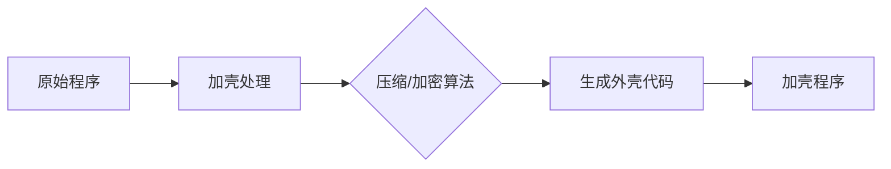
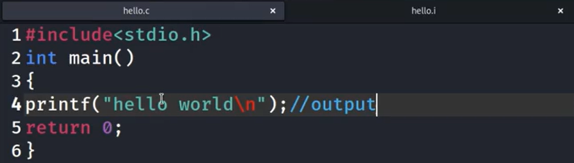
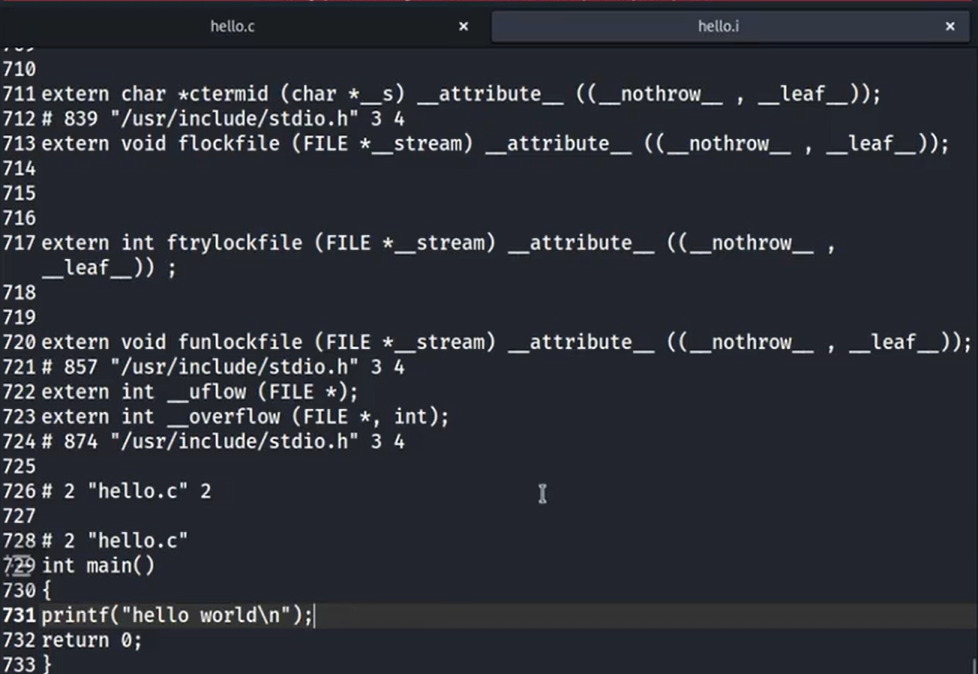
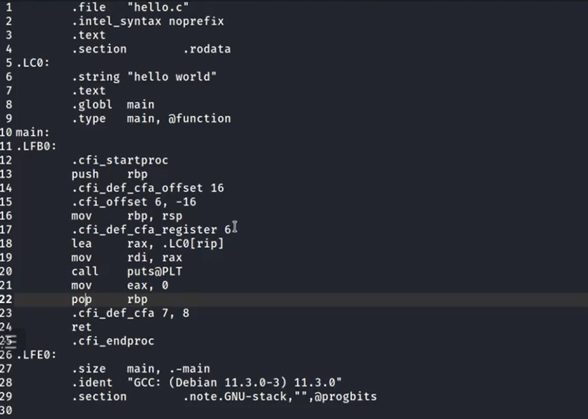
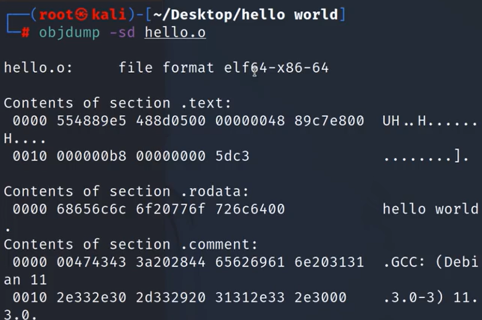
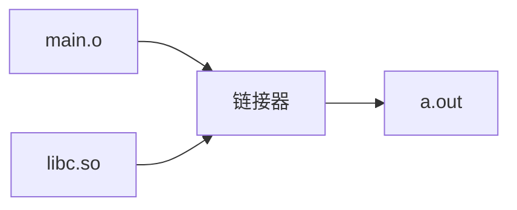
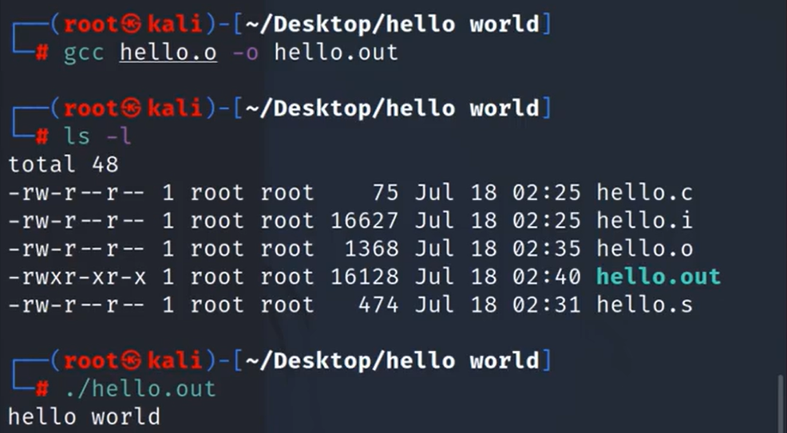
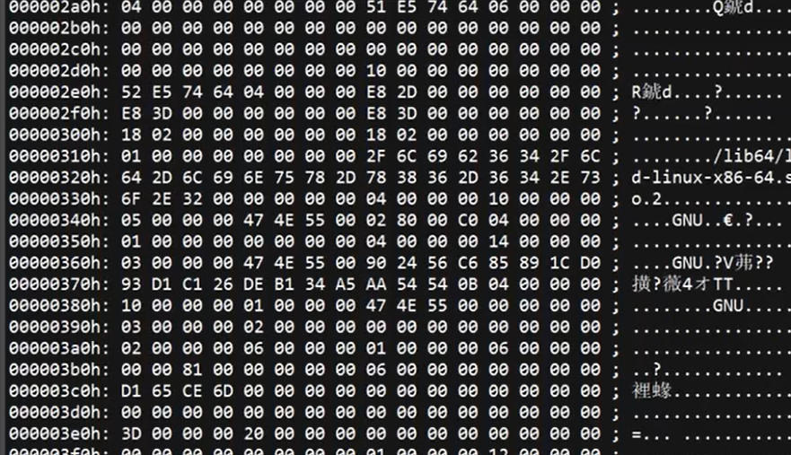

# 逆向工程

## 一、逆向工程定义

逆向工程（Software Reverse Engineering），又称软件反向工程，从可运行的程序系统出发，运用解密、反汇编、系统分析、程序算法理解等多种计算机技术，对软件的结构、流程、代码等进行逆向拆解和分析，推导软件产品的源代码、设计原理、结构、算法、处理过程、运行方法及相关文档等。

## 二、CTF竞赛中的逆向

- 涉及Windows、Linux、Android平台的多种编程技术。
- 要求利用常用工具对源代码及二进制文件进行逆向分析。
- 掌握Android移动应用APK文件的逆向分析，掌握加解密、内核编程、算法反调试和代码混淆技术。

## 三、逆向工程的用途

1. 逆向分析已编译软件，用高级语言重现。
2. 分析病毒，提取特征码，开发杀毒程序。
3. 高级代码审计，在汇编层面调试审计程序。
4. 用于游戏外挂、反外挂及破解软件。
5. 分析挖掘嵌入式设备中的漏洞。

## 四、静态分析技术

### 定义

在不执行计算机程序的条件下，对源代码进行分析，找出代码缺陷。一般利用静态程序分析工具将二进制的可执行文件翻译成汇编代码或C语言伪代码，通过对代码的分析来破解软件。

### 优点

1. 直接面向源码，可分析多种问题。
2. 能检测所有代码级别可执行路径组合，快速且准确。
3. 无需执行程序，不会被恶意代码攻击。

## 五、动态调试技术

### 定义

与静态分析技术相对，破解者利用调试器跟踪软件的运行，寻求破解路径。通过观察程序运行过程中的状态（如寄存器内容、函数输入输出、内存使用情况等），分析函数功能，明确代码逻辑，挖掘可能存在的漏洞，特别关注代码流和数据流。

### 优点

1. 更好地判断程序执行流程。
2. 可跟踪数据流走向，如用户名口令、验证码等在程序执行中的流向。
3. 程序装载到内存后，能够分析内存地址信息。
4. 便于理解和修改程序，可更改标志位的值，修改程序走向。

​​

# 程序壳

### 一. 定义与本质

程序壳（Software Packer）指包裹在原始程序外层的保护性代码层，其核心功能包括：

- 代码保护：防止反编译、逆向分析和非法修改
- 运行控：程序加载时率先获得执行权（控制权劫持）
- 内存管理 ：负责在内存中解密/解压原始程序

### 二. 加壳原理



- **技术本质**：通过算法变换（压缩/加密/混淆）重构可执行文件
- **内存加载**：运行时在内存中动态还原原始程序（对用户透明）
- **保护特性**：加壳后程序可运行但无法直接查看源码

## 三、壳的分类与技术对比

|类型|代表工具|核心技术|主要目的|典型特征|
| ------| --------------------| -----------------------------------| -----------------| ------------------------|
|**压缩壳**|UPX, ASPack|LZMA/APLIB压缩算法|减小文件体积|高压缩率，易脱壳|
|**加密壳**|VMProtect, Themida|反调试+代码虚拟化+多态变形|防止逆向分析|强保护性，脱壳难度极高|
|**保护壳**|Armadillo, SE|授权校验+代码签名+自修改代码(SMC)|软件授权+防篡改|商业软件常用|

1. **加密壳核心技术**：

    - **反调试技术**：检测调试器存在（如`IsDebuggerPresent`​ API拦截）
    - **代码虚拟化**：将x86指令转换为自定义字节码（VM虚拟机保护）
    - **多态引擎**：每次加壳生成不同二进制结构（相同功能）
    - **IAT加密**：隐藏导入函数表（Import Address Table）
2. **进阶保护形态**：

    - **多层嵌套壳**：多重加壳（如压缩壳+加密壳组合）
    - **动态壳**：运行时下载解密密钥（需网络验证）
    - **虚拟机保护壳**：将关键代码转换为虚拟机指令（如VMProtect）

# 编译原理

## 一、编译全过程总览


## 二、核心步骤

### 1. 预处理（Preprocessing）

**核心任务**：

- 处理`#include`​指令：将头文件内容包含到源文件。
- 宏替换：展开`#define`​定义的宏
- 条件编译：处理`#ifdef/#endif`​等指令。条件编译指令将决定哪 些代码被编译，而哪些不被编译的。可以根据表达式的值或者某个特定的宏是否被定义来确定编译条件。
- 删除注释

**操作原理**：

​

```c
// 原始代码 
#define PI 3.14
#include "math.h"
int main() { 
    return PI * 2; // 计算直径 
}
 
// 预处理后 
/* math.h 内容插入 */
int main() {
    return 3.14 * 2;
}
```

**输出**：`.i`​文件（C）或`.ii`​文件（C++）

​

### 2. 编译（Compilation）

**核心任务**：

- **词法分析**：将字符流转换为词法单元（Token）序列  
  \*输入：`position = initial + rate * 60`​  
  \*输出：`[id,1] [=] [id,2] [+] [id,3] [*] [60]`​
- **语法分析**：构建抽象语法树（AST）

  ```mermaid
  graph TD 
    A[=] --> B[position]
    A --> C[ ＋ ]
    C --> D[initial]
    C --> E[ × ]
    E --> F[rate]
    E --> G[60]
  ```
- **语义分析**：类型检查、作用域验证  
  *例：检测*​*​`int + string`​*​*类型错误*
- **中间代码生成**：生成三地址码或字节码  
  ​`t1 = rate * 60; t2 = initial + t1; position = t2`​

**操作原理**：  
基于上下文无关文法（2型文法）进行推导，使用LL/LR算法解析语法结构

​

### 3. 汇编（Assembly）

**核心任务**：

- 将中间代码转换为目标机器指令
- 生成符号表（Symbol Table）记录变量/函数地址
- 生成重定位信息

**操作原理**：

```assembly
; x86示例
mov eax, [rate]   ; 加载rate值 
imul eax, 60      ; 乘以60
add eax, [initial] ; 加initial
mov [position], eax ; 存储结果
```

**输出**：`.o`​目标文件（ELF/Mach-O格式）

​

### 4. 链接（Linking）

**核心任务**：

- **符号解析**：匹配函数/变量引用与定义
- **重定位**：修正指令中的内存地址
- **库整合**：链接静态库（`.a`​）或动态库（`.so`​/`.dll`​）

**操作原理**：



*动态链接示例*：`printf`​函数在运行时从`libc.so.6`​ 加载

​

​

# 寄存器概述

寄存器是CPU内部的高速存储单元，访问速度比内存快得多，单位空间的价格也比内存高很多（内存又比硬盘贵）。

## 常用寄存器分类

常用的寄存器分为4类，分别是8个通用寄存器、6个段寄存器、1个标志寄存器和1个指令指针寄存器。

## 1. 数据寄存器

- **组成**：包括EAX、EBX、ECX、EDX。
- **特点**：主要用于各种运算和数据的传送，每个数据寄存器都可以作为一个32位、16位或8位来使用。

  - 以EAX寄存器为例：它可以存储32位的数据，其低16位表示为AX，可存储16位的数据；AX又可分为AH和AL两个8位的寄存器，AH对应AX的高8位，AL对应AX的低8位。
  - ```bash
    +----------------+----------------+----------------+----------------+
    | 位31 ~ 位16     | 位15 ~ 位0     | 位7 ~ 位0      | 位15 ~ 位8      |
    +----------------+----------------+----------------+----------------+
    | 未命名（高16位）  | AX（低16位）    | AL（低8位）    | AH（高8位）      |
    +----------------+----------------+----------------+----------------+

    MOV EAX, 0x12345678  ; EAX = 0x12345678（32位）
    MOV AX, 0x5678       ; EAX = 0x12345678（仅修改低16位）
    MOV AL, 0x78         ; EAX = 0x12345778（仅修改低8位）
    ```
- **用途**：

  - EAX：称为累加器，常用于很多算术运算。
  - EBX：基地址寄存器，在内存寻址时存放基地址。
  - ECX：计数器，用于保存循环的索引（即循环次数）。
  - EDX：用于存放整数除法产生的余数。

**说明**：以上为每个数据寄存器的默认作用，但编写汇编代码时并非必须按上述用途使用。

## 2. 指针、变址寄存器

- **组成**：包括EBP、ESP、ESI、EDI。
- **特点**：可以按照32位或16位进行使用，但无法分割为8位来使用。例如ESI寄存器，能存储32位的指针，其低16位表示为SI，可存储16位的指针，但不能像AX那样拆分成高8位和低8位。
- **用途**：

  - EBP：堆栈基址指针寄存器，用于访问堆栈中的数据。
  - ESP：专门用作堆栈指针，被形象地称为栈顶指针，配合EBP来访问栈顶数据。
  - ESI：源指针寄存器，用于内存数据的传送，DS:ESI指向源串。
  - EDI：目的指针寄存器，用于内存数据的传送，DS:EDI指向目的串。

## 3. 段寄存器

- **作用**：用于存放段的基地址，段是一块预分配的内存区域。有些段存放程序的指令，有些存放程序的变量，还有堆栈段存放函数变量和函数参数等。
- **发展**：在16位CPU中，段寄存器只有4个，分别是CS（代码段）、DS（数据段）、SS（堆栈段）和ES（附加段）。在32位CPU中，段寄存器从4个扩展为6个，分别是CS、DS、SS、ES、FS和GS，其中FS和GS属于附加的段寄存器。

## 4. 指令指针寄存器EIP

- **不同CPU中的名称**：在16位CPU中称为IP，在32位CPU中称为EIP。
- **功能**：保存着下一条要执行的指令的地址（CS:EIP）。

  - 顺序执行汇编代码时，下一条指令的地址为当前指令的地址加当前指令的长度，即EIP \= EIP + 指令长度。
  - 遇到JMP、JE、LOOP等跳转指令时，会指定EIP的值为跳转目的地，导致CPU执行指令产生跳跃性执行，从而构成分支与循环的程序结构。

## 5. 标志寄存器

- **不同CPU中的名称**：在16位CPU中，标志寄存器称为FLAGS；在32位CPU中，扩展为32位，称为EFLAGS。
- **常见标志位及其含义**：

  - **OF（溢出标志）** ：运算结果溢出时为1，否则为0。
  - **DF（方向标志）** ：在串处理指令中用于控制方向。
  - **IF（中断允许标志）** ：控制是否允许响应外部可屏蔽中断。
  - **SF（符号标志）** ：运算结果为负时为1，否则为0。
  - **ZF（零标志）** ：运算结果为0时为1，否则为0。
  - **AF（辅助进位标志）** ：运算时第3位（半字节）产生进位时为1，否则为0。
  - **PF（奇偶标志）** ：运算结果中1的个数为偶数时为1，否则为0。
  - **CF（进位标志）** ：产生进位时为1，否则为0。

# 寄存器快速记忆表

### **一、通用寄存器（32位）**

|寄存器|字母含义解析|功能说明|
| --------| ------------------------------------------------------| ---------------------------------------|
|**EAX**|**E**（Extended）扩展，**A**（Accumulator）累加器|算术运算核心寄存器，支持32/16/8位操作|
|**EBX**|**E**（Extended）扩展，**B**（Base）基址|存储内存基址或数据|
|**ECX**|**E**（Extended）扩展，**C**（Counter）计数器|循环计数、移位操作|
|**EDX**|**E**（Extended）扩展，**D**（Data）数据|I/O端口操作、除法余数|
|**EBP**|**E**（Extended）扩展，**B**（Base）基址，**P**（Pointer）指针|堆栈基址，访问函数参数和局部变量|
|**ESP**|**E**（Extended）扩展，**S**（Stack）堆栈，**P**（Pointer）指针|栈顶指针，控制堆栈进出|
|**ESI**|**E**（Extended）扩展，**S**（Source）源，**I**（Index）索引|串操作源地址指针|
|**EDI**|**E**（Extended）扩展，**D**（Destination）目的，**I**（Index）索引|串操作目的地址指针|

### **二、段寄存器（16/32位）**

|寄存器|字母含义解析|功能说明|
| --------| -------------------------------| -----------------------------|
|**CS**|**C**（Code）代码，**S**（Segment）段|指向代码段起始地址|
|**DS**|**D**（Data）数据，**S**（Segment）段|指向数据段起始地址|
|**SS**|**S**（Stack）堆栈，**S**（Segment）段|指向堆栈段起始地址|
|**ES**|**E**（Extra）附加，**S**（Segment）段|附加段，用于数据暂存|
|**FS**|**F**（Flat）平坦，**S**（Segment）段|扁平内存模型的附加段|
|**GS**|**G**（Global）全局，**S**（Segment）段|全局数据段，多线程中用于TLS|

### **三、指令指针寄存器**

|寄存器|字母含义解析|功能说明|
| --------| --------------------------------------------------------| --------------------------------|
|**EIP**|**E**（Extended）扩展，**I**（Instruction）指令，**P**（Pointer）指针|存储下一条指令的地址（CS:EIP）|

### **四、标志寄存器（EFLAGS）**

|标志位|字母含义解析|功能说明|
| --------| ------------------------------------------------| -----------------------------|
|**CF**|**C**（Carry）进位，**F**（Flag）标志|无符号数溢出或借位|
|**PF**|**P**（Parity）奇偶，**F**（Flag）标志|低8位1的个数为偶数时置1|
|**AF**|**A**（Auxiliary）辅助，**C**（Carry）进位，**F**（Flag）标志|第3位（半字节）进位|
|**ZF**|**Z**（Zero）零，**F**（Flag）标志|运算结果为0时置1|
|**SF**|**S**（Sign）符号，**F**（Flag）标志|运算结果为负数时置1|
|**OF**|**O**（Overflow）溢出，**F**（Flag）标志|有符号数溢出时置1|
|**DF**|**D**（Direction）方向，**F**（Flag）标志|控制串操作方向（增/减指针）|

### **记忆技巧**

1. **通用寄存器**：

    - **E**（Extended）表示32位扩展，后缀如AX、BX等继承自16位寄存器命名
2. **段寄存器**：

    - 后缀**S**（Segment）统一表示段，前缀描述用途
3. **标志寄存器**：

    - 后缀**F**（Flag）表示标志位，前缀描述功能

# 常用指令

## 一、常用指令声明段

|**声明段**|**含义**|**关键特性**|
| ------| ------------------| -------------------------------------------------|
|​`.text`​|代码段|存放可执行程序的指令序列|
|​`.data`​|数据段|存放编译时确定的全局数据和已初始化的静态变量|
|​`.rodata`​|只读数据段|存放字符串常量、全局`const`​变量等不可修改数据|
|​`.bss`​|未初始化数据段|存放未初始化的全局/静态变量，程序启动时自动清零|
|​`.comment`​|编译器信息段|存储编译器版本等元信息|
|​`.eh_frame`​|异常处理帧信息段|存储栈展开和异常处理所需的数据结构|

## 二、数据移动指令

|**指令格式**|**功能说明**|**操作示例**|
| ------| ----------------------------| ------------------|
|​`mov eax, ebx`​|寄存器间数据传输|将`ebx`​值复制到`eax`​|
|​`push eax`​|数据压入栈顶|将`eax`​值存入栈内存|
|​`pop ebx`​|栈顶数据弹出|将栈顶数据载入`ebx`​|
|​`lea eax, [ebx+4]`​|计算有效地址（非内存数据）|将`ebx+4`​的地址赋给`eax`​|

## 三、逻辑运算指令

|**指令格式**|**运算类型**|**功能说明**|
| ------| ----------| ----------------------|
|​`add eax, ecx`​|算术运算|​`eax = eax + ecx`​|
|​`sub eax, ecx`​|算术运算|​`eax = eax - ecx`​|
|​`inc eax`​|算术运算|​`eax = eax + 1`​|
|​`dec eax`​|算术运算|​`eax = eax - 1`​|
|​`and/or/xor`​|位运算|按位与/或/异或|
|​`shl/shr`​|位移运算|左移/右移（空位补0）|

## 四、流程控制指令

|**指令格式**|**功能说明**|**寄存器约束**|
| ------| -----------------------------------| --------------------------------|
|​`jmp <label>`​|无条件跳转到指定地址|隐式修改EIP|
|​`je/jne/jg/jl...`​|条件跳转（相等/不等/大于/小于等）|根据标志寄存器状态跳转|
|​`call func`​|调用函数|将返回地址压栈并跳转到函数入口|
|​`ret`​|函数返回|从栈中弹出返回地址并跳转|

> **注**：EIP寄存器存储下一条指令地址，只能通过流程控制指令间接修改。

# 逆向工具

## **一、二进制文件工具**

### **StudyPE**

- **PE结构解析**：深度解析DOS头、NT头（文件头、可选头）、节表（Section Table）、导入表（IAT）、导出表（EAT）、资源表等。
- **特征识别**：检测加壳（如UPX、ASPack）、识别编译器类型（VC++、Delphi）、分析重定位表。
- **动态支持**：支持插件扩展（如查看TLS回调函数、解析.NET元数据）。

- **典型场景**：

  - 分析勒索病毒入口点（EntryPoint）偏移，定位加密函数起始位置。
  - 验证数字签名是否被篡改（对比证书哈希与PE结构中的签名数据）。

### **010 Editor**

- **核心功能**：

  - **模板化解析**：内置50+文件模板（ELF、PDF、JPEG、ZIP），可自定义模板解析未知二进制结构。
  - **脚本引擎**：支持JavaScript脚本批量处理数据（如自动修复CRC32校验和）。
  - **高级操作**：文件差异对比（Byte-Level Diff）、磁盘扇区编辑、正则表达式搜索二进制模式。
- **典型场景**：

  - 逆向工程中解析安卓APK的DEX文件头，提取类加载器信息。
  - 修复因传输损坏的RAR文件（定位并修补缺失的文件头标记）。

### **WinHex**

- **核心功能**：

  - **磁盘级操作**：支持RAID重组、内存镜像（RAM Dump）解析、FAT/NTFS文件系统底层访问。
  - **数据恢复**：通过特征码（如文件头签名）恢复被格式化的JPEG、DOCX文件。
  - **取证功能**：提取浏览器Cookie、分析\$MFT元文件记录追踪文件删除痕迹。
- **典型场景**：

  - 从损坏的U盘中提取比特币钱包文件（搜索特定HEX特征码）。
  - 分析勒索病毒加密后的文件熵值变化，判断加密算法强度。

### **UltraEdit**

- **核心功能**：

  - **混合编辑**：同时支持文本（UTF-8/GBK/Unicode）与二进制模式切换编辑。
  - **列模式**：块状选择编辑（用于批量修改固件中的配置参数）。
  - **集成开发**：语法高亮（500+语言）、SSH/Telnet远程文件编辑、Git版本控制。
- **典型场景**：

  - 修改游戏存档文件中的数值（如金币数量、角色属性）。
  - 快速定位嵌入式设备固件中的硬编码密码（通过正则表达式搜索关键词）。

## **二、静态分析工具**

- **定义**：在不运行程序的情况下，通过逆向工程手段（如反汇编、反编译）分析代码结构和逻辑。
- **技术特点**：

  - 依赖二进制文件的反汇编结果（如IDA生成的伪代码）。
  - 分析控制流、函数调用关系、字符串及加密算法等静态特征。
  - 适用于漏洞挖掘、恶意代码分析及代码审计。
- **局限性**：无法获取运行时数据（如动态内存分配、加密密钥生成）。

### **IDA Pro**

- **核心功能**：

  - **反编译引擎**：支持x86/ARM/MIPS/PowerPC等50+处理器架构，生成类C伪代码（F5插件）。
  - **图形化分析**：生成函数调用图（Call Graph）、控制流图（CFG）、交叉引用（Xrefs）追踪。
  - **插件生态**：集成Binary Ninja脚本、Ghidra协同分析、Python API自动化分析。
- **典型场景**：

  - 逆向分析物联网设备固件，定位缓冲区溢出漏洞（如strcpy未校验长度）。
  - 解密APT攻击样本中的C2通信协议（通过反编译RC4加密函数）。

## **三、动态调试工具**

- 通过运行程序并实时监控其执行流程，观察内存、寄存器及交互行为。
- **技术特点**：

  - 使用调试器（如OllyDbg）设置断点、修改寄存器和内存值。
  - 跟踪程序对系统API的调用、网络通信、文件操作等动态行为。
  - 适用于漏洞利用开发、协议逆向及绕过反调试机制。
- **局限性**：可能触发反调试检测，且需处理程序运行的环境依赖性。

### **OllyDbg**

- **核心功能**：

  - **实时调试**：硬件断点、内存断点、条件断点（如EIP\=0x401000时暂停）。
  - **行为监控**：记录API调用序列（如CreateFileA、WriteProcessMemory）、DLL注入追踪。
  - **内存操作**：实时修改寄存器值、Patch指令（如NOP掉许可证校验指令）。
- **典型场景**：

  - 动态脱壳：跟踪UPX压缩代码的解压过程，定位原始代码段（OEP）。
  - 绕过软件试用期：拦截GetLocalTime系统调用，篡改时间返回值。

‍
