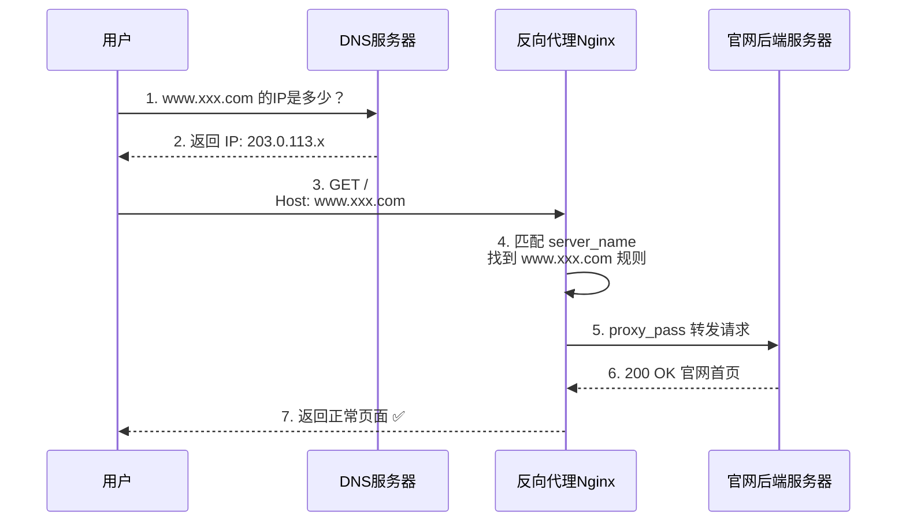
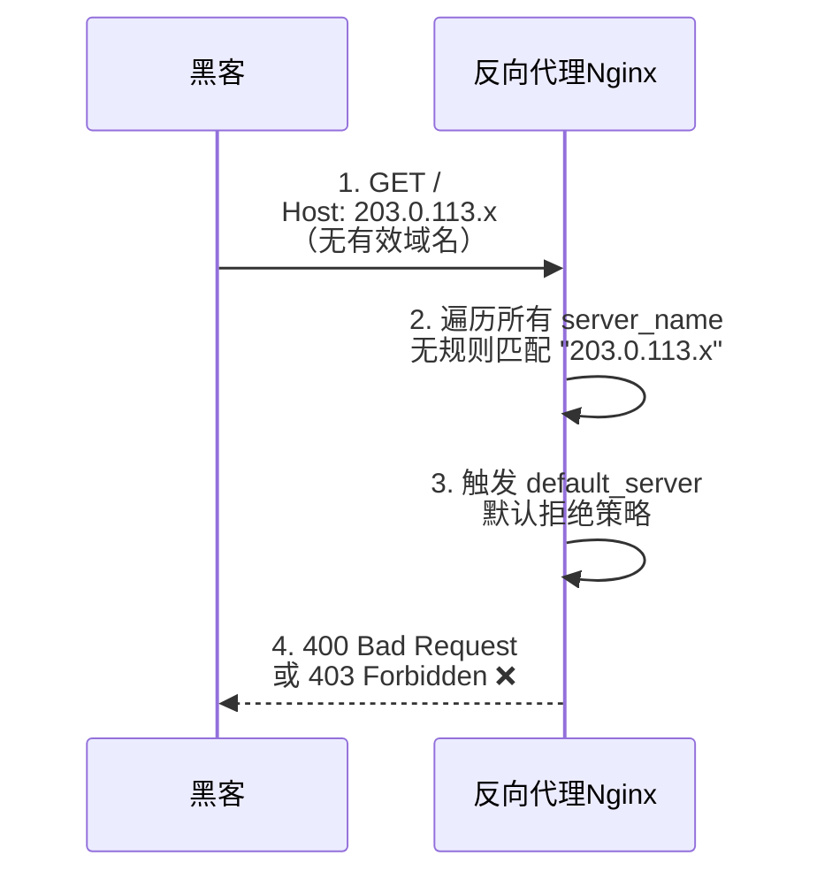
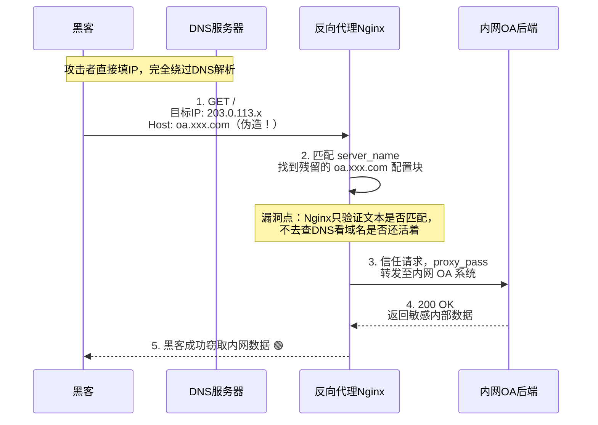

## 企业场景设定

| 项目 | 说明 |
|------|------|
| 公司名称 | 某科技有限公司 |
| 公网反向代理IP | 203.0.113.x（Nginx服务器） |
| 对外服务域名 | www.xxx.com（正常解析到 203.0.113.x） |
| 已废弃的内网域名 | oa.xxx.com（DNS记录已被删除，但Nginx配置残留） |

## 漏洞原理

**Host碰撞攻击**的核心在于：Nginx（反向代理）在决定"是否转发请求"和"转发给谁"时，依据的是客户端发来的 **HTTP Host 头文本**，而 Nginx 自己并不会去校验这个 Host 头对应的域名是否真的解析到了自己的 IP 上。

攻击者不需要 DNS 解析，直接向 IP 发送请求，但在请求头里伪造一个已废弃但 Nginx 配置残留的内部域名，即可骗过 Nginx 的文本匹配机制，访问到本应隔离的内网服务。

---

## 场景一：正常网络请求（用户访问官网）

用户通过 DNS 正常解析域名，访问公司官网，流程完全合规：

**关键点**：DNS 解析正确，Host 头发送正确，Nginx 正常匹配，流程丝滑。

---

## 场景二：普通失败请求（黑客用IP直接访问）

黑客知道服务器 IP，直接拿着 IP 敲门，但不带有效域名：

**关键点**：Nginx 不认识这个 Host 头，直接拒之门外。

---

## 场景三：Host碰撞攻击成功（漏洞触发）

黑客绕过 DNS，直接向 IP 发送请求，但在 Host 头中伪造已废弃的内网域名：

---

## 漏洞根因总结

| 对比 | 场景一（正常） | 场景三（攻击） |
|------|--------------|--------------|
| 请求方式 | DNS解析 → 域名 → IP | 直接IP + 伪造Host头 |
| Host头 | www.xxx.com ✅ | oa.xxx.com ❌（已废弃） |
| DNS记录 | 存在，指向203.0.113.x | 已被删除 |
| Nginx配置 | 存在，正常匹配 | **存在，运维未清理残留** |
| 结果 | 正常访问官网 | 获取内网敏感数据 |

**漏洞本质**：反向代理转发决策仅依赖 **HTTP Host 头文本匹配**，缺乏对域名有效性的 **DNS反向校验** 机制。运维人员删除 DNS 记录后未同步清理 Nginx 配置，导致攻击者有机可乘。

## 防御措施

1. **配置 default_server 拒绝策略**：未匹配的请求统一返回 403/444
2. **定期清理 Nginx 配置**：下线域名同步删除对应 server block
3. **限制 proxy_pass 目标**：仅允许转发到预期的内网服务，配合 IP 白名单
4. **Nginx 层校验 Host 合法性**：通过 `if ($host !~ ^(www\.xxx\.com)$)` 做白名单校验
5. **内网服务额外认证**：即使被转发，OA 等系统应要求二次认证
