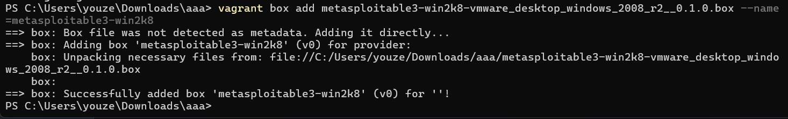
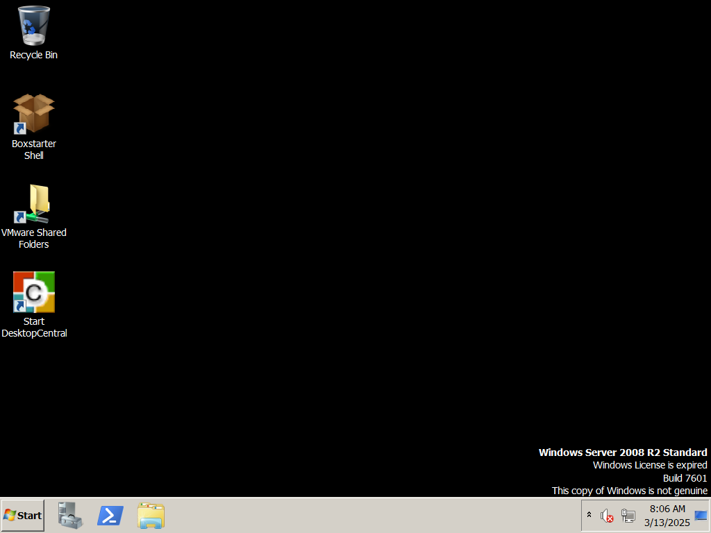

一、[Vagrant](https://so.csdn.net/so/search?q=Vagrant&spm=1001.2101.3001.7020)下载与安装

 **Vagrant**是一个基于[Ruby](https://so.csdn.net/so/search?q=Ruby&spm=1001.2101.3001.7020)的工具，​**用于创建和部署虚拟化开发环境**​。它使用Oracle的开源VirtualBox[虚拟化](https://so.csdn.net/so/search?q=%E8%99%9A%E6%8B%9F%E5%8C%96&spm=1001.2101.3001.7020)系统，使用Chef创建自动化虚拟环境。

##### 1. 下载Vagrant

 下载地址：[https://www.vagrantup.com/downloads](https://www.vagrantup.com/downloads)  

##### 2. 安装Vagrant

 在**Windows**下，Vagrant安装很简单，以我这里为例子，我只需要直接双击下载的  **“vagrant_2.4.3_windows_amd64.msi”**  文件即可直接安装，直接下一步，直至完成即可。

> 默认安装在C:\\Program Files\\Vagrant

##### 3. 安装Vagrant-reload

 **Vagrant-reload**是必须要安装的，后面要用到。这里需要在命令行使用Vagrant安装Vagrant-reload，命令如下：

> vagrant plugin install vagrant-reload

 如果出现以下提示，则需要把Vagrant的`bin`​目录路径配置到环境变量Path中：

> vagrant不是内部或外部命令，也不是可运行的程序

#### 二、下载metasploitable3.box文件

 metasploitable3有两个版本，分别是：

* Linux：ubuntu-14.04
* Windows：windows 2008

##### 1. Windows 2008版本下载

 下载地址：[https://app.vagrantup.com/rapid7/boxes/metasploitable3-win2k8](https://app.vagrantup.com/rapid7/boxes/metasploitable3-win2k8)  
 这里下载**vmware_desktop**版本,下载后的文件类似于“9406490e-e25b-4506-81e8-0b3c42d5ba0e”，需要自己再“重命名”。

以我这为例子，我将它又重命名为：

> “metasploitable3-win2k8-vmware\_desktop\_windows\_2008\_r2\_\_0.1.0.box”

#### 三、 使用Vagrant自动配置

 刚刚下载的box文件还不能直接使用，需要我们使用Vagrant自动配置一下才能正确的在VMware或VirtualBox里面使用。切换到box文件所在目录，执行以下命令：

> vagrant box add metasploitable3-win2k8-vmware_desktop_windows_2008_r2__0.1.0.box --name=metasploitable3-win2k8

查看生成的metasploitable3-win2k8\_r2的vmware\_desktop版本的相关虚拟机文件，一般会在以下目录：

> C:\\User\<用户名\>.vagrant.d\\boxes\\metasploitable3-win2k8\_r2\\0\\vmware-desktop

#### 四、迁移虚拟机

 由于默认生成的虚拟机文件是在C盘，而虚拟机文件最好不要存放在C盘，避免占用大量的系统盘空间。因此，我们把它移动到其他盘符下的目录，例如：

> D:\\VMware\\VirtualMachines

#### 五、打开虚拟机

1. 使用VMware或Virtual Box打开生成好的\*\*.vmx**文件或者选择**扫描虚拟机\*\*。
2. 启动虚拟机，输入用户名和密码：

> 默认用户名：vagrant  
> 默认密码：vagrant

