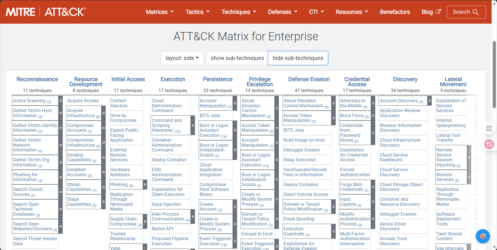
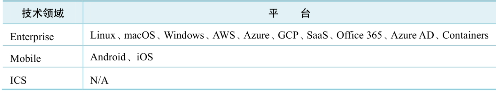
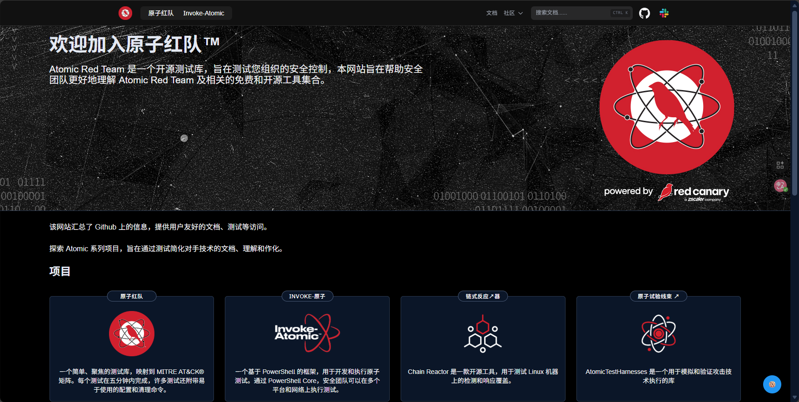

## 什么是MITRE ATT&CK
是一个对抗行为知识库。

MITRE ATT&CK提供了一个复杂框架，介绍了攻击者在攻击过程中使用的190多项技术、400多项子技术，其中包括特定技术和通用技术，以及有关知名攻击组织及其攻击活动的背景信息和攻击中所使用的战术、技术。简单来说，MITRE ATT&CK是一个对抗行为**知识库**。

● 它是基于真实观察数据创建的。

● 它是公开免费、全球可访问的。

● 它为蓝方和红队提供了一种沟通交流的通用语言。

● 它是由社区驱动发展的。

## ATTCK框架所解决的问题

● 我们的防御方案有效吗？

● 我们能检测到APT攻击吗？

● 新产品能发挥作用吗？

● 安全工具覆盖范围是否有重叠呢？

● 如何确定安全防御优先级？

## ATT&CK技术领域

MITRE ATT&CK已确定了三个技术领域—Enterprise（用于传统企业网络和云技术）、Mobile（用于移动通信设备）、ICS（用于工业控制系统）

在各技术领域，ATT&CK定义了多个平台，即攻击者在各技术领域进行操作的系统。一个平台可以是一个操作系统或一个应用程序（例如，Microsoft Windows）。ATT&CK中的技术和子技术可以应用在不同平台上。

## ATT&CK框架与痛苦金字塔模型的关系

痛苦金字塔模型由**IoC（Indicators of Compromise，失陷指标）** 组成，通过IoC进行组织分类并描述各类IoC在攻防对抗中的价值。**TTPs是Tactics，Techniques and Procedures（战术、技术及步骤）** 的缩写，描述了攻击者从踩点侦察到获取数据这一过程中，每一步是如何完成任务的。

TTPs处于痛苦金字塔塔尖。对于攻击者，TTPs反映了攻击者的行为，表明攻击者调整TTPs所付出的时间和金钱成本是最为昂贵的。对于防守方，基于TTPs的检测和响应可以给攻击者造成更大的痛苦，因此TTPs也是痛苦金字塔中对防守方最有价值的一类IoC。但另一方面，这类IoC更加难以识别和应用。由于大多数安全工具并不太适合捕获TTPs，这也意味着，收集TTPs并将其应用到网络防御中的难度系数是最高的。而ATT&CK则是有效分析攻击行为（即TTPs）的威胁模型。

## ATT&CK框架的七大核心对象

#### 1. **战术 - Tactics**

战术描述了攻击的“**为什么**”，即对手在攻击过程中的战略目标或短期目标。它代表了攻击链中的一个阶段，回答了“攻击者在这个阶段想要达到什么目的？”的问题。

​**示例**：

- ​**初始访问**：试图进入你的网络。
- ​**执行**：试图运行恶意代码。
- ​**持久化**：试图在重启或更改凭证后保持其存在。
- ​**防御规避**：试图避免被安全工具发现。
- ​**横向移动**：试图在你的网络内部移动。
- ​**数据窃取**：试图从你的网络中窃取数据。

#### 2. **技术 - Techniques**

技术描述了攻击的“**如何**”，即对手为实现战术目标而采取的具体手段、方法或行为。它是比战术更低一层的具体动作。

为了实现“占领制高点”（战术）这个目标，可以采用“正面强攻”或“夜间偷袭”（技术）等方法。

​**示例**：

- 为实现 **初始访问** 战术，攻击者可能采用 **网络钓鱼附件** 技术。
- 为实现 **持久化** 战术，攻击者可能采用 **创建计划任务** 技术。

#### 3. **子技术 - Sub-techniques**

子技术是技术的进一步细化和具体化。它描述了实现同一项技术的更具体、更具描述性的变种。

使对攻击行为的描述更加精确，有助于更精细的检测和分析。

​**示例**：

- 技术：​**OS凭证转储**。
- 子技术：​**从LSASS内存转储凭证**​、​**从Security Account Manager转储凭证**​、​**缓存的域凭证转储**。

#### 4. **程序 - Procedures**

程序描述了攻击者或恶意软件在真实攻击中**具体使用的技术、子技术及其组合顺序**。它是技术在实际场景中的应用实例。

通常来自威胁情报报告、恶意软件分析报告或事件响应报告。

​**示例**：

- “APT组织X在攻击中，首先通过**鱼叉式网络钓鱼（初始访问）**  投递恶意文档，该文档利用**PowerShell（执行）**  下载后门，并创建**Windows注册表运行键（持久化）**  以保持访问。”
- 这个过程描述就是一个“程序”。

#### 5. **缓解措施 - Mitigations**

缓解措施是安全配置、工具或实践，旨在**预防**一项技术或子技术的**成功执行**，而不仅仅是检测它。

在攻击发生之前，加固系统、减少攻击面。

​**示例**：

- 针对“创建计划任务”技术，对应的缓解措施可以是“​**限制计划任务的创建权限**​”、“​**使用用户账户控制**”等。
- 针对“OS凭证转储”技术，对应的缓解措施可以是 “ Credential Guard ”。

#### 6. **检测方法 - Detections**

方法描述了如何**发现**正在发生或已经发生的攻击行为。它关注于通过日志、传感器（如EDR）或其他工具来识别技术的迹象。

​**数据源**：明确指出了检测所需的数据来自哪里，例如“进程监控”、“命令行参数”、“Windows日志”、“网络流量”等。

**示例**：

- 针对“PowerShell执行”技术，检测方法可以是“​**监控PowerShell进程的创建及其命令行参数中是否包含可疑的编码或下载命令**”。

#### 7. **组织与软件 - Groups & Software**

​**组织**​：指已知的威胁行为者团体，如APT28、Lazarus Group等。ATT&CK会将这些组织与它们已知使用的**技术、程序和软件**关联起来。

​**软件**：指攻击者使用的工具，包括：

- ​**恶意软件**：如Cobalt Strike、Metasploit、Dridex等。
- ​**合法工具**：被攻击者滥用的系统内置工具，如PsExec、Mimikatz、PowerShell等。

​**作用**：帮助分析师进行威胁追踪和归因，通过识别攻击中使用的工具和技术，可以关联到潜在的幕后组织。

## ATT&CK战术

ATT&CK Enterprise框架由14项战术组成，每项战术下包含多项实现该战术目标的技术，每项技术中详细介绍了实现该技术的具体步骤。

1. **侦查** ：在入侵之前，攻击者试图收集目标的信息，以便为后续攻击做准备。
2. **资源开发** ：攻击者为其攻击行动准备、获取或控制所需的资源。
3. **初始访问** ：攻击者试图通过某种方式首次进入您的目标网络。
4. **执行** ：攻击者试图在本地或远程系统上运行其恶意代码。
5. **持久化** ：攻击者试图在系统重启、更改凭证或其他中断后，仍然保持其在该系统上的存在。
6. **权限提升** ：攻击者试图获取比当前账户更高级别的权限（例如，从普通用户提升到系统管理员）。
7. **防御规避** ：攻击者试图避免在整个攻击过程中被安全工具检测到。
8. **凭证访问** ：攻击者试图窃取账户名称和密码等凭证信息。
9. **发现** ：攻击者试图获取他们当前已入侵的系统以及内部网络环境的知识。
10. **横向移动** ：攻击者试图在目标网络内部移动，从一个系统转向另一个系统。
11. **收集** ：攻击者试图识别并收集位于目标网络中的、与其攻击目标相关的数据。
12. **命令与控制** ：攻击者试图与受其控制的内部系统进行通信并对其下达指令。
13. **数据渗出** ：攻击者试图从目标网络中窃取数据并将其传输到外部受其控制的位置。
14. **影响** ：攻击者试图破坏目标组织的可用性、完整性或可靠性，包括直接勒索或干扰业务运营。

## 基于ATT&CK框架的扩展知识库

-  针对容器的ATT&CK攻防知识库
- 针对Kubernetes的攻防知识库
- 针对内部威胁的TTPs攻防知识库
- 针对网络安全对策的知识图谱MITRE D3FEND
- 针对软件供应链的ATT&CK框架OSC&R

## 四个关键 ATT&CK 项目工具

**[CALDERA](https://github.com/mitre/caldera)**    

MITRE Caldera™ 是一个网络安全[MITRE Caldera™](https://caldera.mitre.org/)平台，旨在轻松自动化对手模拟、协助手动红队和自动化事件响应。  
该项目基于 MITRE AT&CK™框架构建，是 MITRE 的一个活跃研究项目。

<iframe width="560" height="315" src="https://www.youtube.com/embed/W7fi0RVYiJE" title="YouTube video player" frameborder="0" allow="accelerometer; autoplay; clipboard-write; encrypted-media; gyroscope; picture-in-picture; web-share" allowfullscreen></iframe>

**[ATT&CK Navigator](https://github.com/mitre-attack/attack-navigator)**

是一个基于 Web 的可视化工具，它提供了一种**交互式的方式来浏览和注释 ATT&CK 矩阵知识库**，用户可以通过创建自定义的“图层”来映射和比较自身防御覆盖范围、威胁组织的行为模式或特定攻击活动的技术细节。

**[Atomic Red Team](https://www.atomicredteam.io/)**

是一个与 ATT&CK 技术直接对应的开源测试用例库，它提供了大量简单且跨平台的“原子测试”脚本，安全团队可以无需依赖复杂的工具即可快速执行这些测试，从而高效地验证其安全控制措施是否能够检测到特定的攻击技术。

**[SIGMA](https://github.com/SigmaHQ/sigma)**

是一个通用的开源签名格式和相关的规则库，它旨在sigma实现检测逻辑的标准化和共享，安全团队可以编写与特定商业产品无关的 SIGMA 规则，然后通过社区提供的转换器将其编译成多种 SIEM 和安全分析平台（如 Splunk、Elasticsearch 等）的本地查询语法，从而快速构建基于 ATT&CK 的检测能力。

## **ATT&CK 四大核心应用场景**

#### 1. **模拟攻击**

此场景主要被**红队**和**渗透测试团队**使用。ATT&CK 框架为模拟真实对手的攻击行为提供了一个全面的“剧本”。

​**如何应用**：团队不再进行随机的攻击测试，而是基于 ATT&CK 矩阵，规划针对性的攻击路径。他们可以选择模拟特定威胁组织（如APT29）的惯用技战术，或专注于测试那些对组织威胁最大的技术。

​**使用工具**​：使用 ​**CALDERA**​、**Atomic Red Team** 等工具，自动化地执行这些攻击模拟，从而高效地验证防御体系的有效性。

**价值**：**主动发现防御盲点**，在真实攻击发生之前验证人员、流程和技术的响应能力。

#### 2. **检测分析**

此场景主要被**蓝队**和**安全分析员**使用。ATT&CK 框架为构建和优化检测能力提供了一个结构化的“知识库”。

​**使用工具**​：利用 **SIGMA** 项目提供的通用检测规则库，快速为缺失的检测点创建高质量的检测逻辑。同时，使用 **Atomic Red Team** 来验证这些新规则是否有效。

​**核心价值**​：​**系统性提升检测能力**，确保能够发现复杂的、多阶段的攻击链，而不仅仅是孤立的恶意事件。

#### 3. **评估改进** 

此场景主要被**安全管理人员**和**架构师**使用。ATT&CK 框架作为一个通用的衡量标准，用于评估安全态势和指导安全投入。

​**如何应用**​：使用 **ATT&CK Navigator** 绘制“防御覆盖热力图”，直观展示当前安全控制措施（如防火墙、EDR、DLP等）所能缓解或检测的技术。通过对比“威胁情报”中高优先级的技术，可以清晰地识别出​**最大的防御差距和风险**。

​**核心价值**​：​**实现数据驱动的安全决策**，为安全预算、技术采购和战略规划提供客观依据，明确告知“钱应该花在哪里”以及“下一步应该优先做什么”。

#### 4. **威胁情报**

此场景主要被**威胁情报团队**使用。ATT&CK 框架为分析和传达威胁信息提供了一种​**标准化语言**。

​**如何应用**：将公开的或内部发现的攻击活动报告，映射到 ATT&CK 矩阵上。这能清晰地勾勒出某个攻击组织（如Lazarus Group）或恶意软件家族（如Emotet）的“攻击画像”（TTPs）。

**核心价值**：**将零散的威胁信息转化为可行动的情报**。这使得组织能够理解“谁在攻击我们”以及“他们如何攻击”，从而优先部署针对特定威胁的防御措施，实现“知彼知己，百战不殆”。

‍
