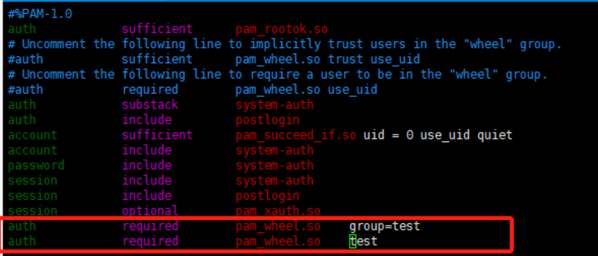

#### 用户管理

##### 特权用户排查

UID=0为特权账号

```bat
[root@localhost ~]# awk -F: '($3==0)' /etc/passwd
root:x:0:0:root:/root:/bin/bash
[root@localhost ~]# passwd -l XXXXX^C	#锁定账户,建议如果存在多个UID为0用户,先锁定再去排查,最后在确定是否删除或解除
[root@localhost ~]# userdel XXXXX^C	#删除
[root@localhost ~]# passwd -u XXXXX^	#解除锁定
```

##### 空口令用户排查

```bat
[root@localhost ~]# awk -F: '($2=="")' /etc/shadow
[root@localhost ~]# passwd username		#增加密码
```

##### 限制用户su到root

/etc/pam.d/su    su命令的配置文件:如下配置1\\test组和test用户可以su到root

​​

##### 禁止root用户直接登录

（危险配置，如果远程新建小号登录，要不然远程ssh直接掉线）

/etc/ssh/sshd_config | grep PermitRootLogin

```apache
[root@localhost ~]# cat /etc/ssh/sshd_config |grep PermitRootLogin
#PermitRootLogin yes			#讲此项放出,并改为No.则会警用root远程登录
# the setting of "PermitRootLogin without-password".

#重启生效
systemctl restart sshd			#service sshd restart
```

​​

#### 服务管理

##### 关闭不必要自启服务

netstart -ntlp

​​

systemctl disable  <服务名称>    设置服务不开机自启

```apache
systemctl disable <服务名称>	#设置服务不开启自启动

centos6等老系统禁用方法不一样:chkconfig --level <级别> <服务名称>  off #设置服务在某个级别用户开机时不启动
```

##### ssh服务配置

vi /etc/ssh/sshd_config

```python
Protocol  2  #修改SSH使用的协议版本 2  1.0 2.0
MaxAuthTries  6  #密码错误次数锁定
```

重启生效  
systemctl restart sshd			#service sshd restart

‍

#### 系统日志

系统日志：   /var/log/messages

cron日志：   /var/log/cron

安全日志：   /var/log/securce

查看是否开启日志记录： cat /etc/logrotate.d/syslog

```apache
/var/log/cron
/var/log/maillog
/var/log/messages
/var/log/secure
/var/log/spooler
{
    missingok
    sharedscripts
    postrotate
	/bin/kill -HUP `cat /var/run/syslogd.pid 2> /dev/null` 2> /dev/null || true
    endscript
}
```

‍

‍
