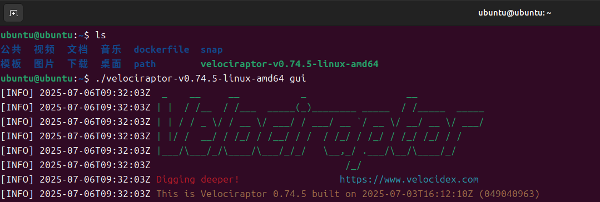
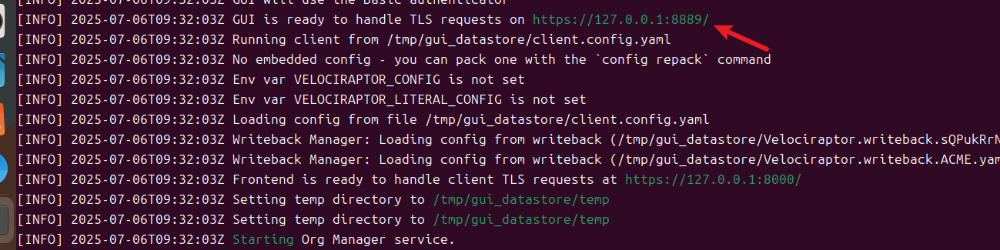
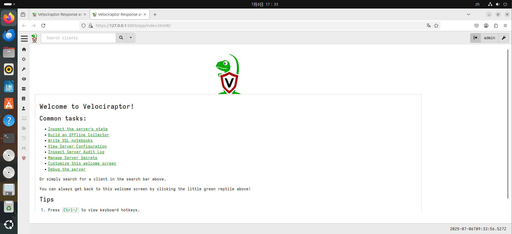
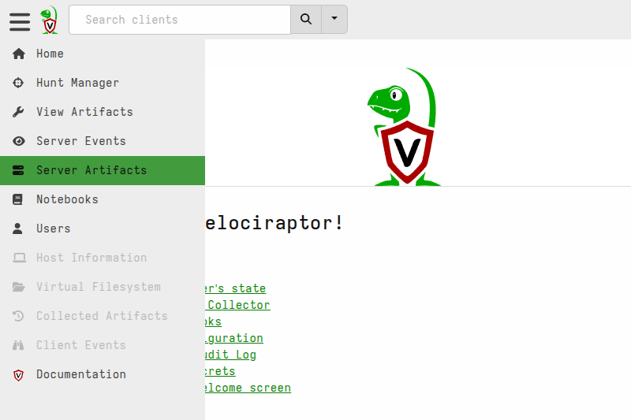
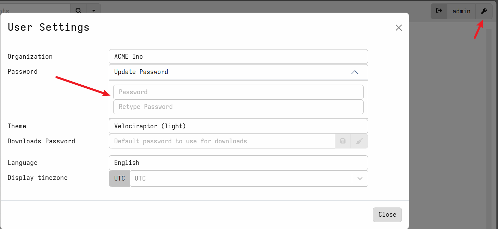

## 基本概念

### 数字取证和事件响应 (DFIR) 

Digital Forensics and Incident Response (DFIR)

**数字取证和事件响应 (DFIR)**  是网络安全领域的其中一个领域，专注于网络攻击的识别、调查和补救。

## 学前必看

[docs.velociraptor.app/  官方文档](https://docs.velociraptor.app/%20)

[www.youtube.com/watch?v=70CBB9MdNWM 教学视频](https://www.youtube.com/watch?v=70CBB9MdNWM)

DFIR 有两个主要组成部分：

- **数字取证：** 取证科学的一个子集，用于检查系统数据、用户活动和其他数字证据，以确定**攻击是否正在进行以及活动的幕后黑手**。
- **事件响应：** 组织将遵循的总体流程，以**准备、检测、遏制数据泄露并从中恢复**。

由于端点的激增和总体网络安全攻击的升级，DFIR 已成为组织安全策略和威胁搜寻能力中的核心能力。向云的转变以及基于远程的工作的加速，进一步提高了组织确保保护连接到网络的所有设备免受各种威胁的需求。

尽管 DFIR 传统上是一种反应性安全功能，但复杂的工具和先进技术（例如人工智能 (AI) 和机器学习 (ML)）使一些组织能够利用 DFIR 活动来影响和通知预防措施。在这种情况下，DFIR 也可以被视为主动安全策略中的一个组件。

### 数字取证

数字取证提供**计算机应急响应小组** (CERT) 或计算机**安全事件响应小组** (CSIRT) 响应安全事件所需的必要**信息和证据**。

数字取证可能包括：

- **文件系统取证：** 分析端点内的文件系统以寻找受损迹象。
- **内存取证：** 分析内存中可能不会出现在文件系统中的攻击指标。
- **网络取证：** 审查网络活动，包括电子邮件、消息传递和网页浏览，以识别攻击、了解网络犯罪分子的攻击技术并评估事件的范围。
- **日志分析：** 审查和解释活动记录或日志以识别可疑活动或异常事件。

除了帮助团队应对攻击之外，**数字取证**还在整个补救过程中发挥着重要作用。数字取证还可能包括提供支持诉讼的证据或向审计员展示的文件。

此外，数字取证团队的分析可以帮助制定和加强预防性安全措施。这可以使组织降低整体风险，并加快未来的响应时间。

### Velociraptor

是一种独特的高级**开源端点监控**， 数字取证和网络响应平台。

它由数字取证和事件响应 （DFIR） 专业人员开发，他们需要 寻找特定工件并监控 终端节点的队列。迅猛龙使您能够更有效地响应各种数字 取证和网络事件响应调查和数据泄露：

- 通过数字取证分析重建攻击者活动
- 寻找老练对手的证据
- 调查恶意软件爆发和其他可疑网络活动
- 持续监控可疑的用户活动，例如文件 复制到 USB 设备
- 发现机密信息泄露是否发生在网络外部
- 随着时间的推移收集端点数据以用于威胁搜寻和 未来的检查

### VQL - 迅猛龙的不同之处

迅猛龙的强大功能和灵活性来自 Velociraptor 查询 语言 （VQL）。VQL 是一个用于创建高度自定义**工件**的框架，它允许您收集、查询和监控几乎 终端节点、终端节点组或整个 网络。它还可用于在 端点，以及在服务器上自动执行任务。深入研究 Velociraptor 查询语言 （VQL）。这是解锁 工具的全部潜力。

## 快速上手

1. 下载

    [github.com/Velocidex/velociraptor/releases/tag/v0.74](https://github.com/Velocidex/velociraptor/releases/tag/v0.74)
2. 授予权限

    ```bash
    chmod +x velociraptor
    ```

3. 使用下方命令生成配置文件存放到/tmp/gui_datastore/server.config.yaml下，默认绑定127.0.0.1不用输入密码。

    ```bash
    velociraptor gui  #直接启动GUI
    ```

4. 直接启动GUI即可进入。

    

    给出的路径会自动跳转到浏览器。

    

    

## 生成客户端

1. 在 Velociraptor Web GUI 中，从侧边栏中选择 **Server Artifacts（服务器工件**） 页面左侧。



2. 添加新集合：搜索 、选择它和 然后点击 “Launch”。`Server.Utils.CreateMSI`​


3. 下载最新版本的 MSI 文件（64 位和 可选 32 位），然后使用您的客户端配置重新打包它们 文件。
4. 然后，重新打包的 MSI 文件将在 **Uploaded Files** 选项卡中。

5. 下载 MSI 文件。将它们复制到网络共享 USB 棒或其他允许您从 Windows 访问它们的介质 端点。

## 修改密码



‍
