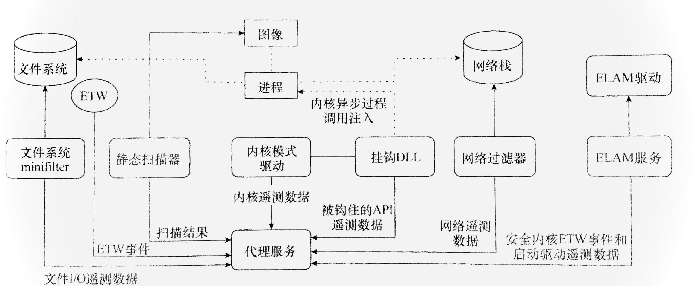

---
title: 终端防御规避技术-1.EDR架构
index: true
isOriginal : true
category:
  - 应急响应
tag:
  - 应急响应
  - EDR
  - 终端防御与规避
  - 免杀
---  
**EDR是部署在目标机器上的应用程序，旨在收集相关环境安全性数据，这些数据通常称为遥测数据**

#### 1.EDR的组件
##### 代理
他负责管理和从传感器组建收集数据，并进行初步分析，以判断特定活动或事件序列是否与攻击者的行为模式相匹配，这些代理将收集到的遥测数据发送到中央服务器。
如：EDR的控制面板或者信息安全和事件管理，SIEM(security incident and event management)系统。
##### 遥测数据和传感器
每一个传感器都肩负着一个共同的使命，收集遥测数据，通常指传感器组件或主机自身生成的原始数据。安全专家通过分析这数据来识别是否存在恶意。

传感器通常需要嵌入某些系统进程中，它们必须运行的非常迅速。尽管WINDOWS提供了众多的遥测数据源。但EDR通常只关注其中的一部分，因为这数据可能缺失数据的质量和数量，或者与主机安全不相关，或者不易访问。一些传感器是内置于操作系统的，例如系统原始日志。EDR还可能向系统引入自己的传感器组件，如驱动程序、函数挂钩dll、微筛选器。

##### 检测
简单的检测，比如检查一个文件的HASH是否以已知恶意软件的HASH相匹配，也可以是复杂的，比如分析特定程序生成的子进程通过特定端口与域控制器通信的事件序列。

##### 脆弱检测与鲁棒检测的运用
脆弱检测是指那些专门要来检测特定工件的检测规则，例如与已知恶意软件项关的简单字符串或基于哈希的签名。鲁棒检测识别行为模式，通常也针对特定环境训练的机器学习模型，支持这两种检测类型，在现代安全扫描引擎中发挥重要作用，它能帮助平衡误报和漏报。

如果检测规则集仅检测文件名mimikatz.exe攻击者可以简单地将文件名改为mimidogz.exe以绕过检测，因此最佳的脆弱检测规则，应该主要诊断那些不可变化，至少难以修改的属性。

如果每个检测规则的漏报率很低，但误报率很高，EDR可能会像"狼来了"的故事一样频繁发出错误警报，如果试图过度降低误报率，也有可能会增加漏报率，使攻击未被发现。

##### 代理设计

EDR代理通常由一个多个专门组件构成，每个组件都有一起独特的目标和能够收集的遥测数据类型，通常一个代理包括以下部分：
- 基础设计

**1.静态扫描器** ：这是一个应用程序或一个代理组件，他对文件或虚拟内存的特定区域进行静态扫描后，以判断内容是否包含恶意代码，扫描器往往是杀毒软件的核心。

**2.挂钩DLL** : 是一种动态链接库（dynamic link libray，DLL）其功能是拦截对特定应用程序编程接口API函数的调用。

**3.内核驱动程序**：这是一种内核模式驱动程序，负责将挂钩dll注入目标进程，并收集与内核相关遥测数据。

**4.代理服务**：这是一个应用程序，负责汇总前两个组件生成的遥测数据，有时也负责数据的关联或告警的生成，然后他将收集的数据转发到集中式的EDR服务器。

- 中级设计

**5.网络过滤驱动程序**： 用以执行网络流量分析，识别恶意活动指标。

**6.文件系统过滤驱动程序**：一种特殊类型的驱动程序，用以监控主机文件系统上的操作。

**7.ETW消费者**：代理的组件可以订阅由主机操作系统或第三方应用程序生成的事件。

**8.早期启动反恶意软件**：ELAM组件。这些功能提供了一种微软支持的机制，在其他引导启动服务之前加载反恶意软件驱动程序，从而控制其他引导启动程序的初始化，这些组件还可以接受ETW事件。

- 高级设计

**9.虚拟机监控器**：这些监控器提供截取系统调用，虚拟化某些系统组件，以及对代码执行进行沙盒处理的方法。这些功能还为代理提供了一种监控客机与主机之间执行过渡的方式，通常作为防勒索软件或防漏洞应用的一部分使用。

**10.对手欺骗**：这种方法提供虚假的数据给攻击值，而不是直接阻止恶意淡马的执行，这可能会导致攻击将注意力集中在调试器攻击而非意识到数据已被篡改。

##### 绕过类型

- **1.配置规避**：当终端上有一个能够识别恶意活动的遥测数据，原始传感器却未能从中收集数据，导致覆盖出现漏洞。

- **2.感知规避**:传感器或代理缺乏收集相关遥测数据的能力时会进行绕过。

- **3.逻辑规避**：攻击者利用检测逻辑中的漏洞，例如检测规则可能存在一个已知漏洞，而没有其他检测规则覆。

- **4.分类规避**：传感器或代理无法涉及足够的数据将行为归类为恶意。尽管管已经观察到该行为，例如攻击的流量可能汇入正常的网络流量中，难以区分。

##### 关联规避技术

**基于行为分析的检测方法**：它不是仅仅是来单一事件的特征，而是通过评估一系列事件的总体风险来做出判断，这种方法可以提高检测的准确性，减少误报，同时对攻击者的行为模式进行更全面的评估和分析。

| 活动 | 风险分数 |
| -|-|
|执行未签名的二进制文件|250|
|非典型子进程生成|400|
|非浏览器发出HTTPS流量|100|
|分配可读写执行缓冲区|200|
没有镜像支持的提交内存分配|350|

在某个时间窗口内发生的累积分是大以或等于500都会触发一个高严重警报。

攻击者可能会做出以下行动来规避检测：
1.执行后续利用工具并接受检测，一旦触发警报，我们可以迅速行动，试图在响应到之前完成目标。或者依赖项应的不及时，未能彻底清除
2.等待一段时间，再执行工具，因为代理只会关联在一定时间窗口内发生的事件，等待状态重置，将风险评分重置为零，然后续操作。
3.寻找其他方法，这可能包括直接在目标机统上放置并执行脚本，或者通过代理传输后续利用工具的流量以减少在主机上留下的痕迹。
无论是用哪种策略目标，都是尽可能的保持警报在阈值以下。

